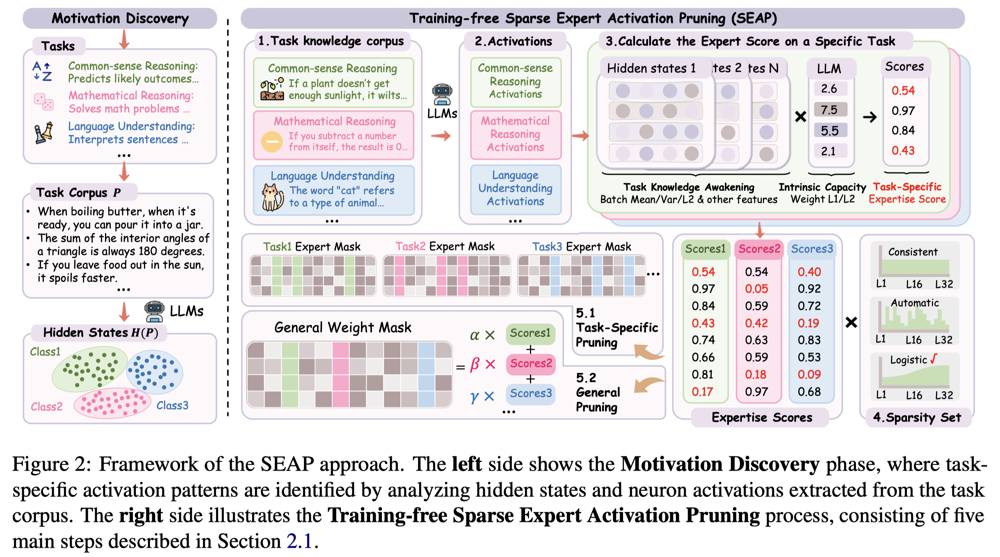

# SEAP: Training-free Sparse Expert Activation Pruning Unlock the Brainpower of Large Language Models

## Abstract

Large Language Models have achieved remarkable success across various natural
language processing tasks, yet their high computational cost during inference
remains a major bottleneck. This paper introduces Sparse Expert Activation
Pruning (SEAP), a training-free pruning method that selectively retains
task-relevant parameters to reduce inference overhead. Inspired by the
clustering patterns of hidden states and activations in LLMs, SEAP identifies
task-specific expert activation patterns and prunes the model while preserving
task performance and enhancing computational efficiency. Experimental results
demonstrate that SEAP significantly reduces computational overhead while
maintaining competitive accuracy. Notably, at 50% pruning, SEAP surpasses both
WandA and FLAP by over 20%, and at 20% pruning, it incurs only a 2.2%
performance drop compared to the dense model. These findings highlight SEAP's
scalability and effectiveness, making it a promising approach for optimizing
large-scale LLMs.

每个task稀疏表现不同，因此每个task可以生成不同的mask，SEAP-gen 表示综合所有task的通用mask。
针对每个task的校准集是直接在task里面选取的吗？

