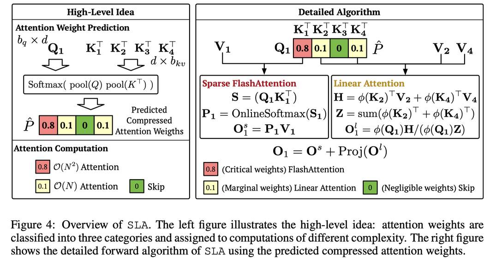

# SLA: Beyond Sparsity in Diffusion Transformers via Fine-Tunable Sparse-Linear Attention

> Jintao Zhang, Haoxu Wang, Kai Jiang, Shuo Yang, Kaiwen Zheng, Haocheng Xi, Ziteng Wang, Hongzhou Zhu, Min Zhao, Ion Stoica, Joseph E. Gonzalez, Jun Zhu, Jianfei Chen

## Abstract

In Diffusion Transformer (DiT) models, particularly for video generation, attention latency is a major bottleneck due to the long sequence length and the quadratic complexity. We find that attention weights can be separated into two parts: a small fraction of large weights with high rank and the remaining weights with very low rank. This naturally suggests applying sparse acceleration to the first part and low-rank acceleration to the second. Based on this finding, we propose SLA (Sparse-Linear Attention), a trainable attention method that fuses sparse and linear attention to accelerate diffusion models. SLA classifies attention weights into critical, marginal, and negligible categories, applying O(N^2) attention to critical weights, O(N) attention to marginal weights, and skipping negligible ones. SLA combines these computations into a single GPU kernel and supports both forward and backward passes. With only a few fine-tuning steps using SLA, DiT models achieve a 20x reduction in attention computation, resulting in significant acceleration without loss of generation quality. Experiments show that SLA reduces attention computation by 95% without degrading end-to-end generation quality, outperforming baseline methods. In addition, we implement an efficient GPU kernel for SLA, which yields a 13.7x speedup in attention computation and a 2.2x end-to-end speedup in video generation on Wan2.1-1.3B. The code will be available at https://github.com/thu-ml/SLA.

---

> **⚠️ 本 note 由 AI Agent 自动生成，包含对论文的完整分析与解读。生成日期：2025 年。**

---

## 一句话总结

SLA 将扩散 Transformer 中的注意力权重按大小分为三类（关键/边缘/可忽略），分别使用精确的稀疏注意力、低秩的线性注意力和跳过计算，在 95% 稀疏度下实现 20 倍注意力计算缩减和 2.2 倍端到端加速，同时保持视频生成质量无损。

---

## 摘要翻译

在扩散 Transformer（DiT）模型中，尤其是视频生成场景，注意力机制的延迟是一个主要瓶颈，原因是序列长度长且具有二次复杂度。我们发现注意力权重可以分解为两部分：一小部分具有高秩的大权重和剩余的具有极低秩的权重。这一发现自然启发我们对第一部分应用稀疏加速，对第二部分应用低秩加速。基于这一发现，我们提出了 SLA（Sparse-Linear Attention），一种可训练的注意力方法，融合了稀疏注意力和线性注意力以加速扩散模型。SLA 将注意力权重分为关键、边缘和可忽略三类，对关键权重应用 O(N²) 注意力，对边缘权重应用 O(N) 注意力，跳过可忽略的权重。SLA 将这些计算合并到单个 GPU 内核中，并支持前向和反向传播。仅需几步微调，DiT 模型即可实现 20 倍的注意力计算缩减，在不损失生成质量的情况下显著加速。实验表明，SLA 将注意力计算减少 95% 而不降低端到端生成质量，优于基线方法。此外，我们实现了 SLA 的高效 GPU 内核，在 Wan2.1-1.3B 上实现了 13.7 倍的注意力计算加速和 2.2 倍的视频生成端到端加速。

---

## 研究动机

1. **注意力是瓶颈**：在 DiT 模型（尤其是视频生成）中，注意力机制是唯一具有二次复杂度的操作，序列长度通常在 10K-100K 范围内，计算开销巨大。

2. **现有方法的局限**：
   - **线性注意力（L1）**：在实践中效果不佳，尤其在视频扩散模型上。现有工作主要局限于图像生成，应用于视频时会严重降低质量。
   - **稀疏注意力（L2）**：难以达到很高稀疏度，通常在序列长度低于 50K 时只能达到 40-60% 稀疏度。尽管部分工作报告了 80-85% 稀疏度，但这是在 100K-300K 的超长序列上实现的，对较短序列（如 Wan2.1 的 30K）效果有限。

3. **关键发现**：注意力权重可以分解为两部分：
   - **少量高秩的大权重**（约占 <10%）：这部分需要精确计算
   - **大量极低秩的剩余权重**（>90%）：这部分可以用低秩近似

   这一发现解释了为什么单独使用稀疏注意力或线性注意力无法获得令人满意的结果，并自然启发了一种混合策略。

---

## 方法（技术细节）

### 核心思想：三类分类 + 混合计算

SLA 将注意力权重分为三类，分别采用不同的计算策略：

1. **关键权重（Critical）**：占比 top $k_h$%（默认 5%），使用稀疏 FlashAttention 精确计算，O(N²) 复杂度
2. **边缘权重（Marginal）**：中间部分，使用线性注意力处理，O(N) 复杂度
3. **可忽略权重（Negligible）**：占比 bottom $k_l$%（默认 10%），直接跳过，O(1) 复杂度

### 具体算法流程

#### 1. 注意力权重预测（压缩注意力）

首先通过均值池化降低分辨率，预测压缩的注意力权重矩阵：

$$P_c = \text{Softmax}(\text{pool}(Q)\text{pool}(K)^T / \sqrt{d})$$

其中 pool(·) 是沿 token 维度的均值池化操作。$P_c$ 的大小为 $N/b_q \times N/b_{kv}$（远小于原始的 $N \times N$）。

#### 2. 三类分类

根据 $P_c$ 生成压缩掩码 $M_c$：
- top $k_h$% 标记为 1（关键）
- bottom $k_l$% 标记为 -1（可忽略）
- 其余标记为 0（边缘）

#### 3. 稀疏注意力（关键权重部分）

对每个 Q 块 $Q_i$，遍历所有 K、V 块，当 $M_c[i,j] = 1$ 时执行标准的在线 softmax 注意力：

$$S_{ij} = Q_i K_j^T / \sqrt{d}$$
$$P_{ij} = \text{OnlineSoftmax}(S_{ij})$$
$$O^s_i = O^s_i + P_{ij} V_j$$

#### 4. 线性注意力（边缘权重部分）

对每个 Q 块 $Q_i$，当 $M_c[i,j] = 0$ 时，执行线性注意力（利用低秩性质）：

$$H_i = \sum_{j: M_c[i,j]=0} \phi(K_j)^T V_j$$
$$Z_i = \sum_{j: M_c[i,j]=0} \text{rowsum}(\phi(K_j)^T)$$
$$O^l_i = \phi(Q_i) H_i / (\phi(Q_i) Z_i)$$

其中 $\phi(\cdot)$ 为激活函数（实验中 softmax 效果最佳）。

#### 5. 最终输出

$$O = O^s + \text{Proj}(O^l)$$

其中 Proj 是一个可学习的线性变换 $R^d \to R^d$，用于减少 softmax 注意力和线性注意力之间的分布不匹配。Proj 的计算开销为 O(Nd²)，与 $O^l$ 的计算成本相同，相对于全注意力的 O(N²d) 可以忽略不计。

### 关键洞察

- 线性注意力在 SLA 中**不是**近似边缘注意力的输出，而是作为一种**可学习的补偿**，增强稀疏注意力的效果
- 线性注意力部分在视频生成中仅占全注意力计算的不到 0.5%，几乎不增加开销
- 需要少量微调（仅 2000 步）让模型适应线性注意力

### 反向传播

SLA 的反向传播包含两部分梯度计算：
- **稀疏注意力梯度**：遵循 FlashAttention 的标准推导，计算 dQ、dK、dV
- **线性注意力梯度**：通过链式法则计算 dQϕ、dKϕ、dV

前向和反向传播都融合到单个 GPU 内核中，以提高效率。

### 额外效率优化

1. **查找表（Lookup Table）**：当 $M_c$ 极度稀疏时（>90%），预处理非零位置，避免扫描整行/列
2. **线性注意力预聚合**：预计算 $\sum_j h_j$ 和 $\sum_j z_j$，然后减去对应的非零贡献，将 90% 的加法替换为 10% 的减法
3. **四俄罗斯人方法（Method of Four Russians）**：当 $M_c[i,j]=0$ 的块数中等时（约 50%），将 $h_j$ 和 $z_j$ 分组为 g 个连续块，预计算所有 $2^g$ 种可能的子集和，将计算复杂度降低为 $1/g$

---

## 实验结果

### 视频生成（Wan2.1-1.3B）

| 指标 | Full Attention | SLA (95% 稀疏) | Sparge-T (84%) | VSA (89%) | VMoBa (85%) |
|------|---------------|----------------|----------------|-----------|-------------|
| VA ↑ | 76.78 | **76.96** | 73.83 | 55.37 | 32.33 |
| VT ↑ | 82.88 | **83.92** | 77.87 | 64.61 | 35.79 |
| IQ ↑ | 62.5 | 62.2 | 61.9 | 60.6 | 58.0 |
| OC ↑ | 23.3 | **23.6** | 22.7 | 22.4 | 18.8 |
| AQ ↑ | 56.1 | 55.9 | 55.4 | 51.9 | 46.2 |
| SC ↑ | 93.0 | **93.1** | 93.1 | 83.6 | 89.9 |
| VR ↑ | 0.059 | 0.048 | 0.014 | -0.069 | -0.175 |
| FLOPs ↓ | 52.75T | **2.74T** | 7.38T | 5.92T | 7.91T |

**关键发现**：
- SLA 在 95% 稀疏度下，FLOPs 仅为全注意力的 5.2%（2.74T vs 52.75T），实现了 20 倍计算缩减
- SLA 在几乎所有质量指标上与 Full Attention 持平甚至略优，且显著优于所有基线方法
- 95% 稀疏度的 SLA 实际上比 90% 稀疏度的 Sparse Only 更高效（因为线性注意力开销可忽略）

### 效率

- **前向传播**：SLA 相比 FlashAttention2 实现 13.7 倍加速
- **反向传播**：6.8 倍加速
- **端到端**：视频生成从 97s 减少到 11s（8.8 倍注意力延迟降低），端到端加速 2.2 倍
- **微调开销**：仅需 2000 步微调，小于预训练成本的 0.1%

### 消融实验

- **稀疏+线性融合**：SLA 优于 Sparse Only、Linear Only 和 L+S（直接相加）
- **激活函数**：softmax > elu+1 > hedgehog
- **参数 $k_h$**：5% 时质量接近全注意力，10% 和 20% 的计算量分别是 5% 的 2 倍和 4 倍

### 图像生成（LightningDiT-1.0B，ImageNet 512×512）

| 方法 | FID ↓ | FLOPs ↓ | 稀疏度 ↑ |
|------|-------|---------|----------|
| Full Attention | 31.87 | 12.88G | 0% |
| SLA | **31.49** | **1.73G** | **87.50%** |
| SpargeAttn-T | 46.05 | 3.16G | 75.45% |

SLA 在图像生成中同样表现优异，在最高稀疏度下 FID 甚至优于全注意力。

---

## 优势

1. **高稀疏度 + 无质量损失**：在 95% 稀疏度下，SLA 的生成质量与全注意力相当，甚至在某些指标上略优（如 VA、VT、OC、SC），而其他基线方法在 85-89% 稀疏度下就有明显质量下降
2. **混合策略的有效性**：将稀疏注意力和线性注意力结合，突破了单独使用任一方法的瓶颈。线性注意力处理中间部分（边际权重），使得稀疏度可以从 80% 提升到 95% 而不损失质量
3. **极低的额外开销**：线性注意力部分在视频生成中仅占全注意力的不到 0.5%，几乎不增加计算成本
4. **高效的 GPU 内核**：前向传播 13.7 倍加速，端到端 2.2 倍加速，注意力延迟从 97s 降至 11s
5. **微调成本极低**：仅需 2000 步微调，占预训练成本不到 0.1%
6. **泛化性**：同时适用于视频生成（Wan2.1）和图像生成（LightningDiT），在两种任务上均表现优异
7. **统一框架**：将稀疏注意力和线性注意力融合到单个 GPU 内核中，实现高效的前向和反向传播
8. **完整的 GPU 优化**：包括查找表、预聚合、四俄罗斯人方法等，针对不同稀疏度进行了专门优化

---

## 局限

1. **需要微调**：SLA 不能直接用于推理，需要在预训练数据上进行少量微调（2000 步），这增加了使用门槛和计算成本
2. **依赖压缩注意力权重的预测精度**：$P_c$ 的预测质量直接影响分类准确性和最终效果，如果预测不准确，可能导致错误的分类
3. **超参数选择**：$k_h$ 和 $k_l$ 的选择需要根据具体任务和模型进行调优，不同设置会影响效率和质量的平衡
4. **固定阈值分类**：当前的分类方法基于全局 top-k 和 bottom-k，可能无法自适应每个 query 块的具体分布
5. **单 GPU 限制**：虽然论文实现了高效的 GPU 内核，但未讨论多 GPU/分布式场景下的性能
6. **实验规模有限**：主要实验在 Wan2.1-1.3B 和 LightningDiT-1.0B 上进行，更大规模模型（如 7B+）的验证不足
7. **线性注意力的近似误差**：线性注意力本质上是低秩近似，对某些复杂场景（如需要高秩表示的任务）可能效果有限
8. **与现有微调方法的兼容性**：需要验证 SLA 与其他微调技术（如 LoRA、DPO 等）的兼容性

---

## 与 EfficientPaper 相关的研究方向

1. **注意力稀疏化（Attention Sparsity）**：SLA 是稀疏注意力的最新进展，关键词为 `sparse_pruning`、`attention_sparsity`，与 SparseVideoGen、SpargeAttn、VSA 等工作密切相关
2. **结构设计（Structure Design）**：SLA 的混合架构设计为高效的注意力机制提供了新范式，关键词为 `structure_design`
3. **高效 Transformer（Efficient Transformer）**：SLA 属于高效注意力机制的重要方向，与 FlashAttention、线性注意力等方法形成互补
4. **扩散模型加速（Diffusion Model Acceleration）**：SLA 专门针对 DiT 模型（Wan2.1），是扩散模型推理加速的重要工具
5. **GPU 内核优化（GPU Kernel Optimization）**：SLA 的高效内核实现（查找表、预聚合、四俄罗斯人方法）为硬件高效的注意力实现提供了参考
6. **微调加速（Fine-tuning Acceleration）**：SLA 仅需极少微调步骤即可适配，与高效微调（如 LoRA）的研究方向有交叉
7. **视频生成（Video Generation）**：SLA 在 Wan2.1 上的验证表明其在视频扩散模型中的实用性，与视频生成效率研究直接相关
8. **图像生成（Image Generation）**：SLA 在 LightningDiT 上的实验验证了其在图像生成中的有效性，与图像扩散模型效率研究相关

---

*本 note 由 AI Agent 自动生成，基于论文全文阅读与分析。*
