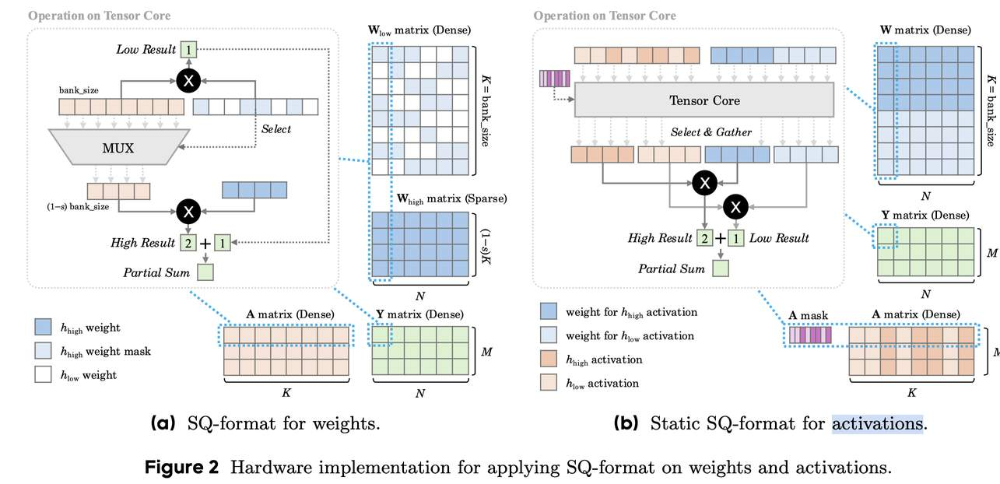

# SQ-format: A Unified Sparse-Quantized Hardware-friendly Data Format for LLMs

> Ruixuan Huang, Hao Zeng, Hantao Huang, Jinyuan Shi, Minghui Yu, Ian En-Hsu Yen, Shuai Wang



---

## 一句话总结

SQ-format 是一种将稀疏化和低精度量化统一起来的硬件友好数据格式，通过在低精度计算中稀疏地混合高精度元素，实现了精度与吞吐量之间的帕累托改进，为下一代 AI 加速器提供了软硬件协同设计蓝图。

---

## 摘要翻译

训练后量化（PTQ）在大语言模型（LLM）的普及中发挥着关键作用。然而，现有的低比特量化和稀疏化技术由于硬件支持有限，难以平衡精度和效率。例如，W4A8 只能达到与 W8A8 相同的峰值 TOPS，而 GPU 支持的稀疏数据格式（2:4 半结构化稀疏）由于精度损失而很少被采用。为弥合这一差距，本文提出了稀疏-量化格式（SQ-format），这是一种统一的量化和稀疏化数据格式，可被新硬件和现有 GPU 轻松支持。SQ-format 利用稀疏矩阵可以在高精度下加速、低精度矩阵乘法也可以相应加速的事实，实现了性能与吞吐量之间的帕累托改进。该格式特别适用于具有异常值不等性状态的激活值，使其静态压缩成为可能。本文展示了 SQ-format 的最先进 PTQ 性能，提出了支持该格式所需的硬件，并进一步提供了下一代 AI 加速器的设计探索和洞察。

---

## 研究动机

1. **现有量化方法的局限**：当前 W8A8 PTQ 已接近无损，但进一步推到 W4A4 会导致显著的模型性能下降。W4A8 虽然理论上高效，但 GPU 无法原生支持混合精度运算，实际回退到 W8A8 计算路径，导致吞吐量提升有限。

2. **稀疏化的精度损失**：NVIDIA 2:4 半结构化稀疏在 LLM 中难以有效使用，因为 LLM 权重和激活中信息分布不均匀，2:4 稀疏格式缺乏处理非均匀信息的灵活性。

3. **硬件-算法差距**：现有量化格式（如 INT8、FP8、NVFP4 等）对所有值应用单一精度方案，无法适应 LLM 中信息的非均匀分布。

4. **核心洞察**：如果能将 8 位激活值分解为稀疏高精度组件（8 位）和密集低精度组件（4 位），就能将计算负担转移到更快的 4 位任务上，实现精度与吞吐量的帕累托改进。

---

## 方法（技术细节）

### SQ-format 定义

SQ-format 仅应用于矩阵乘法中的一个操作数，另一个操作数使用正常均匀格式。它将精度分为高精度 `hhigh`（如 INT8）和低精度 `hlow`（如 INT4）两部分，支持整数（如 INT4）和浮点（如 FP4）格式。

核心公式：
```
SQ-format(X) = ([Xquant], [Squant], [m], hhigh, hlow, b, s)
```
- `Xquant`：量化后的矩阵（hhigh/hlow 精度）
- `Squant`：缩放矩阵
- `m`：高/低精度的掩码（可隐式或显式表示）
- `b`：固定的 bank 大小
- `s`：稀疏度

SQ-format 可视为 NVIDIA 2:4 半结构化稀疏的广义扩展（s=0.5, hlow=0, b=4）。

### 算法 1：SQ-format 应用于权重

- 结合 GPTQ 和 SmoothQuant 进行量化
- 使用 Hessian 矩阵计算权重重要性分数：`Ir,i = (W'r,i)² / (H⁻¹i,i)²`
- 在每个 weight bank 内，按重要性分数排序，选择 top (1−s) 比例的权重作为高精度掩码
- 高精度元素稀疏分布但紧凑存储（通过固定稀疏度 per-bank 设置避免浪费间隙）
- 低精度部分的 vmask 值用于指示高精度元素的存在

### 算法 2：SQ-format 应用于激活（静态策略）

- **问题**：激活的动态性质使 SQ-format 应用于激活时需要额外的 TopK 开销
- **静态策略**：在校准集上预先计算激活掩码
- 重新定义重要性分数：考虑 A·W 的逐通道平均幅度 `Ij = |Āj · Σi W'i,j|`
- 选择 top (1−s) 通道作为高精度元素
- 重排权重矩阵的列以提高数据局部性
- 存储开销可忽略（Llama-3-70B 的掩码仅 5.94 MB）
- 动态策略可保留大多数性能，静态策略性能在 ±1% 内

### 硬件设计

**权重 SQ-format 的计算路径**（Figure 2a）：
- 高精度和低精度计算分为两个并行路径
- 低精度部分直接由 tensor core 处理（密集矩阵乘法）
- 高精度部分通过检测低精度部分中的 vmask 值来收集对应激活元素
- 由于高精度部分可超过 8x 稀疏，延迟完全被低精度计算隐藏

**激活 SQ-format 的计算路径**（Figure 2b，GPU 上的静态策略）：
- 依赖预计算的激活掩码将整个计算分为两个精度路径
- 虽然高精度和低精度计算流串行执行，但大部分计算（可达 3/4）转换为低精度
- 实现了 CUDA kernel 在 GPU 上的静态 SQ-format 计算

**专用硬件单元**（动态策略，Figure 4）：
- 使用流水线硬件单元确保每个 bank 的掩码在 tensor core 执行前就绪
- RTL 实现并通过 TSMC 12nm 工艺库综合
- 即使考虑动态掩码的额外 gather 单元，整体硅面积仍比基线减少 35.8%

---

## 实验结果

### 实验设置

- **模型**：Llama-3-8B、Llama-3-70B、Qwen3-30B-A3B
- **基准测试**：6 个非生成数据集（ARC-easy, ARC-challenge, OpenBookQA, Hellaswag, Winogrande, PIQA）、2 个生成数据集（GSM8k, AGIEval）、2 个困惑度测试（Wikitext, Lambada）
- **基线方法**：SpQR、SparseGPT、GPTQ、SmoothQuant、SpinQuant
- **配置**：B-(8/4)-s，包括 (8/3)、(8/2)、(4/2) 设置，bank 大小 4-128，稀疏度 0.5-0.9375

### 主要结果

#### Finding 1：SQ-format 实现精度-吞吐量帕累托改进

**W4A8 vs. W4A(SQ)**：
- SQ-format 将大部分计算任务转换为 W4A4 计算，显著提升吞吐量
- 在 Llama-3 模型上，W4A(SQ6) 和 W4A(SQ5) 达到与 GPTQ 相当的平均精度和困惑度
- 在 Qwen-3 上，平均基准精度提升 3.87%，且困惑度更好

**W4A4 vs. W(SQ)A4**：
- 通过引入稀疏高精度元素，W4A4 量化精度可经济地提升
- 从 16x 到 4x 稀疏，平均精度提升 0.11% 至 3.54%
- W(SQ6)A4（4x 稀疏）实现接近 W4A8 的精度
- 在更大模型（Llama-3-70B, Qwen-3-30B）上更稳定，生成精度提升更明显

**实际加速**：
- 对于 Llama-3-70B，SQ-format 实现 1.71× 加速，捕获约 89% 的理论 W4A4 加速
- 对于 Llama-3-8B，SQ-format 实现 1.17× 加速（s=0.875）

#### Finding 2：SQ-format 支持静态激活量化

- 静态策略成功保留大多数性能，平均基准精度在 ±1% 内变化
- 静态策略不特别依赖大校准集大小，不同校准集大小下精度趋势相对稳定
- 不同 bank 大小（16, 32, 64）下性能相对稳定

#### DeepSeek-R1 浮点量化

- 对 DeepSeek-R1（685B）进行 FP8/FP4 量化
- 应用 SQ-format 于权重（bank_size=64, sparsity=0.875），激活保持 FP8
- 有效比特宽度 5 位，保持与 BF16 基线近乎无损的性能

### 硬件综合分析

- SQ-format 单元（4x 稀疏权重 + INT8 激活）vs. 标准 INT6 MAC 数组
- 总面积比：2.073 vs. 3.232（归一化）
- 面积减少 35.8%
- SQ-format 在乘法器、加法器方面都更紧凑

### 延迟分析

| 模型 | 方法 | 稀疏度 | 时间 | 加速比 |
|------|------|--------|------|--------|
| Llama-3-8B | W4A8 | - | 48s | 1.00× |
| Llama-3-8B | SQ-format | 0.875 | 41s | 1.17× |
| Llama-3-8B | W4A4 | - | 38s | 1.26× |
| Llama-3-70B | W4A8 | - | 10m8s | 1.00× |
| Llama-3-70B | SQ-format | 0.875 | 5m55s | 1.71× |
| Llama-3-70B | W4A4 | - | 5m16s | 1.92× |

---

## 优势

1. **统一框架**：将稀疏化和低精度量化统一到一个数据格式中，避免了分别处理的复杂性。

2. **硬件友好**：基于 bank 的设计避免了非结构化稀疏的负载不平衡问题，适用于现有 GPU（通过 CUDA kernel）和未来 AI 加速器（通过专用硬件单元）。

3. **帕累托改进**：在精度与吞吐量之间实现最优平衡，W4A(SQ) 配置在保持接近 W4A8 精度的同时，达到接近 W4A4 的吞吐量。

4. **静态激活量化**：提出基于校准集的静态策略，无需运行时动态计算，避免了 TopK 操作的额外开销，且性能与动态策略相当。

5. **灵活的精度配置**：支持多种 hhigh/hlow 组合（8/4, 8/3, 8/2, 4/2）和不同的稀疏度/银行大小，可根据具体需求进行配置。

6. **硬件面积效率**：RTL 综合结果表明，SQ-format 硬件单元比标准 INT6 MAC 阵列面积减少 35.8%。

7. **大规模模型适用性**：在 DeepSeek-R1（685B）上展示了良好的扩展性，保持近乎无损的性能。

---

## 局限

1. **需要专用硬件支持**：虽然可以在 GPU 上通过 CUDA kernel 模拟静态 SQ-format，但其最佳性能需要专用硬件加速器（如 gather、scatter 单元）才能充分发挥优势。

2. **低精度比特限制**：对于 hlow = INT2 的配置，SQ-format 在权重上难以维持精度，仅 B-(8/2)-0.5 设置可获得可用性能，这是由于低精度比特宽度不足，即使引入高精度元素也难以补偿损失。

3. **稀疏度与计算平衡**：稀疏度受 hhigh/hlow 配置限制。例如，当 W8A8 的计算能力是 W4A4 的 4 倍时，稀疏度至少需要 0.75，这限制了可选的配置空间。

4. **Bank 大小选择的复杂性**：需要在银行大小和稀疏度之间仔细权衡，不同的配置组合需要通过网格搜索找到最优值，增加了实现的复杂性。

5. **静态策略的局限**：静态策略虽然在精度上与动态策略相当，但仍然依赖于校准集的分布，可能在与校准集差异较大的数据上表现不同。

6. **尚未开源**：论文代码部分标注为 Pytorch 但 URL 为空，尚未提供开源实现。

---

## 与 EfficientPaper 相关的研究方向

1. **低比特量化与稀疏化的统一**：SQ-format 展示了如何将稀疏化和量化统一到一个框架中，这对 EfficientPaper 中关于 LLM 高效推理的研究方向有直接启示。

2. **硬件-算法协同设计**：论文强调了硬件设计与算法设计协同的重要性，这与 EfficientPaper 关注的高效 AI 系统方向一致。

3. **激活异常值处理**：SQ-format 特别关注激活中异常值的处理，这对于 EfficientPaper 中关于 LLM 激活压缩和异常值鲁棒性的研究有参考价值。

4. **结构化稀疏**：SQ-format 提出的基于 bank 的结构化稀疏方法，为 EfficientPaper 中关于高效稀疏化方法的研究提供了新的视角。

5. **混合精度计算**：通过将高精度稀疏元素和低精度密集元素混合，SQ-format 实现了计算效率的提升，这对于 EfficientPaper 中关于混合精度优化的研究方向有重要参考意义。

6. **下一代 AI 加速器设计**：论文提供了下一代 AI 加速器的设计探索和见解，对于 EfficientPaper 中关于高效硬件架构的研究方向有指导意义。

7. **静态压缩策略**：提出的静态激活量化策略，通过校准集预计算掩码，为 EfficientPaper 中关于训练后压缩方法的研究提供了新的思路。

---

*本 note 由 AI Agent 自动生成，生成时间：2026-06-04。*
