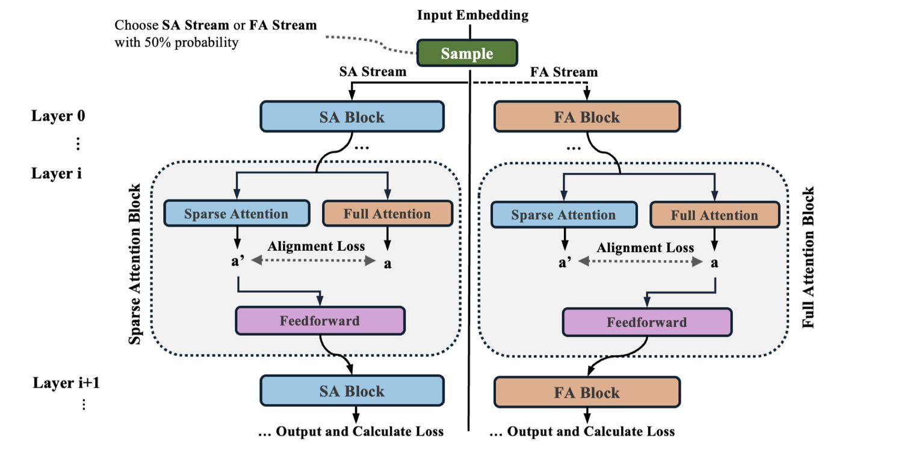

# SSA: Sparse Sparse Attention by Aligning Full and Sparse Attention Outputs in Feature Space

> Zhenyi Shen, Junru Lu, Lin Gui, Jiazheng Li, Yulan He, Di Yin, Xing Sun

> **声明：本 note 由 AI Agent 自动生成，仅供参考，建议结合论文原文阅读。**
>
> 生成时间：2026-06-04

---

## 一句话总结

SSA 提出了一种统一的训练框架，在训练阶段同时使用全注意力和稀疏注意力，并通过双向输出对齐损失强制两者在特征空间保持一致，从而显著提升注意力稀疏性，实现稀疏推理和全注意力推理的双重最优性能。

---

## 摘要翻译

全注意力的二次复杂度限制了大语言模型（LLM）的高效长上下文处理。稀疏注意力通过限制每个 query 仅关注前序 token 的子集来降低计算成本；然而，无训练的稀疏注意力方法往往导致严重的性能退化。原生稀疏注意力方法（如 NSA、MoBA）缓解了这一问题，但暴露出一个关键悖论：尽管旨在近似全注意力，它们产生的注意力稀疏性反而低于全注意力模型，这可能限制了其有效性。我们将此悖论归因于梯度更新不足：在稀疏训练中被排除的低排名 key-value 对既未获得前向贡献，也未获得反向梯度，因此从未学会正确地抑制无关 token。

为了克服这一局限，我们提出了 SSA（Sparse Sparse Attention），一种统一的训练框架，同时考虑稀疏注意力和全注意力，并在每一层强制执行双向对齐。这一设计保留了对所有 token 的梯度流，同时显式地鼓励稀疏注意力输出与全注意力输出对齐，从而促进更强的稀疏性。因此，SSA 在多个常识推理基准测试中，在稀疏注意力和全注意力推理下均达到了最先进的性能。此外，SSA 使模型能够平滑地适应不同的稀疏度预算——随着允许关注更多 token，性能持续提升，支持灵活的推理时计算-性能权衡。最后，我们表明原生稀疏注意力训练通过缓解 sink 区域注意力值的过度分配来改善长上下文外推能力，其中 SSA 展现了最强的外推能力。

---

## 研究动机

1. **全注意力的计算瓶颈**：标准 Transformer 的全自注意力机制对上下文长度具有二次计算复杂度，使得在 128K 甚至 1M token 的长上下文下训练和推理成本极高。

2. **无训练稀疏注意力的性能退化**：Training-free 的 Full-Sparse 方法（如 StreamingLLM）虽然计算高效，但频繁产生显著的性能下降。

3. **原生稀疏注意力的关键悖论**：作者发现 Sparse-Sparse 模型（如 NSA、MoBA）虽然专为稀疏性设计，但其注意力稀疏性反而**低于**全注意力模型。这是一个反直觉的现象，挑战了稀疏注意力的核心前提——只有少量 key 贡献显著的注意力输出。

4. **梯度更新不足**：作者将此悖论归因于梯度更新不足——在稀疏训练过程中被排除的低排名 key-value 对既不参与前向计算，也不接收反向梯度，导致模型无法学会抑制不相关的 token。

5. **长上下文外推需求**：随着 LLM 应用场景的扩展（长文档理解、深度推理轨迹、深度研究工作流），对高效长上下文处理的需求日益增长，但全注意力模型在超出训练窗口后性能急剧退化。

---

## 方法（技术细节）

### 核心思想

SSA 是一种统一的训练框架，联合使用稀疏注意力和全注意力，并通过双向输出对齐损失增强注意力稀疏性。

### 训练流程

- **双流交替训练**：在每次迭代中，以 50% 的概率选择全注意力（FA）流或稀疏注意力（SA）流作为主语言建模目标。
- **主流与辅助流**：如果当前是 FA 流，则计算全注意力输出作为主流，同时计算稀疏注意力输出作为辅助（仅用于对齐目标，不传播到下一层）；反之亦然。
- **损失函数**：

$$\mathcal{L} = \mathbb{E}_{\text{mode} \sim \{\text{full, sparse}\}}[\mathcal{L}_{\text{mode}}] + \alpha \mathcal{L}_{\text{alignment}}$$

其中 $\mathcal{L}_{\text{mode}}$ 是标准的交叉熵损失，$\alpha$ 是权重系数，$\mathcal{L}_{\text{alignment}}$ 是双向对齐损失。

### 对齐损失（双流对齐机制）

对齐损失由两个互补组件组成：

1. **稀疏性损失（Sparsity Loss）**：
$$\mathcal{L}_{\text{sparsity}} = \|a_{\text{full}} - \text{sg}[a_{\text{sparse}}]\|$$
鼓励全注意力输出模仿稀疏注意力输出，从而促进更稀疏、更选择性的注意力分布。实践中使用 SmoothL1 损失。

2. **承诺损失（Commitment Loss）**：
$$\mathcal{L}_{\text{commitment}} = \|a_{\text{sparse}} - \text{sg}[a_{\text{full}}]\|$$
正则化稀疏注意力输出，使其保持接近全注意力输出，类似于 VQ-VAE 中的承诺损失和 RLHF 中的 KL 散度项。

总对齐损失：$\mathcal{L}_{\text{alignment}} = \mathcal{L}_{\text{sparsity}} + \mathcal{L}_{\text{commitment}}$

其中 $\text{sg}[\cdot]$ 表示停止梯度操作。双向对齐确保全注意力趋向更稀疏的分布，同时稀疏注意力路径保持稳定且与全注意力保持一致。

### 稀疏注意力机制

- **块稀疏注意力（Block-sparse Attention）**：将输入序列划分为多个块，对每个 query 计算其与所有前序块表示（通过块内 token 嵌入的均值池化）的相似度，选择 top-k 最相关的块。
- **块级相似度保持 token 级排序**：$\text{Mean}(qK^\top) = q \text{Mean}(K)^\top$，因此块级选择近似于 token 级注意力排序。
- **复杂度**：如果总块数为 $n$，每块 $s$ 个 token，则稀疏率约为 $k/n$，计算复杂度为 $O((ks)^2)$，从标准自注意力的二次降至亚二次。

### 其他配置

- **模型架构**：基于 Llama-3.2-1B 架构，关键修改：KV head 数量降至 2（适配块稀疏注意力实现和加速训练）；采用 Gated Attention（缓解注意力 sink 现象）。
- **训练数据**：SmolLM 语料库，100B token，上下文长度 8K，学习率 1e-3（余弦退火），全局 batch size 3.15M token。
- **训练效率**：虽然训练时计算了全注意力，但不将其用于后续计算（如 FFN 或输出 softmax 层），因此训练成本不会翻倍，仅有轻微增加。
- **推理效率**：与 MoBA 相同的稀疏注意力操作，极高效的长上下文推理。

---

## 实验结果

### 语言建模（PPL）

- SSA 在相同稀疏预算下达到所有稀疏注意力基线中最低的困惑度。
- 全注意力推理下与 FullAttn 模型匹配（PPL 15.19 vs 15.18）。
- SSA 的稀疏和全注意力 PPL 差距显著缩小，体现了更强的注意力稀疏性。

### 常识推理

- SSA 在所有基线中始终表现最佳，在 256 感受野下甚至**超越** FullAttn 模型。
- SSA 全注意力推理平均得分 60.22%（FullAttn 为 59.48%），稀疏推理 59.87%（MoBA 为 58.60%）。
- 更高注意力稀疏性不仅提升稀疏推理，也改善常识推理任务表现。

### 长上下文评估

#### Needle-in-a-Haystack (NIAH)
- SSA 在几乎所有感受野下都是最强的稀疏注意力方法。
- 全注意力推理下达到 100% 准确率。
- 超过训练长度（8K）后，FullAttn 崩溃至 0%，而稀疏注意力训练的模型保持非零检索准确率。

#### 困惑度（PPL）
- FullAttn 和 MoBA 在超过训练窗口后 PPL 爆炸。
- SSA 和 NSA 在 32K 上下文下仍保持稳定低 PPL。
- NSA 在 PPL 上略优于 SSA（得益于滑动窗口模块），但 SSA 在 LongBench 理解任务上更优。

#### LongBench
- SSA 在所有推理模式下持续取得最佳结果。
- 稀疏注意力训练模型在长上下文理解任务上优于全注意力模型。
- SSA 在 32K 下的 LongBench 平均得分 20.75%，超过 NSA 的 18.21%。

### 不同稀疏度的外推

- SSA 在不同稀疏度水平间表现出近乎单调的性能提升（随更多 token 参与注意力计算，性能持续改善）。
- MoBA 无法有效外推。
- FullAttn 行为与 SSA 相似，但在几乎所有稀疏度水平上表现更差。

### 消融实验

- **稀疏度水平**：较小感受野（如 16×16）提供更强的结构约束和更好的正则化效果；过大或过小的感受野都不利。
- **全注意力采样比例**：适度的 SA 流引入（FullRatio=0.75）可获得接近最优的 PPL，而更多 FA 流权重通常带来更好的下游基准表现。
- **对齐权重 α**：不同 α 值影响性能，需要仔细调优。
- **对齐损失**：移除对齐损失导致性能显著下降。单向对齐（仅 Full→Sparse 或仅 Sparse→Full）导致训练不稳定。

---

## 优势

1. **统一框架，双向对齐**：首次在训练中联合使用全注意力和稀疏注意力，并通过双向对齐损失增强注意力稀疏性，设计简洁有效。
2. **双重推理最优**：SSA 在稀疏推理和全注意力推理下均达到最佳性能，而非牺牲一方来换取另一方。
3. **更强的注意力稀疏性**：SSA 的注意力稀疏性显著高于 Full-Full 和 Sparse-Sparse 基线，直接带来更好的推理质量。
4. **灵活的推理时权衡**：支持不同稀疏度预算的平滑适应，随更多 token 参与注意力计算，性能持续提升。
5. **强长上下文外推**：即使在 8K 上下文训练下，SSA 在 32K 长度上仍保持稳定低 PPL，在 LongBench 上取得最佳成绩。
6. **缓解注意力 sink 现象**：原生稀疏注意力训练自然缓解了全注意力训练中的注意力 sink（数据无关的全局 spike），从而改善长上下文泛化。
7. **推理效率高**：推理时的稀疏注意力操作与 MoBA 相同，极高效的长上下文推理。
8. **训练成本仅轻微增加**：虽然训练时计算全注意力，但不用于后续层计算，因此训练成本不会翻倍。

---

## 局限

1. **模型规模有限**：实验主要在 300M 和 1B 参数规模上进行，缺乏在更大规模（如 7B、70B）模型上的验证。
2. **训练复杂度增加**：虽然训练成本不会翻倍，但每次迭代需要计算两种注意力模式（全注意力和稀疏注意力），增加了实现复杂性和计算开销。
3. **对齐损失需要调优**：对齐权重 α、感受野大小、采样比例等超参数需要仔细调优，增加了实验负担。
4. **单向对齐不稳定**：仅使用单向对齐（Full→Sparse 或 Sparse→Full）会导致训练不稳定，说明双向对齐是必要的，但这也增加了设计的复杂性。
5. **代码未开源**：论文中未提供代码实现（代码 URL 为空），限制了可复现性。
6. **NSA 的滑动窗口优势**：NSA 在长上下文 PPL 上略优于 SSA（得益于其滑动窗口模块），但 SSA 的架构更简单。
7. **稀疏度选择策略**：当前使用块级均值池化和 top-k 选择，可能不如更精细的 token 级选择（如 DSA）有效。
8. **评估基准局限**：主要评估了常识推理和长上下文理解，缺乏在代码生成、数学推理等其他任务上的全面评估。
9. **仅支持块稀疏注意力**：SSA 专门针对块稀疏注意力设计，未探讨其与滑动窗口注意力、压缩注意力等其他稀疏模式的结合。

---

## 与 EfficientPaper 相关的研究方向

### 相关研究方向

1. **注意力稀疏性优化**：SSA 属于注意力稀疏性优化的研究方向，与 MoBA、NSA、DSA 等方法密切相关，共同探索如何在保持模型性能的同时降低注意力计算复杂度。

2. **长上下文高效推理**：SSA 通过增强注意力稀疏性改善长上下文外推能力，与 StreamingLLM、InfLLM、InfLLM-v2 等长上下文高效推理方法相关。

3. **注意力机制设计**：SSA 的双向对齐机制是一种新的注意力机制设计思路，启发了通过联合优化多种注意力模式来增强模型能力的方法。

4. **训练效率优化**：SSA 通过双流交替训练在不显著增加训练成本的情况下提升模型性能，与 EfficientPaper 中关注的训练效率优化方向一致。

5. **稀疏注意力与全注意力的统一**：SSA 的核心贡献在于统一了稀疏注意力和全注意力的训练，实现了两者在特征空间的对齐，为高效 AI 研究提供了新的思路。

### 相关方法对比

| 方法 | 类型 | 稀疏性 | 推理效率 | 长上下文能力 |
|------|------|--------|----------|------------|
| FullAttn | Full-Full | 低 | 低 | 一般 |
| MoBA | Sparse-Sparse | 中 | 高 | 一般 |
| NSA | Sparse-Sparse | 中 | 高 | 较好 |
| SSA | Full-Sparse | 高 | 高 | 最佳 |

### 未来研究方向

1. **更大规模验证**：在 7B、70B 等更大规模模型上验证 SSA 的有效性。
2. **多模态扩展**：将 SSA 应用于多模态模型（如视觉-语言模型）中。
3. **动态稀疏度调度**：根据任务需求动态调整稀疏度，实现更灵活的计算-性能权衡。
4. **与其他稀疏模式的结合**：探索 SSA 与滑动窗口注意力、压缩注意力等其他稀疏模式的结合。
5. **硬件优化**：针对特定硬件（如 GPU、TPU）优化 SSA 的稀疏注意力实现，进一步提升推理效率。
6. **训练策略改进**：探索更高效的训练策略，如渐进式稀疏度增加、自适应对齐权重等。
7. **与其他高效注意力方法的结合**：将 SSA 与 GQA、MQA、FlashAttention 等其他高效注意力方法结合，进一步提升效率。

---

## 参考文献

- 基础方法：FullAttn（标准全注意力）、MoBA（块混合注意力）、NSA（原生稀疏注意力）
- 相关工作：StreamingLLM、InfLLM、InfLLM-v2、DSA、Gated Attention
- 评估基准：PIQA、HellaSwag、ARC-Easy、ARC-Challenge、WikiText、LongBench、Needle-in-a-Haystack
