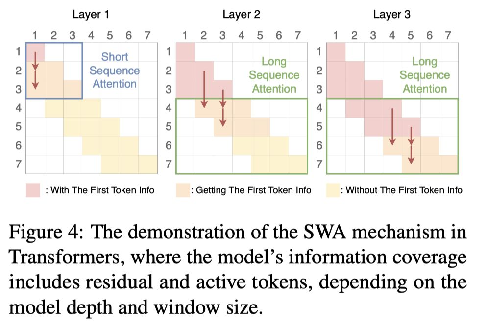

# Sliding Window Attention Training for Efficient Large Language Models

> Zichuan Fu, Wentao Song, Yejing Wang, Xian Wu, Yefeng Zheng, Yingying Zhang, Derong Xu, Xuetao Wei, Tong Xu, Xiangyu Zhao

> **声明**：本 note 由 AI Agent（Hermes Agent）自动生成，基于 arXiv 论文全文阅读和理解。生成时间：2025年。

---

## 一句话总结

SWAT 通过用 sigmoid 替代 softmax 并结合平衡的 ALiBi 和 RoPE 位置编码，实现了滑动窗口注意力的有效训练，在八个常识推理基准测试上达到了优于线性递归架构的 SOTA 性能，同时保持线性计算复杂度。

---

## 摘要翻译

近年来，基于 Transformer 的大语言模型（LLMs）在各种任务上展现了卓越能力。然而，其关于序列长度的二次计算复杂度仍然是处理长文档的主要瓶颈。因此，许多研究（如稀疏注意力和状态空间模型）被提出以提升 LLM 在长序列上的效率。虽然这些方法有效，但它们在性能上有所妥协或引入了架构复杂性。这呼唤一种简单而高效的模型来保持基本的 Transformer 架构。为此，作者提出了 SWAT，通过滑动窗口注意力训练实现高效的长上下文处理。具体而言，SWAT 用 sigmoid 函数替代 softmax 以实现高效的信息压缩与保留，并利用平衡的 ALiBi 和旋转位置嵌入（RoPE）来稳定训练过程。实验表明，SWAT 在八个常识推理基准测试上与主流线性递归架构相比达到了 SOTA 性能，同时在推理阶段通过滑动窗口注意力保持线性计算复杂度。

---

## 研究动机

Transformer 模型的自注意力机制具有 O(N²) 的计算复杂度，这在处理长序列时成为显著瓶颈。现有的解决方案主要有两类：

1. **稀疏注意力机制**（如 Longformer、BigBird）：通过选择性计算注意力分数来降低计算量，但依赖预定义的注意力模式，灵活性有限。
2. **线性递归架构**（如 Mamba、RWKV、GLA）：通过递归隐藏状态实现高效序列处理，但通常引入复杂的架构，难以利用现有的 Transformer 技术进行方便的实现和部署。

**滑动窗口注意力（SWA）** 是最直观的解决方案，它避免了添加额外的模型组件并将推理计算复杂度压缩为线性。然而，现有的 SWA 方法面临两个核心挑战：

- **训练-推理差距**：当前研究主要关注推理阶段的注意力沉降问题（attention sink），但忽略了训练过程，导致训练和推理之间存在差距。
- **信息丢失**：窗口之外的 token 被忽略，导致长上下文建模中的信息丢失。

论文通过深入分析发现，注意力沉降现象的根本原因在于 softmax 操作的高方差，导致 token 嵌入方差传播。具体来说，Qwen2-7B 的实验显示，第一个 token 的隐藏状态方差显著高于后续 token，这为注意力沉降通过归一化机制传播提供了有力证据。

---

## 方法（技术细节）

### SWAT 框架概述

SWAT 是一种基于滑动窗口注意力训练的高效 LLM 框架，其核心改进在于三个组件的组合：**sigmoid 激活函数**、**平衡 ALiBi** 和 **RoPE 位置编码**。

### 1. Sigmoid 替代 Softmax

传统 Transformer 使用 softmax 归一化注意力权重：

$$\text{Attention}(Q, K, V) = \text{softmax}\left(\frac{QK^T}{\sqrt{d}}\right)V$$

softmax 的指数性质导致"赢家通吃"效应，注意力权重集中在最高分的 token 上，严重抑制其他 token，这在滑动窗口场景下会阻碍模型保留历史信息。此外，softmax 还通过隐式位置信息传播导致注意力沉降。

SWAT 用 sigmoid 函数替代 softmax：

$$\text{Attention}(Q, K, V) = \sigma\left(\frac{QK^T}{\sqrt{d}}\right)V$$

其中 σ(·) 是 sigmoid 函数。sigmoid 对每个输入独立操作，不跨多个值进行归一化，因此不存在"赢家通吃"效应。这使得窗口内的所有 token 都能被有效保留，提升了每个 token 的信息容量。

### 2. 平衡 ALiBi（Balanced ALiBi）

为了在 sigmoid 的密集注意力模式中引入判别性偏置，并更好地区分滑动窗口内的 token 表示，SWAT 提出了平衡 ALiBi，这是原始 ALiBi 机制的双向扩展：

$$\text{Attention}(Q, K, V) = \sigma\left(\frac{QK^T}{\sqrt{d}} + s \cdot (m - n)\right)V$$

其中 m 和 n 是 token 索引（m > n），s 是斜率。

与原始 ALiBi 仅使用负斜率不同，平衡 ALiBi 在不同注意力头中同时使用正斜率和负斜率：
- **前向头**（h/2 个）：使用负斜率 $s_k = -2^{-k}$，关注近期上下文
- **后向头**（h/2 个）：使用正斜率 $s_k = 2^{-k}$，保留历史信息

这种双向斜率设计允许注意力头在不同时间方向上专业化，使模型能够同时保留近期和历史信息。

### 3. RoPE 位置编码

由于将 softmax 替换为 sigmoid 后，softmax 归一化中隐式的位置信息丢失，仅靠 ALiBi 提供的位置信号较弱，SWAT 进一步引入旋转位置编码（RoPE）来增强显式位置信息，确保训练稳定性。

最终的 SWAT 注意力计算为：

$$\text{Attention}(Q, K, V)_m = \sum_{n=m-\omega+1}^{m} \sigma\left(\frac{(R_{\Theta,m}q_m)^T (R_{\Theta,n}k_n)}{\sqrt{d_k}} + s \cdot (m-n)\right)v_n$$

其中 $R_{\Theta,m}$ 和 $R_{\Theta,n}$ 是 RoPE 旋转矩阵，ω 是滑动窗口大小，确保 m - n < ω。

### 4. 网络效率

由于 SWAT 的架构与标准注意力层几乎相同，每个 token 的计算成本在等效注意力长度下几乎相同（除了计算 ALiBi 的额外开销）。但由于使用了滑动窗口，整体计算变为线性：

$$\text{Cost} = N\omega \times (1 + \delta_{\text{ALiBi}}), \quad 0 < \delta_{\text{ALiBi}} \ll 1$$

其中 $\delta_{\text{ALiBi}}$ 表示 ALiBi 的额外开销。

### 5. 训练范式

SWAT 引入了一种新的训练范式，其中每个窗口滑移需要仔细的历史上下文管理。在 Transformer 的上层，新 token 的嵌入仍然保留了旧 token 嵌入的一定权重。因此，模型倾向于在高层保留所有过去的嵌入，以防止滑动窗口造成的信息丢失，从而增强模型的信息压缩能力。

---

## 实验结果

### 实验设置

- **数据集**：FineWeb-Edu 的 100BT 子集（高质量教育数据集）
- **模型规模**：340M（15B tokens）和 760M（30B tokens）参数
- **词汇表**：与 Llama 2 相同
- **序列长度**：4096 tokens
- **批大小**：0.5M tokens
- **评估基准**：八个常识推理任务（Wiki、LMB、PIQA、HellaSwag、WinoGrande、ARC-e、ARC-c、SIQA、BoolQ）

### 主要结果

**340M 参数 / 15B tokens：**
- SWAT (-) 在八个任务上平均达到 46.88%，显著超越所有基线（包括 Gated DeltaNet 45.42%、Titans 46.17%）
- 在 PIQA（65.94%）、ARC-e（59.68%）、ARC-c（28.24%）、SIQA（38.69%）上达到最佳

**760M 参数 / 30B tokens：**
- SWAT (-) 在平均准确率上达到 51.85%，超越 Titans（51.56%）等所有基线
- 在 LMB（40.81%）、PIQA（69.80%）、HellaSwag（48.65%）上达到最佳
- 随着模型规模增大，困惑度显著下降

**不同配置比较：**
- **SWAT (-)**（仅负斜率）：在短文本基准上表现最佳，但长文本上略弱
- **SWAT (+)**（仅正斜率）：表现较弱，表明正斜率需要与反向注意力结合使用
- **SWAT (-+)**（平衡配置）：在不同任务上表现更均衡，在 BoolQ（62.11%）上达到最佳，适合需要历史上下文的复杂推理任务

### 滑动窗口训练效果验证

- 滑动窗口训练显著提升了长序列性能：在 16,384 长度评估时，Sliding Window A（3.0051）远优于 Vanilla A（4.8414）
- 传统 Transformer 仅在评估长度与训练长度匹配时表现最优，而滑动窗口训练模型在不同序列长度上保持稳定性能

### 消融实验

- 直接用 sigmoid 替代 softmax 会导致显著性能下降（需要 ALiBi 稳定训练）
- ALiBi 斜率配置（6:6 vs 12:0 vs 8:4）对性能有关键影响
- AliRope-6:6（ALiBi + RoPE）实现了最低的平均损失（2.51）和最稳定的训练模式
- 延长训练长度从 1024 到 2048（保持层数和窗口大小固定）并未帮助降低损失

---

## 优势

1. **架构简单**：SWAT 保持了基本的 Transformer 架构，无需复杂的额外组件或新架构，便于实现和部署。
2. **线性计算复杂度**：通过滑动窗口注意力，推理时的计算复杂度从 O(N²) 降低到 O(N·ω)，同时保持模型性能。
3. **解决注意力沉降**：通过 sigmoid 替代 softmax，从根本上解决了注意力沉降问题，避免了隐式位置信息传播导致的偏差。
4. **双向信息保留**：平衡 ALiBi 设计使模型能够同时关注近期和历史信息，提升了长上下文处理能力。
5. **训练稳定性**：通过 ALiBi 和 RoPE 的组合，确保了训练过程的稳定性，避免了 sigmoid 密集注意力导致的信息过载。
6. **性能卓越**：在八个常识推理基准测试上达到 SOTA，超越了包括 Gated DeltaNet、Titans 在内的多种线性递归架构。
7. **与现有技术兼容**：可以利用现有的 Transformer 训练技术（如 FlashAttention、分布式训练），无需额外的并行训练技术。
8. **代码开源**：提供了 PyTorch 实现（https://github.com/Fzkuji/swat-attention），便于复现和进一步研究。

---

## 局限

1. **超参数敏感性**：SWAT 的性能对超参数配置（窗口大小、模型深度、ALiBi 斜率分布）显著敏感，需要全面的超参数探索来优化模型架构。
2. **规模扩展的边际效应**：随着模型规模增大，可能遇到保留长上下文信息的边际递减效应。较大的模型可能完全记忆训练数据，减少了信息传输的需求，从而削弱了设计用于处理扩展上下文的机制的有效性。
3. **最大注意力距离受限**：SWAT 的最大注意力距离受限于窗口大小和模型深度的乘积。虽然理论上可以扩展这些参数来增加注意力跨度，但在处理超长序列时信息丢失仍然不可避免。
4. **需要缓存机制**：未来实验需要在训练过程中保留前一步的缓存以解决上述问题。
5. **评估基准有限**：主要在常识推理任务上进行评估，缺乏对代码生成、数学推理等复杂任务的评估。
6. **与全注意力 Transformer 的比较**：虽然在效率上优于全注意力，但可能在需要全局注意力的特定任务上性能不如标准 Transformer。
7. **缺乏大规模验证**：实验主要在 340M 和 760M 参数的模型上进行，缺乏更大规模（如 7B、13B）的验证。
8. **训练长度限制**：虽然支持长序列，但训练序列长度仍受限于 4096，可能限制了对更长序列的建模能力。

---

## 与 EfficientPaper 相关的研究方向

SWAT 与 EfficientPaper 研究方向高度相关，涉及以下几个关键领域：

### 1. 稀疏注意力与高效 Transformer
- **Sparse Transformer**（Child et al., 2019）、**Longformer**（Beltagy et al., 2020）、**BigBird**（Zaheer et al., 2021）等通过稀疏注意力模式降低计算复杂度，与 SWAT 的滑动窗口方法有直接关联。
- SWAT 提供了对稀疏注意力的新理解：通过 sigmoid 函数替代 softmax，实现了更高效的信息保留，同时保持了 Transformer 架构的简洁性。

### 2. 线性递归模型
- **Mamba**（Gu & Dao, 2023）、**RWKV**（Peng et al., 2023）等通过状态空间模型实现线性复杂度，是 SWAT 的主要竞争对手。
- **GLA**（Yang et al., 2024c）、**Gated DeltaNet**（Yang et al., 2024b）等通过门控机制实现线性注意力，与 SWAT 的 sigmoid 替代方案形成对比。
- **DeltaNet**（Yang et al., 2025）、**TTT**（Sun et al., 2024）等通过不同的近似技术实现线性复杂度，与 SWAT 在效率和性能之间提供了不同的权衡。

### 3. 注意力沉降与长序列处理
- **Attention Sink**（Xiao et al., 2023）：SWAT 通过 sigmoid 函数从根源上解决了注意力沉降问题，而现有方法（如 StreamingLLM）主要在推理阶段进行缓解。
- **Transformer-XL**（Dai et al., 2019）、**Memorizing Transformers**（Wu et al., 2022）等通过缓存机制处理长序列，与 SWAT 的滑动窗口训练形成互补。

### 4. 位置编码与位置信息
- **RoPE**（Su et al., 2023）：SWAT 使用 RoPE 作为显式位置编码，与 ALiBi 的隐式位置信息结合。
- **ALiBi**（Press et al., 2022）：SWAT 通过平衡 ALiBi 实现双向位置编码，扩展了原始 ALiBi 的单向设计。
- **位置信息在归一化中的作用**（Chi et al., 2023）：SWAT 的分析表明，softmax 的归一化操作通过方差传播隐式编码位置信息，这为位置编码研究提供了新的视角。

### 5. 高效训练与部署
- **FlashAttention**：SWAT 可以利用 FlashAttention 等优化技术实现高效训练和推理。
- **分布式训练**：SWAT 的简洁架构使其能够轻松集成现有的分布式训练框架（如 FSDP、DeepSpeed）。
- **自适应窗口大小**：未来可探索自适应窗口大小以实现更灵活的文本处理，这与 EfficientPaper 中高效 LLM 研究方向一致。

### 6. Sigmoid 自注意力的新范式
- **理论分析**（Ramapuram et al., 2025）：SWAT 的 sigmoid 替代方案与最新的 sigmoid 自注意力理论研究相呼应，为注意力机制的设计提供了新的理论基础。
- **与标准 Transformer 的兼容性**：SWAT 保持了标准 Transformer 的架构，这意味着它可以与现有的预训练模型（如 Llama 2、Qwen2）结合使用，进行微调或迁移学习。

### 7. 与其他高效模型的对比
| 模型 | 计算复杂度 | 架构类型 | 位置编码 |
|------|-----------|---------|---------|
| SWAT | O(N·ω) | Transformer | RoPE + ALiBi |
| Mamba | O(N) | SSM | 隐式 |
| GLA | O(N) | 线性注意力 | 可选 |
| DeltaNet | O(N) | 线性注意力 | 可选 |
| TTT | O(N) | 线性注意力 | 可选 |
| Titans | O(N) | 混合架构 | 可选 |

SWAT 在保持 Transformer 架构的同时实现了线性复杂度，在效率和性能之间取得了优异的平衡，为高效 LLM 研究提供了重要的参考方向。
