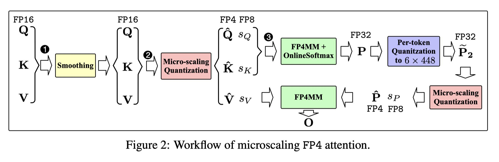

# SageAttention3: Microscaling FP4 Attention for Inference and An Exploration of 8-Bit Training

> Jintao Zhang, Jia Wei, Pengle Zhang, Xiaoming Xu, Haofeng Huang, Haoxu Wang, Kai Jiang, Jun Zhu, Jianfei Chen



## 一句话总结

SageAttention3 是首个利用 Blackwell GPU 的 FP4 Tensor Core 实现微缩放（Microscaling）FP4 注意力推理加速的工作，在 RTX5090 上实现 1038 TOPS（较 FlashAttention 提升 5 倍），并首次探索了 8 位注意力在训练任务中的可行性（SageBwd），在微调中达到无损性能。

## 摘要翻译

注意力的效率至关重要，因为其具有二次时间复杂度。我们通过两项关键贡献来提升注意力效率：第一，利用 Blackwell GPU 中的新型 FP4 Tensor Core 来加速注意力计算。我们的实现在 RTX5090 上实现了 1038 TOPS，相比 RTX5090 上最快的 FlashAttention 提速 5 倍。实验表明，我们的 FP4 注意力可以以即插即用的方式加速各种模型的推理。第二，我们率先将低比特注意力应用于训练任务。现有的低比特注意力工作（如 FlashAttention3 和 SageAttention）仅关注推理。然而，训练大型模型的效率同样重要。为了探索低比特注意力能否有效应用于训练任务，我们设计了一种精确且高效的 8 位注意力，同时支持前向和反向传播。实验表明，8 位注意力在微调任务中实现了无损性能，但在预训练任务中收敛较慢。代码将在 https://github.com/thu-ml/SageAttention 发布。

## 研究动机

### 推理加速方面

1. **注意力效率瓶颈**：注意力机制的二次时间复杂度使其成为长序列生成模型（尤其是视频生成）的关键瓶颈。
2. **低比特量化潜力**：量化通过利用 GPU 中的低比特 Tensor Core 可以有效加速推理。Blackwell GPU（RTX5090）引入了新的 FP4 Tensor Core，相比 FP16 提供显著更快的性能。
3. **即插即用需求**：已有低比特注意力方案（如 FlashAttention3 的 FP8 注意力）无法以即插即用的方式应用于视频生成模型，且 FlashAttention3 仅支持 Hopper GPU。

### 训练加速方面

4. **训练效率同样重要**：现有低比特注意力工作（FlashAttention3、SageAttention）仅关注推理，训练加速方面的空白亟需填补。
5. **探索可行性**：这是首次探索低比特注意力在训练中的可行性，设计可训练的 8 位注意力以加速前向和反向传播。

### 核心挑战

- **C1**：FP4 量化仅有 15 个可表示值，逐张量或逐令牌量化无法保持模型精度。
- **C2**：注意力图 P 的值主要在 [0, 1] 范围内，直接量化到 FP4 会导致缩放因子动态范围极窄，而硬件要求缩放因子为 FP8 格式，导致精度损失。
- **C3**：8 位训练时，注意力图梯度对量化误差特别敏感，导致输入梯度误差累积。

## 方法（技术细节）

### 3.1 微缩放 FP4 注意力（SageAttention3）

#### 核心思想

采用微缩放（Microscaling）FP4 量化对注意力中的两个矩阵乘法（QK⊤ 和 PV）进行加速。

#### FP4 微缩放量化

给定矩阵 X ∈ R^(N×d)，量化为 FP4 格式的 X̂，缩放因子 sX 为 FP8 格式。将 X 划分为 1×n 的块（block size = 16），每个块对应一个缩放因子：

- **量化**：s_ij = max(|X|) / 6，X̂_ij = ⌈X_ij / s_ij⌋（FP4 舍入）
- **反量化**：X'_ij = s_ij × X̂_ij

#### FP4 微缩放 Matmul

FP4 微缩放 Matmul（FP4MM）指令接受四个输入（X̂_A, s_A, X̂_B, s_B），在 RTX5090 上实现约 1600 TOPS（FP16 约 200 TOPS，加速 8 倍）。

#### 注意力计算

```
Q̂, sQ = ϕ(Q), K̂, sK = ϕ(K⊤)
S = FP4MM(Q̂, sQ, K̂, sK)  // QK⊤
P̃ = OnlineSoftmax(S)       // 注意力图
P̂, sP = ϕ(P̃), V̂, sV = ϕ(V)
O = FP4MM(P̂, sP, V̂, sV)   // PV
```

硬件实现基于 FlashAttention 的分块（tiling）策略，同时采用 SageAttention2 的平滑（smoothing）Q 和 K 技术提升精度。

#### 数据类型选择

选择 NVFP4（E2M1 格式，block size = 1×16，缩放因子 E4M3）而非 MXFP4（E2M1，block size = 1×32，缩放因子 E8M0），因为 NVFP4 在注意力量化中精度更高（CosSim 99.52% vs 98.37%）。

### 3.2 P 的两级缩放（Two-level Scaling）

#### 问题

直接对注意力图 P 进行微缩放 FP4 量化会严重降低输出质量，因为 P 的值在 [0, 1] 范围，缩放因子（max(P)/6）范围为 [0, 0.167]，导致 E4M3 的表示范围利用不充分。

#### 解决方案

两级量化方法：
1. **第一级**：逐令牌（per-token）归一化，将 P 的每行范围映射到 [0, 448×6]
2. **第二级**：对归一化后的 P 应用标准微缩放 FP4 量化

```
sP1 = rowmax(P̃) / (448 × 6)
P̃2 = P̃ / sP1
sP2, P̂2 = ϕ(P̃2)
O = FP4MM(P̂2, sP2, V̂, sV) × sP1
```

效果：CosSim 从 93.32% 提升到 99.52%，L1 从 0.193 降至 0.077，RMSE 从 1.103 降至 0.201。

### 3.3 硬件实现优化

- **K 的排列（Permutation）**：FP4 MatMul 的 FP32 累加器内存布局与操作数 A 的寄存器布局不同，通过排列 P tile 的列来匹配，同时重新排列 K 的列（与量化核融合）。
- **重用 Shuffle**：将 eP 的微缩放量化与在线 Softmax 融合，复用 16 元素的最大值计算，减少 50% 的冗余 shuffle 和 max 操作，内核速度提升约 10%。
- **Producer Warp Epilogue**：创新地在 producer warp 之间实现 ping-pong 调度，一个 producer 加载下一次 MatMul 的输入，另一个同时将输出存储到全局内存，打破传统 warp 专化核的约束。

### 4. INT8 注意力用于训练（SageBwd）

#### 4.1 前向传播

两个矩阵乘法：S = QK⊤，O = PV

- **QK⊤**：沿用 SageAttention 的平滑 K 和逐块 INT8 量化。
- **PV**：采用逐令牌 INT8 量化（而非逐块），结合复用在线 Softmax 的全局/局部最大值，避免显式的 max 操作。V 使用逐块 INT8 量化。

#### 4.2 反向传播

五个矩阵乘法：S = QK⊤，dV = P⊤dO，dP = dOV⊤，dQ = dS·K，dK = dS⊤·Q

关键发现：**dOV⊤ 的量化对 dQ、dK 梯度的精度影响最大**，因为 dS 的误差会在反向传播的循环过程中沿序列长度累积，序列越长误差越大。

因此，保持 dOV⊤ 在 FP16 精度，其余四个矩阵乘法使用 INT8 逐块量化。效果：dQ 的 CosSim 从 97.47%（INT8）提升到 99.77%（FP16）。

## 实验结果

### 推理加速（SageAttention3）

**内核速度**（RTX5090）：
- 在 head_dim=128, causal=False 条件下，SageAttention3 达到 **1038 TOPS**
- FlashAttention2 最高约 212 TOPS
- xformers 最高约 94 TOPS
- **加速比**：FlashAttention 5 倍，xformers 11 倍

**端到端加速**：
- HunyuanVideo 推理：490s → 164s（**3 倍加速**）
- CogVideoX 推理：64s → 27s（**2.4 倍加速**）

**精度保持**（多个模型的端到端质量指标）：
- CogVideoX（视频生成）：CLIPSIM 0.1865 → 0.1881，CLIP-T 0.9968 → 0.9969
- HunyuanVideo：CLIPSIM 0.1838 → 0.1866
- Flux（图像生成）：FID 162.812 → 162.121，CLIP 31.409 → 31.450
- Stable-Diffusion3.5：CLIP 31.93 → 32.01

### 训练加速（SageBwd）

**内核速度**（RTX4090）：
- 最高较 FlashAttention 加速 **1.67 倍**
- 前向传播加速约 2 倍，反向传播加速约 1.2~1.6 倍

**端到端加速**：
- Llama（1B）训练：2.1s/iter → 1.9s/iter（8K），6.0s → 5.2s（16K），约 **1.15 倍加速**

**微调无损性能**（SageBwd vs BF16）：
- Qwen2.5 (1.5B)：GSM8K 0.520 vs 0.521，DROP 0.734 vs 0.733，MMLU 0.574 vs 0.569
- Qwen2.5 (3B)：GSM8K 0.607 vs 0.601，MMLU 0.653 vs 0.640
- Llama3.2 (1B)：GSM8K 0.268 vs 0.259，HELLASWAG 0.823 vs 0.828
- 多随机种子（5 个）下标准差极小，表明高度一致

**预训练局限**：
- Llama (400M) 在 FineWeb-Edu 上预训练，SageBwd 虽能收敛，但**收敛速度较慢**，不适合当前预训练任务。

## 优势

1. **突破性加速**：首个 FP4 注意力，RTX5090 上实现 1038 TOPS，较 FlashAttention 提速 5 倍。
2. **即插即用**：可无缝替换各种生成模型（文本、图像、视频）中的注意力，无质量损失。
3. **开创性探索**：首次将低比特注意力扩展到训练任务，填补了推理之外的空白。
4. **微调无损**：8 位注意力在微调任务中实现与 BF16 一致的性能，多随机种子下稳定。
5. **技术深度**：两级量化方法巧妙解决了 FP4 量化中缩放因子精度问题，硬件优化充分利用了 Blackwell 架构特性。
6. **多模型验证**：在语言、视频、图像等多模态模型上验证了有效性。
7. **开放代码**：代码开源，可复现性强。

## 局限

1. **硬件依赖**：FP4 注意力需要 Blackwell GPU（RTX5090），不支持旧架构。
2. **预训练不适用**：8 位注意力在预训练中收敛较慢，当前不适合大规模预训练。
3. **训练加速有限**：SageBwd 的训练加速（约 1.15 倍）与理论上限有差距，Triton 实现可能次优。
4. **dOV⊤ 保留 FP16**：反向传播中 dOV⊤ 仍需 FP16 精度，限制了进一步的量化加速。
5. **FP4 量化误差**：尽管采用了两级量化和微缩放策略，FP4 的精度仍受限于仅 15 个可表示值。
6. **长序列训练**：dS 的误差会在反向传播中沿序列长度累积，长序列下误差可能更大。

## 与 EfficientPaper 相关的研究方向

1. **低比特推理加速**：SageAttention3 代表了从 FP8 到 FP4 的推理加速趋势，是 EfficientPaper 中"量化加速"方向的前沿工作。
2. **低比特训练**：SageBwd 是首个可训练的低比特注意力，开辟了"训练加速"的新方向。
3. **注意力机制优化**：与 FlashAttention 系列、线性注意力、稀疏注意力等正交，可结合使用。
4. **硬件-算法协同设计**：充分利用 Blackwell GPU 的 FP4 Tensor Core，体现了硬件特性驱动的算法创新。
5. **多模态生成加速**：在视频（HunyuanVideo、CogVideoX）、图像（Flux、SD3.5）等模型上验证了通用性。
6. **KV Cache 量化**：论文关键词包含 kv_cache_quant，与 EfficientPaper 的量化加速方向高度相关。
7. **稀疏注意力**：与 SparseVideoGen、SpargeAttn 等工作互补，可进一步探索稀疏+低比特的联合加速。
8. **长序列训练优化**：8 位注意力在长序列训练中的误差累积问题，是值得进一步研究的方向。

---

> **生成声明**：本笔记由 AI Agent（Hermes Agent）基于论文 PDF 全文自动生成，使用 /Users/xiandong/miniconda3/bin/python + PyMuPDF 提取文本，并基于论文内容撰写中文摘要。生成时间：2026 年 6 月。
