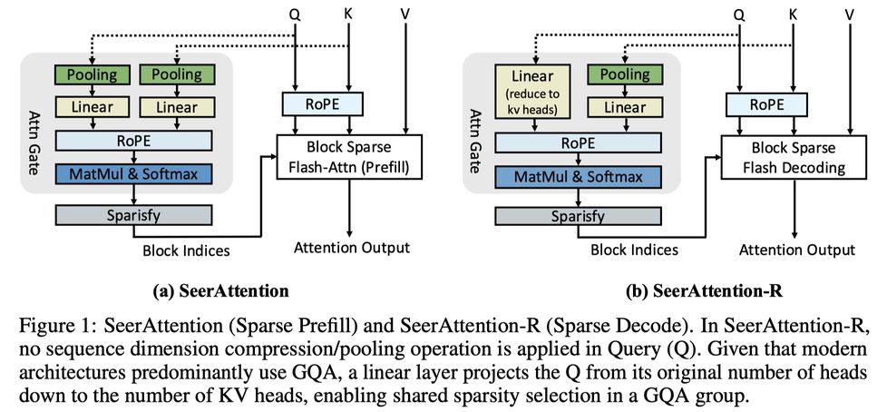

# SeerAttention-R: Sparse Attention Adaptation for Long Reasoning

> **生成声明**：本 note 由 AI Agent（Hermes Agent）于 2025 年 6 月自动生成，基于 arXiv 论文原文（2506.08889v1）全文阅读。内容仅供学习参考，如有错误请以原文为准。

---

## 一句话总结

SeerAttention-R 是一个针对推理模型长序列解码的轻量级稀疏注意力框架，通过自蒸馏注意力门控机制（AttnGate）学习注意力稀疏性，仅需 0.4B tokens 训练即可在 AIME 等推理基准上保持近无损精度，并在 H100 GPU 上实现高达 9× 的稀疏解码加速（相比 FlashAttention-3）。

---

## 摘要翻译

我们提出 SeerAttention-R，一个专门针对推理模型长序列解码的稀疏注意力框架。作为 SeerAttention 的扩展，SeerAttention-R 保留了通过自蒸馏门控机制学习注意力稀疏性的设计，同时移除查询（Query）的池化操作以适应自回归解码。凭借轻量级的插件式门控，SeerAttention-R 可以灵活地集成到现有的预训练模型中，而无需修改原始参数。我们证明，仅在 0.4B tokens 上训练的 SeerAttention-R，在 AIME 基准测试中使用 4K token 预算下，能够维持近无损的推理精度，同时采用较大的稀疏注意力块大小（64/128）。使用 TileLang，我们开发了一个高度优化的稀疏解码内核，在 H100 GPU 上 90% 稀疏度下实现了接近理论极限的加速，最高可达 FlashAttention-3 的 9 倍。

---

## 研究动机

### 1. 推理模型的效率挑战

近年来，以 OpenAI o1、DeepSeek-R1、Qwen3 为代表的推理模型展示了通过测试时扩展（test-time scaling）显著提升模型能力的潜力。更长的推理序列对应更强的推理能力，但同时也带来了显著的效率挑战：

- **自回归解码的计算增长**：后续 token 需要关注更长的上下文，导致计算和内存需求（KV cache）不断增加
- **每 token 生成成本线性增长**，整体生成成本呈二次方增长
- **长序列推理**使得注意力机制成为性能瓶颈

### 2. 稀疏注意力的潜力

研究表明，推理模型中的注意力也是固有稀疏的（intrinsic sparse），仅激活少量重要 token 即可维持模型推理能力。然而，如何有效地识别和利用这种内在稀疏性仍然是一个挑战。

### 3. 现有方法的不足

现有的稀疏注意力方法（如 Quest）属于训练无关（training-free）的启发式方法，在大块大小下精度下降明显。SeerAttention 虽然采用了可训练的门控机制，但其设计针对预填充（prefill）阶段，不适合自回归解码。

---

## 方法（技术细节）

### 1. 核心设计：AttnGate 适配解码

SeerAttention-R 的核心是在 SeerAttention 基础上，对注意力门控（AttnGate）进行修改，以适应自回归解码场景：

- **移除 Query 池化**：不同于 SeerAttention 对 Q 和 K 都进行序列维度压缩，SeerAttention-R 仅对 K 进行池化压缩，Q 保持逐 token 处理以适应自回归解码
- **GQA 共享稀疏性**：利用 Grouped Query Attention (GQA) 的结构，通过线性层将每个查询头组中的多个 query head 合并为单个 head，实现组内共享稀疏选择

**AttnGate 计算公式**：

- **Q 分支**：`Qgate = RoPE(Wq_gate · reshape(Qnope, [..., g·d]))`，其中 g 为 GQA 的组大小
- **K 分支**：`Kgate = RoPE(Wk_gate · concat[Pmax(Knope), Pmin(Knope), Pavg(Knope)])`
- **注意力分数**：`S = softmax(Qgate · Kgate^T / √dgate)`

### 2. K 分支的池化压缩

采用 Max、Min、Average 三种池化操作的组合来压缩 K 的序列维度：
- **Max Pooling** 和 **Min Pooling** 可以有效捕获异常值
- **Average Pooling** 有助于保持整体分布
- 池化输出拼接后送入线性层，与 SeerAttention 设计一致

### 3. 位置编码

AttnGate 使用预 RoPE 的 Q、K 张量作为输入，并在 AttnGate 内部重新应用 RoPE。由于 K 在序列维度被压缩，位置索引被分配给每个块的第一个 token。

### 4. 自蒸馏训练

**Ground Truth 生成**：
- 将预填充阶段的 2D 最大池化改为解码阶段的**列方向 1D 最大池化**
- 为适应 GQA 共享稀疏性，在每个 query head 子组内进一步最大池化
- 最终归一化为和为 1 的分布

**训练效率优化**：
- 修改 FlashAttention-2 内核，在前向传播中直接生成 ground truth，避免显式计算完整注意力图（避免二次方内存开销）
- 复用 Flash-Attention 的中间结果（如块级 rowmax）

**训练设置**：
- 仅训练 AttnGate 参数，原始模型权重冻结
- 训练数据：OpenR1-MATH-220K，0.4B tokens
- 全局 batch size 16，800 步
- 使用 DeepSpeed ZeRO-2 优化
- AdamW 优化器，学习率 1e-3，余弦衰减
- 序列长度打包至 32k

### 5. 推理流程

**K Compression Cache**：
- 存储 K 压缩后的表示（池化+线性）以加速 AttnGate 预测
- 每生成 b 个新 token 更新一次（b = 块大小）
- 额外内存开销仅约原 KV cache 的 1/128（<1%）
- 支持将大 KV cache 卸载到 CPU，仅按需检索激活块

**稀疏化方法**：
- **Token Budget 方法**：固定 token 预算，通过 Top-k 选择重要块（需排序，无需 softmax）
- **Threshold 方法**：选择超过阈值的块（自适应，无需排序，实现简单）

### 6. Block Sparse Flash Decoding 内核

- 基于 Flash Decoding 的 3D 启动空间（batch, heads_kv, num_split）
- 仅遍历 AttnGate 选定的块索引，跳过无效条目
- 使用 max_selected_blocks 进行分区，确保负载均衡
- H100 GPU 上利用 wgmma 指令，填充 query head 组到 64
- 提供 **TileLang** 和 **Triton** 两种实现
- TileLang 自动应用 tiling、warp specialization、pipelining、tensorization 等优化

---

## 实验结果

### 1. Oracle 稀疏实验（理论上限）

- **设置**：Qwen3-14B，块大小 32/64/128，token 预算 1k-8k
- **结论**：推理模型的注意力确实存在稀疏性
  - token 预算 ≥ 2k 时，Oracle 稀疏可实现无损精度
  - 块大小 32/64 时，即使 1k 预算精度损失也可忽略
  - 选择块大小 64 作为默认设置

### 2. SeerAttention-R vs Quest

- **模型**：Qwen3-4B/8B/14B、DeepSeek-R1-Distill-Qwen-14B
- **基准**：AIME24、AIME25、MATH-500、GPQA-Diamond
- **结论**：
  - SeerAttention-R 在所有基准和计算预算下**一致优于 Quest**
  - AIME24：SeerAttention-R 在 4K token 预算下实现无损精度，Quest 在 8K 预算下仍无法达到
  - MATH-500/GPQA-Diamond：SeerAttention-R 2K 预算即可无损，Quest 需约 8K
  - **大模型更具鲁棒性**：14B 模型比 4B/8B 更容易关闭与全注意力的精度差距

### 3. 内核加速

- **硬件**：NVIDIA H100 GPU
- **设置**：序列长度 8k-128k，batch 1-16，稀疏度 50%-90%
- **结果**：
  - TileLang 实现始终优于 FA3 和 Triton
  - batch=16，序列长度 ≥32k，90% 稀疏度下达到接近理论极限的 **8.6× 加速**
  - batch=4，序列长度 32k，0.9 稀疏度下达到 **6× 加速**
  - TileLang 比 Triton 快 1.7×

### 4. 消融实验

**块大小影响**：
- Quest 随块大小增大精度明显下降
- SeerAttention-R 在不同块大小下性能几乎一致（得益于 GQA 组内共享稀疏选择）

**混合密集注意力**：
- Quest 在前两层使用密集注意力时精度显著提升
- SeerAttention-R 仅获得边际收益（其前两层稀疏预测已足够准确）

**Threshold vs Token Budget**：
- Threshold 方法在高稀疏度区域精度略优
- Token Budget 方法更适合与不同方法直接对比

**稀疏注意力对推理长度的影响**：
- 不准确的稀疏注意力会增加推理输出长度（类似量化导致的推理路径变长）
- Quest 和低预算 SeerAttention-R 均会产生更长的推理路径
- 准确的稀疏选择对缓解此效应至关重要

### 5. 训练开销

- Qwen3-4B：10.9 GPU 小时
- Qwen3-8B：12.2 GPU 小时
- Qwen3-14B：18.6 GPU 小时
- 训练极为轻量，仅需 0.4B tokens

---

## 优势

1. **轻量级训练**：仅需 0.4B tokens 和少量 GPU 小时即可训练，不修改原始模型参数
2. **插件式集成**：可灵活集成到任何标准 Transformer 预训练模型中
3. **近无损精度**：在 4K token 预算下保持近无损推理精度
4. **支持大块大小**：在块大小 64/128 下仍保持高精度，降低稀疏注意力开销
5. **高效内核实现**：TileLang 实现的稀疏解码内核在 H100 上实现接近理论极限的加速
6. **GQA 共享稀疏性**：利用 GQA 结构实现组内共享稀疏选择，提高效率
7. **K Compression Cache**：额外内存开销极低（<1%），支持 KV cache 卸载
8. **训练无关 baseline**：与 Quest 相比，在所有设置下表现更优

---

## 局限

1. **缺乏端到端系统优化**：当前工作聚焦于稀疏解码精度和内核级加速，未与 vLLM、SGLang、Lserve 等推理框架集成，端到端加速有待未来工作
2. **稀疏度自适应不足**：当前使用固定稀疏度，需要在准确性和效率之间平衡，未来可结合 Top-p（Nucleus sampling）等方法实现自适应稀疏度
3. **Prefill 和 Decode 未统一**：SeerAttention 和 SeerAttention-R 目前分别训练，拥有不同的 AttnGate 设计，未统一
4. **缺少 PagedAttention 支持**：当前内核未与 PagedAttention 集成，限制了在实际推理系统中的应用
5. **准确性对推理长度的影响**：不准确的稀疏注意力会增加推理输出长度，可能导致效率下降
6. **仅在数学推理基准上验证**：实验主要在 AIME、MATH-500、GPQA-Diamond 上进行，缺少更多样化的任务验证

---

## 与 EfficientPaper 相关的研究方向

### 稀疏注意力与 KV Cache 优化
- **关键词**：sparse_pruning、attention_sparsity
- **相关工作**：SeerAttention（prefill 阶段稀疏注意力）、Quest、NSA、MoBA、Lserve、Rectified Sparse Attention
- **方向**：
  1. **稀疏注意力统一**：如何在 prefill 和 decode 阶段统一稀疏注意力机制，避免分别训练
  2. **自适应稀疏度**：结合 Top-p 等采样方法，根据任务难度和推理长度自动调整稀疏度
  3. **与 KV Cache 压缩结合**：将稀疏注意力与 KV cache 卸载、压缩技术结合，进一步减少 GPU 内存占用
  4. **推理框架集成**：将稀疏注意力内核与 vLLM、SGLang 等推理框架集成，实现端到端加速
  5. **多 token 预测与投机解码**：将多 token 预测或投机解码与稀疏注意力结合，利用 query 级并行性
  6. **更广泛的任务验证**：在代码生成、长文本理解等更多任务上验证稀疏注意力的效果

---

## 基本信息

- **标题**：SeerAttention-R: Sparse Attention Adaptation for Long Reasoning
- **作者**：Yizhao Gao, Shuming Guo, Shijie Cao 等
- **机构**：Microsoft Research, The University of Hong Kong, Huazhong University of Science and Technology, Peking University, Tsinghua University
- **发表**：arXiv 2025
- **代码**：https://github.com/microsoft/SeerAttention
- **论文链接**：http://arxiv.org/abs/2506.08889v1
