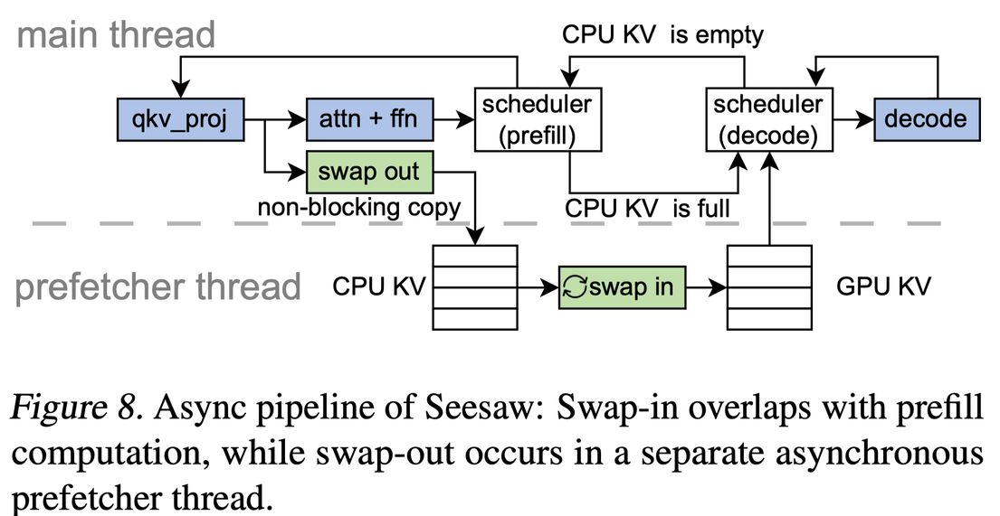

# Seesaw: High-throughput LLM Inference via Model Re-sharding

> Qidong Su, Wei Zhao, Xin Li, Muralidhar Andoorveedu, Chenhao Jiang, Zhanda Zhu, Kevin Song, Christina Giannoula, Gennady Pekhimenko
>
> University of Toronto, Vector Institute, CentML, Stanford University
>
> arXiv:2503.06433v1, 2025

## 一句话总结

Seesaw 提出了一种**动态模型重分片（dynamic model re-sharding）**技术，通过在 LLM 推理的预填充（prefill）和解码（decode）阶段动态切换并行化策略（tensor parallelism vs pipeline parallelism），配合分层 KV 缓存缓冲和最小化转换调度，实现了相比 vLLM 平均 **1.36×**、最高 **1.78×** 的吞吐量提升。

## 摘要翻译

为了提升分布式大语言模型（LLM）推理效率，研究者们提出了多种并行化策略，如张量并行和流水线并行。然而，LLM 推理的两个阶段——预填充和解码——具有截然不同的计算特征，使得单一静态并行策略无法同时有效优化两个阶段。本文提出 **Seesaw**，一个面向吞吐量优化的 LLM 推理引擎。Seesaw 的核心思想是**动态模型重分片**，该技术能够在不同阶段之间动态重新配置并行化策略，从而最大化两个阶段的吞吐量。为了缓解重分片开销并优化计算效率，Seesaw 采用了**分层 KV 缓存缓冲**和**最小化转换调度**。这些技术协同工作，减少频繁阶段转换带来的开销，同时确保最大化的批处理效率。评估结果表明，Seesaw 相比 vLLM（目前最广泛使用的 LLM 推理引擎）实现了最高 **1.78×**（平均 **1.36×**）的吞吐量提升。

## 研究动机

### LLM 推理的两阶段特性

LLM 推理遵循自回归生成范式，包含两个阶段：

- **预填充阶段（Prefill）**：一次性处理输入序列中的所有 token，生成初始输出 token。该阶段计算密集，多个 token 同时处理，计算和通信开销占主导。
- **解码阶段（Decode）**：逐个生成后续 token。该阶段计算量小，权重加载（data movement）开销占比相对较高。

### 现有方法的局限

- **静态并行策略**：现有系统（如 vLLM）使用单一并行配置贯穿整个推理过程，无法适应两个阶段的不同计算特征。
- **解耦预填充-解码（Disaggregated Prefill-Decode）**：如 DistServe、Mooncake 等，将预填充和解码分配到不同 GPU 实例，但存在严重的吞吐量不匹配问题。例如，在 8×40GB GPU 上部署 70B 模型时，即使最均衡的配置，预填充和解码之间的吞吐量差异也高达 6×。
- **Chunked Prefill**：如 Sarathi/Sarathi-serve，通过将长 prompt 切分为较小 chunk 与解码步骤混合，但最优 chunk 大小难以确定。

### 核心观察

1. **张量并行（TP）在预填充阶段表现较差**：TP 需要在每层进行 all-reduce 操作，通信开销随 TP 度数增加而显著增长，预填充阶段通信开销占比较高，因此 TP 在预填充时效率低下。
2. **流水线并行（PP）在解码阶段表现较差**：PP 将批次划分为 micro-batch（1/PP），需要更多次前向传播，导致权重加载开销在解码阶段被放大。

**结论**：没有"一刀切"的并行策略，预填充和解码需要不同的并行化方案。

## 方法（技术细节）

### 1. 动态模型重分片（Dynamic Model Re-sharding）

核心思想：在预填充阶段使用 pipeline parallelism（PP），在解码阶段切换为 tensor parallelism（TP），通过动态重分片实现。

- 预填充时使用 cp（preference for prefill）的并行策略，解码时使用 cd（preference for decode）的并行策略。
- 重分片涉及模型权重和 KV 缓存的重新分配。
- 模型权重通过从 CPU 内存重新加载所需分片来重分片。
- KV 缓存通过 CPU 共享内存进行重分片。
- 不动态调整数据并行（data parallelism），因为调整数据并行会改变 GPU 内存中模型权重与 KV 缓存的比例，增加系统复杂度。

### 2. 分层 KV 缓存缓冲（Tiered KV Cache Buffering）

- 利用 **CPU 内存**作为 KV 缓存的辅助存储，打破 GPU 内存对 KV 缓存容量的限制。
- 在预填充阶段，生成的 KV 缓存被卸载到 CPU 内存中，释放 GPU 内存用于更多序列的预填充。
- 在解码阶段，KV 缓存从 CPU 内存加载到 GPU 内存，支持更大的批处理大小。
- CPU KV 缓存使用操作系统共享内存实现，所有 GPU 共享。

### 3. 最小化转换调度（Transition-minimizing Scheduling）

- 控制阶段转换仅在 CPU KV 缓存满或空时发生。
- **预填充阶段**：持续进行预填充，直到 CPU KV 缓存满，然后触发重分片，转入解码。
- **解码阶段**：持续解码，当所有 CPU KV 缓存都已转移到 GPU 后，切换回预填充。
- 与预填充优先调度相比，减少了频繁转换；与解码优先调度相比，保持了较大的批处理大小。

### 4. 异步流水线（Asynchronous Pipeline）

为了减轻 KV 缓存传输开销：

- **Swap-out 与计算重叠**：预填充阶段生成的 KV 缓存在解码开始前不需要使用，因此 swap-out 可以与预填充计算重叠。使用两阶段传输：GPU → pinned memory（与计算重叠）→ shared memory（host 端操作）。
- **异步 Swap-in**：每个 worker 维护一个后台 prefetcher 线程，由调度器控制，独立于主线程运行。调度器在 GPU KV 存储有空闲槽位时创建新的预取任务，完成后通知调度器，使这些序列可以被调度进行解码。
- **带宽感知的 KV 缓存布局**：使用 HND（num heads, seq len, head dim）布局存储 KV 缓存，避免张量并行中沿 H 维度分片导致的非连续内存访问。

### 5. 系统架构

- 采用 **单调度器-多 worker** 架构。
- 调度器管理所有生成请求，组织成批次，并通过共享队列向 worker 发送指令。
- 每个 worker 控制单个 GPU，维护任务队列按序执行指令。
- 每个解码步骤处理 1/PP 的 GPU KV 存储中的序列。

## 实验结果

### 实验设置

- **硬件**：NVIDIA A10（24 GiB）、L4（24 GiB）、A100（40 GiB），PCIe 4.0 8×（16 GiB/s），NVLink（600 GiB/s）。
- **模型**：LLaMA3-15B、CodeLLaMA-34B、LLaMA2-70B（均使用 GQA，float16）。
- **数据集**：ShareGPT（聊天记录，输入输出长度相当）、arxiv-summarization（摘要，输入远长于输出）。
- **基线**：vLLM 0.5.4。
- **指标**：端到端吞吐量（纯吞吐量导向，不关注延迟）。

### 主要结果

| 场景 | 平均加速比 | 最高加速比 |
|------|-----------|-----------|
| A10（PCIe） | 1.45× | 1.78× |
| L4（PCIe） | 1.29× | 1.52× |
| **整体平均** | **1.36×** | **1.78×** |

### A100 上的表现

- **A100 + NVLink**：在 sharegpt 上仍有 13% 的吞吐量提升（70B 模型，8 GPU）。
- **A100 + PCIe**：arxiv-summarization 上 46% 加速，sharegpt 上 30% 加速。
- Seesaw 将 PCIe 版本的 A100 性能提升至 NVLink 版本的 82%–89%（vLLM 仅达到 60%）。

### 加速分析示例

以 CodeLLaMA-34B 在 arxiv-summarization 数据集上使用 4 个 A10 GPU 为例：
- TP4 在解码时最优，但预填充时显著慢。
- PP4 在预填充时表现优异，但解码时较慢。
- Seesaw 使用混合策略（PP4 预填充 + TP4 解码），实现了与每个阶段最优配置相当的性能。
- 相比最优单并行策略（TP2PP2 + chunked prefill），Seesaw 仍然更快，因为 chunked prefill 无法完全覆盖所有解码步骤。

### 敏感性分析

- **输入输出长度比（P:D）**：Seesaw 在所有 P:D 比例下均实现最高吞吐量，尤其在输入输出长度差异较大的实际场景中优势更大。
- **互联带宽**：Seesaw 在 0.1×–50× PCIe 带宽范围内均优于固定并行策略。在低带宽时 PP 更优，高带宽时 TP 更优，Seesaw 在中间范围有显著优势。

## 优势

1. **显著的吞吐量提升**：相比 vLLM 平均 1.36×，最高 1.78×，且在多种硬件和工作负载下均有效。
2. **无需额外硬件资源**：与解耦方案不同，Seesaw 使用相同 GPU 集群，不需额外的预填充/解码专用实例。
3. **自适应能力强**：对输入输出长度分布和互联带宽的变化具有鲁棒性。
4. **工程实用性**：采用 scheduler-worker 架构，异步流水线设计有效重叠计算与通信，工程实现相对完善。
5. **适用于 PCIe 系统**：在没有 NVLink 的 PCIe 连接系统（如 A10、L4）上优势尤为明显，因为这些系统中通信开销更大。
6. **将 PCIe 系统性能提升至接近 NVLink 水平**：在 A100 PCIe 场景下，Seesaw 将性能提升至 NVLink 版本的 82%–89%。

## 局限

1. **仅适用于吞吐量导向任务**：Seesaw 专注于离线推理场景（如信息提取、摘要等），不考虑延迟敏感的在线服务场景。
2. **重分片开销**：虽然通过异步流水线和最小化转换调度缓解，但模型权重和 KV 缓存的重分片仍有一定开销，特别是当 CPU-GPU 带宽受限时。
3. **不支持动态调整数据并行**：由于数据并行会改变 GPU 内存中模型权重与 KV 缓存的比例，Seesaw 仅动态调整张量并行和流水线并行。
4. **需要 CPU 内存支持**：需要每 GPU 分配 80 GiB CPU 内存，且依赖操作系统的共享内存机制。
5. **未开源**：论文未提供代码，复现可能有难度。
6. **未与其他推理引擎对比**：基线仅包括 vLLM，未与 SGLang、DeepSpeed-FastGen、TensorRT-LLM 等直接对比。
7. **对长序列的支持**：论文未深入讨论长序列（如 100K+ token）场景下 KV 缓存管理的挑战。
8. **硬件异构性**：虽然讨论了 A100 PCIe/NVLink 的差异，但未深入探索异构 GPU 集群中的优化。

## 与 EfficientPaper 相关的研究方向

1. **LLM 推理并行化优化**：Seesaw 的动态模型重分片技术为 LLM 推理并行化提供了新思路，可与现有方法（如 Alpa、Megatron-LM）结合。
2. **KV 缓存管理与优化**：分层 KV 缓存缓冲机制与 FlexGen、Mooncake 等工作相关，可进一步探索更高效的 KV 缓存卸载策略。
3. **推理引擎架构设计**：Seesaw 的 scheduler-worker 架构和异步流水线设计可作为 LLM 推理引擎设计的参考。
4. **吞吐量与延迟的权衡**：Seesaw 专注吞吐量，未来可探索如何在保持吞吐量的同时优化延迟。
5. **异构硬件适应性**：Seesaw 在 PCIe 系统上的优势表明其在资源受限环境（如云计算、边缘计算）中的应用潜力。
6. **离线推理工作负载优化**：Seesaw 针对信息提取、数据库查询、知识图谱处理等离线推理场景的优化思路，可扩展到更广泛的批量推理应用。
7. **动态并行策略搜索**：Seesaw 的动态重分片机制可与自动并行化框架（如 Alpa）结合，实现更灵活的并行策略搜索。
8. **KV 缓存压缩与量化**：在 Seesaw 的基础上，可探索 KV 缓存压缩技术以进一步降低重分片开销。

---

> **生成声明**：本 note 由 AI Agent（Hermes Agent）于 2026 年 6 月自动生成，基于论文原文全文提取和分析。内容仅供参考，如有遗漏或不准确之处，以原文为准。
