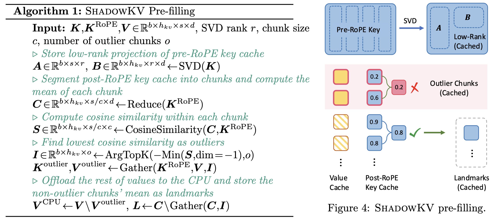
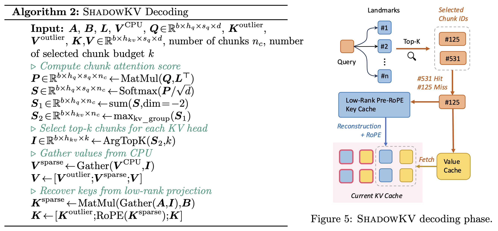

# ShadowKV: KV Cache in Shadows for High-Throughput Long-Context LLM Inference

## Abstract

With the widespread deployment of long-context large language models (LLMs),
there has been a growing demand for efficient support of high-throughput
inference. However, as the key-value (KV) cache expands with the sequence
length, the increasing memory footprint and the need to access it for each
token generation both result in low throughput when serving long-context LLMs.
While various dynamic sparse attention methods have been proposed to speed up
inference while maintaining generation quality, they either fail to
sufficiently reduce GPU memory consumption or introduce significant decoding
latency by offloading the KV cache to the CPU. We present ShadowKV, a
high-throughput long-context LLM inference system that stores the low-rank key
cache and offloads the value cache to reduce the memory footprint for larger
batch sizes and longer sequences. To minimize decoding latency, ShadowKV
employs an accurate KV selection strategy that reconstructs minimal sparse KV
pairs on-the-fly. By evaluating ShadowKV on a broad range of benchmarks,
including RULER, LongBench, and Needle In A Haystack, and models like
Llama-3.1-8B, Llama-3-8B-1M, GLM-4-9B-1M, Yi-9B-200K, Phi-3-Mini-128K, and
Qwen2-7B-128K, we demonstrate that it can support up to 6$\times$ larger batch
sizes and boost throughput by up to 3.04$\times$ on an A100 GPU without
sacrificing accuracy, even surpassing the performance achievable with infinite
batch size under the assumption of infinite GPU memory. The code is available
at https://github.com/bytedance/ShadowKV.

## 两个 Observation

- Pre-RoPE keys 可以通过SVD分解方式，压缩6倍，且没有精度损失
- Post-RePE keys 邻近 tokens具有相似性，去除一些outlier后，并按照chunk对其进行mean reduce，观察到非常好的 cosine 相似度，因此把mean reduce后的key 当作 landmarks

## ShadowKV

### Pre-filling

- 对Pre-RoPE的K进行SVD分解，
- 对Post-RoPE的K 按照chunk进行分组，每组保留mean
- 如果组内的 cosine 相似度很低，那么这组作为outlier来单独保存。

### Decoding

- 根据K的landmark与Q进行计算，得到softmax的score，
- 选择最高的几个score对应的index，根据index选择稀疏V
- 根据index和prefill保存的SVD小矩阵，合并为稀疏K
- 是否需要根据sparse K sparse V计算attention? 应该是需要的，算法写的有些不完整

所有的V都保存下来了，K的SVD分解其实也可以不做，也可以像V一样存在CPU Memoy中，根据landmark进行计算；除了SVD分解的思路，landmark的思想其实和MInference是一样的，也就是通过间隔的计算来评估哪部分的kv重要，从而将dense attention转化为 sparse attention，进而加速整个计算过程。

K的临近相似相和可以分解的特性。
