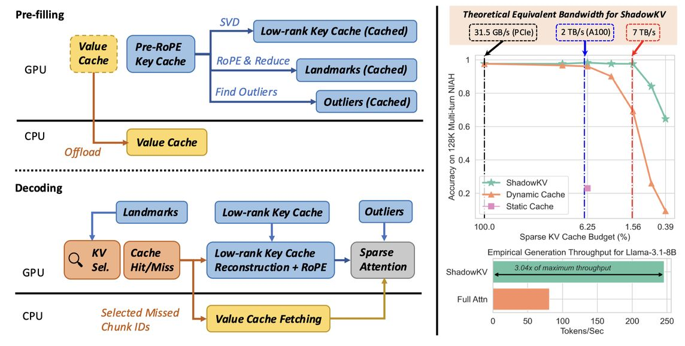

# ShadowKV: KV Cache in Shadows for High-Throughput Long-Context LLM Inference



> **⚠️ 生成声明**：本 note 由 AI Agent（Hermes Agent）基于论文全文自动生成，内容仅供参考，可能存在遗漏或不准确之处。

## 一句话总结

ShadowKV 通过低秩压缩 pre-RoPE key cache 并将 value cache 卸载到 CPU，结合基于 landmark 的精确 KV 选择策略，在 A100 GPU 上实现高达 6× 批量大小提升和 3.04× 吞吐量提升，同时保持几乎无损的精度。

## 摘要翻译

随着长上下文大语言模型（LLM）的广泛部署，对高效高吞吐量推理的需求日益增长。然而，随着键值（KV）缓存随序列长度不断膨胀，不断增加的内存占用和每次 token 生成时的访问需求导致长上下文 LLM 服务的吞吐量低下。虽然已有多种动态稀疏注意力方法被提出以加速推理并保持生成质量，但它们要么无法充分减少 GPU 内存消耗，要么通过将 KV 缓存卸载到 CPU 而引入显著的解码延迟。

本文提出 ShadowKV，一种高吞吐量长上下文 LLM 推理系统，通过存储低秩 key cache 并将 value cache 卸载到 CPU 来降低内存占用，以支持更大的批量大小和更长的序列。为最小化解码延迟，ShadowKV 采用了精确的 KV 选择策略，在线重建最小的稀疏 KV 对。在 RULER、LongBench、Needle In A Haystack 等基准测试和 Llama-3.1-8B、Llama-3-8B-1M、GLM-4-9B-1M、Yi-9B-200K、Phi-3-Mini-128K、Qwen2-7B-128K 等模型上评估表明，ShadowKV 在 A100 GPU 上可支持高达 6× 更大的批量大小，吞吐量提升高达 3.04×，且不牺牲精度，甚至超越了在无限 GPU 内存假设下无限批量大小所能达到的性能。

## 研究动机

长上下文 LLM 推理面临三大核心挑战：

1. **内存瓶颈**：KV 缓存随序列长度线性增长，在处理 1M token 上下文时，KV 缓存占用的 GPU 显存极大，严重限制了批量大小。
2. **计算瓶颈**：每次 token 生成都需要访问完整的 KV 缓存，导致解码阶段的带宽成为瓶颈。
3. **现有方法的局限**：
   - **KV 驱逐策略**（如 StreamingLLM、H2O）：通过丢弃不重要的 KV 对减少内存，但会导致信息损失和精度下降，尤其在多轮对话中问题严重。
   - **动态稀疏注意力**（如 Quest）：保留所有 KV 缓存在 GPU 上，仅计算选中 KV 对的注意力，但不减少内存占用，限制了批量大小。
   - **CPU 卸载**（如 InfiniGen）：将 KV 缓存卸载到 CPU 以减少 GPU 内存，但 CPU 到 GPU 的数据传输延迟显著增加了解码延迟。

理想的系统应该同时实现：（1）减少 GPU 内存使用，（2）最小化推理延迟，（3）在有限的稀疏 KV 缓存预算内保持精度。ShadowKV 正是基于这一目标设计的。

## 方法（技术细节）

### 两个关键观察

ShadowKV 的设计基于两个重要发现：

**观察 1：Pre-RoPE Key Cache 具有极低的秩**

通过对比 Llama-3.1-8B 中不同组件的奇异值分布（模型权重 Wk、Wv、输入 X、pre-/post-RoPE key cache、value cache），发现 pre-RoPE key cache 的奇异值衰减最快，具有最低的秩。这意味着 pre-RoPE key cache 可以被 SVD 压缩 6 倍以上且无精度损失。此外，同一序列内的 pre-RoPE keys 共享低秩子空间（子空间相似度高），但不同序列之间则不共享，因此对权重做低秩近似会降低性能。

**观察 2：Post-RoPE Key Cache 的局部性**

Post-RoPE key cache 中相邻 token 之间具有高余弦相似度（空间局部性）。将 post-RoPE keys 分成 chunk（每组 8 个 token），计算 chunk 均值的余弦相似度，发现大多数 chunk 的相似度很高，只有少数 outlier 难以近似（约占 0.2-0.3%）。因此，均值可以作为 landmark 来近似注意力计算。此外，KV 缓存还具有时间局部性——相邻解码步骤中被选中的 KV 对有很高的重复率。

### ShadowKV 系统架构

ShadowKV 分为两个阶段：**预填充（Pre-filling）** 和 **解码（Decoding）**。

#### 预填充阶段（Algorithm 1）

1. **低秩 Key Cache 压缩**：对 pre-RoPE key cache 进行 SVD 分解，仅存储低秩投影矩阵 A ∈ R^{b×s×r} 和 B ∈ R^{b×hkv×r×d}（默认 rank=160），将 key cache 从 GPU 上的全尺寸存储压缩为低秩表示。
2. **Landmark 构建**：将 post-RoPE key cache 按 chunk（大小=8）分段，计算每个 chunk 的均值作为 landmark（C ∈ R^{b×hkv×s/c×d}）。
3. **Outlier 检测**：计算 chunk 内余弦相似度，找到相似度最低的 o 个 chunk 作为 outlier（默认 o=48），将这些 outlier 的 KV 对存储在 GPU 上。
4. **Value Cache 卸载**：将非 outlier 的 value cache 卸载到 CPU（V_CPU），GPU 上仅保留 low-rank key cache、landmark 和 outlier。

#### 解码阶段（Algorithm 2）

1. **Landmark 注意力计算**：使用 Q 与 landmark L 计算近似注意力分数（P = Q·L^T，S = softmax(P/√d)），选择 top-k 个 chunk（默认 k=256，约占 1.56%）。
2. **并行 KV 恢复**：使用 CUDA multi-streams 并行执行：
   - **Key Cache 重建**：从低秩投影 A、B 重建被选中 chunk 的 key cache（K_sparse = A[I]·B），并加上 RoPE。
   - **Value Cache 获取**：从 CPU 读取对应的 value cache。
   这种重叠策略将数据获取开销降低了 2×。
3. **缓存机制**：利用 KV 缓存的时间局部性，通过索引扫描检测 miss 的 chunk，仅重建必要的 KV 对，减少计算和数据传输（降低约 60%）。
4. **稀疏注意力计算**：使用选出的稀疏 KV 对（加上 outlier）进行标准注意力计算。

### 理论等效带宽

ShadowKV 的等效带宽定义为：
```
eB = 2S·B_GPU / (S/C + 2(K+O)·C + (1-α)·K·C·B_GPU/B_PCIe)
```
在 A100 上（B_GPU=2TB/s, B_PCIe=31.5GB/s, S=128K, C=8, K=256, O=48），等效带宽可达 7.2TB/s，是 A100 显存带宽的 3.6×。

### 系统实现

- 基于 PyTorch + CUDA 实现，使用 FlashAttention 进行注意力计算。
- 融合了 Flashinfer 和 vLLM 中的高效 kernel（如 layer norm）。
- 通过自定义 CUDA kernel 融合了注意力近似、key cache 低秩重建、value cache 获取、缓存机制等操作。
- 使用多流并行重叠 key cache 重建和 value cache 获取。

### ShadowKV+ 扩展

为了处理新生成的 token，ShadowKV+ 将生成 token 的 key cache 投影到与预填充阶段相同的低秩空间，从而进一步减少长输出序列的内存使用。

## 实验结果

### 精度评估

在 128K 上下文下，使用 1.56% 稀疏 KV 缓存预算：

| 模型 | 方法 | RULER Avg. | LongBench Avg. |
|------|------|-----------|----------------|
| Llama-3-8B-1M | Full Attn | 86.68 | 39.86 |
| Llama-3-8B-1M | ShadowKV | 86.88 | 39.94 |
| GLM-4-9B-1M | Full Attn | 86.82 | 48.24 |
| GLM-4-9B-1M | ShadowKV | 85.62 | 47.89 |
| Llama-3.1-8B | Full Attn | 85.53 | 48.96 |
| Llama-3.1-8B | ShadowKV | 83.57 | 48.13 |

- 在 RULER 上，ShadowKV 表现出色，几乎无损（部分任务甚至优于 Full Attention）。
- 在 LongBench 上，ShadowKV 与其他方法一致地保持了精度。
- 在 NIAH（Needle In A Haystack）上，ShadowKV 在 16K-1M 上下文范围内均可有效检索信息。
- 在 Multi-turn NIAH 上，ShadowKV 保持多轮对话精度，而 SnapKV 从第二轮开始显著下降。
- 在 InfiniteBench 上，ShadowKV 与 Full Attention 精度相当。

### 效率评估（A100 GPU）

| 模型 | 上下文 | Full Attn (tokens/s) | ShadowKV (tokens/s) | 提升倍数 |
|------|--------|---------------------|---------------------|---------|
| Llama-3.1-8B | 122K | 80.78 (bs=4) | 245.90 (bs=24) | 3.04× |
| Llama-3-8B-1M | 60K | 160.62 (bs=8) | 455.14 (bs=48) | 2.83× |
| Llama-3-8B-1M | 122K | 80.77 (bs=4) | 239.51 (bs=24) | 2.97× |
| GLM-4-9B-1M | 60K | 241.05 (bs=12) | 615.89 (bs=50) | 2.56× |
| Yi-9B-200K | 60K | 204.81 (bs=10) | 544.36 (bs=42) | 2.66× |

- ShadowKV 支持最大 6× 更大的批量大小。
- 在 A100 上吞吐量提升高达 3.04×。
- 甚至超越了在无限 GPU 内存假设下的 Full Attention 性能。

### 与 Quest 效率对比

在 1M 上下文、3 个 batch 下：
- Full Attention：OOM
- Quest (CPU)：9.34 tokens/s
- **ShadowKV：45.32 tokens/s**（Quest 的 4.85×）

### 消融实验

- **稀疏 KV 缓存预算**：1.56% 即可保持精度，且始终优于 Quest。
- **Chunk 大小**：默认 8 最优，增大可增加批量大小但精度下降。
- **SVD Rank**：160 时精度接近 Full Attention，后续趋于稳定。
- **Outlier 数量**：48 个 outlier（0.293%）即可达到 Full Attention 精度；8 个 outlier（0.049%）已可超越 Quest。
- **FP8 精度**：ShadowKV 在 FP8 下仍保持精度，不敏感。
- **预填充延迟**：SVD 在 256K 上下文下仅占 1.75%，512K 下仅占 0.97%，随序列增长相对开销递减。

### 与 MInference 的兼容性

ShadowKV 可与 MInference（高效预填充方法）结合使用，在 RULER 上测试 8K-256K 上下文，性能与单独使用 MInference 相当甚至略优。

### 可扩展性

- 在 Llama-3-70B-1M（512K 上下文）上 ShadowKV 表现稳健。
- 在 1M 上下文的 NIAH 上，ShadowKV 在不同深度位置均可有效检索。

## 优势

1. **高吞吐量**：支持 6× 更大批量大小，吞吐量提升高达 3.04×。
2. **低延迟**：通过并行 key cache 重建和 value cache 获取（2× 降低）以及缓存机制（60% 减少），显著降低解码延迟。
3. **几乎无损精度**：1.56% 的稀疏预算即可保持接近 Full Attention 的精度。
4. **内存节省**：理论上 KV 缓存内存占用降低 7.08×（S=128K, r=160, C=8）。
5. **良好的可扩展性**：支持从 16K 到 1M 上下文，适用于不同模型（8B-70B）。
6. **多轮对话能力**：不受驱逐策略的信息损失影响。
7. **与预填充加速兼容**：可与 MInference 等方法结合使用。
8. **实现简洁**：基于 PyTorch + CUDA，可复现性强。
9. **FP8 精度兼容**：在低精度下仍保持性能。
10. **利用 pre-RoPE key cache 的固有低秩性**：不需要额外的权重分解，是数据依赖的在线 SVD。

## 局限

1. **预填充阶段的 SVD 开销**：虽然随序列增长相对开销降低，但 SVD 仍有一定计算成本。
2. **依赖 CPU 卸载**：value cache 需要从 CPU 读取，依赖 PCIe 带宽，在 CPU 内存不足或 PCIe 带宽受限时可能成为瓶颈。
3. **chunk 大小的选择**：需要在批量大小和精度之间做权衡，chunk 大小超过 8 时精度下降。
4. **对不同模型的通用性**：虽然在多个模型上测试良好，但 pre-RoPE key cache 的低秩性可能因模型架构不同而有差异。
5. **单 GPU 实现**：目前实验主要在单 A100 上进行，多 GPU 场景下的效果未充分评估。
6. **训练时未考虑**：ShadowKV 是推理时的优化方法，不涉及模型训练或微调。
7. **与 KV 量化方法正交**：文中未探讨与量化方法的结合效果（如 KIVI）。
8. **部分任务精度略降**：在某些复杂任务（如 RULER-N-MV）上，ShadowKV 的精度可能略低于 Full Attention。

## 与 EfficientPaper 相关的研究方向

### 直接相关
- **KV 缓存压缩**：ShadowKV 是 KV 缓存压缩领域的重要工作，核心思想是利用 pre-RoPE key cache 的低秩性进行压缩，结合 value cache 卸载实现高吞吐量推理。
- **稀疏注意力**：ShadowKV 属于动态稀疏注意力方法，通过 landmark 选择重要 KV 对进行稀疏计算。
- **高效推理系统**：ShadowKV 是一个完整的推理系统，集成了低秩分解、KV 卸载、稀疏注意力和缓存机制。

### 相关工作
- **KV 驱逐**：StreamingLLM、H2O、LESS、SnapKV 等——ShadowKV 不丢弃 token，而是压缩并按需恢复。
- **动态稀疏注意力**：Quest、Loki、InfiniGen、TriForce、SparQ 等——ShadowKV 通过低秩 key cache 和 CPU 卸载显著优于这些方法。
- **KV 缓存量化**：KIVI、Palu 等——ShadowKV 的低秩压缩与量化正交，可结合使用。
- **MInference**：高效预填充加速，ShadowKV 可与之结合。

### 潜在研究方向
1. **与 KV 量化方法的结合**：将 ShadowKV 的低秩压缩与量化技术结合，实现进一步的内存节省。
2. **多 GPU 扩展**：将 ShadowKV 扩展到多 GPU 场景，支持更大规模的模型和服务。
3. **自适应 rank 选择**：根据输入特征动态调整 SVD rank，以平衡精度和内存。
4. **与其他注意力加速方法结合**：如 FlashAttention、FlashDecoding++ 等。
5. **更大模型的评估**：在更大模型（如 Llama-3-70B）上进行更全面的评估。
6. **在线学习/自适应调整**：根据实时推理负载动态调整 chunk 大小和稀疏预算。
