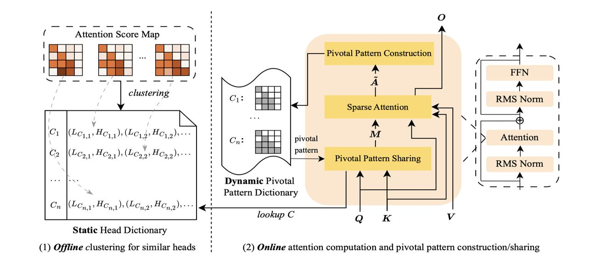

# Accelerating Prefilling for Long-Context LLMs via Sparse Pattern Sharing

> **⚠️ 本 note 由 AI Agent 自动生成，生成时间：2025年6月。内容基于论文全文阅读，仅供参考，如有疏漏请以原文为准。**

---

## 一句话总结

SharePrefill 通过发现注意力头之间的高相似性及其跨输入的稳定性，提出了一种基于稀疏模式共享的高效预填充加速方法，在保持最佳精度的同时实现了与 SOTA 相当或更优的加速效果。

---

## 摘要翻译

稀疏注意力方法利用注意力机制的内在稀疏性来加速长上下文推理的预填充阶段，缓解全注意力计算的二次复杂度问题。现有稀疏注意力方法依赖预定义模式或不准确的估计来近似注意力行为，往往无法完全捕捉注意力的真实动态，导致效率降低和精度受损。本文提出一种高精度的稀疏注意力机制，通过在注意力头之间共享相似但精确的注意力模式，更真实地捕捉注意力的动态行为。该方法基于两个关键观察：（1）注意力模式展现出强烈的头间相似性；（2）这种相似性在不同输入间保持高度一致。通过策略性地在注意力头之间共享已计算的准确模式，该方法在仅对少数头进行全注意力计算的情况下，有效捕捉实际模式。全面的评估表明，该方法在实现与 SOTA 方法相当或更优加速的同时，达到了最佳的整体精度。

---

## 研究动机

长上下文推理对于大语言模型（LLM）的实际应用至关重要。现代模型如 GPT-4.1 和 Gemini 1.5 支持百万级 token 上下文，应用于多文档问答、代码理解和多轮对话等场景。然而，预填充阶段由于注意力机制的二次计算复杂度，仍然非常耗时。

稀疏注意力提供了一种有前景的解决方案，但现有方法存在以下不足：

1. **静态模式的局限性**：MInference 等方法使用 A-shape、vertical-slash、block-sparse 等预定义模式，但这些模式缺乏泛化能力，无法适应不同的输入。注意力模式在不同输入下高度动态变化。

2. **池化估计的不准确性**：FlexPrefill 使用池化查询和键来估计 query-aware 块级模式，但池化操作存在两个关键缺陷：
   - **忽略 token 位置对齐**：池化操作忽略了查询（Q）和键（K）段内的 token 级位置对齐，而注意力机制对位置对齐敏感，导致无法准确估计块的平均注意力分数。
   - **平滑高低值**：池化操作平滑了 Q 和 K 中的高低值，这些值通常对高/低注意力分数有重要贡献，导致重要性估计不准确。

3. **训练式方法的高成本**：MoBA、NSA 等训练式方法虽然有潜力，但资源密集型训练阻碍了其广泛应用。

本文的动机在于：通过发现注意力头之间的高相似性和跨输入的一致性，提出一种无需训练、不依赖预定义模式且不使用池化估计的高效预填充加速方法。

---

## 方法（技术细节）

### 核心观察

论文基于两个关键观察：

**观察 1：头间模式相似性（Inter-head Pattern Similarity）**
- 不同注意力头（包括层内和层间）展现出高度相似的稀疏模式
- 例如，(L18, H4)、(L22, H2) 和 (L25, H7) 在 En.Dia 任务中展现出高度一致的阶梯状模式
- 基于 Jaccard 相似度的统计分析显示，大量相似度得分超过 0.5，表明每个头在其他头中有许多相似对应

**观察 2：跨输入相似性一致性（Cross-input Similarity Consistency）**
- 即使特定头的模式在不同输入间显著变化，头之间的相似性关系保持高度一致
- 例如，(L18, H4)、(L22, H2) 和 (L25, H7) 在 Code.Debug 和 En.Dia 两个任务中都表现出高度相似性，尽管模式本身不同
- 这表明稀疏模式可以在相似头之间跨上下文转移

### 方法框架

SharePrefill 包含两个主要组件：

#### 1. 离线聚类（Offline Clustering）

**目的**：基于注意力分数图的相似性，将注意力头分组

**具体步骤**：
- 使用 InfiniteBench 中 Retr.KV 任务的样本作为聚类数据
- 训练自编码器（Autoencoder）对注意力分数图进行压缩降维
  - 自编码器架构：Conv2d → ReLU → MaxPool2d → Conv2d → ReLU → MaxPool2d → Flatten → Linear（64维潜在空间）
  - 训练 1000 个 epoch，学习率 1e-3，带早停
- 对归一化的压缩表示应用层次聚类（hierarchical clustering），使用距离阈值 10
- 样本数少于 5 的聚类被标记为噪声聚类
- 仅存储聚类中的层和头索引，不存储稀疏模式本身（模式在在线推理时动态生成）

#### 2. 在线推理（Online Inference）

在线推理包含三个关键步骤：

**步骤 1：关键模式共享（Pivotal Pattern Sharing，Algorithm 4）**
- 在执行稀疏注意力计算前，查询全局关键模式字典（Dynamic Pivotal Pattern Dictionary）
- 如果关键模式可用，则共享给当前头
- 否则，该头使用稠密模式（全 1 模式）计算全注意力

**步骤 2：稀疏注意力计算（Sparse Attention Computation，Algorithm 1）**
- 执行稀疏注意力计算，同时计算块级平均 QK 值（$\tilde{A}$）
- 稀疏注意力核使用 Triton 实现，遵循 FlashAttention 2 的块级策略
- 仅计算标记为 1 的块，跳过标记为 0 的块
- 在最终输出计算中，对于模式值为 1 的块计算平均 QK 值，对于模式值为 0 的块赋值为 $-\infty$

**步骤 3：关键模式构建（Pivotal Pattern Construction，Algorithm 2）**
- 使用块级平均 QK 值计算 softmax 后的块级平均注意力分数
- 取最后一行块作为关键代表
- 展平并归一化注意力分数图
- 排序注意力分数，获取最小计算预算使累积分数超过阈值 $\gamma$
- 将结果模式更新到关键模式字典

#### 稀疏模式决策（Algorithm 3）

**核心逻辑**：
1. 选择查询子集 $\hat{Q} = Q[-block\_size:]$
2. 计算估计的块级平均注意力 $\hat{a}$ 和关键块级平均注意力 $\tilde{a}$
3. 查询静态头字典获取聚类索引 $c$
4. 计算稀疏度散度 $d_{sparse} = \sqrt{JSD(\hat{a}||u)}$（$u$ 为均匀分布）
5. 计算相似度散度 $d_{sim} = \sqrt{JSD(\hat{a}||\tilde{a})}$
6. 决策逻辑：
   - 如果 $d_{sparse} < \delta$ 且 $d_{sim} < \tau$：使用共享关键模式（shared_pivot）
   - 否则：使用保守的 vertical-slash 模式（vertical_slash）

**安全机制**：
- 在共享模式前验证相似性，使用 Jensen-Shannon (JS) 距离
- 如果 JS 距离低于相似性阈值 $\tau$，则共享关键模式
- 否则回退到保守的 vertical-slash 模式
- 噪声聚类（包含不相似模式）也回退到 vertical-slash 模式

**高稀疏度头处理**：
- 对于高度稀疏的头，计算全注意力以获得关键模式不划算
- 使用 JS 距离与均匀分布比较，如果距离不小于稀疏度阈值 $\delta$，则分类为高稀疏度头
- 高稀疏度头回退到搜索 vertical-slash 模式

### 优化问题形式化

目标是最小化稀疏注意力输出与全注意力输出的差异，同时最小化稀疏模式的计算量：

$$\min_M |A(Q, K, V, M) - A(Q, K, V)|, \quad \min_M |M|$$

其中 $A(Q, K, V, M) = \sigma(\frac{1}{\sqrt{d}}QK^T - c(1-M))V$，$M$ 为二值掩码，1 表示计算，0 表示跳过。

### 实现细节

- 硬件：单张 NVIDIA A100 80GB GPU
- 稀疏注意力核：使用 Triton 实现，基于 FlashAttention 2 的块级策略
- 超参数：
  - 相似性阈值 $\tau = 0.2$
  - 稀疏度阈值 $\delta = 0.3$
  - 累积注意力阈值 $\gamma = 0.9$
- 基线实现：FlashAttention 2 官方包、MInference 官方仓库（包含 FlexPrefill 实现）

---

## 实验结果

### 实验设置

- **模型**：Llama-3-8B-Instruct-262k（支持 262K 上下文）、Qwen2.5-7B-Instruct（支持 128K 上下文）
- **数据集**：
  - InfiniteBench：包含 10 个长上下文理解任务（英语和中文，平均 214K token）
  - PG-19：长上下文语言建模任务（评估困惑度）
  - Latency Benchmark：使用 MInference 提供的长度可调提示
- **基线方法**：FlashAttention 2（全注意力）、MInference（静态模式）、FlexPrefill（动态模式）

### 主要结果

**1. InfiniteBench 任务表现（Table 1）**

Llama-3-8B-Instruct-262k：
- SharePrefill 平均得分 39.05（默认参数），39.35（$\delta=1.01$）
- MInference：39.14，FlexPrefill：36.44，FlashAttn：38.16
- SharePrefill 在 En.Dia（11.84 vs 8.00）、Math.Find（30.00 vs 32.86）、Retr.KV（21.00 vs 16.40）等任务上表现突出

Qwen2.5-7B-Instruct：
- SharePrefill 平均得分 31.79
- MInference：29.23，FlexPrefill：25.88，FlashAttn：31.56
- SharePrefill 在 En.MC（38.43 vs 34.93）、Math.Find（44.57 vs 38.29）等任务上显著优于基线

**2. 语言建模（PG-19 困惑度，Figure 4）**

- SharePrefill 困惑度接近 FlashAttn 和 MInference，差距约 1.0
- 相比 FlexPrefill，Qwen2.5-7B-Instruct 降低 1.0~4.0，Llama-3-8B-Instruct-262k 降低超过 1.0

**3. 延迟比较（Figure 5）**

- SharePrefill 在不同上下文长度下实现更好或相当的加速
- 128K 上下文：Llama-3-8B 约 16.92s（默认）vs FlashAttn 约 30s+
- Qwen2.5-7B 同样表现出色
- Figure 1 展示了延迟与准确性的权衡：SharePrefill 在准确性和加速之间取得了有利平衡

**4. 消融实验（Table 2，Llama-3-8B-Instruct-262k）**

| 变体 | 平均得分 | 128K 延迟 (s) |
|------|---------|-------------|
| Ours w/o Sharing ($\tau=0$) | 38.70 | 17.01 |
| Ours w/o Exclusion ($\delta=1.01$) | 39.35 | 20.02 |
| Ours (默认) | 39.05 | 16.92 |

- 移除模式共享机制导致性能下降，证实了共享策略对精度保持的必要性
- 移除高稀疏度头排除策略后，精度提升但加速降低

**5. 模式分布（Figure 6）**

- 大多数头采用 vertical-slash 模式
- 仅少量头（1-4 个）需要全注意力稠密模式
- 共享模式数量有限，但对精度保持有显著贡献

---

## 优势

1. **高精度保持**：通过共享精确的注意力模式而非近似估计，在所有方法中实现最佳整体精度
2. **无需训练**：不引入额外的训练开销，避免了训练式方法的高成本
3. **动态适应**：模式在推理时动态生成和共享，适应不同输入，而非依赖预定义静态模式
4. **高效加速**：在 128K 上下文下实现显著加速（约 1.3-1.8 倍），同时保持精度
5. **简洁的设计**：离线聚类 + 在线模式共享的两阶段设计，逻辑清晰，易于实现
6. **对 FlexPrefill 池化估计缺陷的改进**：通过使用实际注意力分数而非池化估计，避免了位置对齐忽略和高低值平滑的问题
7. **兼容性好**：基于 FlashAttention 2 和 Triton 的实现，与现有基础设施兼容

---

## 局限

1. **相似性一致性的理论解释不足**：论文提供了观察和统计证据，但注意力头之间高度一致的相似性关系的底层机制尚不清楚，需要进一步研究
2. **单设备可扩展性有限**：当前方法在单设备上有效，但向更大规模场景（如多设备推理）的扩展性需要进一步研究
3. **模式共享的泛化性**：虽然论文展示了在多个模型和任务上的有效性，但在更广泛的场景（如不同架构、不同领域）上的泛化性有待验证
4. **稀疏度和相似性阈值的敏感性**：超参数（$\tau$, $\delta$, $\gamma$）的设置可能影响性能，论文主要在默认参数下验证
5. **与训练式方法的比较有限**：虽然提到 MoBA、NSA 等训练式方法，但实验中未与这些方法直接比较
6. **自编码器聚类的开销**：离线聚类阶段需要训练自编码器并进行层次聚类，虽然是一次性开销，但在实际部署中需要考虑
7. **对编码阶段的改进有限**：论文主要关注预填充阶段，对解码阶段的加速尚未探索（论文提到未来工作方向）

---

## 与 EfficientPaper 相关的研究方向

本论文属于 **attention_sparsity（注意力稀疏性）** 关键词方向，与 EfficientPaper 中以下研究密切相关：

1. **MInference（2024）**：本文的直接基线，使用静态/半动态模式，SharePrefill 通过模式共享改进了其模式估计的准确性
2. **FlexPrefill（2025）**：另一主要基线，使用池化估计，SharePrefill 指出其池化估计的缺陷并提出更准确的替代方案
3. **FlashAttention 2（2024）**：本文的稀疏注意力核基于 FlashAttention 2 的块级策略实现
4. **SeerAttention（2024）**：训练式稀疏注意力方法，使用可学习门控
5. **MoBA（2025）**：训练式方法，继续训练整个模型
6. **NSA（2025）**：原生稀疏注意力，硬件对齐且可训练
7. **稀疏注意力的泛化方向**：论文提出的头间相似性和跨输入一致性观察，可能启发更多基于注意力模式共享的研究
8. **解码阶段加速**：论文提到将模式共享机制扩展到解码阶段，这是一个重要的未来方向
9. **多模态系统扩展**：论文提到将模式共享机制扩展到多模态系统，可能与其他高效多模态推理研究相关
10. **大模型长上下文推理**：SharePrefill 是长上下文推理效率优化的重要工作，与 EfficientPaper 中关注的模型效率优化主题一致

---

*本 note 由 AI Agent 自动生成，基于论文全文阅读，仅供参考。*
