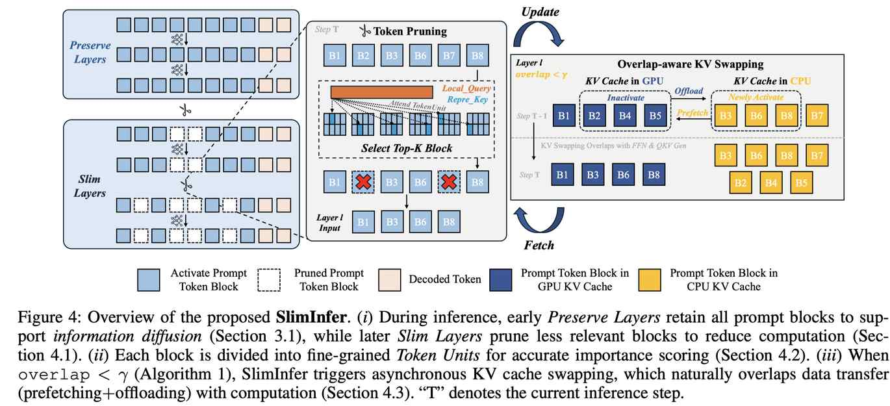

# SlimInfer: 通过动态 Token 剪枝加速长上下文 LLM 推理

> Lingkun Long, Rubing Yang, Yushi Huang, Desheng Hui, Ao Zhou, Jianlei Yang
> 北京航空航天大学 / 香港科技大学

> ⚠️ **本文由 AI Agent 自动生成**，基于论文全文阅读与分析。生成时间：2025年。

---

## 一句话总结

SlimInfer 利用"信息扩散现象"，在 Transformer 中间层对隐藏状态进行动态细粒度剪枝，并结合无预测器的异步 KV Cache 管理，在不牺牲 LongBench 性能的前提下实现最高 2.53× TTFT 加速和 1.88× 端到端延迟降低。

---

## 摘要翻译

长上下文推理对大语言模型（LLM）的计算需求提出了巨大挑战。尽管已有多种方法优化了注意力计算，但它们在每一层仍需处理完整的隐藏状态集，从而限制了整体效率。本文提出 SlimInfer，一个在前向传播过程中直接剪枝不太关键的 prompt token 的创新框架。核心洞察是**信息扩散现象**：随着关键 token 的信息在各层间传播，它会逐渐分散到整个序列中。这意味着即使在隐藏状态中剪枝掉过多 token（包括这些关键 token），LLM 仍能保持语义完整性。基于此，SlimInfer 引入了动态细粒度剪枝机制，在中间层精确移除冗余 token。这种逐层剪枝自然支持了一个无需复杂预测器的异步 KV Cache 管理器，可预取所需的 token 块，同时降低内存使用和 I/O 开销。大量实验表明，SlimInfer 在单张 RTX 4090 上为 LLaMA3.1-8B-Instruct 实现了最高 2.53× TTFT 加速和 1.88× 端到端延迟降低，且在 LongBench 上不牺牲性能。

---

## 研究动机

长上下文 LLM 推理面临两大核心瓶颈：

1. **注意力计算的二次复杂度**：Self-attention 在 prefill 阶段对序列长度的二次时间复杂度，是长上下文场景下延迟的主要来源。
2. **KV Cache 的线性内存增长**：KV Cache 随输入长度线性增长，导致显著的 GPU 内存消耗。

现有方法存在以下关键局限：

- **仅优化解码阶段**（如 StreamingLLM、H2O、SnapKV、LazyLLM）：对 TTFT 改善有限，且不可逆的 token 驱逐可能导致准确率显著下降。
- **仅稀疏化注意力模式**（如 FlexPrefill、MInference）：仍需在每层处理完整序列的隐藏状态，FFN 等非注意力组件未被优化，加速效果受限。
- **KV Cache 管理的 I/O 开销**（如 Quest、InfiniGen、AttentionPredictor）：CPU 卸载引入显著 I/O 延迟，预取依赖预测机制，增加了计算和工程开销。

---

## 方法

### 4.1 框架概述

SlimInfer 的核心设计基于两个关键洞察：

#### 信息扩散现象（Information Diffusion）

论文通过在 LLaMA3.1-8B-Instruct 上的探测实验发现：当在**较深层**（如 Layer 25）剪枝关键 token "278" 的隐藏状态时，模型仍能正确回忆答案；但在**较早层**（如 Layer 5）剪枝则会导致错误输出。

原因：关键 token 的语义信息在早期层逐步"扩散"到其他 token 表示中。在较深层，语义已充分分布，此时剪枝不会破坏推理过程。

由此产生两条设计原则：
- **早期层保留所有 token**，保证信息扩散完整。
- **后期层可安全剪枝**，包括原本重要的 token，因为其语义已扩散。

#### 预取机会（Prefetching Opportunity）

SlimInfer 的逐层隐藏状态剪枝设计自然支持无预测器的异步 KV Cache 预取：
- 在 Attention 计算后进行剪枝，剪枝决策是确定性的（不依赖预测器）。
- KV Cache 的获取可以与下一层的 FFN 和 QKV 生成并行重叠（overlap）。

### 4.2 块级 Prompt Token 剪枝

将 prompt token 划分为固定大小的块（block size = 64），每个块进一步划分为多个 **Token Unit**（size = 8），实现细粒度语义评估。

**重要性评分机制**：
1. 对每个 block Bj 中的每个 token unit，计算代表性 Key 向量：$k_{rep}(j,m) = \text{Mean}(\{key \in \text{TokenUnit}_{j,m}\})$
2. 构造局部 Query 窗口 $q_l$（取最近 w=4 个 token 的 Query 平均）
3. 计算 block 级重要性得分：$r_{block}(q_l, B_j) = \max_m (\frac{1}{H}\sum_{h=1}^{H} |q_h^l \cdot k_{rep}^h(j,m)|)$
4. 选择 top-k blocks 作为活跃集，被剪枝的 block 的 KV Cache 被卸载到 CPU 内存（可恢复）。

**额外保留策略**：prompt 的首个 block（attention sink）始终保留在活跃集中。

### 4.3 无预测器的 KV Cache 预取

通过 **Overlap-aware KV Swapping** 算法实现高效数据传输：

- 维护活跃块集合 $B_{active}(t)$，其 KV Cache 在 GPU 内存中。
- 计算候选集与前一活跃集的重叠比（overlap ratio）。
- 若 overlap < 阈值 γ（默认 0.9），触发交换操作：
  - 异步卸载不再需要的块（GPU→CPU）
  - 异步预取新需要的块（CPU→GPU）
  - 在独立 CUDA 流上执行，与 FFN 和 QKV 生成重叠。

若 overlap ≥ γ，直接复用上一步的活跃集，避免不必要的数据传输。

**关键优势**：不需要任何预测器或启发式策略（如 InfiniGen 的 SVD、AttentionPredictor 的 CNN），纯粹基于确定性的剪枝决策。

### 实现细节

- 构建于 LazyLLM 之上，集成到 Transformers 库
- Block size = 64，Token Unit size = 8，KV swap 阈值 γ = 0.9，局部 Query 窗口 w = 4
- LLaMA3.1：在 layers 10, 20, 30 剪枝，保留 8k, 4k, 2k tokens
- Qwen2.5：在 layers 9, 18, 26 剪枝，保留 12k, 6k, 4k tokens
- 仅对 prompt token 剪枝，所有生成的 response token 完全保留

---

## 实验结果

### 准确率（LongBench）

| 方法 | LLaMA3.1 平均 | Qwen2.5 平均 |
|------|--------------|-------------|
| Full KV | 48.08% | 47.76% |
| LazyLLM | 47.23% | 45.48% |
| MInference | 47.17% | 47.25% |
| FlexPrefill | 46.38% | 44.61% |
| **SlimInfer** | **47.65%** | **47.38%** |

- SlimInfer 在两个模型上均达到最高平均准确率
- 相比 Full KV 仅下降约 0.4%，远优于其他剪枝方法

### 效率（LLaMA3.1-8B-Instruct，单 RTX 4090）

| 指标 | 32k 上下文加速比 |
|------|-----------------|
| TTFT | **2.53×** |
| E2E | **1.88×** |

### 内存效率

| 上下文长度 | Full KV | SlimInfer | 节省 |
|-----------|---------|-----------|------|
| 8k | 1.00 GB | 0.80 GB | 20.3% |
| 16k | 2.00 GB | 1.11 GB | 44.5% |
| 24k | 3.00 GB | 1.42 GB | 52.6% |
| 32k | 4.00 GB | 1.73 GB | 56.6% |

### 消融实验

- **剪枝起始层**：中期层开始剪枝效果最佳；过早阻碍信息扩散，过晚保留的 token 不足。
- **Token Unit 评分**：优于 Avg-Pooling 和 Max-Pooling 基线。
- **异步 KV Cache**：32k 时从 1.60× 提升至 1.88×。
- **块大小**：64 为最佳（平衡精度和延迟）。
- **局部 Query 窗口**：w=4 最优。
- **交换阈值 γ**：0.90 为最佳平衡点。

### 边缘设备性能（Jetson AGX Orin 32GB）

- 32k 上下文：TTFT 加速 1.94×，E2E 加速 1.69×
- 证明 SlimInfer 在边缘设备上同样有效

---

## 优势

1. **信息扩散理论**：基于可验证的现象而非经验启发式，提供了坚实的设计依据。
2. **端到端优化**：同时优化 prefill 和解码阶段，不仅稀疏化注意力，还通过剪枝隐藏状态减少 FFN 计算。
3. **无预测器预取**：利用逐层剪枝的确定性设计，天然支持无预测器的 KV Cache 异步预取，避免了 InfiniGen/AttentionPredictor 的额外开销。
4. **可恢复剪枝**：被剪枝的 token 并非不可逆丢弃，而是卸载到 CPU 内存，可按需恢复，显著优于 StreamingLLM/H2O/LazyLLM 等方法。
5. **显著加速且不牺牲性能**：在 LongBench 上接近 Full KV 的准确率，同时实现 2.53× TTFT 和 1.88× E2E 加速。
6. **内存效率**：32k 上下文下 KV Cache 内存节省 56.6%。
7. **跨模型/跨设备泛化**：在 LLaMA3.1-8B 和 Qwen2.5-7B 上均有效，且在边缘设备（Jetson AGX Orin）上表现优异。

---

## 局限

1. **仅优化 prompt token**：不处理生成 token 的 KV Cache，解码阶段的优化依赖传统的 token 衰减策略。
2. **固定剪枝层**：当前使用固定的中间层进行剪枝（如 LLaMA3.1 的 layers 10, 20, 30），缺乏对不同任务/输入的自适应调整。
3. **块级粒度**：尽管引入了 Token Unit 细粒度评分，但剪枝仍以块为单位，可能丢失块内 token 的差异化重要性。
4. **CPU-GPU 数据传输**：虽然通过异步预取和重叠优化了 I/O，但仍依赖 CPU-GPU 通信，可能在某些硬件/网络配置下成为瓶颈。
5. **CPU 内存占用**：被卸载的 KV Cache 需要 CPU 内存存储，在极端长上下文场景下可能导致 CPU 内存压力。
6. **缺乏代码公开**：论文声明代码将在接受后发布，当前无法复现。
7. **特定超参数敏感性**：消融实验显示剪枝层数、token 保留数量、局部查询窗口等参数对性能有显著影响，调参成本较高。

---

## 与 EfficientPaper 相关的研究方向

SlimInfer 所属的关键研究领域包括：

1. **稀疏注意力（Sparse Attention）**：与 FlexPrefill、MInference、SpargeAttn 等方法同属一类，但 SlimInfer 独特之处在于直接剪枝隐藏状态而非仅优化注意力计算。
2. **KV Cache 管理（KV Cache Management）**：与 Quest、InfiniGen、AttentionPredictor 等方法构成同一研究方向，但 SlimInfer 实现了无预测器的异步预取。
3. **Token 剪枝（Token Pruning）**：与 LazyLLM、StreamingLLM、H2O、SnapKV 等方法同属一类，但 SlimInfer 的关键区别在于可恢复剪枝和隐藏状态级别的剪枝。
4. **长上下文推理优化**：这是 EfficientPaper 的核心研究方向之一，SlimInfer 为 LLM 在边缘设备和服务器端的长上下文部署提供了实用的加速方案。
5. **信息扩散现象（Information Diffusion）**：这是一个值得关注的新发现，可能启发更多基于信息流分析的模型压缩和加速方法。
6. **边缘部署优化**：SlimInfer 在 Jetson AGX Orin 上的表现表明，该方法在资源受限设备上具有实际应用价值，与 EfficientPaper 关注的高效推理主题高度契合。
