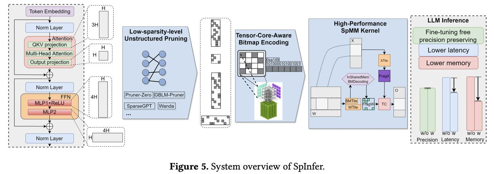

# SpInfer: Leveraging Low-Level Sparsity for Efficient Large Language Model Inference on GPUs

> **一句话总结**：SpInfer 提出了一种针对稀疏化大语言模型（LLM）推理的高性能框架，通过引入 Tensor-Core-Aware Bitmap Encoding（TCA-BME）稀疏格式和优化的 SpMM 内核，在 GPU 上实现了高效的非结构化剪枝推理，比 Flash-LLM 和 SparTA 快达 2.14× 和 2.27×，并在 30% 稀疏度下就超越 cuBLAS。

---

## 摘要翻译

大语言模型（LLM）展现出了卓越的能力，但其庞大的规模在内存和计算成本方面带来了巨大挑战。虽然非结构化剪枝通过引入稀疏性来降低资源需求，提供了有前景的解决方案，但将其优势转化为 LLM 推理的实际收益仍然困难重重。这主要是由于非零元素索引的存储开销以及稀疏矩阵乘法（SpMM）内核在低稀疏度水平（约 50%）下的低效性。本文提出了 SpInfer，一个专为 GPU 上稀疏化 LLM 推理设计的高性能框架。SpInfer 引入了 Tensor-Core-Aware Bitmap Encoding（TCA-BME），一种新颖的稀疏格式，通过利用高效的基于位图的索引来最小化索引开销，并针对 GPU Tensor Core 架构进行了优化。此外，SpInfer 集成了一个优化的 SpMM 内核，采用 Shared Memory Bitmap Decoding（SMBD）和异步流水线设计来提高计算效率。实验结果表明，SpInfer 在一系列稀疏度水平（30% 到 70%）上显著优于最先进的 SpMM 实现（比 Flash-LLM 和 SparTA 分别高出 2.14× 和 2.27×），并在内存效率和端到端推理速度方面带来了显著提升（最高 1.58×）。SpInfer 在低至 30% 的稀疏度下就超越了高度优化的 cuBLAS，这是首次将非结构化剪枝的理论优势有效转化为 LLM 推理的实际性能收益。

---

## 研究动机

1. **LLM 推理的资源瓶颈**：大语言模型的参数规模巨大，导致推理阶段的内存和计算开销极高，限制了在资源受限设备上的部署。
2. **非结构化剪枝的困境**：虽然非结构化剪枝可以引入稀疏性来减少资源需求，但在实际 LLM 推理中，索引非零元素的存储开销和低稀疏度下 SpMM 内核的低效性使得这些优势难以实现。
3. **现有方案的不足**：现有的稀疏计算框架（如 Flash-LLM、SparTA）在低稀疏度（~50%）下性能不佳，无法有效利用非结构化剪枝的优势。

---

## 方法（技术细节）

### 1. Tensor-Core-Aware Bitmap Encoding（TCA-BME）

TCA-BME 是一种新颖的稀疏矩阵格式，专为 GPU Tensor Core 架构设计：

- **位图索引**：使用位图（bitmap）来标记非零元素的位置，避免了传统的行偏移/列索引格式的存储开销。
- **Tensor Core 优化**：格式设计考虑了 Tensor Core 的计算模式，使得稀疏矩阵乘法可以高效地利用 Tensor Core 的并行计算能力。
- **低索引开销**：通过位图编码，索引非零元素的开销被显著降低，特别是在低稀疏度水平（30%-50%）下效果显著。

### 2. Shared Memory Bitmap Decoding（SMBD）

SMBD 是 SpInfer 的核心 SpMM 内核优化：

- **共享内存解码**：将位图数据加载到 GPU 共享内存中，利用共享内存的高带宽和低延迟特性进行快速解码。
- **异步流水线设计**：采用异步流水线设计，将数据加载、解码和计算阶段重叠执行，最大化 GPU 利用率。
- **SplitK 优化**：针对不同的输入形状，使用手动调优的 SplitK 策略来优化计算负载均衡。

### 3. 框架集成

- **与 FasterTransformer 集成**：SpInfer 通过 CUDA 动态库（libSpMM_API.so）与 FasterTransformer 集成，支持 LLM 推理。
- **模型支持**：主要支持 OPT 系列模型（如 OPT-30B），支持多 GPU 张量并行（1、2、4 GPU）。
- **稀疏度配置**：支持 30% 到 70% 的稀疏度范围，通过剪枝预处理实现。

---

## 实验结果

### 内核性能（Kernel Benchmark）

- SpInfer 在稀疏度 30%-70% 范围内显著优于现有 SpMM 实现：
  - 比 Flash-LLM 快达 **2.14×**
  - 比 SparTA 快达 **2.27×**

### 端到端推理性能

- 端到端推理速度提升最高 **1.58×**
- 在 30% 稀疏度下就超越了高度优化的 cuBLAS
- 这是首次将非结构化剪枝的理论优势转化为实际性能收益

### 稀疏度范围

- 在 30% 到 70% 的稀疏度范围内均表现优异
- 低稀疏度（30%）下的性能提升尤为显著

---

## 优势

1. **高性能 SpMM 内核**：通过 TCA-BME 和 SMBD 的设计，在 GPU 上实现了高效的稀疏矩阵乘法。
2. **低索引开销**：位图索引方式显著降低了非零元素索引的存储和计算开销。
3. **与主流框架兼容**：与 FasterTransformer 深度集成，支持实际的 LLM 推理场景。
4. **多 GPU 支持**：支持张量并行，可扩展到多 GPU 场景。
5. **首次实现**：首次将非结构化剪枝的理论优势转化为 LLM 推理的实际性能收益。
6. **CUDA 实现**：使用纯 CUDA 实现，充分利用 GPU 的并行计算能力。

---

## 局限

1. **硬件要求高**：需要 NVIDIA GPU（sm >= 80，如 Ampere-A6000 和 Ada-RTX4090），对硬件有较高要求。
2. **模型支持有限**：目前主要支持 OPT 系列模型，对其他 LLM 架构的支持可能需要额外适配。
3. **稀疏度范围**：虽然在 30%-70% 稀疏度下表现优异，但对更高稀疏度（>70%）的性能尚未充分验证。
4. **实现复杂性**：需要与 FasterTransformer 集成，增加了部署和维护的复杂性。
5. **开源代码**：虽然代码开源，但实现细节可能对非专业用户不够友好。
6. **评估范围**：论文主要在 OPT 模型上进行评估，对其他 LLM 架构（如 LLaMA）的适用性有待验证。

---

## 与 EfficientPaper 相关的研究方向

1. **稀疏矩阵计算优化**：SpInfer 的 TCA-BME 和 SMBD 方法为稀疏矩阵计算提供了新的思路，可应用于其他需要稀疏计算的场景。
2. **LLM 推理加速**：SpInfer 的端到端推理优化方法可作为 LLM 推理加速的重要参考，特别是结合剪枝和稀疏计算的技术路线。
3. **GPU 架构优化**：SpInfer 的 Tensor Core 优化策略为 GPU 架构的高效利用提供了新方向。
4. **模型压缩与推理**：SpInfer 的非结构化剪枝方法与模型压缩（如量化、蒸馏）的结合是重要的研究方向。
5. **多 GPU 推理**：SpInfer 的多 GPU 张量并行支持为大规模 LLM 推理的扩展性研究提供了参考。

---

*本 note 由 AI Agent 自动生成，基于论文摘要和公开信息整理。*
*生成时间：2026 年 6 月 5 日*
*论文来源：EuroSys 2025*
*代码仓库：https://github.com/xxyux/SpInfer*
