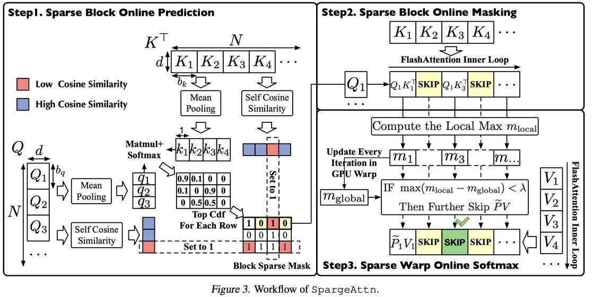

# SpargeAttn: Accurate and Training-free Sparse Attention Accelerating Any Model Inference

> **本文由 AI Agent 自动生成，生成时间：2025年6月4日。所有内容基于论文原文提炼，仅供学术参考。**

---

## 一句话总结

SpargeAttn 提出了一种**免训练的通用稀疏注意力机制**，通过两阶段在线过滤（选择性 token 压缩预测 + 稀疏 warp 在线 softmax）和 8-bit 量化集成，实现了对语言、图像和视频生成模型的统一加速，**在几乎不损失端到端性能的前提下达到 2.5x–5x 的加速比**。

---

## 摘要（翻译）

高效的注意力实现对大模型至关重要，因为注意力的计算复杂度是二次的。幸运的是，注意力图通常表现出稀疏性——即注意力图中许多值接近零，可以跳过相应的计算。许多研究已经利用稀疏模式来加速注意力。然而，大多数现有工作集中在通过利用注意力图的特定稀疏模式来优化特定模型中的注意力。**一种能同时保证多种模型的加速和端到端性能的通用稀疏注意力仍然难以实现**。在本文中，我们提出了 SpargeAttn，一种适用于任意模型的通用稀疏量化注意力。我们的方法使用两阶段在线过滤器：在第一阶段，我们快速准确地预测注意力图，从而跳过注意力中的部分矩阵乘法；在第二阶段，我们设计了一个不产生额外开销的在线 softmax 感知过滤器，进一步跳过一些矩阵乘法。实验表明，我们的方法显著加速了包括语言、图像和视频生成在内的多种模型，且不牺牲端到端指标。代码已开源：https://github.com/thu-ml/SpargeAttn。

---

## 研究动机

1. **注意力计算瓶颈**：随着大模型序列长度不断增长（如视频生成中 45K–128K），注意力计算占据了推理延迟的显著部分。
2. **注意力的内在稀疏性**：softmax 操作使得注意力图中大量值接近零，理论上可以跳过这些计算。
3. **现有方法的局限性**：
   - **通用性不足（Universality）**：大多数方法依赖于特定的稀疏模式（如滑动窗口、注意力 sink），这些模式在不同任务间差异很大，难以泛化到所有模型。
   - **可用性不足（Usability）**：难以同时满足精度要求（精确预测稀疏区域）和效率要求（预测开销最小化）。例如 MInference 需要 100K 的序列长度才能获得明显加速。
4. **研究目标**：设计一种免训练的稀疏注意力算子，能在所有模型上加速推理且不损失性能指标。

---

## 方法（技术细节）

### 3.1 整体框架：Sparse FlashAttention

SpargeAttn 采用 FlashAttention 的分块（tiling）策略，通过跳过被过滤掉的块来实现稀疏注意力。核心定义了两个二值掩码：

- **$M_g$（Block Mask）**：决定是否跳过 $Q_iK_j^\top$ 和 $e^{P_{ij}}V_j$ 的计算（第一阶段）。
- **$M_{pv}$（PV Mask）**：决定是否跳过 $e^{P_{ij}}V_j$ 的计算（第二阶段）。

### 3.2 第一阶段：选择性 Token 压缩的稀疏预测

**核心观察**：各种模型中，Q 和 K 中相邻 token 之间表现出高相似性（高余弦相似度）。对于包含高相似性 token 的块，可以将其压缩为单个代表 token。

**算法流程（Step1 & Step2）**：
1. **计算块内余弦相似度**：对 Q 和 K 的每个块计算平均余弦相似度 $sq_i = \text{CosSim}(Q_i)$，$sk_j = \text{CosSim}(K_j)$。
2. **选择性压缩**：
   - 对高自相似性块（$sq_i \geq \theta$）：将块内所有 token 取均值，压缩为单个 token。
   - 对低自相似性块（$sq_i < \theta$）：保留为 "fix block"，始终参与计算。
3. **计算压缩注意力图**：使用压缩后的 Q 和 K 计算 $\hat{S} = qk^\top$。
4. **应用相似度阈值**：对于 $sk_j < \theta$ 的块，将 $\hat{S}$ 对应列设为 $-\infty$，防止干扰。
5. **TopCdf 选择**：对每行 $\hat{P}[i] = \text{Softmax}(\hat{S}[i])$，选取累计和达到 $\tau \cdot \sum \hat{P}[i]$ 的 top 位置设为 1（$M_g$），其余设为 0。
6. **保护 fix block**：对于非自相似的 Q 块（$sq_i < \theta$），$M_g$ 对应行全部设为 1；对于非自相似的 K 块（$sk_j < \theta$），$M_g$ 对应列全部设为 1。

**关键设计**：只压缩高自相似性块，对低自相似性块保留完整计算，避免信息丢失。

### 3.3 第二阶段：稀疏 Warp 在线 Softmax

**核心思想**：在 FlashAttention 的在线 softmax 过程中，如果某个块的所有 $e^{P_{ij}}$ 值都足够小，那么 $e^{P_{ij}}V_j$ 可以被忽略。

**数学推导**：
- 在 FlashAttention 内循环中，$O_{ij} = \text{diag}(e^{m_{i,j-1} - m_{ij}}) O_{i,j-1} + e^{P_{ij}}V_j$
- 如果 $\text{rowmax}(S_{ij}) \ll m_{ij}$，则 $e^{P_{ij}} = \exp(S_{ij} - m_{ij})$ 的所有值都接近 0，$e^{P_{ij}}V_j$ 可忽略
- 等价条件：$\max(m_{\text{local}} - m_{ij}) < \lambda$

**实现方式**：在 GPU warp 级别，将 $S_{ij}$ 按 warp 分割为 $\{S_{ij}[I_w]\}$。如果 $\max(m_{\text{local}}[I_w] - m_{ij}[I_w]) < \lambda$，则跳过 $e^{P_{ij}}[I_w]V_j$ 的计算。这一操作在 FlashAttention 的每个内循环迭代中执行，**不产生额外开销**。

### 3.4 与 SageAttention 集成（8-bit 量化）

SpargeAttn 与 SageAttention 的 8-bit 量化方法正交，可直接集成：
- 在 SageAttention 内循环开头添加判断（是否跳过整个内循环）
- 在更新 $O_{ij}$ 前添加判断（是否跳过 $e^{P_{ij}}V_j$ 的计算）
- 预测阶段使用 CUDA 实现并采用内核融合技术，最小化开销
- 最终实现基于 SageAttention2，进一步提供 30% 的额外加速

### 3.5 HilbertCurve 排列

**目的**：提高图像/视频模型中块的自相似性，从而增加稀疏性。

**方法**：对 3D 视觉 token 张量 $Q, K, V \in \mathbb{R}^{T \times H \times W \times d}$，使用 Hilbert 曲线填充 3D 空间，沿曲线展平 token 为 $\mathbb{R}^{L \times d}$（$L = T \times H \times W$）。

**优势**：Hilbert 曲线有效保持局部性，不跨越行或列遍历，增加相邻 token 的相似性和注意力的稀疏性。实验证明 HilbertCurve 在块自相似性和稀疏性上均优于 Rowmajor、Timemajor 等方法。

### 3.6 超参数确定

三个超参数：$\tau \in (0,1)$（TopCdf 阈值）、$\theta \in (-1,1)$（自相似性阈值）、$\lambda < 0$（softmax 感知阈值）。

确定流程：在 5 个不同输入上，通过网格搜索确定最大化稀疏性且满足 L1 误差限制的超参数。先搜索 $\tau$ 和 $\theta$（限制 $L_1 < l_1$），再搜索 $\lambda$（限制 $L_1 < l_2$）。

---

## 实验结果

### 4.1 实验设置

| 模型 | 任务 | 序列长度 | 数据集 |
|------|------|---------|--------|
| Llama3.1 (8B) | 文本生成 | 128K | WikiText, LongBench, InfiniteBench, NIAH |
| CogvideoX (2B) | 视频生成 | 17K | Open-Sora prompt set |
| Mochi | 视频生成 | 22K | Open-Sora prompt set |
| Open-Sora-Plan | 视频生成 | 38K | Open-Sora prompt set |
| Flux (.1-dev) | 图像生成 | 4.5K | COCO |
| Stable-Diffusion3.5 | 图像生成 | 4.5K | COCO |

基线方法：MInference、FlexPrefill（不同稀疏度）。

### 4.2 核心结果

**语言模型（Llama3.1 128K）**：

| 方法 | 速度 (1/t)↑ | WikiText Ppl.↓ | LongBench↑ | NIAH↑ |
|------|------------|---------------|------------|-------|
| Full-Attention | 156.9 | 6.013 | 38.682 | 0.907 |
| Minference (0.5) | 140.1 | 10.631 | 28.860 | 0.832 |
| FlexPrefill (0.5) | 240.6 | 6.476 | 38.334 | 0.858 |
| **SpargeAttn (0.54)** | **708.1** | **6.020** | **39.058** | **0.909** |

**视频模型（CogvideoX 17K）**：

| 方法 | 速度 (1/t)↑ | CLIPSIM↑ | VQA-a↑ | VQA-t↑ |
|------|------------|----------|--------|--------|
| Full-Attention | 166.0 | 0.1819 | 80.384 | 75.946 |
| Minference (0.3) | 196.9 | 0.1754 | 77.326 | 63.525 |
| **SpargeAttn (0.46)** | **507.9** | **0.1798** | **78.276** | **74.846** |

**图像模型（Flux 4.5K）**：

| 方法 | 速度 (1/t)↑ | FID↓ | CLIP↑ | IR↑ |
|------|------------|------|-------|-----|
| Full-Attention | 158.2 | 166.103 | 31.217 | 0.8701 |
| Minference (0.3) | 118.9 | 170.221 | 31.001 | 0.7701 |
| **SpargeAttn (0.38)** | **280.3** | **163.982** | **31.448** | **0.9207** |

### 4.3 关键发现

1. **端到端加速**：SpargeAttn 在 Mochi 上实现 **1.83x** 端到端加速（1897s → 1037s on L40）。
2. **稀疏度随序列长度增长**：Llama3.1 中，稀疏度从 8K 的 6.8% 增长到 128K 的 54%，序列越长加速越明显。
3. **预测开销极低**：8K 序列预测开销仅 3.78%，128K 仅 0.516%。
4. **SpargeAttn 可增强 LLM 性能**：在长上下文任务中，SpargeAttn 的端到端指标甚至优于 Full-Attention（可能因为稀疏注意力帮助 LLM 聚焦于更相关的信息）。
5. **扩散模型稀疏度分析**：CogvideoX 中，稀疏度随去噪时间步增加而增加，且不同层和头的稀疏度差异显著。
6. **自相似性判断的消融实验**：自相似性判断有效保证端到端精度（VQA-a 从 34.664 提升到 54.179）。

### 4.4 速度对比

| 模型 | GPU | 原始 | SageAttn | SpargeAttn |
|------|-----|------|----------|------------|
| CogvideoX | RTX4090 | 87s | 68s | 53s |
| Mochi | L40 | 1897s | 1544s | 1037s |
| Llama3.1 (24K) | RTX4090 | 4.01s | 3.53s | 2.6s |
| Llama3.1 (128K) | L40 | 52s | 42s | 29.98s |

---

## 优势

1. **通用性**：首个能在语言、图像和视频模型上同时加速且不损失精度的稀疏注意力方法，不依赖特定模式。
2. **免训练**：无需修改模型结构或重新训练，即插即用。
3. **高精度**：通过选择性压缩和自相似性判断，几乎不损失端到端性能指标。
4. **高效率**：预测开销极低（< 4%），集成 8-bit 量化后进一步加速。
5. **良好可扩展性**：稀疏度随序列长度增长，适合长序列场景。
6. **实现简洁**：与 FlashAttention 和 SageAttention 兼容，集成方便。
7. **HilbertCurve 排列**：有效利用视觉 token 的局部性先验，提高稀疏度。

---

## 局限

1. **超参数调优**：需要为每个模型和每层搜索超参数（$\tau, \theta, \lambda$），虽然流程系统化但仍有调优成本。
2. **稀疏度依赖输入**：稀疏度随输入内容和序列长度变化，某些输入可能无法达到高稀疏度。
3. **GPU 依赖**：实现基于 CUDA，在 warp 级别操作，对 GPU 硬件有特定要求。
4. **与训练无关**：虽然免训练是优势，但也意味着无法通过训练学习更优的稀疏模式。
5. **评估范围**：虽然覆盖了语言、图像、视频，但未评估语音等其他模态。
6. **与 FlashAttention 版本绑定**：当前实现基于 SageAttention（基于 FlashAttention），可能受限于特定版本的 FlashAttention 接口。

---

## 与 EfficientPaper 相关的研究方向

1. **注意力加速**：SpargeAttn 属于注意力加速领域，与 FlashAttention、SageAttention、MInference、FlexPrefill 等工作密切相关。
2. **稀疏注意力**：属于动态稀疏注意力的 token 压缩方法，可与 H2O、InfLLM、DUOAttention 等模式方法形成对比。
3. **量化与稀疏的结合**：展示了 8-bit 量化（SageAttention）与稀疏注意力的正交性，为联合加速提供了范例。
4. **通用性与专用性**：是首个在多模态模型间实现统一加速的稀疏注意力方法，推动了通用注意力优化的研究方向。
5. **长序列推理**：对长序列（128K+）的高效推理有重要价值，与长上下文模型（如 Llama3.1）的部署密切相关。
6. **HilbertCurve 排列**：为视觉 token 的高效处理提供了新的排列策略，可与视觉 Transformer 的优化结合。
7. **稀疏模式分析**：扩散模型中不同层/头/时间步的稀疏度差异分析，为未来自适应稀疏策略设计提供了参考。

---

## 参考信息

- **论文链接**：https://arxiv.org/pdf/2502.18137
- **代码仓库**：https://github.com/thu-ml/SpargeAttn
- **发表会议**：ICML 2025
- **作者**：Jintao Zhang, Chendong Xiang, Haofeng Huang, Jia Wei, Haocheng Xi, Jun Zhu, Jianfei Chen
- **机构**：清华大学（Tsinghua University）、加州大学伯克利分校（UC Berkeley）
- **关键词**：sparse_pruning, attention_sparsity
