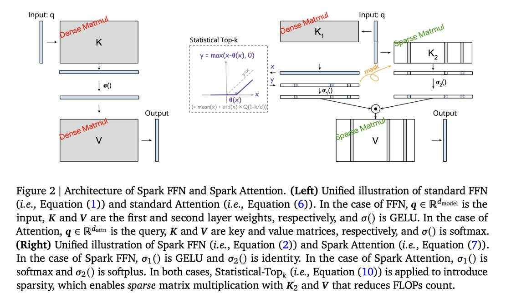

# Spark Transformer: Reactivating Sparsity in FFN and Attention

> **AI Agent 自动生成 Note** | 生成时间：2025-06-04 | 生成工具：Hermes Agent
> 
> 本文 note 由 AI Agent 基于论文全文自动生成，内容仅供参考。如有错误请以原文为准。



## 一句话总结

Spark Transformer 通过统计 top-k（Statistical Top-k）算子和低秩预测器，在 FFN 和注意力机制中同时实现高稀疏度（FFN 仅激活 8%、注意力最多 256 个 token），在保持模型质量的同时实现 2.5 倍 FLOPs 削减和最高 1.79 倍 CPU 解码加速。

## 摘要翻译

训练后 Transformer 中的"懒神经元"现象（Li et al., 2022）——即 FFN 中绝大多数神经元对每个 token 不活跃——激发了利用激活稀疏性提升大模型效率的巨大兴趣。虽然在将稀疏性转化为 CPU、GPU、TPU 上的墙钟时间收益方面已取得显著进展，但现代 Transformer 已逐渐抛弃了对这一现象至关重要的 ReLU 激活函数。现有重新引入激活稀疏性的方法往往导致模型质量下降、参数量增加、训练复杂化或变慢。稀疏注意力（将稀疏激活应用于注意力机制）也面临类似挑战。

本文提出 Spark Transformer，一种在 FFN 和注意力机制中同时实现高水平激活稀疏性的新架构，同时保持模型质量、参数量和标准训练流程。我们的方法通过 top-k 掩码实现稀疏性，以显式控制稀疏水平。关键地，我们引入了 **Statistical Top-k**——一种硬件加速器友好、线性时间的近似算法，避免了昂贵的排序操作，减轻了标准 top-k 算子导致的显著训练减速。此外，Spark Transformer 将现有 FFN 参数和注意力 key 嵌入重新分配，形成一个低成本预测器来识别激活条目。该设计不仅缓解了强制稀疏性导致的质量损失，还增强了墙钟时间收益。使用 Gemma-2 配方预训练后，Spark Transformer 在标准基准上展示了有竞争力的性能，同时表现出显著的稀疏性：仅 8% 的 FFN 神经元被激活，每个 token 最多关注 256 个 token。该稀疏性转化为 2.5 倍的 FLOPs 削减，在 CPU 上实现最高 1.79 倍的解码加速，在 GPU 上实现最高 1.40 倍的加速。

## 研究动机

1. **现代 Transformer 丧失了自然稀疏性**：Gemma、LLaMA、Mistral 等主流模型采用 gated 激活函数（如 SwiGLU）而非 ReLU，导致 FFN 中不再存在自然激活稀疏性。
2. **现有方法的三大挑战**：
   - **质量退化**：切换回 ReLU 变体或应用 top-k 阈值往往导致模型质量下降。
   - **训练减速**：标准 top-k 算子（如 JAX 的 `jax.lax.approx_max_k`）在 TPU 上可导致超过 10 倍的训练减速。
   - **复杂性增加**：引入稀疏预测器通常增加训练流程复杂度、额外的训练成本和参数量。
3. **稀疏注意力的类似挑战**：top-k 注意力同样面临高质量与高稀疏度的矛盾，以及 top-k 带来的训练减速。

## 方法（技术细节）

### 整体架构：Spark FFN + Spark Attention

Spark Transformer 将 FFN 和注意力机制统一为**键值查找表**（key-value lookup）的视角，为稀疏性和低成本预测器提供统一框架。

### 1. Spark FFN

标准 FFN：`Standard-FFN(q; K, V) = V · σ(K^T q)`，计算量为 4d_model · d_ff。

Spark FFN 将输入 q 拆分为两部分 `q[:r]` 和 `q[r:]`（r ≈ d_model/2）：

```
Spark-FFN(q; K1, K2, V, k, r) = V · [σ(Top_k(K1^T q[:r])) ⊙ (K2^T q[r:])]
```

- **K1**（维度 r × d_ff）：用于生成预测分数，经 Top-k 后得到稀疏掩码。
- **K2**（维度 (d_model-r) × d_ff）：用于计算实际激活值，仅在被选中的位置上计算。
- **V**（维度 d_model × d_ff）：与稀疏激活向量相乘，仅计算非零行。

**FLOPs 分析**：当 r ≈ d_model/2 时，Spark FFN 的 FLOPs 约为 d_model·d_ff + 3·d_model·k，相比标准 FFN 实现约 4 倍的 FLOPs 削减。

**与门控 FFN 的关系**：Gated FFN 使用 σ(K1^T q) ⊙ (K2^T q)，而 Spark FFN 在此基础上加入 Top-k 算子获取稀疏性，并将输入拆分为两个部分。

### 2. Spark Attention

注意力机制与 FFN 具有相同形式（键值查找），因此可以应用相同的稀疏策略：

```
Spark-Attention(q; K, V, k, r) = V · [σ1(Top_k^{(-∞)}(K1^T q[:r])) ⊙ σ2(K2^T q[r:])]
```

- σ1 = softmax，σ2 = softplus
- Top_k^{(-∞)} 将低于阈值的条目设为 -∞（而非 0）
- k = 256（每个 token 最多关注 256 个 token）

**FLOPs 分析**：当 r = d_attn/2 时，FLOPs 约为 d_model·n_ctx + 3·d_model·min{k, n_ctx}，近乎 4 倍缩减。

### 3. Statistical Top-k（核心创新）

Standard Top-k 需要排序（O(d log d)），在硬件加速器上效率低下。Statistical Top-k 提供了一种**线性复杂度**的近似方案：

```
Statistical-Top_k(x) = Soft-Threshold(x, θ(x, k))
θ(x, k) = mean(x) + std(x) · Q(1 - k/d)
```

其中 Q(·) 是标准高斯分布的分位数函数（逆 CDF）。

**原理**：假设激活向量的条目来自高斯分布，通过样本均值和标准差估计阈值，使得约 k 个条目超过该阈值。

**理论保证（Theorem 3.1）**：对于独立同分布的高斯条目，以至少 1-δ 的概率，超过阈值的条目数与 k 的相对误差满足 O(√(log d/d))。

**计算成本**：仅需 2d FLOPs（计算均值和标准差），远低于标准 top-k 的 O(d log d)。高斯分位数函数通过 SciPy 的分段逼近以常数复杂度实现。

**软阈值化（Soft-Thresholding）**：使用 soft-thresholding 算子（而非硬阈值），将所有条目左移阈值 θ 后截断为非负值。该算子连续且几乎处处可微，对梯度优化友好。

**变分形式**：Statistical Top-k 可视为求解 `argmin_{z≥0} θ∥z∥_1 + 1/2∥x-z∥_2^2`，即 ℓ1 稀疏正则化。相比之下，Soft Top-k 和 SparseK 分别使用熵和 Gini 熵正则化，无闭式解，需要迭代算法。

**训练效率**：Statistical Top-k 的训练减速非常小，而 JAX 标准 top-k 在 50% 召回率下即可导致超过 10 倍减速。

### 4. 低秩预测器设计

Spark FFN 和 Spark Attention 都利用 K1（或 K1^T q[:r]）作为低成本预测器，预测哪些条目应被激活。这一设计：
- 不引入额外参数（K1 是现有 FFN 参数的子集）
- 使所有模型参数在单一阶段训练
- 提供了稀疏性预测的同时也带来了质量提升（对比 Topk 基线）

### 5. 实现细节

- **模型**：Gemma-2 2B（2B 参数，d_model = 2304）
- **FFN**：Spark FFN 中 d_ff = 13824（保持与 Gated FFN 相同参数量），k = 1106（8% 稀疏度），r = 1024 ≈ d_model/2
- **注意力**：Spark Attention 中 k = 256（每个 token 最多关注 256 个 token），r = 128 = d_attn/2
- **位置编码**：RoPE 应用于 q[:r]、q[r:]、K1 和 K2 的列
- **稀疏矩阵乘法实现**：
  - CPU：使用 SIMD 指令和 `builtin_prefetch` 软件预取，避免加载被掩码的列/行
  - GPU：使用自定义 CUDA kernel
  - 实现了两种稀疏矩阵乘法：向量掩码矩阵乘法（Vector-Masked MatMul）和稀疏向量矩阵乘法（Sparse Vector-MatMul）
- **训练**：使用标准 Gemma-2 配方，480k steps，完整预训练（非微调）
- **推理框架**：CPU 使用 gemma.cpp，GPU 使用 llama.cpp

## 实验结果

### 模型质量
- 在 Gemma-2 标准基准上，Spark Transformer 与 Gemma-2 质量接近（近似质量中性）
- 相比 ReLU、ReLU2、Topk 等方法，Spark FFN 实现了更优的 FLOPs-质量权衡
- 结合 Spark FFN + Spark Attention 后，整体质量几乎无损

### 稀疏性
- **FFN**：训练过程中稳定维持约 8% 的非零激活率（接近 k/d_ff = 8% 的超参数设定）
- **注意力**：训练过程中每个 token 的关注 token 数始终低于 256 的上限
- 评估阶段保持与训练一致的稀疏水平

### 推理效率

**CPU 推理**（gemma.cpp）：
- 16 核 CPU VM：解码加速 1.35x ~ 1.79x（取决于 prompt 长度）
- 4 核 CPU VM：解码加速 1.35x ~ 1.64x
- Prefill（4096 token，chunk=64）：1.86x 加速
- Decode（batch=1）：1.64x 加速

**GPU 推理**（NVIDIA T4 GPU，llama.cpp）：
- 解码加速 1.25x ~ 1.40x

### 训练效率
- Statistical Top-k 的训练减速非常小
- JAX 标准 top-k 在 50% 召回率下可导致超过 10 倍训练减速
- Spark Transformer 保持与标准 Gemma-2 相同的训练流程和速度

## 优势

1. **FFN 和注意力机制同时稀疏**：FFN 仅激活 8%，注意力最多 256 个 token，双重稀疏性带来 2.5 倍 FLOPs 削减。
2. **Statistical Top-k 的高效性**：线性复杂度、硬件友好、可微分，解决了标准 top-k 的训练减速和不可微问题。
3. **无需额外参数**：低秩预测器直接复用现有 FFN/注意力参数（K1），单阶段训练。
4. **近似质量中性**：在保持 Gemma-2 质量的同时实现显著效率提升。
5. **广泛的硬件加速**：在 CPU（SIMD 优化）、GPU（CUDA kernel）上均实现显著加速。
6. **与 MoE 的关联**：可视为"最小专家混合"（Mixture of Minimum Experts），每个神经元都是一个专家。

## 局限

1. **仅在 Gemma-2 2B 上验证**：论文主要在 2B 参数模型上进行实验，未展示在更大模型（如 7B、70B）上的效果。
2. **稀疏性依赖于统计假设**：Statistical Top-k 依赖于激活分布近似高斯的假设，虽然实验中基本成立，但理论上缺乏严格的理论保证（需分布假设）。
3. **硬件优化仍有空间**：当前在 CPU 和 GPU 上的加速依赖于朴素的稀疏矩阵乘法实现，可能存在更高效的硬件加速方案。
4. **未能实现完全的稀疏加速**：预训练过程中存在 memory-bound 约束，且在批量推理场景下稀疏性收益可能降低。
5. **无开源代码**：论文未提供公开代码（prototxt 中 code url 为空）。
6. **仅覆盖解码加速**：论文主要关注解码阶段的加速，预训练阶段仍需完整计算（尽管训练减速很小）。

## 与 EfficientPaper 相关的研究方向

### 激活稀疏性（Activation Sparsity）
- **ReLU 激活稀疏性**：ReLU、ReLU2 等方法通过替换激活函数引入稀疏性，但存在质量损失或稀疏度不足。
- **Top-k 稀疏性**：Turbo Sparse、ProSparse 等方法利用 top-k 阈值化引入稀疏性，但面临训练减速和不可微问题。
- **Statistical Top-k**：本文提出的 Statistical Top-k 在效率和可微性上具有显著优势，可作为稀疏激活的通用方案。
- **稀疏注意力**：Sparse Flash Attention、InfiniGen 等方法利用稀疏注意力加速推理，Spark Attention 是一种新的统一方案。

### Mixture of Experts（MoE）
- Spark Transformer 可视为 MoE 的极端形式（每个神经元是一个专家），为 MoE 设计提供了新的视角。
- Statistical Top-k 的线性复杂度可能解决 MoE 路由中的 top-k 计算瓶颈。

### 与投机解码（Speculative Decoding）的协同
- Spark Transformer 作为目标模型，其更快的推理速度可加速验证瓶颈。
- 作为草稿模型，其近似质量中性和高速度使其成为理想的草稿生成器。
- 可能带来更高的 token 接受率和更大的整体加速。

### 与量化（Quantization）的协同
- Statistical Top-k 的软阈值化压缩了激活分布的动态范围，可能降低对量化误差的敏感度。
- 量化和稀疏性的效果可能是乘性的（而非加性的）。

### 与其他稀疏方法的对比
- **LookupFFN**：通过查表实现稀疏 FFN，但与 Spark Transformer 的方法不同。
- **DejaVu**：通过上下文稀疏性在推理时加速 LLM，Spark Transformer 从架构层面解决稀疏性。
- **CATS**：上下文感知阈值化，与 Spark Transformer 的统一框架不同。
- **R-Sparse**：秩感知激活稀疏性，与 Spark Transformer 的低秩预测器有相似之处。

## 参考信息

- **arXiv**: [2506.06644v2](http://arxiv.org/abs/2506.06644v2)
- **发表**: NeurIPS 2025
- **作者**: Chong You, Kan Wu, Zhipeng Jia, Lin Chen 等（Google、xAI、Anthropic）
- **代码**: 未公开（PyTorch）
- **关键词**: sparse_pruning, activation_sparsity
