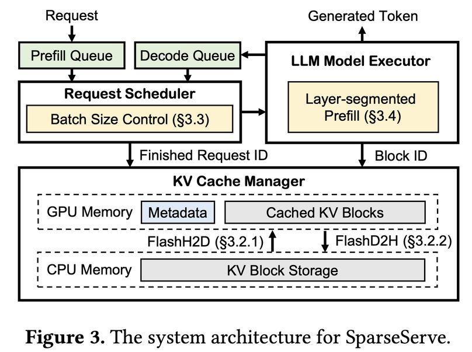

# SparseServe: Unlocking Parallelism for Dynamic Sparse Attention in Long-Context LLM Serving

> Qihui Zhou, Peiqi Yin, Pengfei Zuo, James Cheng

> **⚠️ 本文由 AI Agent 自动生成，生成时间：2025 年。内容基于 arXiv 论文全文阅读，仅供参考。**

---

## 一句话总结

SparseServe 是一个面向长上下文 LLM 推理的高效服务系统，通过碎片化感知的 KV 缓存传输、工作集感知的批大小控制和分层分段预填充三大创新，将动态稀疏注意力（DSA）的并行潜力充分释放，实现了相比现有系统高达 9.26 倍的首 token 延迟降低和 3.14 倍的吞吐量提升。

---

## 摘要翻译

服务长上下文 LLM 代价高昂，因为注意力计算随上下文长度线性增长。动态稀疏注意力算法（DSA）通过仅关注关键 token 的 KV 缓存来缓解这一问题。然而，使用 DSA 时，主要性能瓶颈从 HBM 带宽转移到 HBM 容量：未被选中的 token 的 KV 缓存必须保留在 HBM 中以确保低延迟解码，这限制了并行批大小并阻碍了进一步的吞吐量提升。将这些未充分利用的 KV 缓存卸载到 DRAM 可以释放 HBM 容量，允许更大的并行批大小。然而，实现这种层次化 HBM-DRAM 存储带来了新的挑战，包括碎片化的 KV 缓存访问、HBM 缓存争用以及混合批处理的高 HBM 需求，这些在先前工作中尚未解决。

本文提出 SparseServe，一个通过高效的层次化 HBM-DRAM 管理来释放 DSA 并行潜力的 LLM 服务系统。SparseServe 引入了三项关键创新来解决上述挑战：（1）碎片化感知的 KV 缓存传输，通过 GPU 直接加载（FlashH2D）和 CPU 辅助保存（FlashD2H）加速 HBM-DRAM 数据移动；（2）工作集感知的批大小控制，基于实时工作集估算调整批大小以最小化 HBM 缓存抖动；（3）分层分段预填充，将预填充期间的 HBM 使用限制在单层，即使对于长提示也能高效执行。大量实验结果表明，SparseServe 相比最先进的 LLM 服务系统，可实现高达 9.26 倍的平均首 token 延迟（TTFT）降低和高达 3.14 倍的 token 生成吞吐量提升。

---

## 研究动机

### 背景问题

1. **长上下文 LLM 推理成本高**：随着长上下文应用（如复杂推理、文档分析）需求增长，LLM 上下文窗口已扩展到超过百万 token。但注意力计算随序列长度线性增长，导致推理成本极高。
2. **动态稀疏注意力（DSA）的瓶颈转移**：DSA 通过仅关注关键 token 的 KV 缓存来减少 HBM 带宽需求，但瓶颈从 HBM 带宽转移到 HBM 容量。即使只有少量 KV 块被访问，所有 KV 块必须留在 HBM 中以确保低延迟解码，导致 HBM 容量利用率低下，限制了通过增加批大小来提升吞吐量的能力。
3. **层次化内存管理的挑战**：将 KV 缓存卸载到 DRAM 是一个有前景的解决方案，但朴素的卸载会引入严重的解码延迟和整体吞吐量下降。实现高效的层次化内存管理面临三个关键挑战：
   - **碎片化 KV 缓存传输**：DSA 以 KV 块为单位进行选择和访问，块大小通常很小（如 32 token，仅 16KB），通过标准 cudaMemcpy 传输时有效带宽远低于 PCIe 峰值。
   - **高效运行时批大小控制**：小批大小浪费 GPU 资源，大批大小可能加剧 HBM 缓存争用。动态平衡批大小对最大化效率至关重要。
   - **分块预填充的高 HBM 需求**：混合批处理中，长提示被分成小块处理，但每个块仍需要之前所有块的 KV 缓存，导致 HBM 消耗高，可能造成头阻塞。

---

## 方法（技术细节）

SparseServe 由三个核心组件组成：**请求调度器**、**模型执行器**和 **KV 缓存管理器**。

### 1. 碎片化感知的 KV 缓存传输（Fragmentation-Aware KV Cache Transfer）

SparseServe 采用 (H, N, D) 的 KV 块布局（按注意力头组织），支持 DSA 的块级选择。为加速 HBM-DRAM 之间的碎片化数据传输，提出两种优化：

#### FlashH2D：GPU 直接加载
- **问题**：传统 memcpy 方法要求源和目标缓冲区连续，每个散落在 DRAM 中的 KV 块必须单独复制，导致大量 memcpy 调用，函数调用开销大，PCIe 带宽利用率低。
- **方案**：利用现代 GPU 的统一虚拟寻址（UVA）能力，GPU 内核可以直接访问 DRAM。SparseServe 启动单个 GPU 内核，将所有选中的 KV 块从 DRAM 并行加载到 HBM，每个 DRAM KV 块分配一个线程块。
- **效果**：FlashH2D 在各种块大小下持续提供超过 20 GB/s 的 PCIe 带宽，显著优于 memcpy 的 5 GB/s 以下。KV 缓存加载延迟最高降低 9.97 倍。

#### FlashD2H：CPU 辅助保存
- **问题**：HBM 中的 KV 块分散在非连续地址，保存时面临同样的碎片化数据移动问题。GPU 直接保存方法会消耗 GPU 资源，干扰模型计算。
- **方案**：利用每次迭代生成的 KV 张量是连续的特性，将保存分为两步：(1) 通过单次 memcpy 将连续 KV 张量复制到 DRAM 缓冲区；(2) 传输完成后，CPU 线程异步将缓冲区数据分发到对应的 DRAM KV 块。
- **效果**：FlashD2H 可以完全与模型计算并行执行，不消耗 GPU 资源，预填充延迟与计算时间相同（无额外开销）。PCIe 带宽持续超过 23 GB/s，显著优于 memcpy 的 6 GB/s 以下。

### 2. 工作集感知的批大小控制（Working-Set-Aware Batch Size Control）

#### 预填充工作集估算
- 预填充是确定性的，工作集大小可以精确计算。对于分层分段预填充，工作集仅包含单层的 KV 缓存（因为前层已驱逐到 DRAM）。

#### 解码工作集估算
- 利用时间局部性：连续查询 token 通常选择高度重叠的 KV 块。实验表明，在窗口大小为 12 步时，重叠率已接近饱和（从 1 到 12 步提升 10.68%，从 12 到 16 步仅提升 0.31%）。
- SparseServe 跟踪过去 w 步（默认 w=12）的 KV 块选择，将其并集作为解码工作集。

#### 调度算法
- 在现有 LLM 服务系统调度器基础上扩展，增加 HBM 可用容量约束（M_avl）。
- 调度流程：(1) 调用现有调度逻辑构建初始候选批（满足 R_max 和 T_max 约束）；(2) 估算每个请求的工作集大小；(3) 仅当总 HBM 使用量不超过 M_avl 时将请求加入执行批；否则拒绝请求并重置状态。
- **效果**：在高请求速率下（如 0.3 RPS），KV 块加载次数降低 52.78 倍，吞吐量持续稳定提升。

### 3. 分层分段预填充（Layer-Segmented Prefill）

#### 核心思想
- LLM 由多层组成，模型前向传播逐层进行。虽然整个预填充耗时，但单层执行相对较快。
- 将预填充按层分割，在不同批中处理，限制每批运行时间。
- 由于输入未被分块，每层 KV 块仅在预填充期间被访问一次，前层 KV 块可在保存到 DRAM 后立即驱逐，释放的 HBM 空间可被后续层复用。
- **关键优势**：将预填充的 HBM 占用限制为单层，显著降低预填充内存需求。

#### 工作流程示例
- 以 3 层 LLM 为例，每批包含 3 个解码请求和 1 个预填充请求（段大小为 1）。预填充在 3 个迭代中完成，每个迭代仅执行一个预填充层，跳过剩余层，确保低批运行时间。每次迭代后保存激活状态，用于下一次迭代恢复预填充。

#### 段大小确定
- 取决于三个因素：提示长度、TBT SLO 和系统吞吐量。小段大小有利于降低 TBT（尤其对长提示），但会降低预填充速度和吞吐量。
- SparseServe 提供可配置参数 maxInjectToken，限制每批注入的最大预填充 token 数。用户通过性能分析找到最佳值（从小值开始逐渐增加直到达到 TBT 限制）。

#### 与分块预填充的结合
- 对于极长输入提示，可将每层进一步分成更小的块（类似分块预填充），在多个批中处理。这种混合策略提供细粒度延迟控制，同时保留分层分段预填充的 HBM 效率优势。

---

## 实验结果

### 实验设置
- **硬件**：Nvidia A100 40GB GPU + AMD EPYC 7J13 CPU + 256GB DRAM，通过 PCIe Gen4 连接（32 GB/s 带宽）。
- **模型**：LWM-7B（1M 上下文窗口，MHA）和 Llama3-8B（262K 上下文窗口，GQA）。
- **基线**：vLLM（全 KV 缓存注意力）、vLLM-S（集成 DSA）、vLLM-SO（DSA + KV 缓存卸载）。
- **数据集**：LongBench（问答、文档摘要、代码生成等任务），请求到达时间基于泊松分布。
- **Token 预算**：2048（确保稀疏注意力精度达到全注意力的 99%）。

### 端到端性能

#### TTFT（首 token 延迟）
- 低请求速率下，所有系统 TTFT 相似。
- 随请求速率增加，vLLM 快速耗尽 HBM，阻塞新请求并显著延长排队时间。
- **SparseServe** 在所有请求速率下一致实现最低 TTFT：
  - LWM-7B：高达 9.26 倍降低（相比 vLLM）
  - Llama3-8B：显著降低

#### Token 生成吞吐量
- **SparseServe** 一致实现最高吞吐量：
  - vs. vLLM：LWM-7B 提升 2.93 倍，Llama3-8B 提升 3.14 倍
  - vs. vLLM-S：LWM-7B 提升 2.23 倍，Llama3-8B 提升 2.03 倍
  - vs. vLLM-SO：LWM-7B 提升 2.96 倍，Llama3-8B 提升 4.24 倍

#### TBT（token 间延迟）
- SparseServe 的 TBT 略高于 vLLM（不超过 20%），但这是合理的权衡，因为 SparseServe 显著降低了 TTFT 并提升了吞吐量。
- vLLM-SO 的 TBT 最高（因大量 KV 块加载开销）。

#### Goodput（SLO 下最大可持续请求吞吐量）
- 从 vLLM 到 SparseServe 的逐步优化：
  - 稀疏注意力（SA）：goodput 提升 1.20×（LWM-7B）/ 1.13×（Llama3-8B）
  - KV 缓存卸载：进一步提升 1.33× / 1.12×
  - 碎片化感知传输（FT）：提升 1.88× / 1.19×
  - 工作集感知批控制（WC）：提升 1.33× / 1.11×
  - 分层分段预填充（LP）：提升 1.25× / 1.10×
- **总体**：SparseServe 在 LWM-7B 上 goodput 提升 5.00 倍，Llama3-8B 上提升 1.83 倍（相比 vLLM）。

### 消融研究

#### FlashH2D
- 在批大小为 8 时，KV 缓存加载占批延迟的 69.94%。
- FlashH2D 将加载延迟降低 9.97 倍。

#### FlashD2H
- memcpy 方法使预填充延迟增加 1.76 倍（vs. 计算时间）。
- GPU 直接保存增加 1.28 倍（干扰模型计算）。
- FlashD2H 预填充延迟与计算时间相同（零开销）。

#### 工作集感知批控制
- 高请求速率下（0.3 RPS），无批控制时吞吐量下降 29.52%（因 KV 块加载剧增）。
- 有批控制时，KV 块加载降低 52.78 倍，吞吐量持续提升。

#### 分层分段预填充 vs. 分块预填充
- **TTFT 降低**：分层分段预填充可将平均 TTFT 降低 8.68 倍（vs. 分块预填充）。
- **预填充计算开销**：分块预填充在小块大小（如 512）时，注意力时间增加 1.51 倍（需重复加载前序块的 KV 缓存）。分层分段预填充开销几乎为零（与普通预填充相同）。

---

## 优势

1. **系统级优化**：SparseServe 首次从系统部署角度优化 DSA 在长上下文 LLM 服务中的效率，填补了算法优化与系统实现之间的空白。
2. **碎片化感知的高效传输**：FlashH2D 和 FlashD2H 分别针对加载和保存的不同特性进行优化，显著提高 PCIe 带宽利用率（20-23 GB/s vs. 5-6 GB/s）。
3. **智能批大小控制**：通过工作集感知的调度策略，避免 HBM 缓存抖动，在高负载下保持吞吐量稳定。
4. **低 HBM 占用的预填充**：分层分段预填充将预填充的 HBM 占用限制在单层，同时避免了分块预填充的重复计算开销。
5. **显著性能提升**：TTFT 降低 9.26 倍，吞吐量提升 3.14 倍，goodput 提升 5.00 倍。
6. **兼容性好**：基于 vLLM 实现，兼容现有 LLM 服务系统设计，且支持多种 DSA 元数据构建方法。
7. **精度损失极小**：Token 预算 2048 时，稀疏注意力精度达到全注意力的 99%。

---

## 局限

1. **硬件依赖**：依赖 GPU 的 UVA（统一虚拟寻址）能力，可能不适用于所有 GPU 架构。
2. **单 GPU 限制**：实验在单 GPU 环境下进行，未充分探索多 GPU / 分布式部署场景。
3. **模型覆盖有限**：仅在 LWM-7B 和 Llama3-8B 上验证，未涵盖更大的模型（如 70B+）或更多类型的注意力机制（如线性注意力、滑动窗口注意力）。
4. **与分块预填充的结合限制**：当单层执行时间已超过 TBT 时，需要进一步分块，可能引入额外复杂性。
5. **工作集估算假设**：解码工作集估算依赖连续查询 token 的时间局部性假设，在某些极端场景下可能不完全准确。
6. **精度与效率的权衡**：Token 预算设置影响精度和效率的平衡，需要用户根据具体场景进行调优。
7. **未开源**：代码链接为空（需进一步确认开源状态）。

---

## 与 EfficientPaper 相关的研究方向

### 直接相关
- **KV 缓存管理**：SparseServe 的层次化 HBM-DRAM 管理与 PagedAttention（2023）一脉相承，是高效 KV 缓存管理的重要扩展。
- **动态稀疏注意力**：SparseServe 与 ArkVale、InfLLM、Quest 等 DSA 工作紧密相关，是首个系统级的 DSA 部署优化。
- **LLM 服务系统**：与 vLLM、Sarathi-Serve、NanoFlow 等 LLM 服务系统相关，属于推理系统优化方向。

### 潜在研究方向
1. **多 GPU 分布式服务**：将 SparseServe 的优化扩展到多 GPU 环境，探索跨 GPU 的 KV 缓存管理。
2. **与预填充稀疏注意力结合**：与 GemFilter、MInference、SeerAttention 等预填充稀疏注意力方法结合，实现端到端的稀疏优化。
3. **与训练稀疏注意力结合**：与 DeepSeek 的 Native Sparse Attention（NSA）结合，在训练阶段即引入稀疏性。
4. **自适应 Token 预算**：根据输入特征动态调整 Token 预算，实现精度与效率的最优平衡。
5. **与 KV 缓存压缩/蒸馏结合**：结合 SnapKV、StreamingLLM 等静态稀疏方法，进一步减少 KV 缓存大小。
6. **与模型参数卸载结合**：与 DeepSpeed Inference、Lina、PowerInfer 等模型参数卸载方法结合，实现更全面的资源优化。
7. **跨平台部署优化**：将 SparseServe 的优化思想迁移到其他硬件平台（如 AMD GPU、Apple Silicon）。
8. **量化 KV 缓存**：将量化技术与层次化内存管理结合，进一步减少 KV 缓存的内存占用。

---

> **生成声明**：本 note 由 AI Agent 基于 arXiv 论文全文（2509.24626v1）自动生成，生成时间为 2025 年。内容仅供学术参考，如有错误或遗漏，请以原文为准。
