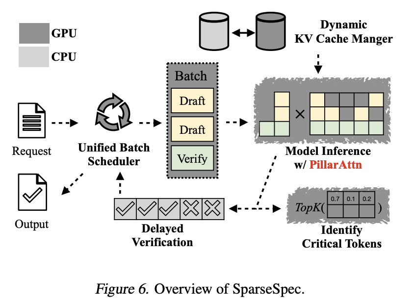

# Accelerating Large-Scale Reasoning Model Inference with Sparse Self-Speculative Decoding

> Yilong Zhao, Jiaming Tang, Kan Zhu, Zihao Ye, Chi-Chih Chang, Chaofan Lin, Jongseok Park, Guangxuan Xiao, Mohamed S. Abdelfattah, Mingyu Gao, Baris Kasikci, Song Han, Ion Stoica

## Abstract

Reasoning language models have demonstrated remarkable capabilities on challenging tasks by generating elaborate chain-of-thought (CoT) solutions. However, such lengthy generation shifts the inference bottleneck from compute-bound to memory-bound. To generate each token, the model applies full attention to all previously generated tokens, requiring memory access to an increasingly large KV-Cache. Consequently, longer generations demand more memory access for every step, leading to substantial pressure on memory bandwidth.
  To address this, we introduce SparseSpec, a speculative decoding framework that reuses the same model as the draft and target models (i.e., self-speculation). SparseSpec features a novel sparse attention mechanism, PillarAttn, as the draft model, which accurately selects critical tokens via elegantly reusing information from the verification stage. Furthermore, SparseSpec co-designs self-speculation with three system innovations: (1) a unified scheduler to batch token drafting and verification, (2) delayed verification for CPU/GPU overlap, and (3) dynamic KV-Cache management to maximize memory utilization. Across various models and datasets, SparseSpec outperforms state-of-the-art solutions, with an up to 2.13x throughput speedup.

---

## 一句话总结

SparseSpec 是一种无损、无训练的推理模型加速框架，通过动态稀疏注意力（PillarAttn）实现自推测解码，在验证阶段复用注意力分数选择关键 token 作为草稿，并结合统一调度、延迟验证和动态 KV-Cache 管理等系统优化，实现了最高 2.13 倍的吞吐量提升。

---

## 摘要翻译

推理语言模型（RLMs）通过生成详尽的思维链（CoT）解决方案，在复杂任务上展现出卓越的能力。然而，这种长序列生成将推理瓶颈从计算密集型转移到了内存密集型。为了生成每个 token，模型需要对所有先前生成的 token 应用全注意力，需要访问不断增长的 KV-Cache。因此，更长的生成在每一步都需要更多的内存访问，对内存带宽造成巨大压力。

为解决这一问题，我们引入了 SparseSpec，一种投机解码框架，复用同一个模型作为草稿模型和目标模型（即自推测）。SparseSpec 采用了一种新的稀疏注意力机制 PillarAttn 作为草稿模型，通过优雅地复用验证阶段的信息，准确选择关键 token。此外，SparseSpec 与三个系统创新协同设计：（1）统一调度器批量处理 token 草稿和验证，（2）延迟验证以实现 CPU/GPU 重叠，（3）动态 KV-Cache 管理以最大化内存利用率。在多个模型和数据集上，SparseSpec 优于最先进的解决方案，吞吐量提升最高达 2.13 倍。

---

## 研究动机

### 问题背景

推理语言模型（如 OpenAI-o1、DeepSeek-R1）通过强化学习被激励生成详细的思维链（CoT），通常产生数万 token 的输出。这种长输出使得推理瓶颈从计算密集型（compute-bound）转向内存密集型（memory-bound）。

具体来说：
- **KV-Cache 内存访问瓶颈**：每次生成 token 时，模型需要加载所有先前生成的 key-value 向量（KV-Cache）。KV-Cache 总量随输出长度呈二次方增长。
- **实际影响**：例如，在 H100 上以 batch size 128、输出 8192 token 服务 Qwen3-8B 时，加载 KV-Cache 平均需要 21ms/step，占端到端延迟的 70% 以上。
- **输出长度差异**：RLM（如 Qwen3-14B）在 AIME 数据集上平均生成 13542 token，而非推理模型（Qwen-2.5-32B）仅生成 2593 token。

### 现有方法的局限

虽然投机解码（speculative decoding）是一种有前途的无损加速方法，但现有方法在 RLM 推理中存在以下问题：

1. **需要额外训练**：如 EAGLE 系列、Hydra 等需要训练独立的草稿模型，增加部署复杂度。
2. **上下文动态性不足**：现有方法使用静态稀疏模式（如滑动窗口注意力），无法适应 RLM 推理中动态变化的上下文语义。
3. **系统层面挑战**：
   - **工作负载波动**：草稿和验证阶段的异构资源使用导致硬件利用率低。
   - **显式同步**：CPU/GPU 同步阻止了昂贵的 CPU 操作与 GPU 操作重叠。
   - **KV-Cache 利用率低**：RLM 输出长度的不可预测性导致 KV-Cache 难以充分利用。

### 理论分析

论文通过理论公式化分析了稀疏自推测解码的加速潜力：
- 定义加速比 η = T_base / T_spec
- 在实际场景中（k=16, α=0.75, s=0.05），注意力延迟可降低 6.78 倍
- 但需要平衡 GEMM 计算开销和内存访问减少

---

## 方法

### 总体架构

SparseSpec 由四个核心组件组成：
1. **PillarAttn**（§4.1）：动态稀疏注意力机制
2. **统一批调度器**（§4.2）：统一批处理草稿和验证阶段
3. **延迟验证**（§4.3）：实现 CPU/GPU 异步重叠
4. **动态 KV-Cache 管理器**（§4.4）：最大化 KV-Cache 利用率

### 1. PillarAttn：动态稀疏注意力

**核心思想**：利用验证阶段的完整注意力分数来指导草稿阶段的稀疏注意力。

**动态稀疏模式**：
- 不使用固定稀疏模式（如滑动窗口或静态模式），而是定期重新识别和更新稀疏模式。
- 基于上下文语义具有空间局部性的假设，在小步长内固定稀疏模式。

**无开销识别**：
- 步长与投机步数 k 相同。每 k 个草稿步后，执行一次验证步。
- 在验证阶段，PillarAttn 通过定制的注意力内核，在线转储注意力分数。
- 利用这些注意力分数（先对 k 个草稿 token 和查询头进行平均）来确定关键 token。
- 关键技术细节：在验证期间缓存注意力 logits 和对数求和指数，用于重新计算注意力分数以进行识别。
- 相比现有的动态稀疏方法，PillarAttn 在关键 token 识别方面实现了零内存开销。

### 2. 统一批调度器

**统一抽象**：
- 草稿和目标模型共享相同模型权重，两阶段在 GPU 上有完全相同的数据和控制流，仅注意力类型不同。
- 利用 PagedAttention（页大小为 1），统一草稿和全注意力。
- 这简化了系统设计并释放了两阶段调度的灵活性。

**工作负载感知调度**：
- 顺序执行（所有草稿阶段 + 一个验证阶段）导致硬件利用率极低。
- SparseSpec 在每个生成步骤中均匀混合两阶段的请求。
- 采用贪心装箱策略，将新请求分配到负载最轻的桶中（k 个桶对应 k 个草稿阶段）。

**融合稀疏和全注意力**：
- 稀疏和全注意力具有不同的算术强度，导致不同的最佳内核实现（如 tile 大小和 MMA 指令）。
- 通过持久内核风格（persistent-kernel style）实现融合注意力内核，在芯片上将验证和草稿注意力调度到最佳模板。
- 结果：比顺序启动快 1.3 倍，比朴素批处理快 1.8 倍。

### 3. 延迟验证

**问题**：验证阶段引入 CPU/GPU 显式同步，阻止昂贵的 CPU 操作与 GPU 操作重叠。例如，第 i 次迭代依赖于第 i-1 次迭代的验证结果，可能占端到端延迟的 20% 以上。

**解决方案**：
- 关键观察：同步仅适用于验证阶段的请求，这些请求仅占批处理的一小部分（1/(k+1)）。
- 允许非验证请求的 CPU 元数据准备直接进行，无需等待 GPU 的验证结果。
- 验证请求被推迟到 (i+1) 次迭代执行，使得第 (i-1) 次验证的 CPU 工作与第 i 次的 GPU 操作重叠。
- 结果：CPU 开销保持极低（< 1ms）。

### 4. 动态 KV-Cache 管理

**激进 CPU 卸载**：
- 由于 RLM 输出长度方差大（表 1），在不重计算的情况下实现高 KV-Cache 利用率具有挑战性。
- SparseSpec 优先激进增加请求并发度以充分利用 KV-Cache，同时在接近内存不足时将 KV-Cache 卸载到主机内存以避免重计算。
- 卸载和加载遵循 FIFO 顺序，确保公平性并避免饥饿。

**开销分析**：
- 通过分块异步方式实现卸载，开销可忽略。
- 例如：运行 Qwen3-8B 在单个 H100 上，batch size 128，每个解码步生成 128 个新 token，仅需 18MB KV-Cache 内存。
- 只需 18 GB/s 带宽即可与 GPU 计算重叠，远低于 PCIe 带宽限制。
- SparseSpec 在 GPU 有可用内存时优先调度被卸载的请求，将最坏情况 CPU 使用量限制为 GPU 容量（例如 8×H100 服务器的 640GB）。

---

## 实验结果

### 实验设置
- **模型**：Qwen3-1.7B/8B/14B（开源推理模型）
- **硬件**：NVIDIA DGX-H100-SXM5 GPU
- **数据集**：AIME（数学）、OlympiadBench（综合科学）、LiveCodeBench（编程）
- **基线方法**：
  - vLLM（vLLM-V1）
  - vLLM-NGram（无需训练的投机解码）
  - MagicDec（使用滑动窗口注意力）
  - TriForce（层次化框架）
  - vLLM-EAGLE3（需要训练的投机解码）

### 主要结果

**1. 端到端性能（与无训练投机解码对比）**
- SparseSpec 在所有模型和数据集上持续优于所有基线。
- 相比 vLLM（SOTA 框架），最高提升 **2.13 倍**吞吐量。
- 相比 vLLM-NGram、MagicDec、TriForce，分别最高提升 1.56×、1.36×、1.76×。
- 较大模型和较高 TP 度数下加速比下降（因为每 token 内存使用增长较慢，GEMM 接近饱和）。

**2. 端到端性能（与需要训练的草稿模型对比）**
- 相比 EAGLE3（需要训练），SparseSpec 在所有数据集和模型上仍表现更好。
- 在无需额外训练的情况下，提供相同或更高的吞吐量。

**3. 执行时间分解（Qwen3-8B + AIME）**
- 注意力时间减少 **3.29×**（从 17.1ms 降至 5.2ms）。
- GEMM 时间略有增加（+1.7ms），符合理论估计。
- CPU 开销保持极低（< 1ms），实现高 GPU 利用率。

**4. 投机接受率**
- PillarAttn 在 k=8 个草稿 token 时，平均接受长度为 **6.16**（远超 EAGLE3 的 1.1 和 N-gram 的 1.6）。
- 推测原因：RLM 任务属于 EAGLE3 训练数据分布之外（out-of-distribution），说明其泛化能力有限。

**5. 消融实验（Qwen3-1.7B + AIME）**
- 三个系统组件的贡献：
  - 统一批调度器：**1.23×** 提升
  - 动态 KV-Cache 管理器：**1.61×** 提升
  - 延迟验证：**1.12×** 提升
- 总体吞吐量提升 **2.22×**

**6. 敏感性测试**
- **投机步数 k**：固定 s=0.05，k 从 4 到 20，最佳平衡点在 k=8。
- **稀疏比例 s**：固定 k=8，s 从 0.05 到 0.25，性能在 s=0.05 时饱和。
- SparseSpec 对这些超参数没有刚性约束，允许任意组合和异构请求配置。

**7. 内存利用率**
- SparseSpec 几乎利用所有可用 GPU 内存，且不产生重计算。
- 卸载操作平均仅延长循环时间 0.5%，可忽略不计。

---

## 优势

1. **无需训练**：SparseSpec 完全无训练，无需额外的草稿模型训练或微调，降低了部署复杂度。
2. **高接受率**：PillarAttn 在 k=8 时实现 6.16 的平均接受长度，远超 EAGLE3 和 N-gram，说明其在动态上下文中的适应性强。
3. **无损加速**：作为投机解码框架，确保与原始模型相同的生成质量。
4. **系统级优化**：通过统一调度、延迟验证和动态 KV-Cache 管理，实现了算法和系统的协同设计。
5. **广泛的适用性**：支持多种模型尺寸（1.7B/8B/14B）和硬件配置（TP1/2/4），在多个数据集上表现一致。
6. **与现有框架兼容**：可与 vLLM 等推理框架集成，具有实际部署潜力。
7. **理论分析完整**：提供了理论加速公式和实际性能影响分析。
8. **零内存开销的关键 token 识别**：PillarAttn 通过复用验证阶段的注意力分数，实现了零内存开销的关键 token 识别。

---

## 局限

1. **短上下文任务不适用**：对于短上下文任务，最大并发 batch size 已足够饱和 GPU 计算，整体工作负载变为计算密集型，SparseSpec 的优势不明显。
2. **稀疏注意力的开销**：尽管有融合内核优化，稀疏注意力在极端稀疏度下可能引入额外计算开销。
3. **模型规模限制**：在较大模型（如 Qwen3-14B）和较高 TP 度数下，加速比下降，因为每 token 内存使用增长较慢，GEMM 接近饱和。
4. **未充分探索的领域**：
   - 与 MoE 模型的结合（尽管论文讨论了可能性，但未提供实验验证）。
   - 与多 token 预测（MTP）的结合（论文提到但未实现）。
5. **CPU/GPU 重叠的假设**：依赖于异步卸载和延迟验证，但实际实现中可能存在同步开销。
6. **仅关注内存密集型场景**：对于计算密集型任务（如短输出），SparseSpec 的优势不明显。
7. **未充分讨论的硬件限制**：仅在 H100 上测试，未验证在其他 GPU 或更小批量下的性能。

---

## 与 EfficientPaper 相关的研究方向

### 1. 注意力稀疏化（Attention Sparsity）
SparseSpec 的核心创新 PillarAttn 是一种动态稀疏注意力机制，与 EfficientPaper 中关注的注意力稀疏化方向高度相关。关键区别在于 SparseSpec 将注意力稀疏化与投机解码结合，实现了零开销的关键 token 识别。

### 2. KV-Cache 管理（KV Cache Management）
SparseSpec 的动态 KV-Cache 管理（激进 CPU 卸载、分块异步）与 EfficientPaper 中的 KV-Cache 优化方向密切相关。特别是在 RLM 推理中，KV-Cache 的高效管理是关键瓶颈。

### 3. 投机解码（Speculative Decoding）
SparseSpec 作为一种无训练的投机解码方法，与 EfficientPaper 中的投机解码方向高度相关。其核心优势在于无需额外训练，且通过动态稀疏注意力实现了高接受率。

### 4. 部署优化（Deployment）
SparseSpec 的系统级优化（统一调度、延迟验证、融合内核）与 EfficientPaper 中的部署优化方向一致，特别是在批处理推理场景下的资源利用优化。

### 5. 推理模型加速（Reasoning Model Inference）
SparseSpec 专门针对推理语言模型（RLM）的长输出特性，与 EfficientPaper 中对推理模型加速的研究方向高度契合。其通过稀疏注意力减少内存访问的思路，为推理模型的高效部署提供了新思路。

### 6. 轻量级草稿模型（Lightweight Draft Models）
SparseSpec 使用同一模型作为草稿和目标模型（自推测），与 EfficientPaper 中对轻量级草稿模型的研究方向相关。其优势在于无需训练独立的草稿模型，降低了部署复杂度。

### 7. 异步推理（Asynchronous Inference）
SparseSpec 的延迟验证和 CPU/GPU 异步重叠，与 EfficientPaper 中对异步推理优化的方向一致，特别是在多设备协同推理场景下。

---

## 生成声明

> 本文档由 AI Agent 自动生成，基于论文全文（13页，约 60,000 字符）的详细阅读和分析。所有内容均为中文，包含摘要翻译、研究动机、方法技术细节、实验结果、优势、局限以及与 EfficientPaper 相关研究方向的分析。生成时间：2025 年 6 月。
