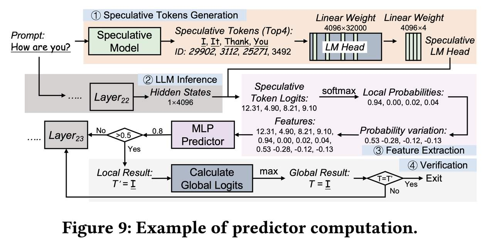

# SpecEE: Accelerating Large Language Model Inference with Speculative Early Exiting

## 一句话总结

SpecEE 提出了一种利用投机模型（speculative model）将早期退出（early exiting）的搜索空间从完整词汇表缩减到投机 token 子集的范式，并结合轻量级预测器、两级启发式调度和上下文感知合并映射三大技术，实现了 LLM 推理 2.25×（云端）和 2.43×（PC 端）的加速，精度损失可忽略不计。

---

## 摘要翻译

早期退出（Early exiting）作为一种通过有效减少硬件计算和内存访问来加速大语言模型（LLM）的技术，最近引起了广泛关注。在本文中，我们发现 LLM 词汇表作为早期退出预测器的运行时搜索空间，显著影响了预测器的工作负载（例如，在 Llama2 中，约 3×10⁴ 的词汇表大小导致约 20% 的推理延迟）。我们提出了一种利用投机模型来减少此搜索空间的新范式，同时解决了三个关键挑战：

1. **耗时的预测器设计**：当前的预测器设计利用高维输入的基本模型，忽略了固有的数据变化和 GPU 并行化机会，导致约 15% 的整体推理延迟。
2. **层级预测器的利用不足**：当前早期退出系统对每层的预测器一视同仁，没有考虑各层预测器的激活频率，导致约 20% 的推理开销。
3. **投机解码中预测器的指数级映射复杂度**：投机解码中的 token 树的每个 token 被视为独立的搜索空间，导致指数级映射复杂度，无法利用高吞吐量优势。

为解决上述挑战，我们提出了 SpecEE——一个具有投机早期退出功能的快速 LLM 推理引擎：

- **算法层面**：提出基于投机的轻量级预测器设计，利用投机 token 与正确结果之间的概率相关性和 GPU 的高并行性。
- **系统层面**：指出并非所有层都需要预测器，基于偏斜分布和上下文相似性设计了两级启发式预测器调度引擎。
- **映射层面**：指出不同解码方法具有相同的本质特征，提出了上下文感知的合并映射方案，支持投机解码，形成适用于各种现有正交加速技术（如量化和稀疏激活）的框架，成功推动了精度和加速比的帕累托前沿。

值得注意的是，SpecEE 可以通过可忽略的训练开销应用于任何 LLM，且不影响模型原始参数。大量实验表明，SpecEE 在云端和 PC 场景下分别实现了 Llama2-7B 的 2.25× 和 2.43× 加速。

---

## 研究动机

### 核心问题

LLM 推理过程中，自回归解码逐个生成 token，具有较差的吞吐量。现有加速方法（如剪枝、量化、投机解码等）形成了精度和加速比的帕累托前沿，但由于缺乏对动态输入和静态模型之间关系的考虑，原始模型中的多级级联层占端到端推理的 70%～95%，成为推进帕累托前沿的主要瓶颈。

### 早期退出的关键挑战

LLM 推理本质上是一个在线搜索问题，搜索空间是完整词汇表。现有早期退出方法面临三大挑战：

| 挑战 | 现有方法的问题 | 影响 |
|------|-------------|------|
| **预测器耗时** | 遍历完整词汇表获取特征，使用高维原始数据（>4×10³维），采用 SVM 等复杂模型 | ~30% 计算开销，~15% 推理延迟 |
| **层级预测器利用不足** | 对每层预测器一视同仁，未考虑退出概率的偏斜分布 | ~20% 额外推理开销 |
| **投机解码映射复杂度** | token 树中每个 token 作为独立搜索空间 | 指数级映射复杂度 |

### 核心洞察（Key Insight）

受计算机系统设计中"投机"概念和投机解码的启发，作者提出：投机模型（DLM）的角色是为目标模型（TLM）生成投机 token。从 TLM 的角度，DLM 的输出提供了一种缩减 token 选择范围（即搜索空间）的潜在途径。如果 DLM 足够强，可以完全将 TLM 的结果限制在投机 token 的范围内。

基于此，**提出利用投机模型来减少早期退出预测器的搜索空间**，将搜索空间从完整词汇表（~3×10⁴ tokens）缩减到投机 token 子集（~3 tokens），实现 **10⁴× 的搜索空间缩减**。

---

## 方法（技术细节）

SpecEE 的架构包含三个核心技术层面（三个 Technque，分别标记为 T1、T2、T3）：

### 技术一（T1）：基于投机的轻量级预测器设计（算法层面）

**动机**：现有预测器使用高维原始数据（~5×10³维）作为输入，没有进行特征分析或提取，导致预测器需要复杂架构（如 AdaInfer 中的 SVM）。

**关键洞察——概率偏移（Probability Shift）**：
- 当最终结果 token 在缩减空间内时，该 token 的概率在某一层急剧上升，而其他 token 的概率保持稳定。
- 反之，如果最终结果不在缩减空间内，所有 token 的概率保持稳定低值。

**特征选择**：基于上述洞察，选择三个特征：
1. **投机 token logits**（l₁, l₂, l₃, l₄）：每层隐藏状态与投机 LM Head 矩阵乘法结果（1×hidden_dim × num_speculative），直接反映 LLM 对投机 token 的置信度。
2. **局部概率（Local Probabilities）**（p₁, p₂, p₃, p₄）：对投机 token logits 施加 softmax，反映缩减搜索空间内投机 token 的可能性。
3. **概率变化（Probability Variation）**（Δ₁, Δ₂, Δ₃, Δ₄）：当前层与上一层的局部概率之差，捕获跨层概率变化。

> 注：三个特征缺一不可。仅用概率变化可能导致误判（如 Δ=0.12 可能来自 0.32−0.20 或 0.58−0.46，含义完全不同）；仅用局部概率可能忽略 logits 差异。

**判断机制**：使用 2 层 MLP（隐藏维度 512）作为预测器，而非 SVM。输入特征维度为 12（4 个投机 token × 3 个特征），输出通过 Sigmoid 函数，与阈值 0.5 比较决定是否退出。

**验证算法**：由于局部概率仅基于局部信息，需引入全局信息验证。计算完整 LM Head 的全局 token logits，检查全局最高 token 是否在投机 token 中。若是，退出并输出该 token；否则继续下一层。

**设计空间探索**：通过控制变量法探索 MLP 层数和隐藏维度的最优配置。最终配置为 **2 层 MLP，隐藏维度 512**。预测器参数量仅约 0.07M，相比基准约 6.7M 参数减少约 **100×**。

### 技术二（T2）：两级启发式预测器调度引擎（系统层面）

**动机**：单独使用 T1，端到端加速仅约 15%，理论加速比可达约 33%（32/(23+1)）。原因在于每层的预测器开销（T×L）过大。统计数据显示退出概率呈偏斜分布，约 50% 的层退出概率低于平均概率 3.2%。

**关键洞察**：
1. **偏斜分布（Skewed Distribution）**：不同模型的退出概率分布呈偏斜分布，约 50% 的层退出概率不足平均概率的 3.2%，表明这些层的预测大多不必要。
2. **上下文相似性（Context Similarity）**：当前 token 的退出层位置有约 80% 概率在前 5 个 token 退出层位置的 ±2 层范围内。理论上该概率仅约 31.8%，实际高达 80%。

**离线调度**：对 LLM 使用大量 prompt 进行推理，收集各预测器的激活频率，按频率排序。结果作为模型配置参数集成到模型中。此过程仅需为每个 LLM 执行一次。

**在线调度**：推理时维护长度为 N（如 5）的循环队列，记录最近 N 个 token 的退出层位置。使用长度等于总层数 L 的数组，追踪每层被命中的次数。最终通过离线调度的高频子集和在线调度结果的并集确定预测器数量和位置。

**效果**：约 68% 的预测器被移除，仅约 10.2 层需要预测器，实现约 **1.21×** 推理加速。

### 技术三（T3）：上下文感知的合并映射（映射层面）

**动机**：在投机解码中，token 树由多层 token 组成，每个 token 被视为独立搜索空间，导致指数级映射复杂度，无法利用投机解码的高吞吐量优势。

**关键洞察**：token 路径中的 token 共享上下文关系，退出位置相对集中，缓解了木桶效应（Cannikin Law）导致的性能损失（如路径 (I, am) 的退出位置由最晚的 am 层决定）。

**方法**：
1. **算法**：将 token 树中一条路径上的 token 合并为单个"超 token（hyper-token）"，使投机解码的早期退出处理方式与自回归解码类似。将指数级映射复杂度转化为线性复杂度。
2. **实现**：基于 cutlass 的 group GEMM 实现和 MegaBlocks 的 block-wise 矩阵乘法，设计自定义 GPU 算子计算超 token 的特征。

**效果**：实现 **1.66×** 推理加速（相比 HuggingFace 基线）。

### 正交加速技术的集成

SpecEE 与以下技术正交，可叠加使用：
- **快速解码**：集成 vllm 的 Paged Attention（云端场景）
- **量化**：集成 AWQ（云端场景）
- **稀疏激活**：集成 PowerInfer 的稀疏激活（PC 场景，GPU-CPU 混合推理）

---

## 实验结果

### 实验设置
- **模型**：Llama2-7B/13B/70B（chat 版本）
- **云端硬件**：NVIDIA Tesla A100-80GB GPU、NVIDIA RTX 4090 24GB GPU
- **PC 硬件**：Lenovo Legion Y7000（i7-13650HX + RTX 4060 Laptop 8GB GPU）
- **数据集**：MT-Bench、SUM、QA、Alpaca、GSM8K、HumanEval、MMLU、CommonsenseQA、SST2（9 个数据集）
- **评估指标**：解码加速比、吞吐量、精度、能耗

### 速度提升（Speedup）

| 场景 | 基线 | 模型 | 加速比 |
|------|------|------|--------|
| 云端（RTX 4090） | HuggingFace | Llama2-7B | **1.43×**（自回归解码） |
| 云端（A100） | HuggingFace | Llama2-7B | **1.27×**（自回归解码） |
| 云端（A100） | HuggingFace | Llama2-13B | **1.43×** |
| 云端（A100） | HuggingFace | Llama2-70B | **1.23×** |
| 云端（A100） | EAGLE | Llama2-7B | **1.05×**（投机解码） |
| 云端（A100） | EAGLE | Llama2-13B | **1.06×**（投机解码） |
| **综合** | **HuggingFace** | **Llama2-7B** | **2.25×**（云端） |
| **PC** | **llama.cpp** | **Llama2-7B** | **2.43×**（PC 端） |
| PC | PowerInfer | Llama2-7B | 1.15× |

### 精度评估

SpecEE 在 Llama2-7B/13B/70B 上的精度损失均 < 1%（与原始 Dense 模型相比），远优于 AdaInfer（如 AdaInfer 在 CSQA 上仅 53.00% vs SpecEE 61.26%）。在所有 7 个评估数据集上，SpecEE 的平均前向层数显著低于原始模型（如 Llama2-7B: 32 层 → 约 23 层）。

### 吞吐量

SpecEE+HF 在云端实现约 56-60 tokens/s（Llama2-7B, RTX 4090），SpecEE+llama.cpp 在 PC 端实现约 8-13 tokens/s（Llama2-7B）。

### 能效

SpecEE 在 NVIDIA A100 上将平均功耗从 201W 降至 182W，实现约 **10% 功耗降低**和约 **1.57× 能效提升**。原因是预测器是内存受限算子，其工作负载相对较低。

### 内存使用

SpecEE 的额外内存开销约 0.9GB（Llama2-7B）和 1.4GB（Llama2-13B），主要来自 DLM（投机模型）。预测器本身的内存可忽略（约 416KB）。

### 训练开销

- 投机模型（EAGLE DLM）：约 24 小时（RTX 3090）
- 预测器训练：仅需约 2% 的训练数据即可达到良好性能，总共约 5 分钟（A100）
- 预测器推理开销：约 0.0009s/token，占整体推理延迟约 5.6%

### 消融实验（Ablation Study）

| 技术 | 加速比 |
|------|--------|
| 仅 T1（轻量级预测器） | ~1.08× |
| T1+T2（+调度引擎） | ~1.27× |
| T1+T2+T3（完整 SpecEE） | ~1.66×（单技术）/ 2.25×（综合） |

---

## 优势

1. **可忽略的训练开销**：SpecEE 仅需训练一个投机模型（如 EAGLE 的 DLM，24 小时）和轻量级预测器（约 5 分钟），且不影响原始 LLM 参数。
2. **适用于任何 LLM**：由于不修改原始模型参数，SpecEE 可以通用化应用于任何 LLM。
3. **精度损失可忽略**：所有评测数据集上精度损失 < 1%。
4. **显著的加速效果**：云端 2.25× 和 PC 端 2.43× 加速（Llama2-7B）。
5. **正交性**：与量化（AWQ）、快速解码（vllm）、稀疏激活（PowerInfer）等技术正交，可叠加使用。
6. **低预测器开销**：预测器参数仅约 0.07M（约 416KB 内存），推理延迟仅占 5.6%。
7. **两级调度**：避免了在不必要的层部署预测器，减少约 68% 的预测器数量。
8. **低内存占用**：预测器内存可忽略，额外内存主要来自 DLM（约 0.9-1.4GB）。
9. **能效提升**：约 10% 功耗降低和 1.57× 能效提升。
10. **自定义 GPU 算子**：基于 cutlass 和 MegaBlocks 实现高效的超 token 计算。

---

## 局限

1. **依赖投机模型质量**：SpecEE 的核心依赖于投机模型（DLM）的质量。如果 DLM 生成的投机 token 不在最终结果中，早期退出将无法生效。DLM 的训练本身需要额外开销（如 EAGLE 需 24 小时）。
2. **额外内存开销**：投机模型（DLM）带来约 0.9-1.4GB 的额外内存消耗，对于资源受限的环境可能有影响。
3. **仅在 Llama2 上验证**：论文的实验仅基于 Llama2-7B/13B/70B，未在其他 LLM（如 Mistral、Qwen、GPT 等）上进行验证。
4. **精度损失虽小但存在**：虽然损失 < 1%，但在某些数据集上（如 GSM8K 从 20.62 降至 20.00），损失仍可感知。
5. **预测器的训练数据依赖**：预测器的训练需要使用特定 prompt 数据集（如 MT-Bench），可能存在泛化性问题。
6. **投机解码加速有限**：与 EAGLE 相比，SpecEE 仅实现约 1.05-1.06× 的加速，提升有限。
7. **硬件依赖**：需要 NVIDIA GPU（CUDA 支持），在 CPU-only 环境中可能无法使用。
8. **离线调度的一次性成本**：离线调度需要为每个 LLM 收集统计信息，虽然仅需一次，但增加了部署复杂性。
9. **未讨论与多模态 LLM 的兼容性**：论文未涉及视觉-语言模型等多模态场景。
10. **Cannikin 效应**：虽然通过超 token 合并缓解了，但当 token 路径中有一个 token 的退出层很晚时，整个路径的加速仍然受限。

---

## 与 EfficientPaper 相关的研究方向

1. **稀疏剪枝（Sparse Pruning）**：SpecEE 的早期退出与结构化稀疏性密切相关，可与 SparseGPT 等方法互补。
2. **投机解码（Speculative Decoding）**：SpecEE 的核心是利用投机模型减少搜索空间，与 EAGLE、Medusa、Lookahead 等方法密切相关。
3. **结构化稀疏性（Structured Sparsity）**：SpecEE 的超 token 合并和偏斜分布利用了结构化稀疏性的概念。
4. **结构设计（Structure Design）**：SpecEE 的两级调度和预测器设计体现了高效的结构设计思路。
5. **量化（Quantization）**：SpecEE 与 AWQ 等量化方法正交，可叠加使用，推动精度-加速帕累托前沿。
6. **动态推理（Dynamic Inference）**：SpecEE 的早期退出和调度机制属于动态推理范畴，与 MoD（Mixture-of-Depths）、D-LLM 等方法相关。
7. **能效优化（Energy Efficiency）**：SpecEE 实现了约 10% 功耗降低和 1.57× 能效提升，与硬件能效优化方向密切相关。
8. **端云协同推理（Edge-Cloud Inference）**：SpecEE 同时在云端和 PC 场景中验证，适用于端云协同推理场景。
9. **预测器训练效率**：仅需约 2% 训练数据和约 5 分钟训练时间，对高效推理系统设计具有参考价值。
10. **GPU 优化与自定义算子**：基于 cutlass 和 MegaBlocks 的自定义 GPU 实现，与高效算子设计方向相关。

---

> **生成声明**：本 note 由 AI Agent（Hermes Agent）自动生成，基于对论文全文的分析和理解。内容仅供参考，可能存在细节偏差，请以原论文为准。生成时间：2025年6月。
