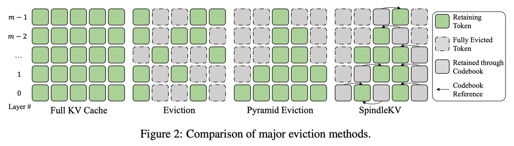

# SpindleKV: A Novel KV Cache Reduction Method Balancing Both Shallow and Deep Layers

> Zicong Tang, Shi Luohe, Zuchao Li, Baoyuan Qi, Guoming Liu, Lefei Zhang, Ping Wang

---

> **⚠️ 本 note 由 AI Agent 自动生成（Hermes Agent），生成时间：2025-07-17。内容基于论文全文提取与分析，仅供参考。**

---

## 一句话总结

SpindleKV 通过在深层使用注意力权重驱逐（token eviction）、在浅层使用基于码本（CodeBook）的相似性替换（token replacement）来平衡 KV cache 压缩，同时解决了 GQA 模型下的兼容性问题，在多个基准上实现了优于现有方法的压缩效果和模型性能。

---

## 摘要翻译

大语言模型（LLM）近年来取得了令人瞩目的成就。然而，KV cache 不断增长的内存消耗给推理系统带来了严峻挑战。驱逐（eviction）方法揭示了 KV cache 中固有的冗余性，证明了其压缩潜力，特别是在更深的层中。然而，浅层的 KV cache 压缩效果一直被认为不足。基于我们观察到的 KV cache 具有高度相似性这一现象，我们提出了 SpindleKV——一种新颖的 KV cache 压缩方法，平衡了浅层和深层的压缩效果。对于深层，我们采用基于注意力权重的驱逐方法；对于浅层，我们采用基于码本（CodeBook）的替换方法，通过相似性和合并策略学习得到。此外，SpindleKV 解决了其他基于注意力的驱逐方法面临的分组查询注意力（GQA）难题。在三个不同 LLM 上的两个通用基准测试实验表明，SpindleKV 相比基线方法获得了更好的 KV cache 压缩效果，同时保持了相似甚至更好的模型性能。

---

## 研究动机

### 核心问题

LLM 推理时的内存消耗主要由模型参数和 KV cache 两部分组成。随着上下文长度增加，KV cache 的内存占用比例显著增大，有时甚至超过模型参数本身，成为限制 LLM 部署和应用的瓶颈。

### 现有方法的局限

1. **Token 驱逐**（如 H2O、SnapKV、PyramidInfer、PyramidKV）：通过移除低贡献 token 来压缩 KV cache，但对浅层的压缩效果有限。
2. **Token 合并**（如 CaM、D2O、KVMerger）：基于相关性合并 token，但同样存在浅层压缩不足的问题。
3. **量化**（如 KIVI、ZipCache、AsymKV）：提供低精度近似但不移除信息，同样在浅层压缩中面临困难。
4. **GQA 兼容性问题**：基于注意力分数的驱逐方法难以与 GQA 集成，因为需要对同一组的所有 Q head 做统一决策，限制了细粒度控制。

### 关键观察

- **深层注意力稀疏性**：随着层数加深，低注意力得分的 token 数量增加，注意力集中在少数特定 token 上，为 token 驱逐提供了可行性。
- **浅层 KV 高相似性**：浅层 KV cache 中，token 的组成成分高度相似（高余弦相似性），即使许多 token 获得高注意力得分，它们的组成成分也非常相似。这提示可以用码本（CodeBook）方法处理这些冗余。

---

## 方法（技术细节）

SpindleKV 的核心思想是"纺锤形"（spindle）分层策略：在深层通过注意力权重驱逐减少冗余，在浅层通过码本替换减少冗余，同时兼容 GQA。

### 3.1 问题定义与符号

- 模型隐藏维度 $d$，每个注意力头维度 $d_h$，总头数 $h$
- GQA 模型中 KV 头数 $h_g$，每个 KV 头对应 $h_n = h/h_g$ 个 Q 头
- 输入序列长度 $l$，输入 $X \in \mathbb{R}^{l \times d}$
- 注意力分数 $A_i$ 通过标准的 softmax 计算
- 累积注意力得分 $ac_{i,a}$：表示在窗口 $l_w$ 内，第 $a$ 个 token 的 key 对所有 query 的平均注意力得分，作为 token 重要性的指标
- 对于 GQA 模型，需要跨 $h_n$ 个 Q 头取平均

### 3.2 深层：基于注意力权重的 Token 驱逐

遵循 PyramidKV 的线性插值策略进行逐层 KV cache 分配：

1. **总保留比率** $r$ 控制 KV cache 的整体压缩率
2. **观察窗口** $l_w$：窗口内的所有 token 全部保留
3. **上下文保留比率** $r_c$：对上下文部分的保留比率
4. **逐层分配**：最浅层（layer 0）保留最多 token，最深层（layer $m-1$）保留最少 token，形成金字塔形分配
5. **最小保留比率** $\beta = 0.05$，最大保留比率 $\alpha = 0.525$
6. **驱逐操作**：基于累积注意力得分 $ac_i$，使用 Top-K 选择保留的 token 索引

关键公式（逐层保留比率）：
$$r_c(\lambda) = r_c(0) + \frac{r_c(m-1) - r_c(0)}{m-1} \cdot \lambda$$

### 3.3 浅层：基于码本的 Token 替换

浅层 KV cache 的冗余主要源于 token 组成成分的高相似性（而非 token 间冗余），因此使用码本（CodeBook）方法进行压缩：

1. **相似度计算**：计算 KV cache 中 token 对之间的余弦相似度 $S_{\Gamma}$
2. **构建邻接矩阵**：$G_{\Gamma} = \text{where}(S_{\Gamma} > \theta_{\Gamma}, 1, 0)$，表示哪些 token 可以合并
3. **码本构建算法**（贪心策略）：
   - 计算每个节点的度 $s_{\Gamma,a} = \sum_{b=0}^{N-1} G_{\Gamma,a,b}$
   - 选择度最高的节点加入码本 $C_{\Gamma}$
   - 将与该节点相邻的节点全部标记为已合并
   - 重复直到 $G_{\Gamma} = 0$
4. **幅度记录**：记录每个 token 的幅度 $m_{\Gamma}$ 以保留原始信息
5. **重建**：通过 $\Gamma_r = C_{\Gamma}[r_{\Gamma}] \otimes m_{\Gamma}$ 高效重建 KV cache
6. **增量更新**：推理时生成的新 KV cache 条目，首先尝试合并到现有码本条目，否则重新构建码本

**关键超参数**：
- Key 阈值 $\theta_K = 0.98$
- Value 阈值 $\theta_V = 0.95$

### 3.4 GQA 兼容性

SpindleKV 解决了 GQA 难题：
- **方法**：直接将 GQA 的 KV 向量重复 $h_n$ 次，展开为完整的 MHA 格式后再进行驱逐决策
- **优势**：避免了跨 head 的平均操作（如 PyramidInfer 的做法），实现更细粒度的控制
- **额外开销**：展开操作增加了内存大小，但码本方法的压缩效率可以补偿这一开销

### 3.5 总压缩率计算

每层的压缩率由三部分组成：
- $r_{\lambda,1}$：驱逐方法的保留比率
- $r_{\lambda,2}$：替换方法的保留比率
- $r_{\lambda,3}$：数据类型转换比率（存储 int 类型索引和 float 类型幅度）

总压缩率：$r_{\lambda} = r_{\lambda,1} \times r_{\lambda,2} \times r_{\lambda,3}$

---

## 实验结果

### 实验设置

- **模型**：LLaMA2-7b-chat（MHA）、LLaMA3-8b-instruct（GQA）、Mistral-7b-instruct-v0.2（GQA）
- **数据集**：LongBench（16 个长上下文知识密集子集）、Needle-in-a-Haystack（长序列检索）
- **基线**：PyramidInfer、PyramidKV、H2O、SnapKV、StreamingLLM
- **评估指标**：保留比率（Reserve Ratio）、平均分（AVG Score）、检索准确率

### LongBench 结果

SpindleKV 在所有三个模型和多个保留比率下均优于基线方法：

| 保留比率 | PyramidInfer AVG | PyramidKV AVG | SpindleKV AVG |
|---------|-----------------|---------------|---------------|
| ~40% | 34.71 | 41.16 | **42.14** |
| ~30% | 33.43 | 40.60 | **41.93** |
| ~25% | 32.00 | 40.25 | **41.64** |
| ~20% | 29.59 | 39.73 | **41.34** |
| ~15% | 28.51 | 39.34 | **40.76** |

（以上为 Mistral-7b 的结果，详见 Table 1）

**关键发现**：
- SpindleKV 在相同压缩率下持续优于基线方法
- 在 GQA 模型上，SpindleKV 仅用一半的 KV cache 即可超越基线
- 在 LLaMA3-8b 和 LLaMA2-7b 上也展现了类似的优势

### Needle-in-a-Haystack 结果

在 15% KV cache 保留下：

| 方法 | LLaMA3-8b | Mistral-7b |
|------|----------|-----------|
| PyramidInfer | 0.615 | 0.621 |
| PyramidKV | 0.938 | 0.962 |
| **SpindleKV** | **0.979** | **0.975** |

SpindleKV 在长序列检索任务中显著优于基线方法。

### 消融实验

1. **GQA 集成**：直接展开 GQA 的方法（SpindleKV）显著优于使用平均注意力权重的方法（PyramidInfer 风格），验证了 SpindleKV 对 GQA 的更好兼容性
2. **仅码本（无驱逐）**：单独使用码本方法即可将 KV cache 压缩到 50% 而不影响准确率，30% 时仍保留大部分模型能力，证明了浅层组成冗余的显著存在
3. **幅度重建**：使用幅度重建可有效保留模型能力，仅增加少量内存开销

### 推理速度

| 模型 | FullKV (token/s) | SpindleKV 40% (token/s) |
|------|-----------------|------------------------|
| LLaMA3-8B-Instruct | 22.16 | 18.39 |
| Mistral-7B | 22.48 | 18.47 |

推理延迟增加有限，与理论分析一致。

---

## 优势

1. **双层平衡策略**：首次同时处理浅层（组成冗余）和深层（token 间冗余）的 KV cache 压缩，形成"纺锤形"分层压缩模式
2. **GQA 兼容性**：解决了其他基于注意力驱逐方法在 GQA 模型上的兼容性问题
3. **码本压缩新颖性**：利用浅层 KV 的高相似性，通过码本进行无损近似（记录幅度和索引），而非简单的驱逐
4. **高压缩率下性能保持**：在约 15-20% 保留率下仍保持较高模型性能，特别是在 Needle-in-a-Haystack 任务中表现优异
5. **适中的推理开销**：虽然增加了码本搜索和重建操作，但不引入显著的额外推理时间
6. **广泛的适用性**：在 MHA（LLaMA2-7b）和 GQA（LLaMA3-8b、Mistral-7b）模型上均有效

---

## 局限

1. **压缩率控制不够精确**：当前方法无法精确控制 KV cache 的最终大小，需要在实验中记录实际压缩率（与基线对比时偏差控制在 2% 以内）
2. **模型覆盖范围有限**：仅在 LLaMA2-7b-chat、LLaMA3-8b-instruct、Mistral-7b-instruct-v0.2 上验证，未涉及更大模型（如 LLaMA2-13b、LLaMA3-70b）或其他架构（如 Qwen2.5-7b）
3. **码本构建的时间复杂度**：虽然作者声称时间开销不显著，但码本构建的贪心搜索过程在高相似度场景下可能带来额外的计算负担
4. **RoPE 重建开销**：由于在 pre-RoPE 的 K 上操作，重建后需重新应用 RoPE，增加了额外的矩阵乘法操作
5. **缺少在线部署评估**：论文中的推理速度测试仅在单 GPU 上进行，未涉及分布式或生产环境下的评估

---

## 与 EfficientPaper 相关的研究方向

### 直接相关

- **KV Cache 压缩**：属于 KV cache 稀疏化（`kv_cache_sparse` 关键词）研究方向，与 H2O、SnapKV、PyramidKV、PyramidInfer 等方法直接对比
- **长上下文推理**：与 LLM 推理效率、上下文长度扩展直接相关
- **分层压缩策略**：启发了"纺锤形"分层压缩的新范式

### 间接相关

- **GQA 优化**：与 GQA 架构下的 KV cache 管理相关，对 GQA 模型的推理优化有参考价值
- **Token 合并与驱逐**：与 CaM、D2O、KVMerger 等 token 合并方法存在方法论差异（基于码本 vs 基于合并）
- **量化压缩**：与 KIVI、AsymKV 等量化方法互补，可考虑混合使用（驱逐 + 码本 + 量化）
- **注意力稀疏性**：与 StreamingLLM 等注意力 sink 方法共享对注意力模式的观察

### 未来研究方向

- **混合压缩策略**：将 SpindleKV 的驱逐+码本方法与量化技术结合，进一步提升压缩率
- **更精确的压缩控制**：改进逐层保留比率的计算方法，实现更精确的 KV cache 大小控制
- **大规模模型验证**：在 LLaMA3-70b、Qwen2.5-72b 等大规模模型上验证方法的有效性
- **动态阈值调整**：根据输入内容自适应调整相似度阈值 $\theta$，而非固定值
- **与其他压缩技术集成**：与 GQA、MQA 等架构优化、FlashAttention 等系统优化结合

---

> **本 note 由 Hermes Agent 自动生成，内容基于论文全文（arXiv:2507.06517v1）的分析与翻译，仅供学习参考。**
