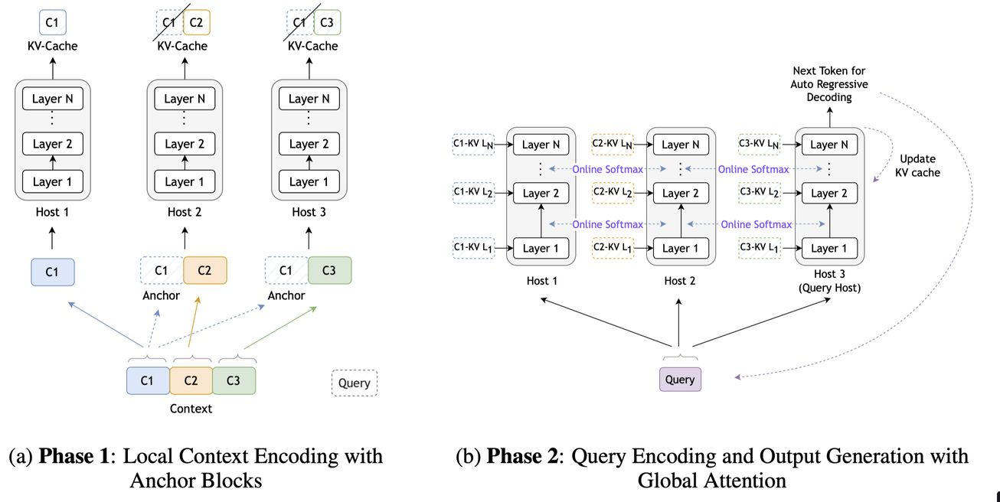

# Star Attention: Efficient LLM Inference over Long Sequences



> **一句话总结**：Star Attention 通过将长序列推理分为"本地块级上下文编码"和"全局查询编码与生成"两个阶段，在多主机分布式架构上实现了无需额外微调的高效长序列推理，推理速度最高提升 11 倍，同时保持 97-100% 的精度。

---

## 摘要翻译

基于 Transformer 的大语言模型（LLM）在长序列上的推理既昂贵又缓慢，原因在于自注意力机制的二次复杂度。本文提出 Star Attention，一种两阶段块稀疏近似方法，通过将注意力分片到多个主机并最小化通信开销来提高计算效率。在第一阶段，上下文通过跨主机的块级局部注意力并行处理。在第二阶段，查询和响应令牌通过序列全局注意力关注所有先前缓存的令牌。Star Attention 可与大多数使用全局注意力训练的 Transformer LLM 无缝集成，在保持 97-100% 精度的同时，将内存需求和推理时间最多降低 11 倍。

---

## 研究动机

1. **长序列推理的计算瓶颈**：随着 LLM 支持的上下文长度达到百万级（如 Gemini 1.5、Claude 3、Llama 3.1 等），自注意力机制的二次复杂度导致巨大的计算和内存开销。

2. **现有方法的局限**：
   - **分块处理方法**（如 Flash Attention）：主要优化训练效率，但自回归解码仍需关注每个先前令牌。
   - **分段编码方法**（如 Longformer、StreamingLLM）：通常需要微调或引入额外组件，限制了即插即用能力。
   - **分布式方法**（如 Ring Attention）：虽然可以扩展到多 GPU，但需要"环形"通信，通信开销大。

3. **关键观察**：在许多长上下文任务中，输入由长上下文后接短查询和短回答组成。回答查询所需的信息通常局限于上下文的局部区域，因此上下文令牌只需关注附近的令牌，而查询令牌需关注所有先前令牌。

4. **目标**：设计一种无需额外微调、可与现有 Transformer LLM 无缝集成、能显著减少推理时间和内存需求的方法。

---

## 方法（技术细节）

Star Attention 采用两阶段架构，如图 1 所示：

### 阶段 1：上下文编码（Context Encoding）

**核心思想**：将长上下文分块并分配到多个主机，通过块级局部注意力并行处理，消除主机间通信。

**详细流程**：
1. **分块**：将输入序列的上下文 `c` 分割为 `n` 个连续块：`c = [c1, c2, ..., cn]`，每个块包含 `b` 个令牌。
2. **锚块机制（Anchor Block）**：除第一个块外，每个块都以前缀形式附加第一个块 `c1`（称为"锚块"），形成增强块 `c'`：
   ```
   c' = [c1, (c1 c2), (c1 c3), ..., (c1 cn)]
   ```
   每个增强块包含 `2b` 个令牌（`b` 个锚块令牌 + `b` 个当前块令牌）。
3. **位置编码保留**：锚块 `c1` 的位置索引保持不变（`[0, 1, ..., b-1]`）。
4. **分布式处理**：增强块分配到不同主机，每个主机在其分配的块上计算注意力并生成 KV 向量。
5. **KV 缓存管理**：
   - 锚块 `c1` 的 KV 向量被丢弃
   - 当前块 `c_i` 的 KV 向量保留在缓存中

**关键设计——锚块的作用**：
- **问题**：如果不使用锚块，块级局部注意力会导致每个块的开头出现多个注意力尖峰（attention sinks），模型无法有效聚焦于上下文的相关部分。
- **解决方案**：通过前缀锚块，将注意力尖峰转移到锚块令牌上。丢弃锚块的 KV 向量后，中间注意力尖峰被移除，确保块级局部注意力的分布（图 3c）与全局注意力（图 3a）近似。
- **消融实验发现**：锚块的内容比位置更重要。使用原始第一个块内容效果最佳，随机令牌或打乱的令牌会导致显著性能下降。

**复杂度降低**：注意力复杂度从二次降为线性（相对于上下文长度），且无主机间通信。

### 阶段 2：查询编码与令牌生成（Query Encoding & Token Generation）

**核心思想**：通过分布式 softmax 算法实现全局注意力，无需在主机间传输 KV 缓存。

**详细流程**：
1. **查询广播**：查询令牌被广播到所有主机。
2. **本地注意力计算**：每个主机 `h` 使用其本地 KV 缓存计算局部注意力输出 `A_h`：
   ```
   A_h = softmax(QK_h^T / √d) * V_h
   ```
3. **局部 softmax 和**：每个主机同时存储局部 softmax 的指数和 `s_h`（softmax 分母）：
   ```
   s_h = Σ exp(QK_h^T / √d)
   ```
4. **全局聚合**：
   - 指定查询主机 `h_q` 收集所有主机的 `A_h` 和 `s_h`
   - 计算全局 softmax 分母：`s_global = Σ s_h`
   - 聚合全局注意力：`A_global = Σ (s_h / s_global) * A_h`
5. **数值稳定性**：使用 Flash Attention 和在线 softmax（log-sum-exp 技巧）确保数值稳定。
6. **输出生成**：查询主机生成下一个令牌，更新其 KV 缓存，重复此过程。

**通信开销**：每个令牌仅需传输一个标量（`s_h`）和一个向量（`A_h`），通信量极低。

---

## 实验结果

### 实验设置
- **模型**：Llama-3.1-8B（base 和 instruct）、Llama-3.1-70B-Instruct、gradientai-Llama-3-8B-Instruct-262K/1048K
- **硬件**：NVIDIA A100 GPU，bfloat16 精度
- **基线**：Ring Attention、StreamingLLM、MInference
- **基准测试**：RULER（合成）、BABILong（推理）、InfiniteBench（真实世界）

### 主要结果

**1. RULER 基准测试（表 1）**

| 模型 | 序列长度 | 精度变化 | 加速比 |
|------|----------|----------|--------|
| Llama-3.1-8B-Instruct | 16K | -0.94% | 1.1x |
| Llama-3.1-8B-Instruct | 32K | +1.17% | 1.2x |
| Llama-3.1-8B-Instruct | 64K | -1.42% | 1.8x |
| Llama-3.1-8B-Instruct | 128K | -1.90% | 2.7x |
| Llama-3.1-70B-Instruct | 16K | -2.71% | 1.7x |
| Llama-3.1-70B-Instruct | 32K | -2.55% | 2.0x |
| Llama-3.1-70B-Instruct | 64K | -1.44% | 4.7x |

**2. BABILong 基准测试（图 4）**
- Star Attention 在 16K-128K 序列长度上保持与全局注意力 97-100% 的精度
- 8B base 模型在长序列上表现稍差，可能与格式特定的生成要求有关

**3. 与其他稀疏注意力方法比较（表 2）**

| 方法 | 16K | 32K | 64K | 128K | 平均 |
|------|-----|-----|-----|------|------|
| Full Attn. | 92.22 | 87.53 | 84.79 | 76.31 | 85.21 |
| StreamingLLM | 74.76 | 48.56 | 26.20 | 30.77 | 45.07 |
| MInference | 93.27 | 86.54 | 84.86 | 58.17 | 80.71 |
| **Star Attention** | **91.27** | **88.70** | **83.37** | **74.41** | **84.44** |

**4. InfiniteBench（表 3）**
- Star Attention 在 10 个多样化任务上取得最高平均精度（46.51% vs Full 48.06%）
- 在检索类任务（PassKey、NumRetr、KVRetr）上表现尤为突出

**5. 长序列性能（表 5）**
- 在 Llama3-8B-Instruct-1048K 上，序列长度从 128K 增加到 1M：
  - 128K: 2.7x 加速，+0.96% 精度
  - 256K: 10.8x 加速，-0.77% 精度
  - 512K: 16.2x 加速，-6.73% 精度
  - 1M: 16.9x 加速，-5.32% 精度

**6. RULER 任务类别分析（图 7）**
- **单 NIAH / 多 NIAH / QA**：与全局注意力相当
- **多跳追踪**：性能下降，因需要跨块通信
- **聚合任务**：Star Attention 显著提升（+16.15%），块编码有助于局部聚合

### 精度-速度权衡
- 块大小 = 序列长度的 1/4 是最佳权衡点
- 块大小越大，精度越高
- 锚块大小应与上下文块大小相同

---

## 优势

1. **无需微调**：可与大多数使用全局注意力训练的 Transformer LLM 无缝集成，即插即用。
2. **显著加速**：推理速度最高提升 11 倍（长序列可达 16.9 倍）。
3. **高精度保持**：保持 97-100% 的基线精度。
4. **通信开销低**：阶段 1 无通信，阶段 2 仅需传输标量和向量。
5. **线性扩展**：上下文长度随主机数量线性扩展。
6. **可与 Flash Attention 结合**：进一步提升速度。
7. **灵活的精度-速度权衡**：可通过调整块大小灵活控制。

---

## 局限

1. **多跳追踪任务性能下降**：由于阶段 1 的块级局部注意力缺乏跨块通信，多跳追踪任务（需要跨多个块传播信息）性能下降。
2. **块大小敏感**：块大小影响精度-速度权衡，较小的块在长序列上精度下降明显。
3. **锚块大小要求**：锚块大小应与上下文块大小相同，较小的锚块导致显著性能下降，原因尚待研究。
4. **分布式依赖**：需要多主机/多 GPU 环境，单机场景下优势有限。
5. **仅优化推理**：本文主要关注推理阶段，训练阶段的优化未涉及。
6. **base 模型兼容性**：在 BABILong 上，base 模型（非指令微调）在长序列上表现不佳。

---

## 与 EfficientPaper 相关的研究方向

### 1. KV 缓存管理（KV Cache Management）
- Star Attention 通过分布式块级缓存管理显著降低了 KV 缓存的内存需求。
- 可与 KV 缓存压缩方法（如 KIVI、Scope）结合，进一步减少内存占用。
- 与 KVLink（RAG 领域）思想类似，但应用于分布式推理领域。

### 2. 分布式推理优化
- Star Attention 是 Ring Attention 的改进，消除了"环形"通信，降低了通信开销。
- 与 Tree Attention（拓扑感知解码）和 GPipe（流水线并行）等相关。
- 可扩展到更大规模的分布式推理系统。

### 3. 稀疏注意力机制
- Star Attention 的块稀疏模式与 Longformer 的滑动窗口注意力、StreamingLLM 的注意力汇聚相关。
- 与 MInference（动态稀疏模式）和 Quest（查询感知稀疏）互补。
- 可探索更复杂的稀疏模式（如学习到的稀疏性）。

### 4. 长序列处理
- Star Attention 可用于支持仓库级代码分析、多文档摘要、大语料检索等应用。
- 与 InfiniteBench、RULER、BABILong 等长序列基准测试相关。
- 可探索与 Infini-Attention、Titans 等长序列方法的结合。

### 5. 效率-精度权衡
- Star Attention 提供了灵活的精度-速度权衡（通过调整块大小）。
- 与 KV 缓存压缩、低秩近似、蒸馏等方法互补。
- 可探索自适应块大小调整策略。

### 6. 其他相关方向
- **混合注意力**：将 Star Attention 与局部/全局混合注意力结合。
- **量化**：将 Star Attention 与 KV 缓存量化（如 KIVI）结合。
- **动态调度**：根据任务需求动态调整块大小和主机数量。
- **多模态**：将 Star Attention 扩展到多模态长序列推理。

---

> **生成声明**：本 note 由 AI Agent 自动生成，基于 arXiv 论文 2411.17116 的全文内容。生成时间：2026-06-04。
