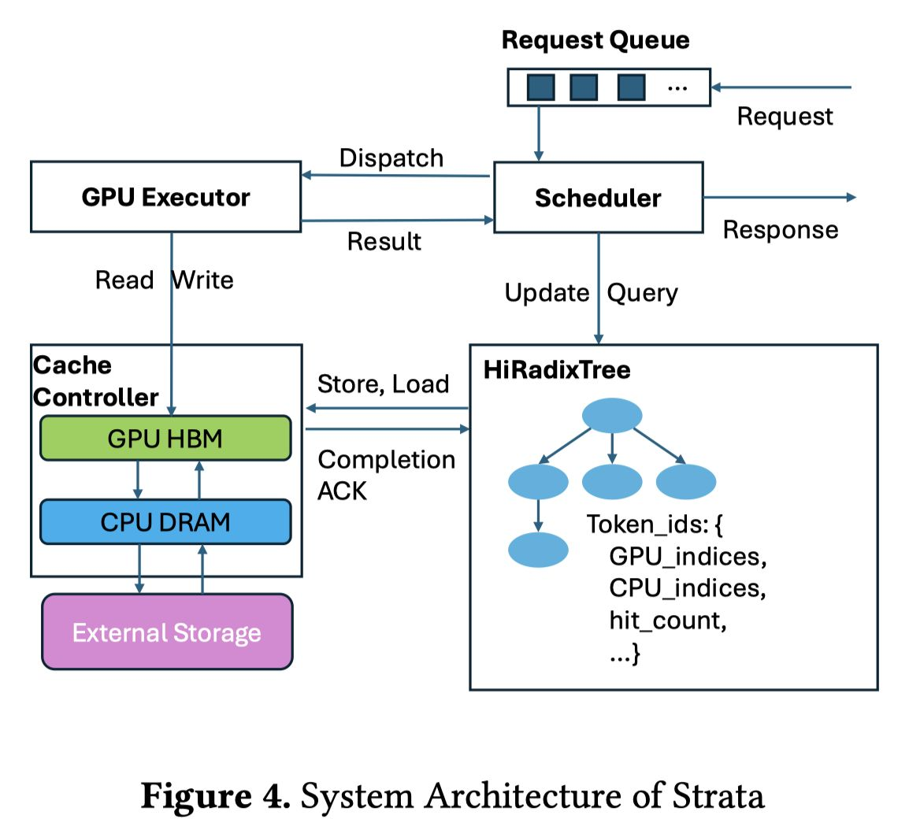

# Strata: Hierarchical Context Caching for Long Context Language Model Serving

> Zhiqiang Xie, Ziyi Xu, Mark Zhao, Yuwei An, Vikram Sharma Mailthody, Scott Mahlke, Michael Garland, Christos Kozyrakis

> Stanford University, NVIDIA, Shanghai Jiao Tong University, University of Colorado Boulder, Carnegie Mellon University, University of Michigan

> 注：以下论文笔记由 AI Agent 自动生成，可能存在理解偏差或遗漏，请以原论文为准。

## Abstract

随着 LLM 上下文窗口不断扩大，缓存 KV 状态对于避免冗余计算至关重要，但长上下文缓存的存储占用很快超出 GPU 显存容量，迫使生产系统采用跨内存层级的分层缓存。然而，将大量缓存上下文传回 GPU 会带来严重性能瓶颈：分页布局导致的碎片化 I/O 无法充分利用带宽，且现有调度器未考虑缓存加载延迟，导致系统受限于加载而非计算。本文提出 Strata，一个面向高效长上下文 LLM 推理的分层上下文缓存框架。Strata 引入 GPU 辅助 I/O 以对抗 KV 缓存碎片化，解耦 GPU 与 CPU 内存布局，并采用缓存感知的请求调度来平衡计算与 I/O 延迟、将不可避免的停顿与互补任务重叠。基于 SGLang 构建并已在生产环境部署，Strata 在长上下文基准测试中实现高达 5× 的 TTFT 降低（对比 vLLM + LMCache）和 3.75× 的加速（对比 NVIDIA TensorRT-LLM），同时不损害短上下文性能。

## 一句话总结

Strata 通过 GPU 辅助 I/O 解决分层 KV 缓存中碎片化传输的带宽利用率问题，结合缓存感知调度（平衡批处理、延迟命中规避、停顿填充）实现长上下文 LLM 推理的显著加速。

## 背景与问题

### 问题领域

LLM 推理系统中，KV 缓存的分层管理（GPU HBM → CPU DRAM → 外部存储）是支撑长上下文推理的关键基础设施。然而现有系统面临两个核心瓶颈：

### 瓶颈一：I/O 带宽利用率低

- **根因**：PagedAttention 等系统为提高内存利用率和缓存命中率使用小页面（如 1-32 tokens/页），但小页面导致碎片化数据传输。
- **量化影响**：在 PCIe 5.0 上仅能利用约 22% 的理论带宽；在 GH200 的 NVLink 上更低至 5%。
- **矛盾**：增大页面虽可提高传输效率，但会严重降低缓存命中率（页面大小从 1 增至 1024 时，命中率显著下降，TTFT 增加 2-2.9×）。
- **物理约束**：Little's Law 表明吞吐量 X = C·S/L，提高传输大小 S 是最实际的手段，但小页面限制了 S。

### 瓶颈二：调度器对缓存加载延迟无感知

- 现有系统假设层间计算足以隐藏 PCIe 传输延迟，但长上下文场景下该假设不再成立。
- 实测表明即使 I/O 达到 75% 理论带宽，仍有高达 24% 的预填充执行时间被 I/O 停顿占据。
- **延迟命中（Delay Hit）**：多个请求命中同一缓存缺失时产生冗余计算，异步调度器加剧了这一问题。

## 核心方法

### 系统架构

Strata 由两个核心组件构成：

1. **Strata Cache Controller（数据平面）**：管理跨内存层级的 KV 缓存数据，引入优化的 GPU-CPU 数据传输机制和灵活的内存布局。
2. **Strata Scheduler（控制平面）**：以缓存资源感知的方式智能调度请求，基于 HiRadixTree（SGLang RadixTree 的扩展）进行页面级元数据追踪。

### 技术一：GPU 辅助 I/O

- **核心思路**：用 CUDA kernel 替代 cudaMemcpyAsync 进行小粒度数据传输。每个线程负责加载一小块数据，GPU 提供数千并发操作（vs CPU 通常仅数十个）。
- **效率保障**：GPU 上 128 字节粒度即可高效传输，足以覆盖单页 KV 缓存（KB 级别），无需增大页面。
- **干扰控制**：仅使用 2 个 CUDA block（各 1024 线程），可实现约 50 GB/s 传输吞吐量，同时对 prefill 仅造成 <5% 性能损失、decode <10%。通过绕过 cache 的低级指令进一步减少缓存污染。
- **内存布局解耦**：GPU 保持计算友好的 layer-first 布局，CPU/外部存储采用传输友好的 page-first 布局。GPU 辅助 I/O 在传输时进行近乎零开销的布局转换（仅一次额外算术运算），实现两全其美。

### 技术二：缓存感知调度

调度器通过三个策略层层递进：

1. **延迟命中规避（Deferral on Delay Hit）**：
   - 在 HiRadixTree 中引入 transient 节点（标记 in-queue / in-flight）
   - 当请求匹配到 transient 节点（表示缓存正在计算中），将其推迟到下一轮调度，避免冗余计算
   - 可配置阈值（默认 100 tokens）控制推迟条件

2. **平衡批处理（Balanced Batch Formation）**：
   - 遵循 FIFO 但引入 loading_bound 检测（加载/计算比，默认阈值 100）
   - 当添加某请求会导致 batch 变为 loading-bound 时，将其放入低优先级列表
   - 优先添加 bundle hit 请求（共享同一上下文的请求），既平衡加载又减少 GPU 显存压力

3. **停顿填充（Bubble Filling / Stall Hiding）**：
   - 当 batch 仍为 loading-bound 时，插入解码批次以填充 I/O 停顿
   - 解码批次主要饱和 HBM 带宽，而加载任务饱和 PCIe 带宽，两者可重叠且资源争用最小

### 技术三：外部存储预取

- Cache Controller 在检测到存储层缓存命中时，利用请求排队延迟进行机会性预取
- 调度器分发请求时终止未完成的预取，使用已有的缓存数据（best-effort 策略）

## 技术细节

### GPU 辅助 I/O 微基准

在 H200 GPU 上，2 个 CUDA block + 1024 线程/block 配置下：
- 传输吞吐量：~50 GB/s
- Prefill 性能干扰：<5%
- Decode 性能干扰：<10%

### GH200 平台适配

- GH200 的 NVLink 提供 6× PCIe 5.0 带宽，但标准 cudaMemcpyAsync 仅利用 ~28% (10.8→19.4 GB/s)
- Strata-IO 将利用率提升至 150.5 GB/s
- 完整 Strata 在 GH200 上接近 Oracle（无限带宽）性能

### 页面大小解耦

- SGLang-HiCache 最优页面大小为 512，但仅达到 Strata-IO 性能的 93%（因命中率低 2.4%）
- Strata 在所有页面大小下均保持高性能，消除用户调参负担

## 实验设置

### 平台

| 平台 | GPU | CPU | 内存 | 互连 |
|------|-----|-----|------|------|
| H200 | 8× H200 (NVLink) | Intel Sapphire Rapids | 1.6 TB DRAM | PCIe 5.0 x16 (64 GB/s) |
| GH200 | 1× H100 | NVIDIA Grace 64-core ARM | 464 GB LPDDR5X | NVLink (384 GB/s) |

### 模型

- Llama-3.1-8B-Instruct（128K 上下文，单 GPU）
- Qwen2.5-14B-Instruct-1M（1M 上下文，单 GPU）
- Llama-3.1-70B-Instruct（128K 上下文，4 GPU TP）

### 数据集

| 数据集 | 平均输入 tokens | 平均输出 tokens | 上下文数 | 查询数 | 场景 |
|--------|----------------|----------------|---------|--------|------|
| LooGLE | 21,613 | 15.6 | 105 | 2,410 | RAG 长文档 QA |
| NarrativeQA | 54,797 | 13.0 | 50 | 1,461 | 长文本阅读理解 |
| ReviewMT | 17,708 | 208.3 | 100 | 1,092 | 多智能体长对话 |
| ShareGPT | 680.9 | 260.9 | - | 200,869 | 短上下文对话 |

### 基线

- vLLM v0.8.5 + LMCache v0.2.1（chunk size 256, page size 32）
- TensorRT-LLM v0.17.0 + HiCache（page size 32）
- SGLang v0.4.5（page size 1）
- SGLang-HiCache（page size 32，layer-wise overlapping，cudaMemcpyAsync）

## 主要结果

### 长上下文性能（LooGLE, H200）

| 对比基线 | Llama-8B 加速比 | Qwen-14B 加速比 | Llama-70B 加速比 |
|---------|----------------|----------------|----------------|
| SGLang-HiCache | 3.2× | 3.9× | 5× |
| vLLM-LMCache | 2.6× | 2.1× | 5× |
| TensorRT-HiCache | 1.9× | 1.9× | 3.75× |

### 温缓存稳态性能（NarrativeQA）

对比 vLLM-LMCache：Llama-8B 2.3×, Qwen-14B 2.6×, Llama-70B 2.5×。

### 短上下文性能（ShareGPT）

Strata 与其他系统在短上下文场景下性能相当，不引入退化。

### 消融分析

- Strata-Schedule-Only：峰值吞吐量提升 1.8×（vs SGLang-HiCache）
- Strata-IO：峰值吞吐量提升 2.3×
- 低请求率时调度优化收益更大，高请求率时 I/O 优化更关键

### 缓存距离适应性

- 最小缓存距离：延迟命中规避贡献 42% 峰值吞吐量提升
- 最大缓存距离：I/O 效率机制贡献 95% 提升

## 优点与局限

### 优点

1. **系统性解决方案**：同时从 I/O 机制和调度策略两个维度解决分层缓存瓶颈，非单一优化。
2. **生产级实现**：基于 SGLang 构建，已在头部 AI 公司生产环境部署。
3. **硬件适应性强**：GPU 辅助 I/O 在 PCIe 和 NVLink 平台上均有效，且兼容 AMD ROCm 后端。
4. **页面大小解耦**：消除了页面大小选择的工程负担，用户无需在命中率和 I/O 效率之间权衡。
5. **不损害短上下文**：对非长上下文场景保持性能中性。

### 局限

1. **GPU 资源占用**：虽然控制在 <5% 干扰，但仍消耗了 SM 资源，在极端负载下可能有累积影响。
2. **调度复杂度**：三阶段调度（延迟规避→平衡批处理→停顿填充）增加了系统复杂度和调试难度。
3. **单实例设计**：聚焦于单计算实例内的内存管理和调度，不涉及跨节点分布式缓存池。
4. **评估范围**：磁盘存储层评估有限（基线系统支持不足），主要关注 CPU DRAM 层。
5. **停顿填充灵活性**：目前主要插入解码批次，在 P-D 分离架构下可插入预填充批次，但未充分探索。

## 与 EfficientPaper 主题的关系

本文属于 **KV Cache 管理**（kv_cache_management）和 **推理部署**（deployment）的核心交叉领域。具体关联：

1. **KV 缓存分层管理**：解决 KV 缓存在 GPU/CPU/磁盘多层存储间高效传输的关键问题。
2. **推理系统优化**：从系统工程角度优化 LLM 推理的 TTFT 和吞吐量。
3. **与已有工作的关系**：
   - 扩展了 SGLang 的 RadixTree 为 HiRadixTree
   - 改进了 CachedAttention 的层间重叠策略
   - 与 LMCache 互补（后者关注缓存压缩和传输，Strata 关注调度和 I/O 机制）

## 可复现/实现要点

1. **代码基础**：构建在 SGLang v0.4.5 之上（https://github.com/sgl-project/sglang）
2. **GPU 辅助 I/O 核心**：
   - 2 个 CUDA block × 1024 线程/block 用于 CPU→GPU 加载
   - 1 个 block 用于 GPU→CPU 备份
   - 使用绕过 L1 cache 的加载指令减少污染
3. **调度器参数**：
   - Loading bound 阈值：100（加载/计算比）
   - 延迟命中推迟阈值：100 tokens
4. **内存布局**：GPU 保持 layer-first，CPU/存储使用 page-first，传输时在线转换
5. **GPU 显存分配**：遵循各引擎默认策略，ShareGPT 限制约 500K tokens
6. **CPU 缓存配置**：H200 分配 1 TB pinned DRAM，GH200 分配 400 GB

## 个人备注

### 开放问题

1. GPU 辅助 I/O 的 SM 资源占用在更细粒度（如 H100 MIG 分区）下表现如何？
2. 与分布式 KV 缓存池（如 Mooncake、MemServe）结合时，Strata 的调度策略是否需要扩展？
3. 在 P-D 分离架构中，bubble filling 插入预填充批次的具体实现和收益？
4. 对于超长上下文（>1M tokens），多层缓存（GPU→CPU→SSD→网络）下各层的调度策略如何协调？

### 延伸阅读

- CachedAttention (USENIX ATC'24)：层间重叠的先驱工作
- Pensieve (EuroSys'25)：有状态 LLM 推理服务
- Mooncake (FAST'25)：大规模 KV 缓存解聚
- MemServe：弹性内存池的全局调度
