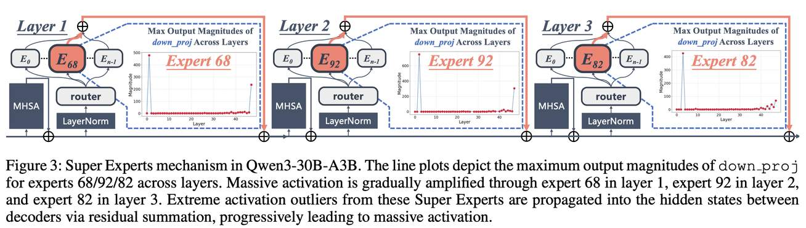

# Unveiling Super Experts in Mixture-of-Experts Large Language Models

> Zunhai Su, Qingyuan Li, Hao Zhang, YuLei Qian, Yuchen Xie, Kehong Yuan

## 一句话总结

本文首次发现并系统研究了 MoE LLM 中的 **Super Experts (SE)**——一小群在 down_proj 输出中产生极端激活离群值的专家，它们是 massive activations 的直接来源，且在压缩时会严重破坏 attention sink 机制，导致模型性能（尤其数学推理能力）灾难性下降。

---

## 摘要翻译

稀疏激活的混合专家（MoE）模型在增强大语言模型（LLM）的学习能力方面展现出巨大潜力。利用专家之间内在的重要性差异，近期研究探索了专家级别的压缩技术以提高 MoE LLM 的效率。然而，现有方法往往依赖经验性标准来识别关键专家，缺乏对专家异质重要性的深入探索和理解。本研究首次发现并调查了一组在模型前向推理机制中起关键作用的独特专家子集。这些专家在开源 MoE LLM 中普遍存在，尽管数量有限，但剪枝它们会导致模型性能显著下降（例如，剪枝三个专家就使 Qwen3-30B-A3B 产生重复且无意义的输出）。我们将这些专家称为 Super Experts (SE)。我们的全面分析提供了关于 SE 的逐步深入的见解：(i) SE 的特征是 down_proj 输出中罕见但极端的激活离群值，导致解码器层间隐藏状态产生巨大激活，且 SE 的分布具有模型特异性，不受后训练过程影响；(ii) 通过剪枝 SE，我们评估了它们在多种任务中的重要性，揭示了它们对模型整体性能的显著影响，尤其是在数学推理方面；(iii) 进一步加深了对 SE 压缩影响的理解，发现 MoE LLM 依赖 SE 来诱导 attention sinks，而 SE 剪枝会显著破坏这些 attention sinks。

---

## 研究动机

MoE LLM（如 DeepSeek、Qwen、Mixtral 等）虽然在能力上表现优异，但其巨大的参数量和计算成本给部署带来挑战。现有的专家级压缩方法（如基于路由频率的专家剪枝、合并、跳过等）通常依赖经验性标准来判断专家重要性，缺乏对专家异质重要性的机制性理解。

一个关键的未解决问题是：**在 MoE LLM 的前向推理中，是否存在一个独特的小规模专家子集，对模型机制起着关键作用？**

现有研究已发现 LLM 中存在 massive activations（隐藏状态中的极端激活离群值），但尚未充分探索 MoE LLM 中 massive activations 的形成机制。本文正是从这一角度切入，试图回答 MoE LLM 中是否存在"关键少数"专家。

---

## 方法（技术细节）

### 1. Super Experts 的发现与定义

**核心发现**：在多个开源 MoE LLM（Qwen3、DeepSeek、Mixtral 等）中，一小部分专家在 `down_proj` 层的输出中会产生**罕见但极端的激活离群值**。这些离群值通过残差连接传递到解码器层间的隐藏状态中，形成 massive activations（值可达其他激活值的 100,000 倍）。

**SE 的识别方法**：作者提出一个量化定义——计算所有层中所有专家 `down_proj` 输出的最大激活幅度：
- 设 `a_{l,e}` 为第 l 层专家 e 的 `down_proj` 最大输出幅度
- 设 `A = {a_{l,e}}` 为所有此类值的集合
- 专家 e 在第 l 层被分类为 SE，当且仅当：
  - `a_{l,e} > P99.5`（即超过第 99.5 百分位数）
  - `a_{l,e} > (1/10) * a_max`（即超过最大值的 1/10）
  - `l ∈ L`（即位于产生 massive activations 的层集合中）

**SE 分布特征**：
- SE 占所有专家的比例极低（<0.5%）
- SE 的分布在模型特异性且不受后训练过程影响（如 Qwen3-30B-A3B-Base 和 Qwen3-30B-A3B 的 SE 完全相同）
- SE 分布在不同输入数据域（C4、WikiText-2、C-Eval、GSM8K、HumanEval）中保持高度稳定
- SE 通常出现在浅层（前几层解码器），一旦产生就会在后续层中持续存在

**具体模型中的 SE 分布**：
| 模型 | 总专家数 | SE 数量 | SE 比例 |
|------|---------|---------|---------|
| Qwen3-30B-A3B | 6144 | 3 | 0.05% |
| DeepSeek-R1 | 15677 | 10 | 0.06% |
| DeepSeek-V2-Lite-Chat | 1782 | 2 | 0.22% |
| Mixtral-8x7B-Instruct-v0.1 | 256 | 1 | 0.39% |

### 2. SE 压缩影响的机制：Attention Sink

**核心机制**：SE 通过产生 massive activations 间接诱导了 attention sinks（注意力汇聚现象）。Attention sink 是指模型的注意力分数不成比例地集中在某些 token（通常是初始 token）上的现象，这对模型的推理能力至关重要。

**Attention Sink Decay Rate（D_sink）**：作者提出量化 SE 剪枝对 attention sink 的破坏程度：
- `D_sink = 1 - (1/H) * Σ_{h=1}^{H} (Σ_{i∈S} p'_i / Σ_{i∈S} p_i)`
- 其中 H 是注意力头数，p_i 是剪枝前的注意力分数，p'_i 是剪枝后的注意力分数，S 是 sink token 集合
- SE 剪枝后，D_sink 在所有层中持续保持在 ~90% 或以上，说明 attention sink 被严重破坏

### 3. SE 与 Outlier Experts 的区分

- **Outlier Experts** 出现在最后几层，也表现出极端激活离群值，但不参与 massive activations 的形成
- 剪枝 outlier experts 不会导致模型性能灾难性下降，也不会导致重复输出
- Outlier experts 的分布随输入数据域变化，而 SE 的分布保持稳定

---

## 实验结果

### 非推理模型评估（Table 3）

| 模型 | 设定 | PPL | 平均准确率 | GSM8K |
|------|------|-----|-----------|-------|
| Qwen3-30B-A3B | Baseline | 8.70 | 70.22% | 88.72% |
| | Prune SEs | 59.86 | 0.55% | 42.38% |
| | Random Pruning | 8.71 | 70.36% | 88.59% |
| DeepSeek-V2-Lite | Baseline | 6.31 | 60.27% | 79.79% |
| | Prune SEs | 10.75 | 43.90% | 9.78% |
| | Random Pruning | 6.31 | 60.30% | 80.37% |
| Mixtral-8x7B-v0.1 | Baseline | 3.84 | 67.84% | 85.02% |
| | Prune SEs | 6.23 | 49.38% | 24.34% |
| | Random Pruning | 3.86 | 67.82% | 85.23% |

关键发现：
- 剪枝仅 1-3 个 SE 即可导致平均准确率下降 21.68%~27.21%
- GSM8K（数学推理）下降最为显著，达到 52.71%~74.15%
- 随机剪枝几乎不影响模型性能

### 推理模型评估（Table 4 & 5）

| 模型 | 设定 | 平均 | GPQA | Math-500 | AIME'24 | AIME'25 | LiveCodeBench |
|------|------|------|------|----------|---------|---------|---------------|
| DeepSeek-R1 | Baseline | 75.64 | 71.50 | 97.60 | 79.33 | 66.33 | 63.44 |
| | Prune SEs | 1.81 | 5.05 | 4.00 | 0.00 | 0.00 | 0.00 |
| | Random Pruning | 75.53 | 72.63 | 98.00 | 77.67 | 67.00 | 62.37 |
| Qwen3-30B-A3B | Baseline | 69.37 | 61.62 | 88.00 | 80.00 | 73.33 | 43.90 |
| | Prune SEs | 4.02 | 18.69 | 1.40 | 0.00 | 0.00 | 0.00 |
| | Random Pruning | 69.33 | 61.62 | 89.00 | 80.00 | 73.33 | 42.70 |

关键发现：
- 推理模型的 SE 剪枝效果更为灾难性：Pass@1 几乎全部降至零
- DeepSeek-R1 平均准确率从 75.64% 降至 1.81%（下降 97.61%）
- Qwen3-30B-A3B 平均准确率从 69.37% 降至 4.02%（下降 93.62%）
- 剪枝 SE 后模型产生重复输出（如 "the way, it's, the way, it's..."），完全丧失推理能力
- 随机剪枝几乎无影响

### Attention Sink 破坏量化

- SE 剪枝后 attention sink decay rate 在所有层中持续 ~90% 或更高
- 可视化显示原始模型中首 token 作为 attention sink，SE 剪枝后完全消失
- 注意力的隐式偏差（implicit attention biases）会被永久破坏，对后续所有 token 产生连续且显著的影响

---

## 优势

1. **发现的创新性**：首次发现并定义了 MoE LLM 中的 Super Experts 概念，填补了对专家异质重要性机制理解的空白
2. **自动化工具**：开发了自动化的 SE 分析工具（代码开源），可用于新 MoE LLM 的快速 SE 分析
3. **跨模型验证**：在多个代表性 MoE LLM（Qwen3、DeepSeek、Mixtral）上验证了 SE 的普遍性
4. **机制性理解**：不仅发现了 SE 的存在，还揭示了其与 attention sinks 的关联机制，为 MoE LLM 压缩提供了重要指导
5. **实验证据充分**：在多种任务（非推理、推理）上进行了详尽的消融实验，结果一致且可复现
6. **SE 分布稳定性**：发现 SE 分布不受后训练过程和输入数据域影响，为实用的 SE 分析提供了基础

---

## 局限

1. **SE 识别方法的局限**：基于 `down_proj` 输出最大幅度的百分位数阈值，可能在不同模型上需要调整
2. **缺乏 SE 的根本成因解释**：论文虽然发现了 SE 的特征和影响，但未深入解释为什么这些特定专家会在训练过程中形成 SE
3. **SE 消除/修复策略缺失**：论文提出了 SE 的存在问题和危害，但未提供有效的 SE 修复或消除方法（仅指出"未来研究将聚焦于利用 SE 开发更精细的 MoE LLM 压缩方法"）
4. **Outlier Experts 未充分研究**：论文提到了最后几层的 outlier experts，但仅简要说明它们与 SE 不同，未深入分析
5. **实验规模限制**：主要分析了 Qwen3-30B-A3B、DeepSeek-V2-Lite、Mixtral-8x7B、DeepSeek-R1 等模型，对于更大规模的 MoE LLM（如 Qwen3-235B-A22B、DeepSeek-V3）未做验证
6. **缺乏与现有压缩方法的对比**：未将 SE 发现与现有专家级压缩方法（如 M-SMoE、NAEE、MC）进行对比，未说明现有方法是否可以规避 SE 的问题

---

## 与 EfficientPaper 相关的研究方向

1. **MoE 模型压缩与剪枝**：本文的核心发现对 MoE 模型的专家级剪枝策略有重要指导意义——在进行专家压缩时，必须保护 SE 不被剪枝。这与 EfficientPaper 中关注的 `sparse_pruning` 和 `structure_design` 关键词高度相关
2. **激活感知的模型压缩**：SE 的识别基于激活异常值，这与激活感知的量化和剪枝方法（如 AWQ、SmoothQuant 等）相呼应，未来可探索将激活异常值信息整合到量化策略中
3. **Attention Sink 优化**：SE 与 attention sinks 的关联为 attention 优化提供了新视角。在高效推理（如 KV Cache 压缩、流式推理）中，维护 attention sinks 的机制可以进一步研究
4. **MoE 模型的可解释性**：SE 的发现为 MoE LLM 的内部机制理解提供了新的研究方向，可探索 SE 在不同任务中的角色和机制
5. **专家级混合精度量化**：结合 SE 的重要性发现，可以为专家级混合精度量化提供更精确的指导，避免对 SE 施加过高的压缩
6. **模型鲁棒性与安全性**：SE 的脆弱性（少量剪枝即导致灾难性后果）为模型的鲁棒性和安全性评估提供了新指标

---

## 参考信息

- **arXiv**: [2507.23279v1](http://arxiv.org/abs/2507.23279v1)
- **代码**: [GitHub](https://github.com/ZunhaiSu/Super-Experts-Profilling)
- **机构**: 清华大学深圳国际研究生院 + 美团
- **关键词**: sparse_pruning, structure_design

---

> ⚠️ **生成声明**：本 note 由 AI Agent 自动生成（基于论文全文文本提取），内容仅供学术参考。如有错误或遗漏，请以原文为准。生成时间：2026年6月4日。
