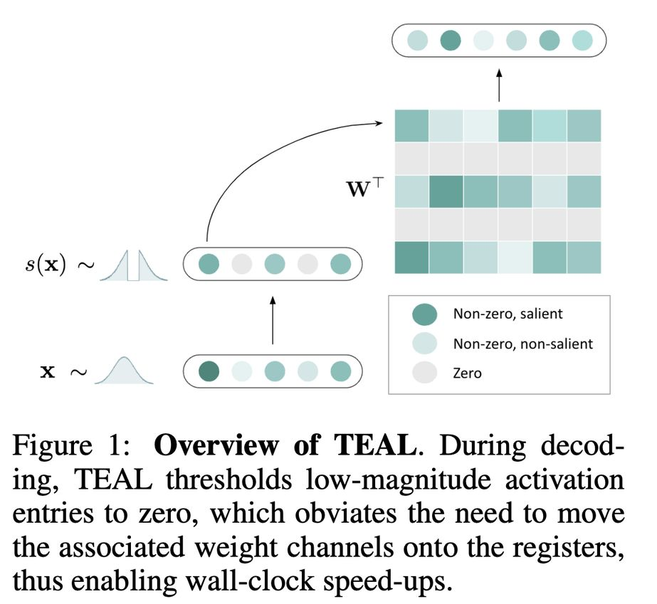

# Training-Free Activation Sparsity in Large Language Models

> **⚠️ 本文由 AI Agent 自动生成，仅供学术参考。生成时间：2025年6月。**

---

## 一句话总结

TEAL 是一种无需训练的激活稀疏化方法，通过对 LLM 隐藏状态进行基于幅度的剪枝，实现 40–50% 模型级稀疏度，同时在 Llama-2/3、Mistral（7B–70B）系列模型上几乎不损失性能，并在单批解码中获得高达 1.53× 和 1.8× 的墙钟加速。

---

## 摘要翻译

激活稀疏性可以通过减少前向传播中矩阵乘法所需的计算和内存搬运，为大语言模型（LLM）提供实际的推理加速。然而，现有方法面临限制其广泛采用的局限性：一些方法针对较旧的基于 ReLU 的稀疏性模型，而另一些则需要在多达数千亿个 token 上进行大量持续预训练。本文描述了 TEAL（Training-Free Activation Sparsity in LLMs），一种简单、无需训练的方法，通过对整个模型的隐藏状态应用基于幅度的激活稀疏性，实现 40–50% 的模型级稀疏度，且性能下降极小。TEAL 在 Llama-2、Llama-3 和 Mistral 系列模型（7B 到 70B）上均表现出色。我们改进了现有的稀疏内核，并在 40% 和 50% 模型级稀疏度下分别实现了高达 1.53× 和 1.8× 的墙钟解码加速。TEAL 与权重量化兼容，可进一步提高效率。

---

## 研究动机

### 1. LLM 推理的内存瓶颈
现代 LLM 在典型的小批量部署场景中，自回归推理是**内存受限**的——瓶颈在于将参数从片外内存搬运到片内内存的速度。核心策略是通过权重量化和稀疏化来克服这一"内存墙"。

### 2. 激活稀疏性的局限
- **旧方法依赖 ReLU 激活函数**：ReLU-based 模型（如 OPT）的中间状态天然具有约 95% 的稀疏度，但现代 LLM 已大量采用 SwiGLU 等非 ReLU 激活函数，不再具有自然稀疏性。
- **训练恢复方法成本高昂**：一些方法（如 ReLUfication）通过替换激活函数并持续预训练来恢复稀疏性，但需要训练多达数千亿 token，成本极高。
- **现有免训练方法不完整**：CATS 仅对 MLP 的 Wgate 输出进行稀疏化，对 Wq/k/v/o 等参数仍做密集计算，导致模型级稀疏度仅约 25%。

### 3. TEAL 的目标
提出一种**简单、无需训练**的方法，对整个模型的所有矩阵进行激活稀疏化，实现更高的模型级稀疏度和更好的性能-稀疏度权衡。

---

## 方法（技术细节）

### 4.1 动机研究：LLM 中激活的分布特性

对 Llama-3-8B 在 C4 数据上的激活分布进行初步研究，发现：

- **零均值单峰分布**：隐藏状态呈零均值的单峰分布。
- **两种明显形状**：
  - Attention 和 MLP **之前的**隐藏状态倾向于**高斯分布**（Gaussian-like）
  - Attention 和 MLP **内部的**中间状态倾向于**拉普拉斯分布**（Laplacian-like）
- 激活值集中在零附近，这启发了基于幅度的剪枝方法。

> 注：作者未尝试解释这些分布形状的原因。观察到 LLM 权重通常呈高斯分布，独立高斯向量与高斯矩阵相乘得到多元广义拉普拉斯分布；Layer Normalization 可能使分布零均值。

### 4.2 TEAL 核心方法：基于幅度的激活稀疏化

**定义**：对于随机向量 $\tilde{x} = (\tilde{x}_1, ..., \tilde{x}_n)$，稀疏度 $p \in [0, 1]$，定义阈值 $t_p$ 满足：

$$\frac{1}{n}\sum_{i=1}^{n} P(|\tilde{x}_i| \leq t_p) = p$$

稀疏化函数 $s_{t_p}(x_i)$：
- 若 $|x_i| \leq t_p$，则置零
- 否则保留原值

**实际操作**：
- 通过离线使用通用文本的激活构建经验分布来估计 $t_p$
- 稀疏度 $p$ 完全由阈值 $t_{p_i}$ 表征，这对实现和内核设计都有利
- 对模型中 MLP 和 Attention 块的所有矩阵 $W$ 都应用此稀疏化

### 4.3 块级贪心优化（Block-wise Greedy Optimization）

**目标**：对每个 Transformer 块，最小化块级 $\ell_2$ 激活误差，同时满足块级稀疏度约束。

**算法流程**（Algorithm 1）：
1. 初始化所有层的稀疏度为零
2. 循环：
   - 对每个矩阵 $W_i$，尝试增加稀疏度 $\delta_i = \alpha \cdot (F/f_i)$（与矩阵大小成反比）
   - 计算该层单独增加稀疏度后的 $\ell_2$ 误差 $E_i$
   - 选择误差最低的层 $j$，增加其稀疏度
   - 记录块级稀疏度 $P$ 和各层稀疏度 $p$

**共享策略**：所有 Transformer 块共享块级稀疏度，但各块内的层级稀疏度可以不同。

**计算成本**：
- 时间复杂度：$O(\frac{M n^2}{\alpha})$ 次前向传播
- 实际使用：长度 2048 的样本，$M, n, \alpha = 10, 7, 0.05$
- 总前向传播次数：$16 \cdot 7^2 \cdot \frac{1}{0.05} = 9800$ 次
- 在 A100 上运行 Llama-3-8B 不到 1 GPU 小时
- 由于逐块进行且无需反向传播，设备内存消耗极小

### 4.4 硬件感知加速（Hardware-Aware Acceleration）

在 DejaVu 的 Triton 基础上开发了**专用稀疏 GEMV 内核**，输入 $x$、布尔稀疏掩码 $s$ 和矩阵 $W$，返回 $(x \odot s)W^\top$。

**墙钟加速的三种方式**：
1. $W$ 以**列优先格式**存储，确保最优内存合并
2. 根据 $s_i$ 的真值**选择性加载**列 $W_{:,i}$
3. 使用 **SplitK 工作分解**，通过原子加法组合部分结果

**对原始内核的改进**：
1. **融合掩码创建过程**：$s = x[|x| > t_p]$ 完全由 $x$ 和 $t_p$ 表征
2. **FP16 累积**：在外部 SplitK 维度使用 FP16（内部寄存器累积保持 FP32），避免 FP32 写入全局内存的大量流量
3. **缓存驱逐策略**：在 NVIDIA PTX 中指定，优先保留跨多个线程块重用的激活的 L2 缓存，降低块特定权重的缓存优先级，保证激活在 L2 缓存中持久化

---

## 实验结果

### 评估设置
- **模型**：Mistral-7B、Llama-2（7B/13B/70B）、Llama-3（8B/70B）
- **数据集**：WikiText 验证集（语言建模），EleutherAI LM Harness 的 6 个下游任务（5-shot MMLU、25-shot ARC Challenge、10-shot HellaSwag、5-shot GSM8K、zero-shot PiQA、zero-shot Winogrande）
- **基线**：CATS（25%稀疏度）、ReLUfication（~35%稀疏度）
- **内核基准**：集成到 GPT-Fast（PyTorch），启用 CUDA graphs 和 torch.compile
- **GPU**：A6000（300W）和 A100（500W）

### 准确性结果

#### 困惑度（Perplexity）结果（Table 1）

| 方法/模型 | Llama-3 8B | Llama-3 70B | Llama-2 7B | Llama-2 13B | Llama-2 70B | Mistral 7B |
|-----------|-----------|------------|-----------|------------|------------|-----------|
| 基线 (0%) | 5.87 | 2.93 | 5.07 | 4.50 | 3.12 | 4.92 |
| CATS 25% | 6.78 | 3.64 | 5.52 | 4.99 | 3.42 | 5.87 |
| TEAL 25% | 5.94 | 3.02 | 5.09 | 4.51 | 3.13 | 5.01 |
| TEAL 40% | 6.21 | 3.52 | 5.22 | 4.60 | 3.25 | 5.13 |
| TEAL 50% | 6.67 | 4.30 | 5.43 | 4.76 | 3.50 | 5.31 |
| TEAL 65% | 9.06 | 6.29 | 6.62 | 5.50 | 4.28 | 6.23 |

#### 下游任务平均分（Table 2）

| 方法/模型 | Llama-3 8B | Llama-3 70B | Llama-2 7B | Llama-2 13B | Llama-2 70B | Mistral 7B |
|-----------|-----------|------------|-----------|------------|------------|-----------|
| 基线 (0%) | 68.07 | 80.41 | 56.50 | 62.01 | 72.65 | 66.96 |
| CATS 25% | 64.15 | 79.25 | 54.60 | 60.48 | 71.93 | 64.25 |
| TEAL 25% | 67.73 | 80.22 | 56.42 | 62.21 | 72.67 | 66.63 |
| TEAL 40% | 66.21 | 79.29 | 55.45 | 61.27 | 72.57 | 65.46 |
| TEAL 50% | 63.42 | 78.26 | 54.26 | 60.41 | 72.02 | 64.16 |
| TEAL 65% | 52.59 | 73.07 | 48.16 | 55.71 | 69.30 | 58.93 |

**关键发现**：
- 25% 稀疏度：几乎零性能下降
- 40% 稀疏度：性能下降极小
- 50% 稀疏度：Llama-3 系列下降略多，Llama-2 和 Mistral 仍较稳健
- 65% 稀疏度：大多数模型显著退化，例外是 Llama-2-70B
- **70B 模型比小模型更具可稀疏性**
- ReLUfication 在免训练设置下完全退化

### 解码加速（Table 3）

**端到端单批解码速度**（tokens/second）：

**A6000**：
| 稀疏度 | Llama-3 8B | Llama-2 7B | Llama-2 13B |
|--------|-----------|-----------|------------|
| 基线 | 45.32 | 50.54 | 26.43 |
| 40% | 64.15 (1.42×) | 77.30 (1.53×) | 40.20 (1.52×) |
| 50% | 73.94 (1.63×) | 89.91 (1.78×) | 47.60 (1.80×) |

**A100**：
| 稀疏度 | Llama-3 8B | Llama-2 7B | Llama-2 13B |
|--------|-----------|-----------|------------|
| 基线 | 100.79 | 110.15 | 61.01 |
| 40% | 126.24 (1.25×) | 143.85 (1.31×) | 81.90 (1.34×) |
| 50% | 134.29 (1.33×) | 154.02 (1.40×) | 88.38 (1.45×) |

### 与量化兼容性

TEAL 与权重量化兼容，测试了：
- 8-bit 通道级 RTN
- 4-bit AWQ
- 2/3-bit QuIP#

在 Llama-2-7B 上，困惑度在各比特宽度下的锐利退化点相似，表明激活稀疏性和权重量化的误差**相对独立地叠加**。结合两者可解锁新的内存传输效率区间。

### 分析

#### Wup 的输入稀疏 vs 输出稀疏
- TEAL 使用**输入稀疏**（对 Wup 的输入 x 进行剪枝）
- CATS 使用**输出稀疏**（对 SiLU(xWgate) 的输出进行剪枝）
- 实验表明输入稀疏在所有稀疏度水平上均优于输出稀疏
- 原因：输出掩码 s 对 Wup 的输出显著性缺乏信息，因为 SiLU 不会精确阈值到零，导致 Wup 的较大值被不必要地剪枝

#### 块级贪心稀疏度的优势
- 块级贪心方法在所有稀疏度水平上均优于均匀配置
- 对 Llama-3-70B（50%模型级稀疏度）的观察：
  - **Attention**：Wq/Wk 在 Block 0 可稀疏性最高，之后急剧下降；Wo 的可稀疏性动态变化（50–60% → 80–90% → 50–60%），与 FinerCut 的注意力模块剪枝相关
  - **MLP**：Wdown > Wgate > Wup（可稀疏性递减）。Wdown 对应拉普拉斯分布（更集中于零）；Wgate 因 SiLU 降低负输出显著性而比 Wup 更可稀疏

#### Prefill 稀疏化
- 稀疏化后半部分预填充几乎等同于稀疏化 99% 预填充（所有 token 除初始 token 外）
- **初始 token 的退化更严重**，与注意力汇聚（attention sink）现象相关
- TEAL 主要是解码方案，预填充稀疏化需谨慎

#### 批量稀疏化
- 提出基于**批量维度平均幅度**的稀疏化方法
- 在低批量设置（batch size > 1）下仍有显著稀疏性
- 批量大小趋向无穷时，TEAL 可解释为基于激活幅度的结构化通道剪枝算法

---

## 优势

1. **完全无需训练**：无需持续预训练或微调，直接应用，开销极低（< 1 GPU 小时）
2. **模型级稀疏度高**：在所有矩阵上进行稀疏化，而非仅 MLP 的部分矩阵（如 CATS），实现更高的模型级稀疏度
3. **性能损失极小**：在 40% 稀疏度下性能下降极小，远优于 CATS 和 ReLUfication
4. **广泛的模型兼容性**：适用于 Llama-2/3、Mistral 等多种架构，7B 到 70B 规模
5. **与量化兼容**：激活稀疏性和权重量化误差可独立叠加，可组合使用
6. **硬件友好的稀疏模式**：使用通道级稀疏，配合优化的内核实现高效加速
7. **优化的内核设计**：融合掩码创建、FP16 累积、L2 缓存驱逐策略，超越 DejaVu
8. **块级贪心优化**：自适应分配各层稀疏度，优于均匀分配
9. **低计算成本**：离线阈值估计仅需 < 1 GPU 小时，无需反向传播

---

## 局限

1. **批量大小扩展性差**：在高批量设置下性能下降显著，这是大多数激活稀疏方法的通病
2. **Llama-3 在高稀疏度下退化较多**：Llama-3 系列（尤其是 8B）在 50% 稀疏度下比 Llama-2 和 Mistral 退化更多，与量化技术在更新模型上效果较差的观察一致
3. **65% 稀疏度下大多数模型显著退化**（Llama-2-70B 除外）
4. **Llama-3-8B 在 0% 稀疏度下比基线慢**：由于 torch.compile 增强了 torch.matmul 基线，说明内核仍有优化空间
5. **LM Head 未稀疏化**：Llama-3-8B 的 LM Head 较大但未被稀疏化，导致其加速低于 Llama-2-7B
6. **预填充稀疏化需谨慎**：初始 token 的稀疏化会导致显著退化（注意力汇聚现象）
7. **主要用于解码**：TEAL 是一个解码方案，对预填充场景需特别处理

---

## 与 EfficientPaper 相关的研究方向

### 直接相关
- **激活稀疏化**：TEAL 是激活稀疏化领域的代表性工作，提供了无训练的高效方案
- **稀疏内核优化**：基于 Triton 的稀疏 GEMV 内核设计，对高效推理有重要参考价值
- **模型压缩与加速**：与权重量化（AWQ、QuIP#）等技术互补，可组合实现更高的推理效率

### 相关方法对比
| 方法 | 类型 | 是否需要训练 | 稀疏范围 | 模型级稀疏度 |
|------|------|------------|---------|------------|
| TEAL | 激活稀疏 | 否 | 全模型 | 40–50% |
| CATS | 激活稀疏 | 否 | MLP 部分矩阵 | ~25% |
| ReLUfication | 激活稀疏 | 是（持续预训练） | MLP | ~35% |
| DejaVu | 激活稀疏 | 是（学习辅助模型） | MLP（ReLU） | 取决于模型 |
| SparseGPT | 权重稀疏 | 否 | 全模型 | 结构化 |

### 潜在研究方向
1. **稀疏-量化联合优化**：TEAL 已验证兼容性，但缺乏专用的稀疏+量化内核
2. **高批量激活稀疏**：解决批量大小扩展性问题
3. **预填充与解码统一**：将 TEAL 扩展到完整的前向传播
4. **多模态模型**：将激活稀疏化应用于视觉-语言模型等多模态架构
5. **训练时稀疏感知**：结合 TEAL 的发现设计稀疏感知的预训练方法
6. **边缘部署**：TEAL 的低开销特性使其成为边缘设备上 LLM 推理的理想方案
7. **注意力模块稀疏化**：TEAL 对 Wq/Wk/Wo 的稀疏化分析可启发更细粒度的注意力优化

---

> **免责声明**：本 note 由 AI Agent 基于论文原文自动生成，可能存在理解偏差或翻译不准确之处。请以原论文为准。
