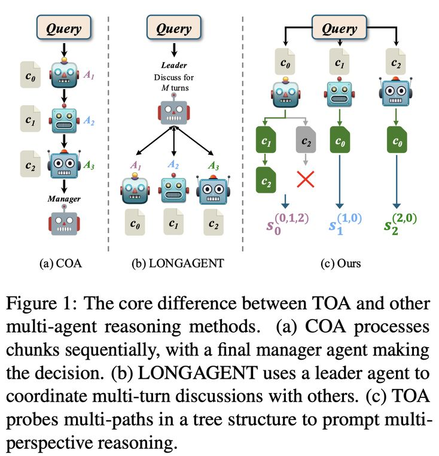

# Tree of Agents: Improving Long-Context Capabilities of Large Language Models through Multi-Perspective Reasoning

> Song Yu, Xiaofei Xu, Ke Deng, Li Li, Lin Tian

---

> ⚠️ **声明**：本 note 由 AI Agent（Hermes Agent）自动生成，基于论文全文阅读与分析。生成时间：2025年6月。

---

## 一句话总结

TOA（Tree of Agents）是一种基于树状结构的多智能体推理框架，通过让多个 agent 以不同顺序探读文本片段实现多视角理解，有效缓解长上下文任务中的"中间丢失"问题和位置偏差，以 LLaMA3.1-8B 等轻量模型达到与 Gemini 1.5-pro 等大型商用模型可比的性能。

---

## 摘要翻译

大语言模型（LLM）在处理长上下文任务时面临持续性挑战，最突出的是"中间丢失"（lost in the middle）问题，即长输入中间部分的信息往往被忽视。一些减少输入的方法有丢弃关键信息的风险，而扩展上下文窗口的方法往往导致注意力分散。为解决这些局限，我们提出了 **Tree of Agents（TOA）**，一种多智能体推理框架，将输入分割为多个块，由独立的 agent 处理。每个 agent 生成其局部认知，然后 agent 之间沿树状结构路径动态交换信息进行协作推理。TOA 使 agent 能够探测不同的推理顺序以实现多视角理解，有效缓解位置偏差并减少幻觉。为提高处理效率，我们引入了前缀哈希缓存和自适应剪枝策略，以相当的 API 开销实现显著的性能提升。实验表明，TOA 在紧凑的 LLaMA3.1-8B 驱动下，在多种长上下文任务上显著优于多个基线，并展示了与最新且更大的商用模型（如 Gemini 1.5-pro）相当的性能。

---

## 研究动机

长上下文任务（如小说问答、法律合同分析、金融报告理解）对 LLM 构成三大挑战：

1. **位置偏差**：模型对长输入中间部分的信息利用率不足，即"中间丢失"问题（Liu et al., 2024b）。
2. **信息稀释**：输入越长，冗余信息越多，可能稀释模型注意力，降低输出质量。
3. **计算成本**：更长的序列导致训练和推理的计算需求急剧增长。

现有方法分为三类，但均有不足：
- **模型优化**（如改进注意力机制、位置编码）：需要大量训练资源，难以直接应用。
- **输入压缩**（如 RAG、提示压缩）：有丢失关键信息的风险，且对需要全局理解的任务表现有限。
- **多智能体推理**（如 COA、LONGAGENT）：COA 的单向链式处理容易信息衰减，LONGAGENT 依赖领导者的能力，两者均不支持多视角理解。

TOA 的核心动机是：通过树状结构的多路径探索，实现多视角理解，从根本上解决位置偏差问题，同时通过缓存和剪枝策略控制计算开销。

---

## 方法（技术细节）

TOA 采用**三阶段**推理流程：

### 阶段 1：块感知（Chunk Perception）

- 将长文档 $D = \{t_1, t_2, ..., t_M\}$ 分割为 $N$ 个文本块 $\{c_0, c_1, ..., c_{N-1}\}$，每个块大小 $M/N$ 小于 agent 的最大上下文窗口。
- 每个块分配给一个独立的 agent $A_i$。
- Agent $A_i$ 根据查询 $q$、块 $c_i$ 和提示 $p$ 生成初始认知状态：
  $$\langle e_i, a_i \rangle = A_i(q, c_i, p)$$
  其中 $e_i$ 为支持回答的证据，$a_i$ 为答案。
- 初始认知状态存储在缓存 $M_i$ 中：$M_i(\langle c_i \rangle) \leftarrow s_i^{(i)}$。

### 阶段 2：多视角理解（Multi-Perspective Understanding）

- **认知交换**：每个 agent 读取其他 agent 的初始认知状态，决定哪些额外的块可以帮助回答查询，形成块索引集 $G_i$。
- **树状结构多路径探读**：对于 agent $A_i$，其额外需要阅读的块集合 $G_i = \{j_0, j_1, ..., j_{k-1}\}$，所有可能的排列 $Perm_i$ 构成树状路径。
  - 例如 $G_i = \{0, 1, 2\}$，则 $Perm_i = \{(0,1,2), (0,2,1), (1,0,2), (1,2,0), (2,1,0), (2,0,1)\}$。
  - 每条路径代表一种独特的阅读顺序，旨在探索不同的认知顺序，避免固定阅读顺序导致的偏差。
  - Agent 依次沿路径读取块，认知状态逐步更新：
    $$s_i^{(i,j_0,...,j_{k-1})} \leftarrow A_i(s_i^{(i,j_0,...,j_{k-2})}, c_{j_{k-1}})$$

- **两个优化策略**：

  **1) 前缀哈希缓存（Prefix-Hash Caching）**：
  - 不同路径可能共享相同的前缀序列（如路径 $(0,1,2,4)$ 和 $(0,1,2,3)$ 共享前缀 $(0,1,2)$）。
  - 已生成的中间状态直接从缓存 $M_i$ 中检索，避免重复计算。
  - 这种前缀共享机制将重复计算转化为查找操作。
  - 实验显示：单独使用缓存可减少 13.0% 的 API 调用（NovelQA 数据集）。

  **2) 自适应剪枝（Adaptive Pruning）**：
  - 如果当前读取的块被判断为无用，则立即终止该路径的剩余部分。
  - 剪枝依据：如果当前路径的块顺序使信息不合理或无法帮助回答问题，则标记为无用并剪枝。
  - 保留所有在剪枝前生成的认知状态缓存。
  - 实验显示：缓存 + 剪枝可减少 50.8% 的 API 调用，token 消耗减少 59%（DeepSeek-V3 + NovelQA）。

### 阶段 3：共识形成（Consensus Formation）

- **Agent 内聚合**：对于有多个路径的 agent，选择最长的块序列对应的认知状态（认为更长的序列意味着更广泛的上下文整合，减少局部偏差）。
  $$\sigma_i^* = \arg\max_{\sigma \in M_i} |\sigma|$$
  $$a_i^{final} = A_i(q, M_i(\sigma_i^*), p)$$
- **跨 Agent 多数投票**：
  $$a^{final} = \text{MajorityVote}(\{a_i^{final}\}_{i=0}^{N-1})$$
- 投票平局时，引入额外的独立 agent 进行最终决策。

---

## 实验结果

### 实验设置

- **数据集**：
  - **DetectiveQA**：侦探小说问答数据集，平均问题长度 100K tokens。
  - **NovelQA**：小说问答数据集，平均输入长度 200K+ tokens，包含 89 部小说和 2305 个问答对。
  - **Needle-in-a-Haystack**：长文档信息检索基准，支持单针和多针设置。
- **基础模型**：LLaMA3.1-8B-instruct（本地部署）、DeepSeek-V3-Chat（API 调用）。
- **评估指标**：准确率（Accuracy）、无回答率（None-rate）。
- **实验环境**：2× NVIDIA RTX 3090 GPU，Intel Core i9-14900K CPU，128 GB RAM。
- **采样**：每个数据集随机抽取 100 个样本，每个实验运行 3 次。

### 主要结果

#### 长上下文推理任务（表 2）

| 模型 | 任务 | DetectorQA Acc | DetectorQA None | NovelQA Acc | NovelQA None |
|------|------|----------------|-----------------|-------------|--------------|
| **LLaMA3.1-8B** | | | | | |
| TOA | | **0.543** | **0.017** | **0.450** | **0.043** |
| COA | | 0.253 | 0.370 | 0.263 | 0.160 |
| LONGAGENT | | 0.487 | 0.157 | 0.373 | 0.243 |
| LongLLMLingua | | 0.307 | 0.260 | 0.170 | 0.500 |
| LongRAG | | 0.370 | 0.217 | 0.440 | 0.153 |
| Sequential | | 0.400 | 0.143 | 0.257 | 0.143 |
| Vote | | 0.330 | 0.023 | 0.343 | 0.003 |
| **DeepSeek-V3** | | | | | |
| TOA | | **0.573** | 0.140 | **0.473** | 0.120 |
| **商用模型** | | | | | |
| GPT-4o | | 0.560 | 0.140 | 0.487 | 0.270 |
| Gemini 1.5-pro | | 0.557 | **0.090** | 0.457 | **0.070** |

- TOA 在所有任务和模型上均取得最高准确率。
- 与 Gemini 1.5-pro（2M 上下文窗口）和 GPT-4o 相当，但使用更小的基础模型（LLaMA3.1-8B）。
- None-rate 极低（DetectiveQA: 1.7%，NovelQA: 4.3%），表明 TOA 能有效避免幻觉。

#### Needle-in-a-Haystack（图 3、图 4）

- **单针设置**：TOA 平均得分 9.38，相比基线（COA 8.31、Vote 6.87、Sequential 7.93）提升超 50%。
- **多针设置**：TOA 平均得分 7.77，相比基线提升超 100%。
- TOA 在中间段（40%-70%）保持稳定，基线（Sequential、Vote）在此区间显著下降。

#### 块大小影响（表 3）

- COA 块大小从 4K 到 16K 性能提升，32K 时下降。
- TOA 在 32K 块大小下仍保持最优（DetectiveQA: 0.543，NovelQA: 0.450）。

#### 输入长度鲁棒性（图 5）

- TOA 在 100K tokens 范围内保持稳定，准确率仅轻微下降，None-rate 一致较低。
- COA 在 64K 以上性能急剧下降，None-rate 上升。

#### Agent 数量影响（表 4）

- 5 个 agent 时性能最优。
- 3 个 agent 时块过大，出现"中间丢失"；7 个 agent 时文本过度碎片化，信息综合困难。

---

## 优势

1. **即插即用（Plug-and-Play）**：无需训练，可直接应用于任何 LLM。
2. **多视角理解**：通过树状结构探读不同顺序，从根本上缓解位置偏差。
3. **极低的 None-rate**：能有效避免在不确定时产生幻觉答案。
4. **参数效率高**：以 LLaMA3.1-8B（8B 参数）达到与 Gemini 1.5-pro（数百亿参数）可比的性能。
5. **高效优化策略**：前缀哈希缓存 + 自适应剪枝，将 API 调用减少 50.8%，token 消耗减少 59%（DeepSeek-V3）。
6. **高可解释性**：每个 agent 的推理过程清晰可见，便于理解。
7. **输入长度鲁棒性**：在 100K+ tokens 范围内保持稳定性能。
8. **开源实现**：代码和数据集公开。

---

## 局限

1. **计算开销**：由于需要探读不同顺序的文本块，推理速度比简单基线慢，特别是在块数量多时。
2. **可扩展性挑战**：大规模部署（如百万级文档）时，路径数量的组合爆炸可能导致计算成本过高。
3. **块大小依赖**：性能对块大小和 agent 数量敏感，需要精心调优。
4. **仅支持多选问答**：实验仅在多选问答任务上验证，对其他长上下文任务（如摘要生成、代码理解）的适用性需进一步研究。
5. **缓存和剪枝效果依赖基础模型能力**：在参数较小的模型上，缓存和剪枝的效果不显著。
6. **中间阶段的 API 调用仍较多**：即使经过优化，Phase 2 仍需要大量 API 调用（NovelQA 数据集约 1034 次）。

---

## 与 EfficientPaper 相关的研究方向

### 1. 多智能体推理（Multi-Agent Reasoning）

TOA 是多智能体推理在长上下文任务中的最新进展。相关方向包括：
- **COA（Chain of Agents）**：链式处理，存在信息衰减问题。
- **LONGAGENT**：领导者-参与者模式，依赖领导者能力。
- **TOA**：树状结构多路径探读，解决位置偏差。
- **HOMER**：分块和 token 压缩以减少内存使用。

### 2. 长上下文建模（Long-Context Modeling）

- **模型优化**：RoPE 角度动态调整（Lin et al., 2024）、共线性约束注意力（Zhu et al., 2024）。
- **输入压缩**：LongLLMLingua（提示压缩）、LongRAG（检索增强生成）。
- **上下文窗口扩展**：SelfExtend（Jin et al., 2024）、LongRoPE（Ding et al., 2024）。

### 3. 结构设计（Structure Design）

TOA 的核心创新在于树状结构设计，可扩展至：
- **图结构**推理（如 Graph of Thoughts）。
- **层次化结构**（如 HOMER 的分层合并）。
- **动态结构**（根据查询自适应调整推理路径）。

### 4. 效率优化（Efficiency Optimization）

TOA 的前缀哈希缓存和自适应剪枝策略可推广至：
- **动态推理**（根据任务复杂度自适应调整推理深度）。
- **缓存机制**（如 KV Cache 的扩展应用）。
- **剪枝策略**（如模型剪枝、路径剪枝的结合）。

### 5. 可解释性（Interpretability）

TOA 的多智能体推理过程具有高可解释性，可与以下方向结合：
- **推理链可视化**（如 Chain-of-Thought 可视化）。
- **证据溯源**（如 RAG 中的证据追踪）。
- **不确定性量化**（如 None-rate 作为不确定性指标）。

---

## 关键数据

- **论文作者**：Song Yu（西南大学）、Xiaofei Xu（默多克大学）、Ke Deng（RMIT 大学）、Li Li（西南大学）、Lin Tian（悉尼科技大学）
- **发表于**：EMNLP Findings 2025
- **代码**：https://github.com/Aireduce952/Tree-of-Agents
- **基础模型**：LLaMA3.1-8B-instruct、DeepSeek-V3-Chat
- **数据集**：DetectiveQA（100K 平均长度）、NovelQA（200K+ 平均长度）、Needle-in-a-Haystack
- **实验环境**：2× RTX 3090，i9-14900K，128GB RAM
- **API 调用节省**：缓存 + 剪枝减少 50.8%（NovelQA）
- **Token 消耗节省**：最多 59%（DeepSeek-V3 + NovelQA）
