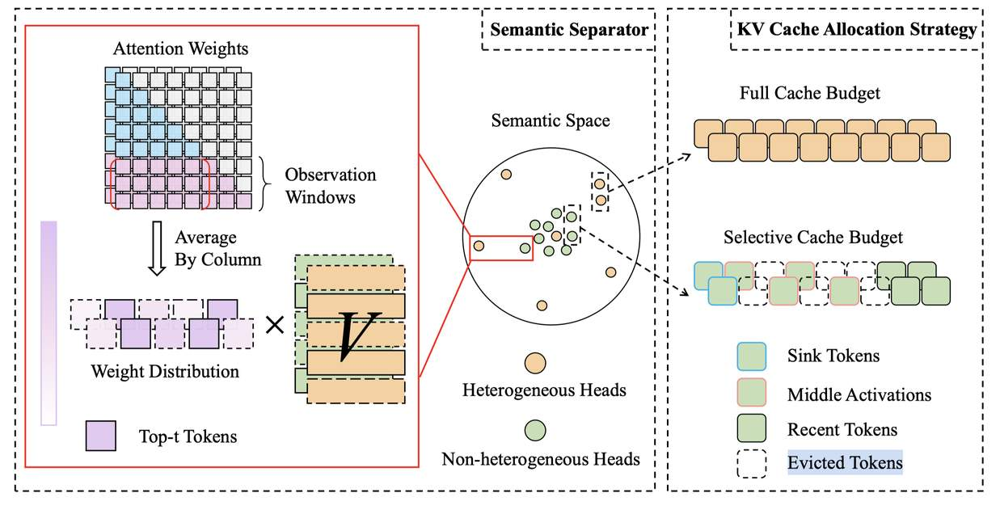

# Task-KV: Task-aware KV Cache Optimization via Semantic Differentiation of Attention Heads

> Xingyang He, Jie Liu, Shaowei Chen

---

> **⚠️ 本 note 由 AI Agent 自动生成（Hermes Agent），生成时间：2025-06-04。内容基于论文全文提取与分析，仅供参考。**

---

## 一句话总结

Task-KV 通过语义分离器（semantic separator）动态区分注意力头中的异构头（heterogeneous heads）与非异构头（non-heterogeneous heads），并根据任务语义差异为不同类型的注意力头分配差异化的 KV cache 预算，在仅使用 40% 内存的情况下即可在摘要和合成任务上达到与完整 KV cache 相当的性能。

---

## 摘要翻译

KV cache 是大语言模型（LLM）推理中广泛使用的加速技术，但其内存需求随输入长度快速增长。先前的研究要么对所有注意力头去除相同数量的不重要 token，要么为预先识别的注意力头分配差异化的 KV cache 预算。然而，由于注意力头的重要性在不同任务间存在差异，预先识别的注意力头无法有效适应各种下游任务。为解决这一问题，我们提出 Task-KV，一种利用注意力头语义分化来为不同任务分配差异化 KV cache 预算的方法。我们证明，远离语义中心的注意力头（称为异构头）对任务输出和语义理解贡献显著，而其他注意力头则主要负责聚合重要信息和集中推理。Task-KV 为异构头分配完整的 KV cache 预算以保留全面的语义信息，同时仅为非异构头保留少量最近 token 和注意力汇聚（attention sinks）。此外，我们创新性地引入中间激活（middle activations）来保留从非异构头聚合的关键上下文信息。为动态感知注意力头之间的语义差异，我们设计了一个语义分离器，基于注意力头与语义中心的距离区分异构头和非异构头。在多个基准和不同模型架构上的实验结果表明，Task-KV 显著优于现有基线方法。值得注意的是，在需要完整上下文处理的场景（如摘要和合成任务）中，Task-KV 在仅使用 40% 内存的情况下达到了与完整 KV cache 相当的性能。

---

## 研究动机

### 核心问题

LLM 推理中的 KV cache 内存需求随输入序列长度快速增长，成为长上下文场景（如上下文学习、多轮对话、检索增强）中部署的瓶颈。现有 KV cache 压缩方法主要从 token 级别和 head 级别两个维度进行优化，但均存在局限性。

### 现有方法的局限

1. **Token 级别方法**（如 StreamingLLM、SnapKV、PyramidKV、MiniCache）：
   - 对所有注意力头施加相同的 KV cache 预算（去除相同数量的 token）
   - 可能遗漏关键注意力头中的重要信息
   - StreamingLLM 仅保留 attention sinks 和最近 token，导致大量信息丢失

2. **Head 级别方法**（如 HeadKV、RazorAttention、DuoAttention）：
   - 预先识别重要注意力头（如检索头），按重要性分配 KV cache 预算
   - 预先识别的注意力头可能无法适应不同任务的需求（不同任务激活的异构头分布显著不同）
   - 基于注意力权重而非语义信息进行头的分类

3. **共同问题**：现有方法未能利用任务感知的语义差异来动态调整 KV cache 分配策略。

### 关键观察

- **注意力头的语义异构性**：在语义空间中，大部分注意力头紧密聚类，而一小部分距离语义中心较远（异构头），这些头从不同视角捕获任务的语义信息，对模型的全面理解和表达能力至关重要。
- **任务间异构头分布差异**：不同任务（检索、摘要、代码补全）激活的异构头分布显著不同，由任务的语义表示需求决定。
- **异构头的贡献上界理论**：从理论分析可知，远离语义中心的异构头对模型输出的贡献上界更大，因为偏移量 δj 是决定贡献的关键因素。

---

## 方法（技术细节）

Task-KV 由两个核心组件组成：**语义分离器（Semantic Separator）** 和 **KV cache 分配策略（KV Cache Allocation Strategy）**。

### 4.1 语义分离器（Semantic Separator）

#### 4.1.1 语义向量计算

对每个注意力头，通过以下步骤计算语义向量：
1. 计算注意力权重矩阵：$A = \text{Softmax}(QK^T / \sqrt{d} + M)$
2. 按列平均得到注意力分布：$A[i,:]$ 列平均
3. 对 V 加权求和得到语义向量：$v = \frac{\sum_{i=1}^{N} A[i,:]}{N} \cdot V$

语义向量 $v \in \mathbb{R}^{1 \times d}$ 高度概括了当前注意力头关注的语义信息。

#### 4.1.2 两阶段优化

为了降低计算开销，采用两阶段优化：

1. **观察窗口（Observation Window）**：仅使用输入序列末尾一小段（大小 $L$）作为观察窗口，计算局部注意力权重矩阵：
   $A' = \text{Softmax}(Q[-L:,:] \cdot K^T / \sqrt{d} + M')$

2. **Top-t Token 选择**：从局部权重中选择注意力得分最高的 $t$ 个 token 来计算语义向量，进一步降低计算成本：
   $C = \frac{\sum_{i=1}^{L} A'[i,:]}{L}$
   $I = \text{Topk}(C, t)$
   $v' = C[I,:] \cdot V[I,:]$

   实验表明 $t = 256$ 时达到计算成本与精度的平衡点（注意力权重比例趋于收敛）。

#### 4.1.3 异构头分类

- 计算所有注意力头的语义向量后，基于距离语义中心的距离进行排序
- 从最远到最近选择一定数量的头作为异构头，其余为非异构头
- **补充策略**：从非异构头中选择最接近语义中心的头加入异构头集合，确保覆盖所有类型的语义信息
- **层间自适应**：异构头数量随层数增加而递减（深层异构头更少），通过线性插值确定每层的异构头数量：
  $f(r) = n\beta - \frac{n\beta - m}{R - 1} \cdot r$
  其中 $\beta$ 为底层异构头比例，$m$ 为顶层异构头数量，$R$ 为 Transformer 层数。

### 4.2 KV Cache 分配策略

#### 异构头（Heterogeneous Heads）
- 分配**完整的 KV cache 预算**，确保多视角语义信息的完整性

#### 非异构头（Non-heterogeneous Heads）
- **最近 token（Recent Tokens）**：保留少量最近 token，维持基本推理能力
- **注意力汇聚（Attention Sinks）**：保留 16 个 sink token
- **中间激活（Middle Activations）**：创新性地引入，从序列中间位置选择注意力得分最高的 $k$ 个 token，保留关键上下文信息
  - 公式：$k = \frac{B - N \cdot f(r)}{n - f(r)} - s_1 - s_2$
  - $B$ 为当前层 KV cache 总预算，$N$ 为序列长度，$s_1$ 为 sink token 数，$s_2$ 为最近 token 数

### 4.3 关键超参数

- 观察窗口大小 $L = 32$
- 平均池化核大小 7
- Top-t tokens $t = 256$
- Llama-2-7B-Chat：$\beta = 0.25$，$m = 4$
- Mistral-7B-v0.2-Instruct：$\beta = 0.3$，$m = 1$
- Sink tokens $s_1 = 16$，最近 token $s_2 = 256$

---

## 实验结果

### 实验设置

- **基线方法**：StreamingLLM、SnapKV、PyramidKV、HeadKV-R2
- **评估基准**：LongBench（含单文档 QA、多文档 QA、摘要、少样本学习、合成任务、代码补全）和 LooGLE（含计算、多信息检索、长依赖摘要）
- **模型**：Llama-2-7B-Chat（MHA）、Mistral-7B-v0.2-Instruct（GQA）
- **KV cache 预算**：40% 和 60%

### 主要结果

#### 1. 长上下文理解任务（LongBench + LooGLE）

在 KV cache 预算 40% 和 60% 的条件下，Task-KV 在两个基准上的平均得分均优于所有基线方法：

- **Llama-2-7B-Chat（40%）**：Task-KV 平均 7.94 vs HeadKV-R2 7.80 vs PyramidKV 7.76 vs SnapKV 7.60 vs StreamingLLM 6.67
- **Llama-2-7B-Chat（60%）**：Task-KV 平均 8.13 vs HeadKV-R2 7.94 vs PyramidKV 7.89 vs SnapKV 8.05 vs StreamingLLM 6.71
- **Mistral-7B-v0.2-Instruct（40%）**：Task-KV 平均 10.73 vs HeadKV-R2 10.63 vs PyramidKV 10.45 vs SnapKV 10.31 vs StreamingLLM 9.37
- **Mistral-7B-v0.2-Instruct（60%）**：Task-KV 平均 11.02 vs HeadKV-R2 10.89 vs PyramidKV 10.77 vs SnapKV 10.63 vs StreamingLLM 9.62

**摘要和合成任务表现突出**：在需要完整上下文处理的任务中，Task-KV 在资源受限条件下显著优于现有基线，仅使用 40% 内存即可达到与完整 KV cache 相当的性能。

#### 2. Reasoning-in-a-Haystack（KV cache 预算 50%）

在多针检索推理任务中，Task-KV 在两个模型上均达到最高平均分：
- Llama-2-7B-Chat：Task-KV 37.15 vs HeadKV-R2 36.85 vs PyramidKV 36.65 vs SnapKV 36.65 vs StreamingLLM 33.20
- Mistral-7B-v0.2-Instruct：Task-KV 40.94 vs HeadKV-R2 40.77 vs PyramidKV 40.71 vs SnapKV 40.83 vs StreamingLLM 37.43

#### 3. 内存与延迟

- **解码延迟**：Task-KV 与其他 KV cache 压缩方法保持相同的解码延迟，预填充时间几乎可忽略
- **峰值内存**：Task-KV 显著减少内存使用，与其他压缩方法相当

### 消融实验

#### 非异构头的作用
- Passkey Retrieval（纯检索）：移除非异构头对检索性能影响不大
- Reasoning-in-a-Haystack（检索+推理）：移除非异构头后性能显著下降
- 结论：非异构头在信息推理中起关键作用

#### 中间激活的重要性
- No Cache（仅保留 sink + recent token）：信息损失严重
- Compressed Cache（压缩中间 token 为补偿 token）：引入噪声，模糊关键信息
- **Selective Cache（中间激活）**：在小 cache size（如 16）下即获得高 F1 分数
- 结论：非异构头聚合的关键信息存储在中间激活中，保留这些元素对充分利用推理能力至关重要

---

## 优势

1. **任务感知的动态分配**：根据任务语义差异动态区分异构头与非异构头，实现细粒度 KV cache 分配，优于预先固定头分类的方法
2. **内存效率高**：仅使用 40% 内存即可在摘要和合成任务上达到与完整 KV cache 相当的性能
3. **理论基础扎实**：通过理论分析和实验验证了异构头对模型输出的贡献上界，为方法提供了坚实的理论支撑
4. **中间激活创新**：引入中间激活（middle activations）保留非异构头聚合的关键信息，显著优于无缓存和压缩缓存方法
5. **广泛的适用性**：在 Llama-2-7B（MHA）和 Mistral-7B（GQA）两种不同架构上均表现良好
6. **计算效率**：通过观察窗口和 top-t token 选择等优化，语义分离器的计算开销可控
7. **鲁棒性**：超参数 β 和 m 在中间范围内对性能影响不大，具有较好的参数鲁棒性

---

## 局限

1. **性能提升有限**：从实验结果看，Task-KV 相比 HeadKV-R2 等基线方法的提升幅度不大（特别是在 Llama-2-7B 上），优势主要体现在摘要和合成任务中
2. **语义分离器开销**：虽然通过观察窗口和 top-t token 选择进行了优化，但语义分离器的计算开销仍然存在，且随输入长度增加而增大
3. **依赖语义中心的计算**：语义中心的计算依赖于当前层所有注意力头的语义向量，需要额外的内存和计算
4. **层间异构头数量预设**：层间异构头数量通过线性插值预设（参数 β 和 m），可能无法完全适应所有任务和模型
5. **仅在 7B 模型上验证**：实验仅在 Llama-2-7B-Chat 和 Mistral-7B-v0.2-Instruct 两个 7B 模型上进行，未在更大规模模型（如 13B、70B）上验证
6. **未考虑量化结合**：未与 KV cache 量化方法结合，可能在更极端的压缩场景下效果不佳

---

## 与 EfficientPaper 相关的研究方向

### KV Cache 稀疏化（kv_cache_sparse）
Task-KV 属于 KV cache 稀疏化方向，通过差异化分配 KV cache 预算来实现压缩。相关研究方向包括：
- **Token 级别稀疏**：StreamingLLM、SnapKV、PyramidKV 等，通过选择性保留 token 实现压缩
- **Head 级别稀疏**：HeadKV、RazorAttention、DuoAttention 等，通过识别重要注意力头实现压缩
- **Task 感知稀疏**：Task-KV 开创了任务感知的头级别稀疏方向，为后续研究提供了新的视角

### 可能的后续研究方向
1. **与量化结合**：将 Task-KV 的头级别稀疏与 KV cache 量化结合，进一步压缩内存
2. **更大规模模型验证**：在 13B、70B 等更大规模模型上验证方法的可扩展性
3. **在线学习**：探索在线学习语义分离器，实现更动态的头分类
4. **多任务联合优化**：同时优化多个任务的 KV cache 分配策略
5. **推理时动态调整**：根据当前生成的上下文内容动态调整 KV cache 分配
6. **与 SSM/MLA 等新架构结合**：探索在 State Space Model 或 Multi-head Latent Attention 等新架构上的适用性

---

*本 note 由 AI Agent 自动生成，基于论文 arXiv:2501.15113v1 全文分析。*
