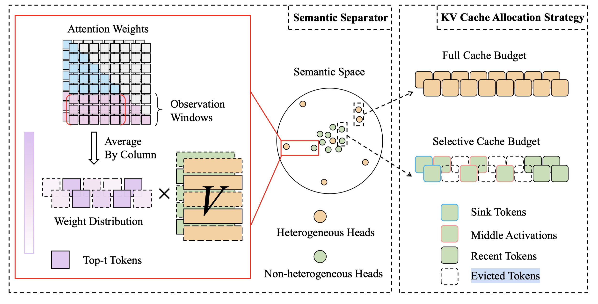

# Task-KV: Task-aware KV Cache Optimization via Semantic Differentiation of Attention Heads

## Abstract

KV cache is a widely used acceleration technique for large language models
(LLMs) inference. However, its memory requirement grows rapidly with input
length. Previous studies have reduced the size of KV cache by either removing
the same number of unimportant tokens for all attention heads or by allocating
differentiated KV cache budgets for pre-identified attention heads. However,
due to the importance of attention heads varies across different tasks, the
pre-identified attention heads fail to adapt effectively to various downstream
tasks. To address this issue, we propose Task-KV, a method that leverages the
semantic differentiation of attention heads to allocate differentiated KV cache
budgets across various tasks. We demonstrate that attention heads far from the
semantic center (called heterogeneous heads) make an significant contribution
to task outputs and semantic understanding. In contrast, other attention heads
play the role of aggregating important information and focusing reasoning.
Task-KV allocates full KV cache budget to heterogeneous heads to preserve
comprehensive semantic information, while reserving a small number of recent
tokens and attention sinks for non-heterogeneous heads. Furthermore, we
innovatively introduce middle activations to preserve key contextual
information aggregated from non-heterogeneous heads. To dynamically perceive
semantic differences among attention heads, we design a semantic separator to
distinguish heterogeneous heads from non-heterogeneous ones based on their
distances from the semantic center. Experimental results on multiple benchmarks
and different model architectures demonstrate that Task-KV significantly
outperforms existing baseline methods.

对head进行分类，heterogeneous heads不稀疏，Non-heterogeneous Heads稀疏

看实验结果提升不是很大