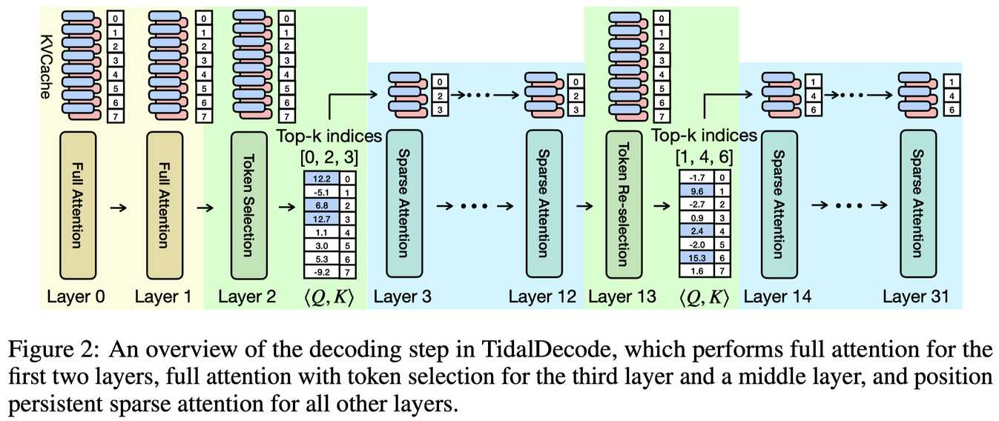

# TidalDecode: Fast and Accurate LLM Decoding with Position Persistent Sparse Attention

> Lijie Yang, Zhihao Zhang, Zhuofu Chen, Zikun Li, Zhihao Jia
>
> Carnegie Mellon University | ICLR 2025

> **⚠️ 生成声明**：本 note 由 AI Agent（Hermes）于 2026 年 6 月自动生成，基于 arXiv 论文 PDF 全文提取与分析。内容仅供参考，如有错误请以原文为准。

---

## 一句话总结

TidalDecode 利用相邻 Transformer 层之间注意力模式的**空间连续性（spatial coherence）**，仅在少量层执行全注意力进行 token 选择，其余层复用已选择的 token 集合进行稀疏注意力，从而将 LLM 解码延迟降低最高 **2.1×**，同时保持与全注意力接近的生成质量。

---

## 摘要翻译

大语言模型（LLM）在自然语言处理任务中取得了显著进展，长上下文模型尤其受到关注。然而，Transformer 架构中不断增长的 KV 缓存大小加剧了内存限制，尤其在解码阶段，形成了显著瓶颈。现有的稀疏注意力机制存在两个局限：（1）往往无法可靠地识别最相关的 token 用于注意力计算；（2）忽略了连续 Transformer 层之间 token 选择的空间连续性，导致性能下降和 token 选择的大量开销。

本文提出 **TidalDecode**，一种通过位置持续稀疏注意力（Position Persistent Sparse Attention, PPSA）实现快速准确 LLM 解码的算法与系统。TidalDecode 利用现有稀疏注意力方法所选择 token 的空间连续性，引入少量 token 选择层执行全注意力以识别具有最高注意力分数的 token，而所有其他层则使用预选 token 执行稀疏注意力。这种设计使 TidalDecode 能够大幅减少稀疏注意力的 token 选择开销，同时不牺牲生成结果质量。在多种 LLM 和任务上的评估表明，TidalDecode 在接近全注意力方法生成性能的同时，将 LLM 解码延迟降低了最高 **2.1×**。

---

## 研究动机

### 核心问题
LLM 推理分为预填充（prefilling）和解码（decoding）两个阶段。解码阶段需要访问所有先前 token 的 KV 缓存，随着上下文长度增长，KV 缓存急剧膨胀。例如，LLaMA-2-7B 在 128K 上下文长度下，半精度 KV 缓存可达 **64 GB**。解码阶段是**内存瓶颈（memory-bound）**，限制了长上下文 LLM 服务的效率。

### 现有方法的不足
现有稀疏注意力机制分为两类：
1. **驱逐型（eviction-based）**：如 H2O、TOVA、StreamingLLM，从 KV 缓存中丢弃不相关 token。问题在于可能过早驱逐携带关键信息的 token，导致性能下降。
2. **选择型（selection-based）**：如 Quest、Sparq Attention，保留完整 KV 缓存，动态选择少量 token 参与注意力计算。问题在于：
   - 每层独立进行 token 选择，忽略跨层的空间连续性
   - token 选择算法（如近似注意力分数估计）引入额外开销，有时甚至超过全注意力的计算成本
   - 可能存在分布偏移（distribution shift），将稀疏注意力的偏差 KV 表示写回缓存

### 关键洞察
论文通过大量实验发现：**相邻 Transformer 层所选择的高注意力分数 token 具有显著的重叠**（spatial coherence）。在 LLaMA-3-8B 模型上，100K 上下文长度的 Needle-in-the-Haystack 测试中，连续层的 top-256 token 重叠率很高，且层间重叠呈现明显的模式。

---

## 方法（技术细节）

### 整体架构：位置持续稀疏注意力（PPSA）

TidalDecode 在每个解码步骤中使用三种注意力层：
1. **全注意力层（Full Attention）**：前两层（Layer 0 和 Layer 1）执行全注意力，避免早期性能退化（参考 Quest 的发现）。
2. **Token 选择层（Token Selection Layer）**：紧接全注意力层之后的一层（如 Layer 2）和一个中间层（如 Layer 13）执行全注意力并进行 token 选择。在计算全注意力时，TidalDecode 在线存储查询（Q）与所有 key（K）的内积值 ⟨Q, K⟩，然后选择内积值最大的 top-k token 作为 token 集合 T。
3. **位置持续稀疏注意力层（PPSA）**：所有其他层仅加载 token 集合 T 中的 key 和 value 进行稀疏注意力计算，完全复用前一个 token 选择层的结果。

### 三种层的协作机制

以 32 层 LLaMA 模型为例：
- Layer 0-1：全注意力
- Layer 2：全注意力 + Token 选择（首次选择）
- Layer 3-12：PPSA（使用 Layer 2 选择的 token）
- Layer 13：全注意力 + Token 重新选择（中间校准）
- Layer 14-31：PPSA（使用 Layer 13 选择的 token）

### Token 选择的具体实现

- TidalDecode 在全注意力计算时，利用 QK 内积（而非 softmax 后的注意力分数）进行 top-k 选择
- 这是等价的，因为 softmax 是单调的（ordering invariant），不影响 top-k 的结果
- 避免了不必要的 softmax 计算开销
- 选择的 token 集合在后续所有 PPSA 层中复用，无需逐层重复选择

### 中间重新选择的重要性

如果仅在开始时选择一次 token 而不进行中间重新选择，由于远距离层之间的相关性降低（如 Layer 3 和 Layer 31），性能会大幅下降。实验表明，选择 Layer 13（或 Layer 7 for LLaMA-2）作为中间重新选择层，可将 recall rate 从 ~20% 提升到 ~40%，显著改善模型性能。

### KV 缓存校正机制（Cache Correction）

稀疏注意力方法解码的 token 的 KV 表示可能偏离全注意力解码的原始表示（称为"污染 token"），随着这些 KV 对被添加到缓存，错误会累积，导致分布偏移。TidalDecode 引入缓存校正机制：每 T 个解码步骤后，对所有污染 token 执行一次全注意力的预填充，更新其 KV 表示。T 可以是数千步。此校正步骤可与稀疏解码步骤并发执行。（注：论文评估中未使用此机制，以保持与现有方法的公平比较。）

### 与 Quest 的关键区别

| 特性 | Quest | TidalDecode |
|------|-------|-------------|
| Token 选择方式 | 每层独立近似（页面级重要性估计） | 少量层精确选择，跨层复用 |
| Token 选择开销 | 每层都有开销，可能超过全注意力 | 仅 2 层有开销，其余层无额外开销 |
| Token 选择精度 | 近似估计，可能不准确 | 精确内积 top-k 选择 |
| 额外机制 | 无 | 缓存校正机制（可选） |

---

## 实验结果

### 评估模型
- LongChat-7b-v1.5-32k
- LLaMA-3-8B（含 LLaMA-3-8B-Instruct-Gradient-1048k）
- LLaMA-3.1-8B-Instruct
- LLaMA-3-70B-Instruct-Gradient-1048k
- LLaMA-2-7B

### 评估任务与数据集
- **Needle-in-the-Haystack**：测试长依赖信息检索能力
- **PG-19**：语言建模（困惑度评估）
- **LongBench**：长上下文综合评估（单/多文档 QA、摘要、检索）

### 核心结果

#### Needle-in-the-Haystack 测试

**LongChat-7b-v1.5-32k（10K 上下文）**：

| 方法 | K=32 | K=64 | K=128 | K=256 | K=512 |
|------|------|------|-------|-------|-------|
| H2O | 0% | 1% | 1% | 1% | 3% |
| TOVA | 0% | 1% | 1% | 3% | 8% |
| StreamingLLM | 1% | 1% | 1% | 3% | 5% |
| Quest | 65% | 99% | 99% | 99% | 100% |
| **TidalDecode+L7** | **73%** | 92% | 98% | 99% | **100%** |

**LLaMA-3-8B（100K 上下文）**：

| 方法 | K=32 | K=64 | K=128 | K=256 | K=512 |
|------|------|------|-------|-------|-------|
| Quest | 38% | 50% | 65% | 87% | 98% |
| **TidalDecode+L13** | **86%** | **92%** | **100%** | **100%** | **100%** |

TidalDecode 仅需 **0.1%** 的输入长度（128 tokens / 100K context）即可达到 100% 准确率，而 Quest 需要更多 token。

#### 语言建模（PG-19 困惑度）

在 token budget 为 2048 和 4096 时，TidalDecode 的多个重选层变体（L9/L13/L15）均比 Quest 达到更低的困惑度，且随上下文长度增长保持鲁棒性。

#### LongBench 评估

在 LLaMA-3-8B-Instruct-Gradient-1048k 上，token budget 为 4096 时：
- TidalDecode 在 8 个任务中平均得分 **32.86**，超过 Quest 的 **31.13**
- 在部分任务中甚至超过全注意力基线（如 MFQA、NrtQA、2Wiki、TrQA）
- 论文假设 TidalDecode 的 token 选择过程能过滤掉不相关信息，因此在某些任务上表现更优

#### 效率评估（端到端延迟）

**LLaMA-2-7B（单 A100 80GB）**：

| 上下文长度 | 全注意力 | Quest | TidalDecode | 加速比（vs 全注意力） |
|------------|----------|-------|-------------|----------------------|
| 10K | 19.22ms | 20.39ms | 16.94ms | 1.13× |
| 32K | 25.71ms | 20.47ms | 17.89ms | 1.44× |
| 100K | 45.70ms | 24.93ms | 21.26ms | **2.15×** |

在 32 层和 64 层 LLaMA 模型上：
- TidalDecode vs 全注意力：最高 **5.56×** 加速
- TidalDecode vs Quest：最高 **2.17×** 加速
- 稀疏注意力核相比 Quest 核：最高 **3.36×** 加速

### 灵敏度分析

最优重选层与模型族系相关：
- LLaMA-2-7B：Layer 7
- LLaMA-3-8B / LLaMA-3.1-8B：Layer 13
- LLaMA-3-70B（64 层）：Layer 14 或 Layer 31

同一模型族系中，最优重选层在不同任务上保持一致。且 3B 小模型（LLaMA-3.2-3B）的最优层为 Layer 12-13。

---

## 优势

1. **简洁高效**：仅需 2 个 token 选择层（前部 + 中间），其余层完全复用，设计极简。
2. **精确 token 选择**：利用全注意力计算内积进行精确 top-k 选择，而非近似估计，选择精度高。
3. **显著加速**：端到端解码延迟降低最高 2.1×，注意力核加速最高 5.56×。
4. **质量保持**：在 Needle-in-the-Haystack、PG-19 困惑度、LongBench 等多个任务上保持与全注意力接近甚至更优的生成质量。
5. **通用性**：适用于 LLaMA-2/3/3.1 多种模型，不同规模（3B/8B/70B）均有效。
6. **低 token 预算**：仅需 ~0.1%-0.5% 的 token 预算即可达到全注意力精度。
7. **缓存校正机制**：提供 KV 缓存分布偏移的缓解方案（可选）。
8. **自定义 GPU 内核**：实现了高效的 PPSA GPU 内核，确保实际部署的效率增益。

---

## 局限

1. **重选层选择依赖模型架构**：不同模型族系的最优重选层不同，需要通过灵敏度分析确定，增加了部署时的调优成本。
2. **缓存校正机制未在评估中使用**：虽然论文提出了缓存校正机制，但评估时并未使用，长期生成场景下可能面临累积误差问题。
3. **依赖注意力分数的层间连续性**：核心假设（层间 token 选择的重叠）在所有模型/任务中是否总是成立尚未完全验证。
4. **稀疏注意力的覆盖率问题**：尽管在多个任务上表现优异，token 预算极低时（如 K=32）仍可能有性能损失。
5. **未考虑多头注意力的差异性**：当前实现对所有头共享相同的 token 选择，可能无法充分利用不同头的注意力模式差异。
6. **仅评估解码阶段**：未讨论预填充阶段的优化，尽管论文明确聚焦于解码阶段。
7. **硬件依赖**：自定义 GPU 内核依赖特定硬件配置（A100），在不同 GPU 上的性能表现可能不同。

---

## 与 EfficientPaper 相关的研究方向

TidalDecode 属于 **KV 缓存稀疏化（kv_cache_sparse）** 研究方向，与以下高效 LLM 推理技术密切相关：

1. **KV 缓存压缩**：如 H2O、TOVA、StreamingLLM 等驱逐型方法，与 TidalDecode 的选择型方法互补。
2. **稀疏注意力机制**：如 Quest、Sparq Attention、Performer 等，TidalDecode 在这些方法的基础上通过跨层 token 复用进行了改进。
3. **长上下文 LLM 服务**：如 FlashAttention、PagedAttention 等，TidalDecode 可与这些系统协同工作，进一步提升长上下文推理效率。
4. **Token 选择与重要性估计**：如何高效准确地识别最重要的 token 是高效 LLM 推理的核心问题，TidalDecode 通过精确内积 top-k 提供了新思路。
5. **模型层间相关性利用**：TidalDecode 发现并利用了相邻层之间的空间连续性，这一发现可能启发其他效率优化方法。
6. **推理时剪枝**：TidalDecode 的方法可视为推理时的 token 级剪枝，与训练时剪枝形成互补。

---

## 相关资源

- **arXiv**: [http://arxiv.org/abs/2410.05076v1](http://arxiv.org/abs/2410.05076v1)
- **代码**: [https://github.com/DerrickYLJ/TidalDecode](https://github.com/DerrickYLJ/TidalDecode)
- **关键词**: kv_cache_sparse
