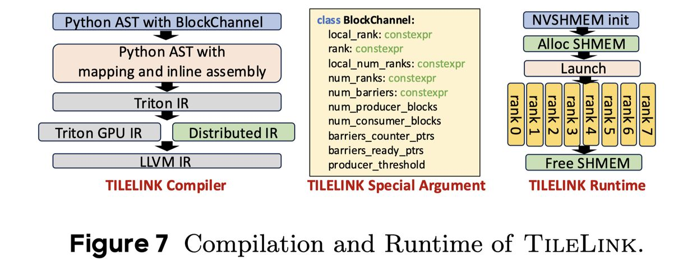

# TileLink: Generating Efficient Compute-Communication Overlapping Kernels using Tile-Centric Primitives

> Size Zheng, Jin Fang, Xuegui Zheng, Qi Hou, Wenlei Bao, Ningxin Zheng, Ziheng Jiang, Dongyang Wang, Jianxi Ye, Haibin Lin, Li-Wen Chang, Xin Liu

---

> ⚠️ **本文由 AI Agent 自动生成（Hermes Agent），仅供学习参考，内容可能存在不准确之处。**

## 一句话总结

TileLink 提出了一套基于 tile 级别的通信-计算融合编译框架，通过解耦通信与计算的设计空间并引入 tile 级原语，使开发者仅需约 200 行 Python 代码即可生成与手工编写数千行 CUDA 代码性能相当的计算-通信重叠内核，实现 1.17×~20.76× 的加速比。

## 摘要翻译

大型深度学习模型在广泛任务中取得了最先进的性能，这些模型通常需要分布式系统来实现高效的训练和推理。分布式模型执行的基本构建块是层内并行算子。提升层内并行算子性能的最有效方法是将计算与通信进行重叠（overlapping）。重叠可通过算子分解或内核融合实现。算子分解实现简单但性能欠优；内核融合性能优越但需要大量专业知识且容易出错。

本文提出 TileLink，通过编译技术高效生成计算-通信重叠内核。TileLink 由前端和后端组成：前端将通信和计算的设计空间解耦，通过 tile 级原语连接两部分；后端将这些原语翻译为低级通信指令，集成通信和计算组件以实现重叠执行。实验表明，TileLink 相对于非重叠基线实现了 1.17× 至 20.76× 的加速，在 GPU 上可达到与最先进重叠库相当的性能。

## 研究动机

1. **分布式训练的通信瓶颈**：在大规模模型（如 LLM）的分布式训练中，层内并行的通信开销可占总执行开销的 10%~50%，严重制约计算效率。
2. **现有重叠方法的不足**：
   - **算子分解**（如 Async-TP PyTorch）：将通信和计算算子拆分为更小的单元，实现简单但会导致 L2 缓存利用率低、资源量化效率差，且需要主机端干预同步，引入额外开销。
   - **内核融合**（如 FLUX、CoCoNet）：将通信和计算融合为一个内核，性能优异但需要极高的硬件专业知识（如 CUDA 级别的 barrier 控制和通信指令），开发难度大、周期长，难以跟上快速发展的算法迭代。
3. **缺乏高效编译支持**：现有编译器（如 CoCoNet、Dist-Einsum）支持的重叠模式有限，缺乏编程灵活性；而通用代码生成编译器（如 Triton、TVM）不支持分布式通信与计算的重叠编译。

因此，需要一种既能高效编译生成重叠内核、又具有编程灵活性的框架，TileLink 正是为此而生。

## 方法

### 整体架构

TileLink 由 **前端（Frontend）** 和 **后端（Backend）** 两部分组成，构建在 Triton 编译器之上，用 Python 实现。

### 前端：解耦设计空间与 Tile 级原语

**1. 解耦设计空间（Decoupled Design Space）**

TileLink 将通信和计算的设计空间解耦为三个子空间，允许两者独立选择优化策略：

- **Tile 大小（Tile Size）**：通信和计算可以使用不同的 tile 大小。例如，通信部分每次传输 128×128 的 tile，而计算部分每次处理 128×256 的 tile。这使得每个组件可以根据其使用的处理核心数量选择最优大小。
- **Tile 顺序（Tile Order）**：通信可以采用 ring order、full-mesh all-to-all order 等数据传输顺序，而计算部分可以等待来自任意 rank 的数据 tile。存在权衡：等待多个 rank 的数据可提高缓存效率但等待时间更长，等待单个 rank 的数据则可更早开始计算但整体效率较低。
- **资源映射（Resource Mapping）**：通信和计算可以映射到不同的硬件单元（如 copy engine 与 compute core）或相同的单元。不同映射方案各有优劣：使用 DMA 引擎避免资源冲突但需要主机干预，使用计算核心进行数据拷贝则消除主机开销但可能产生资源冲突。

**2. Tile 级原语（Tile-Centric Primitives）**

为解决解耦设计空间带来的同步挑战，TileLink 提供了一组 tile 级原语，分为两类：

**信号原语（Signal Primitives）**：
- `producer_tile_notify(tile_id, mode)`：标记生产者 tile 完成并通知消费者 tile
- `consumer_tile_wait(tile_id)`：消费者 tile 阻塞直到所有依赖的生产者 tile 完成
- `peer_tile_notify(tile_id, rank)` / `peer_tile_wait(tile_id, rank)`：用于不同 rank 间同操作的 tile 同步
- `rank_notify(tile_id, rank)` / `rank_wait(rank)`：用于 copy engine 与计算核心之间的 barrier 控制

这些信号原语携带严格的内存一致性语义：notify 原语具有 release 语义（确保之前的内存访问不被重排到其后），wait 原语具有 acquire 语义（确保之后的内存访问不被重排到其前）。

**数据原语（Data Primitives）**：
- `tile_push_data(tensors, tile_id, data)` / `tile_pull_data(tensors, tile_id)`：设备侧数据传输，映射到计算核心
- `rank_copy_data(src, dst)`：主机侧数据传输，映射到 copy engine（DMA）

数据传输支持两种模式：**pull 模式**（生产者从所有其他 rank 读取数据）和 **push 模式**（生产者将本地数据写入所有其他 rank），具体性能取决于数据形状和硬件资源。

### 后端：Tile 级映射与编译

**1. Tile 级映射（Tile-Centric Mapping）**

TileLink 使用三种映射函数将 tile_id 关联到具体信息：

- **形状映射（Shape Mapping）**：将 tile_id 映射到特定的张量形状切片范围
- **秩映射（Rank Mapping）**：将 tile_id 映射到设备 rank
- **通道映射（Channel Mapping）**：将 tile_id 映射到通信 barrier

分为两类：
- **静态映射（Static Mapping）**：在编译时通过仿射变换确定，适用于数据分片策略固定的场景（如 tensor-parallel MLP、sequence-parallel self-attention）
- **动态映射（Dynamic Mapping）**：在运行时计算，适用于数据分片策略动态的场景（如 MoE 的动态路由），通过查找表实现，查找表的值在运行时由动态逻辑（如动态路由）填充

**2. 内存一致性编译**

TileLink 将前端原语编译为对应的设备指令（如 `ld.global.acquire`、`red.release`）。为确保多阶段流水线优化中内存访问操作的正确重排序，TileLink 在原语与其后的 load/store 操作之间强制执行严格的数据依赖关系。

**3. 编译流程**

- 输入：结合 TileLink 原语和 Triton 原语的 Python 程序
- 通过 Python AST 解析和转换为 Triton IR
- TileLink 的原语被转换为 Triton 的 `ElementwiseInlineAsmOp`
- 引入新的 Distributed IR 层，将特殊指令翻译为 LLVM IR
- 进一步编译为 PTX（NVIDIA GPU）
- 运行时使用 NVSHMEM 初始化分布式执行环境和分配共享内存

**4. 内核设计示例**

论文展示了三个代表性用例：
- **GEMM + Ring ReduceScatter**：使用 SM 同时运行 GEMM 和 ReduceScatter，通过 `producer_tile_notify` 和 `peer_tile_notify/wait` 实现生产者-消费者和 peer-to-peer 同步（静态映射）
- **AllGather + MoE**：支持动态路由，使用查找表实现动态映射，AllGather 映射到 DMA 引擎
- **AllGather KV + Self-Attention**：使用 copy engine 进行通信，通过 host 原语触发 DMA，通信和计算在不同 stream 上运行（静态映射）

### 实现

- 基于 Triton 用 Python 实现，通过 Python AST 变换实现 tile 级映射
- 支持扩展到其他编译器框架（如 TVM、MLIR）
- 使用 NVSHMEM 作为分布式通信后端

## 实验结果

**实验环境**：8×H800 GPU 集群，也测试了 16×H800（双节点）

**基线**：
- 非重叠：cuBLAS + NCCL
- 分解方法：Async-TP PyTorch
- 融合方法：FLUX
- 注意力：RingAttention

### MLP 层

- **AG + GEMM**：TileLink 达到 cuBLAS+NCCL 的 1.27×，达到 FLUX 性能的 94.5%（FLUX 为 1.34×）
- **GEMM + ReduceScatter**：TileLink 达到 cuBLAS+NCCL 的 1.25×，超越 FLUX 1.28×（TileLink 的 decoupled 设计空间优势）
- **完整 MLP**：TileLink 与 FLUX 性能相当（101.4%），cuBLAS+NCCL 的 1.24×
- 编程效率：FLUX 约 2000 行 CUDA，TileLink 约 200 行 Python（~10× 效率提升）

### MoE 层

- **AG + Gather + GroupGEMM**：TileLink 平均比 vLLM 快 1.51×（vLLM 已比 CUTLASS+NCCL 快 9.82×）
- **GroupGEMM + Scatter + Topk Reduce + RS**：TileLink 平均比 vLLM 快 1.31×，比 CUTLASS+NCCL 快 10.56×
- **完整 MoE**：TileLink 平均比 vLLM 快 1.14×，比 cuBLAS+NCCL 最高快 20.76×
- TileLink 是首个支持 MoE 层重叠的框架（FLUX 和 Async-TP 不支持 MoE）

### Self-Attention

- 测试序列长度从 16k 到 128k
- 平均比 PyTorch 非重叠快 5.04×，比 RingAttention 快 1.97×
- 平均 overlap ratio 为 43.9%（有效隐藏了 43.9% 的通信开销）

### 端到端评估

- **8×H800（单节点）**：8 个 LLM 模型（含 dense 和 MoE），平均加速比 1.32× vs PyTorch
  - Dense 模型平均加速 1.20×
  - MoE 模型平均加速 1.54×
- **16×H800（双节点）**：平均加速 1.29× vs PyTorch
- 测试模型：GPT3-6.7B、LLaMA2-7B/13B/70B、GPT3-175B、Mixtral-8x7B/8x22B、Qwen1.5-2.7B

## 优势

1. **编程效率极高**：约 200 行 Python 代码即可实现与数千行 CUDA 代码（如 FLUX）相当的性能，编程效率提升约 10×
2. **性能优异**：在非重叠基线上实现 1.17×~20.76× 加速，与 SOTA 融合库（FLUX、RingAttention）性能相当或更优
3. **灵活的设计空间**：解耦通信和计算的设计空间（tile 大小、顺序、资源映射），允许独立优化
4. **支持动态映射**：首次支持 MoE 层的重叠（需要动态路由），扩展了编译器的适用范围
5. **通用的原语抽象**：tile 级原语兼具信号控制和数据传输，支持生产者-消费者和 peer-to-peer 两种同步模式
6. **编译器友好**：基于 Triton 编译器，易于扩展到其他编译器框架和硬件后端
7. **严格的内存一致性**：原语携带严格的 acquire/release 语义，确保正确性

## 局限

1. **仅支持 NVIDIA GPU**：当前实现仅针对 NVIDIA GPU（使用 NVSHMEM 和 PTX），虽然论文指出可以通过扩展编译器支持更多硬件，但尚未实现
2. **仅支持层内并行**：仅聚焦于层内（intra-layer）并行的通信-计算重叠，未扩展到层间（inter-layer）或模型级（model-level）重叠，如流水线并行
3. **需要手动编写 tile 级程序**：虽然比手写 CUDA 简单得多，但仍需要用户理解 tile 级原语和设计空间，对普通开发者仍有学习曲线
4. **端到端加速比有限**：单节点平均加速 1.32×，多节点 1.29×，在实际训练中的提升受限于 MLP 层主导性能等因素
5. **缺乏自动调优**：当前没有自动搜索最优 tile 大小、顺序和资源映射的机制，需要用户手动选择
6. **Distributed IR 仍处于发展初期**：作为一种新的 IR 层，其功能和优化能力可能还需要进一步完善

## 与 EfficientPaper 相关的研究方向

1. **计算-通信重叠（Overlap）**：这是 EfficientPaper 关键词"overlap"的直接研究方向，TileLink 通过编译技术实现高效重叠，与基线方法 Async-TP、FLUX、PagedAttention 形成对比
2. **分布式系统优化**：TileLink 专注于分布式训练/推理中的通信效率优化，属于大模型系统效率的核心研究
3. **编译器与代码生成**：TileLink 是一个编译器框架，将高级原语编译为高效设备代码，与 Triton、TVM、MLIR 等编译器研究密切相关
4. **Tile 级编程模型**：提出 tile 级原语和映射策略，为分布式计算提供了新的编程抽象
5. **MoE 模型效率**：TileLink 是首个支持 MoE 层重叠的框架，与 MoE 模型的高效训练和推理研究相关
6. **GPU 内核融合**：将通信和计算内核融合，涉及 GPU 硬件特性和内核设计的深入研究
7. **端到端 LLM 训练加速**：TileLink 在 8 种 LLM 上进行了端到端评估，与大模型训练效率研究直接相关

## 参考信息

- **论文 URL**：http://arxiv.org/abs/2503.20313v3
- **代码**：https://github.com/ByteDance-Seed/Triton-distributed
- **机构**：ByteDance Seed
- **年份**：2025
- **基线方法**：Async-TP (2024)、FLUX (2024)、PagedAttention (2023)
