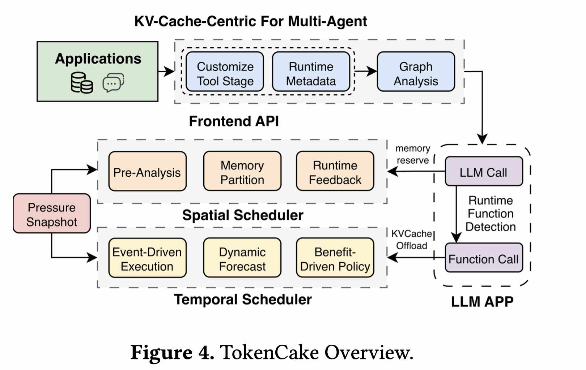

# TokenCake: A KV-Cache-centric Serving Framework for LLM-based Multi-Agent Applications

> Zhuohang Bian, Feiyang Wu, Zhuoran Li, Teng Ma, Youwei Zhuo

> 注：以下论文笔记由 AI Agent 自动生成，可能存在理解偏差或遗漏，请以原论文为准。

## Abstract

Large Language Models are increasingly deployed in complex multi-agent applications that rely on external function calls. This workload creates severe performance challenges for the KV Cache: spatial contention leads to eviction of critical agents' caches and temporal underutilization leaves the cache of agents stalled on long-running function calls idling in GPU memory. TokenCake is a KV-Cache-centric serving framework that co-optimizes scheduling and memory management through an agent-aware design. Its Temporal Scheduler uses event-driven opportunistic offloading of idle KV caches during function calls and predictive uploading to hide transfer latency. Its Spatial Scheduler uses dynamic memory partitioning guided by a hybrid priority metric combining graph structure and runtime state to reserve GPU memory for critical-path agents. On representative multi-agent benchmarks, TokenCake reduces end-to-end latency by over 47.06% and improves effective GPU memory utilization by up to 16.9% compared to vLLM.

## 一句话总结

TokenCake 把 multi-agent 应用中的 tool-call stall 和 agent dependency graph 显式纳入 KV cache 管理，用 agent-aware temporal/spatial scheduler 同时处理空闲 KV 和关键路径 KV。

## 创新点

1. agent-aware KV scheduling：不再把请求当独立序列，而是利用 multi-agent workflow 的依赖图和运行态区分关键 agent 与等待 tool-call 的 idle agent。
2. Temporal Scheduler：在函数调用等待期间主动 offload idle KV，并用预测性 upload 隐藏恢复延迟。
3. Spatial Scheduler：用图结构 + runtime state 的混合优先级动态划分 HBM，为 critical-path agents 预留 KV 空间。

## 带来什么提升

1. 相比 vLLM，端到端 latency 降低超过 47.06%，说明 agent workload 下传统 request-level serving 策略明显不足。
2. 有效 GPU memory utilization 最高提升 16.9%，减少 tool-call stall 期间 KV 占着 HBM 不工作的浪费。
3. 对 EfficientPaper 的 agent serving 方向价值高：它把 KV cache 生命周期和外部工具调用/多 agent DAG 绑定起来。

## 备注

- 评估依赖代表性 multi-agent benchmark；真实生产 DAG、tool latency 分布和失败重试会影响策略鲁棒性。
