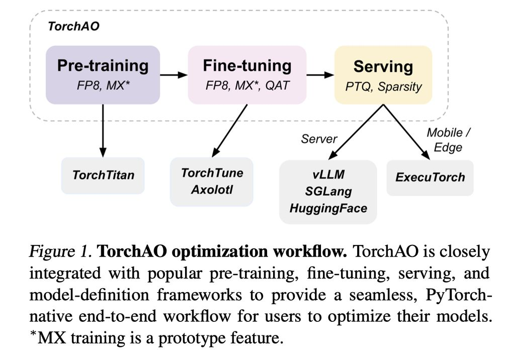

# TorchAO: PyTorch-Native Training-to-Serving Model Optimization

> Andrew Or, Apurva Jain, Daniel Vega-Myhre, Jesse Cai, Charles David Hernandez, Zhenrui Zheng, Driss Guessous, Vasiliy Kuznetsov, Christian Puhrsch, Mark Saroufim, Supriya Rao, Thien Tran, Aleksandar Samardžić



> **注意：本 note 由 AI Agent 自动生成，生成时间为 2025 年。内容基于论文原文的全文阅读与分析，仅供参考。**

## 一句话总结

TorchAO 是一个 PyTorch 原生的模型优化框架，通过张量子类（tensor subclass）抽象统一了 FP8 训练、量化感知训练（QAT）、训练后量化（PTQ）和 2:4 稀疏等技术，实现了从预训练到推理服务的端到端工作流，并与 TorchTitan、TorchTune、vLLM、SGLang、ExecuTorch 等主流生态紧密集成。

## 摘要翻译

我们提出了 TorchAO，一个 PyTorch 原生的模型优化框架，利用量化和稀疏技术为 AI 模型提供端到端的从训练到服务的工作流。TorchAO 支持多种流行的模型优化技术，包括 FP8 量化训练、量化感知训练（QAT）、训练后量化（PTQ）和 2:4 稀疏，并利用一种新颖的张量子类抽象来表示多种广泛使用、后端无关的低精度数据类型，包括 INT4、INT8、FP8、MXFP4、MXFP6 和 MXFP8。TorchAO 在模型优化管道的每个步骤中与更广泛的生态系统紧密集成，从预训练（TorchTitan）到微调（TorchTune、Axolotl）再到服务（HuggingFace、vLLM、SGLang、ExecuTorch），将一个原本碎片化的领域连接成一个统一的工作流。TorchAO 已支持最近发布的量化 Llama 3.2 1B/3B 和 LlamaGuard3-8B 模型，开源代码位于 https://github.com/pytorch/ao/。

## 研究动机

### 1. 大模型部署的计算与内存挑战

大型语言模型（LLM）在内容创作、文本摘要、聊天机器人和代码生成等方面表现卓越，但这些能力通常需要大量的基础设施。例如，Llama 3.1 的训练耗费了 30.84M GPU 小时（在 16K H100 GPU 上），即使是 BF16 精度的推理服务也需要至少 800GB 的聚合内存，超过单台 8×H100 服务器的内存限制。即使在较小的 1-8B 参数规模下，减少模型大小对于在资源受限的环境（如移动和边缘设备）中部署也至关重要。

### 2. 现有 LLM 优化流程的碎片化

现有的 LLM 优化流程高度碎片化。例如，一个研究者可能使用 Transformer Engine 的混合 FP8/BF16 精度进行预训练，然后加载到 Unsloth 或 Axolotl 进行微调，再使用 bitsandbytes 进行量化，最后使用 llama.cpp 进行推理。在每个步骤中，用户可能需要手动转换模型格式（如从 HuggingFace 的 safetensors 转换为 llama.cpp 的 GGUF），且不同步骤的量化方案可能存在细微的差异。这种碎片化增加了用户的使用门槛和出错风险。

### 3. 统一框架的需求

因此，需要一个统一的、PyTorch 原生的模型优化框架，能够覆盖从训练到推理的全生命周期，同时与主流生态无缝集成，降低用户的使用成本。

## 方法（技术细节）

### 核心抽象：张量子类（Tensor Subclass）

TorchAO 的核心设计理念是利用 PyTorch 的张量子类（tensor subclass）抽象。这种抽象允许 TorchAO 以一种后端无关的方式表示各种低精度数据类型（INT4、INT8、FP8、MXFP4、MXFP6、MXFP8），并自然地与 PyTorch 的自动求导（autograd）、分布式训练（如 FSDP2、Tensor Parallelism）等功能组合。

### 1. FP8 训练（预训练阶段）

FP8 训练通过动态地将激活、权重和梯度转换为 FP8 格式，并利用专用的 GEMM 内核来利用底层 GPU 上的 FP8 张量核心（如 NVIDIA H100 的 Tensor Core）来加速计算。

**三种 FP8 缩放策略（scaling recipes）：**

- **Tensorwise scaling（默认）：** 为每个张量计算一个缩放因子。开销最低，性能最高，但对异常值更敏感（单个异常值会影响整个张量的缩放）。当使用 FSDP 时，还支持 FP8 all-gather 优化以减少通信开销。在 405B 参数规模下，结合 torch.compile 可实现约 1.5x 的训练吞吐量加速。

- **Rowwise scaling：** 沿左 GEMM 操作数的逻辑行和右 GEMM 操作数的逻辑列计算缩放因子。更细粒度的缩放降低了对异常值的敏感性，提升了精度，但性能略低于 tensorwise。在 70B 参数规模下可实现约 1.43x 的加速。

- **Rowwise with high-precision gradient weight：** 类似 rowwise，但将 ∂L/∂W 的计算保持在 BF16 精度，因为实验表明该计算对低精度更敏感。在某些情况下可实现比 rowwise 更高的加速。

**关键特性：** FP8 训练利用张量子类抽象，可以与 PyTorch 的 autograd、FSDP2、Tensor Parallelism 原生组合。通过 SymmetricMemory API 和异步张量并行，可以进一步获得高达 17% 的额外训练吞吐量提升。

### 2. 量化感知训练（QAT，微调阶段）

QAT 通过在训练过程中插入"伪量化"（fake quantization）操作来模拟量化过程，使模型学习到对量化误差的鲁棒性，从而在最终量化后获得更好的精度。

**技术细节：**

- TorchAO 的 QAT 分为两步：**prepare**（插入伪量化操作）和 **convert**（将伪量化操作转换为实际量化操作）。
- 在 prepare 阶段，`torch.nn.Linear` 被替换为 `FakeQuantizedLinear`，使用 `FakeQuantizeConfig` 配置激活和权重的量化方案（如 INT8 动态激活 + INT4 权重）。
- 在训练过程中，所有"伪量化"操作仍在高精度（如 BF16）下执行，仅模拟低精度数值（如 INT4）。QAT 检查点保留与原始检查点完全相同的模型结构，因此可以直接替换。
- 在 convert 阶段，伪量化操作被替换为实际量化操作，使用与 TorchAO PTQ 相同的代码路径。
- QAT 可以与 LoRA（Hu et al., 2022）组合，将训练吞吐量提升 1.89x（相比 vanilla QAT）。
- TorchAO 还提供 NF4 数据类型用于 QLoRA，进一步降低训练资源需求。

**已集成的微调框架：** TorchTune（原生集成 QAT、NF4、FP8 训练支持）和 Axolotl（提供 QAT + DPO 的微调工作流）。

**实际效果：** 在 Llama 3.2 1B/3B 和 LlamaGuard3-8B 的发布中，QAT 被用于缓解 INT4 检查点的量化退化，在 ARM CPU 后端实现了 2-4x 的推理加速、56% 的模型大小减少和 41% 的内存减少。

### 3. 训练后量化（PTQ，推理阶段）

PTQ 在训练完成后对模型进行量化，无需额外的训练过程。TorchAO 的 PTQ 支持多种数据类型和后端：

**支持的量化方案：**

| 量化方案 | 数据类型 | 目标后端 |
|---------|---------|---------|
| INT4 Weight Only | INT4 | CUDA（tinygemm 内核） |
| INT8 Dynamic Activation + INT4 Weight | INT8/INT4 | XNNPACK（ARM CPU） |
| FP8 Dynamic Activation + FP8 Weight | FP8 | Hopper GPU |
| MXFP4/MXFP6/MXFP8 | MX 格式 | 多种后端 |

**关键特性：**

- 利用张量子类抽象，与其他 PyTorch 功能原生组合，并支持序列化。
- 与 GemLite 集成，使用 Triton 内核进一步加速推理（1.1-2x 的推理加速）。
- 支持多种后端：CUDA、ARM CPU。

### 4. 稀疏支持

TorchAO 支持多种稀疏技术，利用现代 NVIDIA GPU 的硬件稀疏矩阵乘法支持来加速推理：

- **Sparse Marlin 2:4：** 混合精度自回归并行推理
- **2:4 稀疏：** 结构化稀疏
- **块稀疏（Block Sparsity）：** 块级稀疏
- **INT8 动态量化 + 2:4 稀疏：** 组合量化与稀疏
- **行级 FP8 + 2:4 稀疏（权重和激活）：** 组合 FP8 量化与稀疏

在 ViT 模型上，稀疏支持可实现高达 1.3x 的加速，相对模型精度保持在 91-100%。

### 5. 生态集成

TorchAO 在模型优化管道的每个步骤中与主流生态紧密集成：

**预训练阶段：**
- TorchTitan：支持 FP8 训练，与 torch.compile、autograd、FSDP2、Tensor Parallelism 原生组合。

**微调阶段：**
- TorchTune：原生集成 QAT、NF4、FP8 训练支持。
- Axolotl：提供 QAT 微调工作流（包括 QAT + DPO）。

**推理服务阶段：**
- HuggingFace Transformers / Diffusers：作为量化后端，支持通过 TorchAoConfig 进行量化，支持 save_pretrained/load_pretrained/push_to_hub 等原生 API。
- vLLM / SGLang：作为量化后端，支持 FP8 推理。
- ExecuTorch：支持将量化模型降低到边缘后端（Android、iOS、CoreML），提供轻量级运行时和静态内存规划。

**API 示例：**

```python
# FP8 训练
torch.compile(model)
convert_to_float8_training(model)

# PTQ：INT4 权重量化
quantize_(model, Int4WeightOnlyConfig(group_size=32))

# QAT：准备阶段
quantize_(model, IntXQuantizationAwareTrainingConfig(activation_config, weight_config))
train_loop(model)
# QAT：转换阶段
quantize_(model, FromIntXQuantizationAwareTrainingConfig())
quantize_(model, Int8DynamicActivationInt4WeightConfig(group_size=32))
```

### 6. 原型功能

TorchAO 还包含许多原型功能（不保证生产可用）：

- AutoRound：通过有符号梯度下降优化权重舍入
- AWQ：激活感知权重量化
- Blockwise FP8：DeepSeek 引入的 FP8 块级量化
- float8nocompile：使用 Triton 内核加速 eager FP8 tensorwise 训练
- GaLore：梯度低秩投影的内存高效训练
- HQQ：半二次量化
- MoE 量化：Mixture of Experts 推理量化
- MX 格式：MXFP4、MXFP6、MXFP8 训练
- ParetoQ：极低比特 LLM 量化的缩放定律
- ParQ：分段仿射正则量化（QAT）
- INT8 量化训练
- Scaled grouped mm：MoE FP8 训练的可微分缩放分组 GEMM
- SmoothQuant：消除 W8A8 量化的异常值
- SpinQuant：使用学习旋转的量化

## 实验结果

所有实验在 1-8 块 H100 GPU（每块 96GB HBM3 内存）上进行。

### 1. FP8 训练性能

在 Llama3-8B 上，使用 TorchTitan 在 C4 数据集上训练 100 步（batch size=1，序列长度 8192，torch.compile，per-op SAC）：

| 缩放方式 | 峰值内存 (GB) | 中位 tok/s | 加速比 |
|---------|-------------|-----------|-------|
| None (BF16) | 47.65 | 6150 | 1.0x |
| Tensorwise + FP8 all-gather | 47.77 | 7689.5 | **1.25x** |
| Rowwise + BF16 all-gather | 47.79 | 6768 | 1.10x |

**关键发现：** Tensorwise 缩放配合 FP8 all-gather 可实现 1.25x 的训练吞吐量加速，且峰值内存与 BF16 基线持平。损失曲线与 BF16 基线几乎一致。

### 2. 训练后量化（PTQ）性能

在 Llama3.1-8B 上，使用单块 H100 GPU，batch size=1，torch.compile：

| 量化技术 | 准确率 | 困惑度 | 吞吐量 (tok/s) | 模型大小 (GB) |
|---------|-------|-------|--------------|-------------|
| None | 60.01 | 7.33 | 132.41 | 15.01 |
| INT4WO-64 | 58.10 | 8.25 | **268.88** | **4.76** |
| INT8WO | 59.92 | 7.34 | 216.38 | 8.04 |
| FP8WO | 59.83 | 7.37 | 213.88 | 8.03 |
| FP8DQ (PerRow) | 59.86 | 7.41 | 167.13 | 8.04 |
| FP8DQ (PerTensor) | 59.95 | 7.42 | 176.44 | 8.03 |

**关键发现：** 量化将模型大小减少 2-4x，推理吞吐量提升高达 2x，同时在所有量化设置下与 BF16 基线保持接近的准确率和困惑度。

### 3. 量化感知训练（QAT）性能

在 Llama3-8B、Llama3.1-8B 和 Llama3.2-3B 上，使用 4 块 H100 GPU，1000 步微调（OpenAssistant 对话数据集，batch size=8，学习率 2e-5，权重量化组大小 32，激活检查点）：

| 模型 | 量化准确率 | 量化困惑度 | 训练吞吐量 (tok/s) | 训练峰值内存 (GB) |
|-----|----------|----------|-----------------|-----------------|
| Llama3-8B | 47.0% (BF16: 57.1%) | 26.270 (BF16: 9.422) | 480.3 (+0%) | 17.6 (+0%) |
| Llama3-8B (QAT) | 52.8% (恢复 57.8%) | 12.312 (恢复 82.8%) | 323.0 (-32.7%) | 32.9 (+86.8%) |
| Llama3.1-8B | 51.8% (BF16: 57.9%) | 18.628 (BF16: 9.164) | 492.4 (+0%) | 17.7 (+0%) |
| Llama3.1-8B (QAT) | 55.5% (恢复 60.0%) | 10.901 (恢复 81.6%) | 323.0 (-34.4%) | 33.0 (+86.5%) |
| Llama3.2-3B | 46.8% (BF16: 51.7%) | 17.461 (BF16: 12.051) | 1408.8 (+0%) | 13.8 (+0%) |
| Llama3.2-3B (QAT) | 50.2% (恢复 69.8%) | 13.220 (恢复 78.4%) | 737.7 (-47.6%) | 14.5 (+5.24%) |

**关键发现：**
- QAT 可以恢复高达 **69.8%** 的量化准确率退化（hellaswag）和 **82.8%** 的量化困惑度退化（wikitext）。
- QAT 的代价是训练吞吐量下降 32-48%，峰值内存增加约 5-87%。
- QAT 对 4-bit 量化特别有效（PTQ 的量化退化更明显时，QAT 的优势更大）。

### 4. 服务推理性能

在 Llama3.1-8B 上，使用 vLLM 服务（ShareGPT 数据集，prompt 数量=1）：

| 量化 | 输出吞吐量 (tok/s) | 单输出 token 时间 (ms) | token 间延迟 (ms) |
|-----|------------------|-------------------|----------------|
| None (BF16) | 103.6 (+0%) | 9.50 (+0%) | 9.47 (+0%) |
| FP8 tensorwise | **132.8 (+28.2%)** | **7.48 (-21.2%)** | **7.47 (-21.1%)** |

**关键发现：** FP8 推理相比 BF16 实现了 28% 的吞吐量提升和 21% 的延迟降低。

## 优势

1. **统一的端到端工作流：** TorchAO 是目前唯一一个覆盖预训练→微调→推理服务全生命周期的 PyTorch 原生优化框架，解决了现有流程的碎片化问题。

2. **张量子类抽象的优雅设计：** 通过张量子类，TorchAO 可以与 PyTorch 的 autograd、分布式训练（FSDP2、Tensor Parallelism）、torch.compile 等核心功能原生组合，无需修改模型代码。

3. **广泛的量化格式支持：** 支持 INT4、INT8、FP8、MXFP4、MXFP6、MXFP8 等多种低精度数据类型，以及多种量化方案（INT4WO、INT8DQ、FP8DQ 等）。

4. **多后端支持：** 覆盖服务器 GPU（CUDA/Hopper）、ARM CPU（XNNPACK）、移动端（ExecuTorch/Android/iOS）和 CoreML 等多种后端。

5. **丰富的生态集成：** 与 TorchTitan、TorchTune、Axolotl、HuggingFace、vLLM、SGLang、ExecuTorch 等主流框架紧密集成，用户只需一行代码即可启用优化。

6. **实际生产验证：** 已成功用于 Llama 3.2 1B/3B 和 LlamaGuard3-8B 的量化发布，证明了其实用性和可靠性。

7. **开源且活跃的社区：** 项目完全开源（https://github.com/pytorch/ao/），拥有庞大的社区贡献者。

8. **灵活的 FP8 缩放策略：** 提供三种不同的 FP8 缩放方案（tensorwise、rowwise、rowwise with high-precision gradient weight），在性能和精度之间提供灵活的权衡。

## 局限

1. **FP8 训练的适用范围有限：** FP8 训练在大规模 GEMM 操作中才能获得显著加速（当 M、N、K 足够大时），对于小规模 GEMM 操作，动态量化的开销可能超过 FP8 张量核心带来的加速。

2. **QAT 的训练成本增加：** QAT 虽然能显著恢复量化精度，但训练吞吐量下降 32-48%，峰值内存增加 5-87%，这在大规模模型微调中可能成为瓶颈。

3. **主要针对 NVIDIA GPU 优化：** 许多优化（如 FP8 张量核心、2:4 稀疏）依赖于 NVIDIA GPU 的硬件特性，在其他硬件平台上（如 AMD GPU）可能无法获得同等性能。

4. **原型功能尚未成熟：** 许多有趣的功能（如 AWQ、GaLore、HQQ、ParetoQ 等）仍处于原型阶段，不保证生产可用。

5. **量化后精度损失：** 即使使用 QAT，在 4-bit 量化下仍存在明显的精度损失（如 hellaswag 准确率从 BF16 的 57.1% 降至 52.8%），在对精度要求极高的应用中可能不够。

6. **缺乏全面的架构对比：** 论文主要与自身的不同配置进行对比，缺乏与其他量化框架（如 GPTQ、AWQ、bitsandbytes 等）的系统性比较。

7. **边缘部署的性能评估有限：** 虽然论文提到了 ExecuTorch 集成，但缺乏在移动设备上的实际性能评估数据。

## 与 EfficientPaper 相关的研究方向

### 1. 模型量化技术

TorchAO 是模型量化领域的核心工具，与 EfficientPaper 中关注的量化方向高度相关：

- **训练后量化（PTQ）：** INT4/INT8/FP8 量化，模型大小减少 2-4x，推理加速 2x。
- **量化感知训练（QAT）：** 通过伪量化操作训练模型，恢复量化精度。
- **FP8 训练：** 在预训练和微调阶段使用 FP8 精度加速训练。

### 2. 模型稀疏化

TorchAO 的 2:4 稀疏、块稀疏等技术与 EfficientPaper 中的稀疏化研究方向相关。

### 3. 高效推理

TorchAO 的 PTQ 和稀疏技术为高效推理提供了重要的工具支持，特别是：
- 在 vLLM、SGLang 等推理框架中集成量化支持
- 在移动设备（ExecuTorch/XNNPACK）上部署量化模型

### 4. 训练效率

FP8 训练在大规模预训练中可实现 1.25-1.5x 的加速，对于 EfficientPaper 中关注的训练效率提升有重要参考价值。

### 5. 生态系统集成

TorchAO 与 PyTorch 生态系统的深度集成（torch.compile、FSDP2、Tensor Parallelism）为 EfficientPaper 中关于系统级优化的研究提供了实践参考。

### 6. 相关研究方向

- **量化与精度的权衡：** 在极低比特量化（如 4-bit、2-bit）下如何保持模型质量。
- **多模态模型的量化：** 将量化技术扩展到视觉-语言模型等多模态架构。
- **自动量化策略：** 根据模型结构和硬件特性自动选择最优的量化方案。
- **混合精度训练与推理：** 在训练和推理中使用不同的精度配置以优化整体性能。

---

*本 note 由 AI Agent 自动生成，基于论文全文阅读与分析，内容仅供参考。如有错误或不准确之处，请以论文原文为准。*
