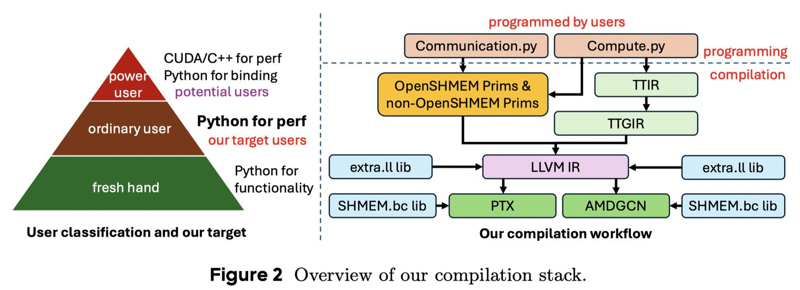

# Triton-distributed: Programming Overlapping Kernels on Distributed AI Systems with the Triton Compiler

> Size Zheng, Wenlei Bao, Qi Hou, Xuegui Zheng, Jin Fang, Chenhui Huang, Tianqi Li, Haojie Duanmu, Renze Chen, Ruifan Xu, Yifan Guo, Ningxin Zheng, Ziheng Jiang, Xinyi Di, Dongyang Wang, Jianxi Ye, Haibin Lin, Li-Wen Chang, Liqiang Lu, Yun Liang, Jidong Zhai, Xin Liu

## 一句话总结

Triton-distributed 是首个支持分布式 AI 工作负载原生重叠优化的编译器扩展，通过在 Triton 编译器中集成 OpenSHMEM 兼容的通信原语，实现 Python 层面的计算-通信重叠编程，性能在多达 64 设备的集群上超越或媲美手写 CUDA/C++ 代码，同时大幅降低开发难度。

## 摘要翻译

随着单芯片扩展逐渐接近瓶颈，单个加速器已无法支持现有大语言模型的训练和推理。因此，使用多加速器组成的分布式系统进行训练和推理已成为迫切需求。在分布式系统中，有三种基本活动并发发生：计算、内存访问和通信。在现有训练/推理框架中，这些方面通常在不同编程层次上独立优化，导致这些活动难以协调，无法充分发挥集群的全部性能潜力。

本报告提出 Triton-distributed，作为现有 Triton 编译器的扩展，以克服分布式 AI 系统中的编程挑战。Triton-distributed 是首个支持分布式 AI 工作负载原生重叠优化的编译器，提供了对不同框架现有优化的良好覆盖。首先，我们将符合 OpenSHMEM 标准的通信原语集成到编译器中，使程序员能够利用这些原语，使用更高级的 Python 编程模型。其次，我们说明如何在编译器的辅助下实现计算、内存访问和通信的复杂联合优化。特别是，我们展示如何使用重叠技术来隐藏延迟，并在单节点和多节点场景中呈现基于编译器的编程方法。最后，我们展示了编译器生成代码的性能。在最多 64 个设备的测试环境中，编译器能够充分利用异构通信和计算资源，提供有效的重叠和高性能。在许多情况下，生成代码的性能甚至可以超越手写优化代码。此外，使用编译器的开发难度和时间成本远低于 CUDA/C++ 等低级编程，这清楚地展示了显著的生产力优势。

## 研究动机

随着大语言模型（LLM）规模的持续增长，单芯片性能提升已接近瓶颈，分布式系统成为必需。分布式编程面临以下核心挑战：

1. **计算-通信重叠困难**：在现有框架中，计算、内存访问和通信往往在不同层次独立优化，难以协调。随着集群规模指数级增长，计算与通信的重叠变得至关重要。例如，ByteDance 的 COMET 通过此技术节省了数百万 GPU 小时。

2. **编程鸿沟**：分布式开发需要 CUDA/C++ 编程，而算法开发通常在 Python 中进行，存在跨语言编程需求，导致开发效率下降。

3. **现有编译器局限**：虽然有多种编译器（如 TVM、Triton、Pallas 等），但它们主要关注单设备场景，缺乏对分布式计算-通信重叠的原生支持。

4. **框架碎片化**：不同框架（NCCL、PyTorch、TE、Pallas、FLUX 等）各自实现了部分重叠优化，但没有统一的编译器框架覆盖所有这些优化。

Triton-distributed 的目标是弥合这些鸿沟，提供一个统一的编译器框架，在 Python 层面实现高效的分布式计算-通信重叠。

## 方法（技术细节）

### 1. 编程模型

Triton-distributed 采用 MPMD（Multiple Programs Multiple Data）编程模型，核心包含三个概念：

- **对称内存（Symmetric Memory）**：每个 rank 在全局范围内分配相同大小的内存缓冲区，每个缓冲区有独立地址空间，没有统一虚拟地址（UVA）。远程内存缓冲区不能直接通过指针访问，需要通过特定原语进行远程数据传输。

- **信号交换（Signal Exchange）**：各 rank 上的操作使用信号进行一致通信。信号是驻留在对称内存中的数据对象，支持设置值、增加值、检查值和自旋锁操作。

- **异步任务（Async-Task）**：数据传输和计算被视为并行运行的异步任务，可通过信号同步。即使在同一 rank 上，操作也是异步的。对于不同硬件后端，异步任务的实现方式不同（GPU 上使用多流或多线程）。

### 2. 通信原语

Triton-distributed 提供两套通信原语：

**OpenSHMEM 原语**：符合 OpenSHMEM 标准，对应 NVSHMEM（NVIDIA）和 ROCSHMEM（AMD）的实现，包括：
- `my_pe`/`n_pes`：获取设备 ID 和设备总数
- `putmem`/`getmem`：阻塞式远程数据传输
- `putmem_nbi`/`getmem_nbi`：非阻塞式远程数据传输
- `putmem_signal`/`putmem_signal_nbi`：带信号的远程数据传输
- `signal_op`/`signal_wait_until`：信号操作和等待
- `barrier_all`/`sync_all`/`quiet`/`fence`：同步和屏障操作

**非 OpenSHMEM 原语**：提供互补功能，专为优化设计：
- `wait`/`consume_token`/`notify`：构建信号操作与 MMA 操作之间的数据依赖
- `atomic_cas`/`atomic_add`：原子操作
- `ld_acquire`/`red_release`：具有特定语义的加载/存储
- `multimem_ld_reduce`/`multimem_st`：多设备内存的加载和存储

### 3. 重叠优化技术

Triton-distributed 覆盖了 13 种不同的优化技术，这是首个在单一框架内覆盖所有这些优化的编译器：

| 优化技术 | 说明 |
|---------|------|
| Intra-Node Swizzle | 节点内通信操作和计算操作顺序调整 |
| Inter-Node Swizzle | 跨节点的通信/计算顺序调整 |
| Inter-NUMA Swizzle | 跨 NUMA 的通信/计算顺序调整 |
| Copy Engine | 利用 GPU 专用 DMA 引擎进行数据传输 |
| High-BW Link | 利用 NVLink/xGMI 等高带宽链路 |
| Network Communication | 跨节点网络通信优化 |
| PCIe Communication | PCIe 链路上的通信调度 |
| OpenSHMEM Support | 使用 NVSHMEM/ROCSHMEM 调度通信 |
| Low-latency Protocol | 使用低延迟协议实现无屏障通信 |
| Multimem Feature | 利用硬件特性进行广播/规约 |
| Fusion | 将处理逻辑融合到通信中（数据转换、转置、简单算术等）|
| Code Generation | 及时代码生成和调优支持 |
| Nvidia/AMD | 硬件特定优化（MMA 指令、warp 特化、TMA 指令等）|

### 4. 关键内核实现

#### 节点内 AllGather（Copy Engine）
- 使用 GPU 专用 DMA 引擎进行数据传输
- 支持 push 模式（无需额外同步，但数据到达顺序不可控）和 pull 模式（需要额外同步，但可控制数据到达顺序）
- 通过信号实现通信与计算的细粒度重叠

#### 节点内 ReduceScatter（Copy Engine）
- 分为两个并行部分：本地数据分片推送和本地规约
- 两个部分通过信号互相通信
- 使用多个流实现异步操作

#### 跨节点 AllGather（低延迟协议 + Multimem）
- 使用 `multimem_st` 原语实现 NVLink 广播（约 1.5µs）
- 使用 LL（Low-Latency）协议进行跨节点通信，依赖 NVIDIA GPU 的 8 字节数据原子操作特性
- 将数据和标志打包在一起，接收方通过自旋锁检查数据是否到达
- 基线延迟约 25µs，优化后约 13.5µs

#### 跨节点 ReduceScatter（异构通信）
- 分解为三个阶段：节点内 scatter、本地规约、跨节点 P2P 通信
- 节点内 scatter 映射到 Copy Engine（不占用 SM）
- P2P 通信仅需 1 个 SM
- 本地规约使用最少 SM（H800 上不超过 15 个）
- 通过资源分区实现完美重叠

#### Swizzling 优化
- 控制 tile 的执行顺序，以提高缓存利用率（如 L2 缓存）和通信效率
- Nvidia H800 使用 NVSwitch 拓扑（单链路 200 GB/s），AMD MI308X 使用全网状拓扑（7 条链路，每条 50 GB/s）
- 不同拓扑需要不同的 swizzle 设计
- 支持节点内和跨节点的 swizzle

#### 自动调优与资源分区
- 开发了专门针对分布式内核的自动调优器，考虑通信和同步需求
- 资源分区将计算和通信映射到不同处理单元，确保所有异步任务同时完成（避免长尾效应）

### 5. 支持的内核

| 内核名称 | 说明 | 测试硬件 |
|---------|------|---------|
| AG+GEMM-intra | 节点内 AllGather GEMM 重叠 | 8x H800/MI308X |
| GEMM+RS-intra | 节点内 GEMM ReduceScatter 重叠 | 8x H800/MI308X |
| AG+MoE-intra | 节点内 AllGather MoE GroupGEMM 重叠 | 8x H800 |
| MoE+RS-intra | 节点内 MoE GroupGEMM ReduceScatter 重叠 | 8x H800 |
| FlashDecode+AG-intra | 节点内 Flash Decode AllGather 和 Combine | 8x H800 |
| AllToAll-intra | 节点内低延迟 AllToAll | 8x H800 |
| AG+GEMM-inter | 跨节点 AllGather GEMM 重叠 | 16x H800 |
| GEMM+RS-inter | 跨节点 GEMM ReduceScatter 重叠 | 16x H800 |
| AG+MoE-inter | 跨节点 AllGather MoE GroupGEMM 重叠 | 16x H800 |
| MoE+RS-inter | 跨节点 MoE GroupGEMM ReduceScatter | 16x H800 |
| FlashDecode+AG-inter | 跨节点 Flash Decode AllGather 和 Combine | 16/32x H800 |
| AllToAll-inter | 跨节点低延迟 AllToAll | 16/32/64x H800 |

## 实验结果

### NVIDIA GPU 节点内性能（8x H800）

- **AG+GEMM**：相比 PyTorch+NCCL 平均加速 1.42×，相比 FLUX 加速 1.09×
- **GEMM+RS**：相比 PyTorch+NCCL 平均加速 1.28×，相比 FLUX 加速 1.30×
- **AG+MoE**：相比 PyTorch+NCCL 平均加速 44.97×（基线较弱）
- **MoE+RS**：相比 PyTorch+NCCL 平均加速 15.55×（基线较弱）

### NVIDIA GPU 跨节点性能（16x H800）

- **AG+GEMM**：相比 PyTorch+NCCL 平均加速 1.33×，达到 FLUX 95.60% 性能
- **GEMM+RS**：相比 PyTorch+NCCL 平均加速 1.42×，达到 FLUX 96.36% 性能
- **AG+MoE**：相比 PyTorch+NCCL 平均加速 26.50×
- **MoE+RS**：相比 PyTorch+NCCL 平均加速 5.16×

### 分布式 Flash Decoding

- 扩展 Flash Decoding 到多设备（节点内和跨节点）
- 弱扩展（每 GPU KV 长度不变）：HBM 带宽保持高位，32 GPU 时达 1.7 TB/s
- 强扩展（全局 KV 长度不变）：GPU 数量增加时带宽下降
- 解码延迟：全局 KV 长度 < 256K 时增加 GPU 无益；1M 时 GPU 越多延迟越低

### 低延迟 AllGather（L20 GPU，PCIe）

- 节点内（8x L20）：相比 NVSHMEM 提升 1.40×-1.48× 带宽，相比 NCCL 提升 3.00×-3.11× 带宽
- 跨节点（16x L20）：相比 NVSHMEM-64bit 提升 1.31×，相比 NVSHMEM-32bit 提升 1.38×

### 低延迟 AllToAll

- 用数百行 Python 代码重新实现 DeepEP 的 AllToAll 内核
- 8-64 GPU 规模下，推理 AllToAll Dispatch 平均加速 1.18×，AllToAll Combine 加速 1.44×
- 128 GPU 以上规模时 DeepEP 仍优于 Triton-distributed（因 DeepEP 使用 IBGDA 协议，可扩展性更好）

### AMD GPU 节点内性能（8x MI308X）

- **AG+GEMM**：相比 PyTorch+RCCL 平均加速 1.09×
- **GEMM+RS**：相比 PyTorch+RCCL 平均加速 1.16×

### 综合性能

- 在多达 64 设备的集群上，加速比范围 1.09× 至 44.97×
- 编译器生成代码在许多场景下超越手写优化代码
- 开发难度和时间成本远低于 CUDA/C++

## 优势

1. **统一编程模型**：将分布式通信和计算统一到 Python 层面，无需跨语言编程
2. **原生重叠支持**：首个支持分布式 AI 工作负载原生计算-通信重叠的编译器
3. **广泛优化覆盖**：覆盖 13 种优化技术，超越所有现有框架
4. **多硬件支持**：利用 Triton 的多硬件支持，同时支持 NVIDIA 和 AMD GPU，以及未来的 NPU
5. **高性能**：在许多场景下性能超越或媲美手写 CUDA/C++ 代码
6. **低开发门槛**：开发难度和时间成本远低于低级编程
7. **细粒度重叠**：支持算子级和内核级的细粒度计算-通信重叠
8. **自动化调优**：专门针对分布式内核的自动调优器，考虑通信和同步需求
9. **可扩展性**：支持从 8 到 64 设备的集群，具有良好的弱扩展性

## 局限

1. **大规模扩展性能下降**：跨节点 MoE+RS 的扩展性不如预期（延迟增长非线性），需要专门的 ReduceScatter 内核
2. **128+ GPU 规模不如 DeepEP**：在超大规模（128+ GPU）下，DeepEP 使用 IBGDA 协议具有更好的可扩展性，而 Triton-distributed 使用 IBRC，扩展性有限
3. **GEMM 性能略低于最优**：Triton 生成的 GEMM 代码性能约为 cuBLAS/CUTLASS 的 95%，虽然通过更好的重叠弥补了这一差距，但仍有提升空间
4. **需要目标硬件支持核心概念**：需要硬件支持对称内存、信号交换和异步任务三个核心概念，限制了可移植性
5. **自旋锁开销**：低延迟协议中的自旋锁可能引入额外开销
6. **不支持 IBGDA**：当前 NVSHMEM 位码库不支持 IBGDA 协议，限制了大规模集群的性能
7. **AMD GPU 优化有限**：AMD GPU 上的性能提升相对较小（1.09×-1.16×），且存在驱动 API 干扰计算内核的问题
8. **代码示例较复杂**：虽然开发难度低于 CUDA/C++，但通信逻辑仍需理解复杂的信号交换和重叠机制

## 与 EfficientPaper 相关的研究方向

1. **分布式编译器优化**：Triton-distributed 代表了分布式编译器的重要进展，与单设备编译器（如 Triton、TVM、Pallas）形成互补，是编译器领域从单设备向分布式演进的关键一步

2. **计算-通信重叠**：核心研究方向，涉及自动重叠优化、swizzling 技术、资源分区等，对训练和推理的效率提升至关重要

3. **MoE（混合专家）优化**：论文中包含 MoE 相关的 AllGather 和 ReduceScatter 内核，是 MoE 模型高效训练的关键技术

4. **Flash Decoding 扩展**：将 Flash Decoding 扩展到多设备，为超长上下文推理提供支持，与推理效率优化相关

5. **AllToAll 通信优化**：低延迟 AllToAll 对专家并行的 MoE 模型至关重要，论文提供了高性能实现

6. **多硬件支持**：支持 NVIDIA 和 AMD GPU，以及未来可能的 NPU，与硬件异构优化相关

7. **自动调优**：专门针对分布式内核的自动调优器，是自动调优领域的重要进展

8. **TileLink**：基于 Triton-distributed 的更高层编译器 TileLink，提供更高级的通信原语，是进一步降低编程难度的方向

9. **编程模型创新**：MPMD 编程模型和对称内存/信号交换/异步任务的核心概念，为分布式编程提供了新的抽象

10. **大规模 LLM 训练/推理**：论文中的内核优化直接应用于大规模 LLM 的训练和推理，是高效 AI 系统的基础设施

---

> ⚠️ 本 note 由 AI Agent（Hermes Agent）自动生成，基于论文全文阅读和分析。生成时间：2026年6月4日。
