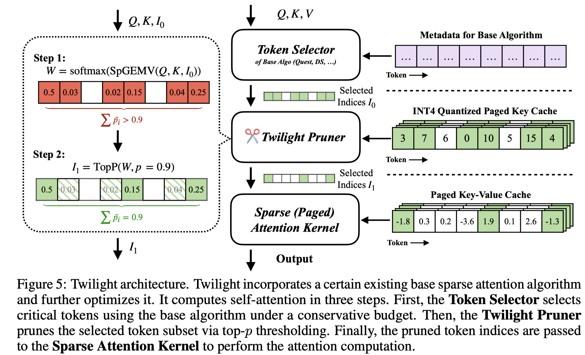

# Twilight: Adaptive Attention Sparsity with Hierarchical Top-$p$ Pruning

> Chaofan Lin, Jiaming Tang, Shuo Yang, Hanshuo Wang, Tian Tang, Boyu Tian, Ion Stoica, Song Han, Mingyu Gao

## Abstract

Leveraging attention sparsity to accelerate long-context large language models (LLMs) has been a hot research topic. However, current algorithms such as sparse attention or key-value (KV) cache compression tend to use a fixed budget, which presents a significant challenge during deployment because it fails to account for the dynamic nature of real-world scenarios, where the optimal balance between accuracy and efficiency can vary greatly. In this paper, we find that borrowing top-$p$ sampling (nucleus sampling) to sparse attention can surprisingly achieve adaptive budgeting. Based on this, we propose Twilight, a framework to bring adaptive sparsity to any existing sparse attention algorithm without sacrificing their accuracy. Empirical results show that Twilight can adaptively prune at most 98% of redundant tokens, leading to $15.4\times$ acceleration in self-attention operations and $3.9\times$ acceleration in end-to-end per token latency in long context LLM decoding.
