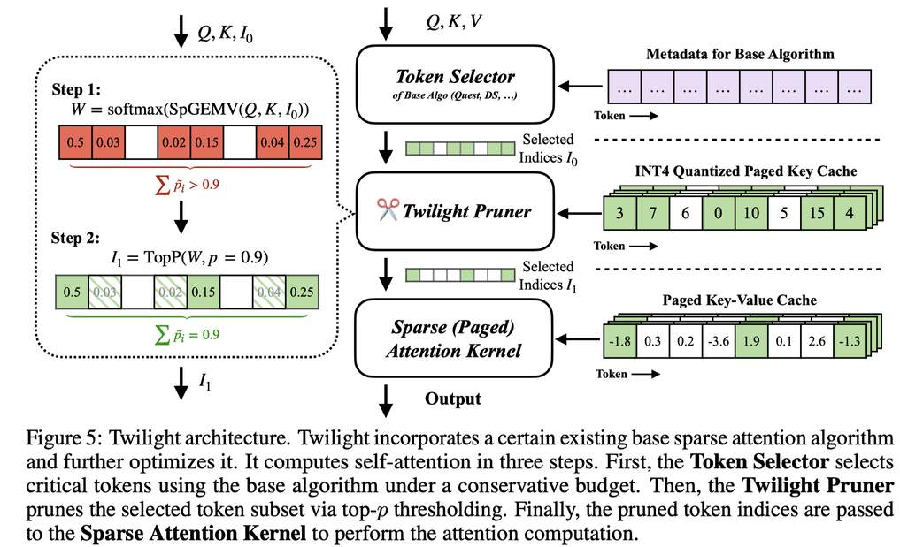

# Twilight: Adaptive Attention Sparsity with Hierarchical Top-$p$ Pruning

> Chaofan Lin, Jiaming Tang, Shuo Yang, Hanshuo Wang, Tian Tang, Boyu Tian, Ion Stoica, Song Han, Mingyu Gao

> ⚠️ 本文档由 AI Agent 自动生成，内容基于论文全文阅读与分析。生成时间：2025年6月。如有疏漏请以原文为准。

---

## 一句话总结

Twilight 将 top-p 采样（nucleus sampling）思想引入稀疏注意力机制，通过层次化的"先选择再剪枝"（Select-then-Prune）架构，为任何现有 top-k 稀疏注意力算法赋予自适应预算选择能力，实现最高 98% 的冗余 token 剪枝、15.4× 自注意力算子加速和 3.9× 端到端解码加速，且几乎不损失精度。

---

## 摘要翻译

利用注意力稀疏性来加速长上下文大语言模型（LLM）已成为热门研究方向。然而，现有的稀疏注意力算法（如 sparse attention 或 KV cache 压缩）通常使用固定的预算（即选择多少 token），这在实际部署中面临重大挑战，因为无法适应真实场景中准确率与效率之间最优平衡的动态变化。在本文中，我们发现将 top-p 采样（nucleus sampling）思想引入稀疏注意力，可以出人意料地实现自适应预算分配。基于此，我们提出了 Twilight，一个能够在不牺牲现有稀疏注意力算法准确率的前提下，为其赋予自适应稀疏能力的框架。实验结果表明，Twilight 可以自适应地剪枝多达 98% 的冗余 token，在长上下文 LLM 解码中实现自注意力操作 15.4× 加速和端到端每 token 延迟 3.9× 加速。

---

## 研究动机

长上下文 LLM（如支持 1M~10M token 上下文窗口的模型）在检索、摘要、代码生成等应用中发挥重要作用，但其注意力机制带来极高的计算和内存开销。现有稀疏注意力方法的核心思想是仅计算一个 token 子集（关键 token / heavy hitters），使用 top-k 选择预算 B 个 token。然而，top-k 方法面临一个根本性的矛盾：

1. **预算的动态性**：不同注意力头的权重分布差异巨大——有些头呈现"聚焦"（focused）分布（权重集中在少量 token 上），有些则呈现"扩散"（diffuse）分布（权重均匀分散）。固定预算在聚焦分布下会导致过度选择（over-selection），在扩散分布下则导致选择不足（under-selection）。
2. **算法差异性**：不同稀疏注意力算法（如 Quest、DS）对过选程度的需求不同，需要各自离线校准预算。
3. **维度多样性**：预算的最优值在不同提示（prompt）、查询（query）、层（layer）、头（head）之间都存在差异。

论文从 LLM 采样阶段的 top-p 采样（nucleus sampling）中获得灵感——top-p 采样通过累积概率阈值自适应地决定采样数量，同样可以用来动态决定注意力预算。

---

## 方法（技术细节）

### 核心思想：Top-p 稀疏注意力

与 top-k 固定选择 B 个 token 不同，top-p 稀疏注意力定义为：**选择最少数量的 token，使其累积注意力权重之和达到阈值 p**。

- **Oracle Top-k**：$I = \arg\max_I \sum_{i \in I} W[i]$，约束 $|I| = B$（固定数量）
- **Oracle Top-p**：$I = \arg\min_I |I|$，约束 $\sum_{i \in I} W[i] \geq p$（固定累积权重）

Top-p 的优势：
- 提供误差上界：$(1-p) \cdot \|V\|_F$
- 自适应不同分布：聚焦分布只需少量 token，扩散分布自动选择更多
- 超参 p 更合理：p 代表累积概率，对不同分布的敏感度远低于 k

### 三层架构：Select-then-Prune

Twilight 采用层次化剪枝框架，将现有 top-k 算法视为黑盒"Token Selector"：

1. **Step 1 - Token Selector（基础算法）**：使用原始 top-k 算法（如 Quest、DS），以保守的较大预算（如 1/4 稀疏度）选择关键 token 集 $I_0$
2. **Step 2 - Twilight Pruner**：对 $I_0$ 中的 token 计算注意力权重，并使用 top-p 阈值进一步剪枝，得到 $I_1$（更小的子集）
3. **Step 3 - Sparse Attention Kernel**：仅在 $I_1$ 上执行稀疏注意力计算

### 高效内核实现

- **4-bit 量化 K cache 的 SpGEMV**：对 K cache 进行 INT4 非对称量化，将内存访问减少至 1/4。研究发现 4-bit 是 top-p 的最佳精度（2-bit 精度不足，8-bit 精度过剩），通过 FlashInfer 实现高效稀疏 GEMV
- **基于二分搜索的 Top-p 实现**：避免低效的排序，采用并行友好的二分搜索（Algorithm 1），利用 GPU 的逐元素操作（max、where、sum）融合到单个循环
- **负载均衡**：复用 FlashInfer 的负载均衡算法，通过展平 head 维度来解决 top-p 带来的 head 级动态预算不均衡问题

### 理论加速分析

- 执行时间由三部分组成：$T_{TokenSel} + T_{Pruner} + T_{SparseAttn}$
- 相比基线算法，引入 $T_{Pruner}$ 但大幅减少 $T_{SparseAttn}$
- 理论加速比约为 $\frac{N/16 + B_0}{N/16 + B_0/4 + B_1}$，假设 $B_0 = N/4$, $B_1 = N/64$，可达约 2×
- 额外内存开销为 INT4 K cache 的 1/8，可通过复用已有 INT4 cache 或选择性量化缓解

---

## 实验结果

### 精度评估

#### 长上下文基准（Longbench，12 个任务）

| 方法 | Longchat-7B-v1.5-32k | LLaMA-3.1-8B-Instruct |
|------|----------------------|------------------------|
| Full | 36.78 | 52.01 |
| Quest + Twilight | 38.04 (+2.5%) | 51.57 (+0.3%) |
| DS + Twilight | 38.71 (+5.7%) | 51.73 (+1.2%) |
| MagicPIG | — | 51.70 |

Twilight 在 Longchat 上甚至**超过了全注意力**（+4.7%），LLaMA-3.1 上几乎无损（<1%）。

#### RULER 基准

| 方法 | 16k | 32k | 64k | 96k | Avg |
|------|-----|-----|-----|-----|-----|
| Full | 92.88 | 89.42 | 85.17 | 85.23 | 88.18 |
| Quest-Twi | 91.53 | 87.97 | 84.12 | 82.96 | 86.65 |
| DS-Twi | 93.54 | 89.24 | 85.91 | 82.81 | 87.88 |

DS-Twi 达到 SOTA，超越所有现有方法。

#### 中等上下文基准（GSM8K、COQA、PG-19）

Twilight 在中等上下文任务上几乎无精度损失，平均预算约 90-112 token（远低于基线的固定 128 预算）。

### 效率评估

#### 自注意力算子加速（A100 GPU）

- FlashInfer-Twi：最高 6.5×（vs FlashAttention2），2.4×（vs FlashInfer）
- Quest-Twi：最高 15.8×（vs FlashAttention2），1.4×（vs Quest）
- 在 batch size 64、序列长度 30k 时加速最显著

#### 端到端解码加速

- Quest-Twi 最高 3.9×（vs FlashInfer），1.35×（vs Quest）
- 随 batch size 和序列长度增加，加速比提升

### 消融实验

- **p 敏感性**：p ≈ 0.85 在准确率和效率间取得最佳平衡；p 是比 k 更稳定的超参（不随分布变化而剧烈波动）
- **时间分解**：Twilight 显著减少稀疏注意力内核时间，引入的 Pruner 开销较小

---

## 优势

1. **通用性强**：可作为"优化器"附加到任何现有 top-k 稀疏注意力算法（Quest、DS 等），无需重新设计算法
2. **自适应性**：通过 top-p 阈值动态调整预算，自动适应不同 head/layer/prompt 的注意力分布
3. **高效实现**：4-bit 量化 K cache + 二分搜索 Top-p + 负载均衡，系统开销可控
4. **显著加速**：自注意力 15.4× 加速，端到端 3.9× 加速，相对基线算法额外 1.4×
5. **精度优秀**：在 Longbench 上甚至超过全注意力，中等上下文几乎无损
6. **兼容性好**：与 PagedAttention、vLLM、SGLang 等主流系统无缝集成，支持 prefix sharing 和多阶段注意力
7. **超参简洁**：只需设置一个阈值 p，比多预算 k 更容易调参

---

## 局限

1. **额外内存开销**：引入 INT4 量化 K cache 带来约 1/8 的额外 KV cache 内存，尽管可通过选择性量化缓解，但仍是额外成本
2. **Pruner 开销**：虽然相对较小，但 top-p 剪枝步骤仍引入额外延迟，在极短序列或极低 batch size 下可能不划算
3. **精度要求**：top-p 对注意力权重精度的要求高于 top-k（需要一定数值精度，而非仅需排序），因此不能像 top-k 那样使用极低精度（如 1-2 bit）
4. **超参 p 仍需校准**：虽然 p 比 k 更稳定，但仍需针对具体模型进行校准（如通过小数据集）
5. **仅针对解码阶段**：主要优化解码阶段的注意力，预填充阶段的优化需要额外考虑（如 SampleAttention 已关注预填充）
6. **并发工作**：同时期的 Tactic 方法也探索了 top-p 稀疏，但采用函数拟合估计权重分布，可能有不同的权衡

---

## 与 EfficientPaper 相关的研究方向

- **KV Cache 稀疏化**：Twilight 的核心 keyword 为 `kv_cache_sparse`，是 KV cache 稀疏化领域的前沿工作。与 Quest（baseline）、DS、H2O 等方法紧密关联
- **自适应预算分配**：与 PyramidKV、Ada-KV、DynamicKV、RazorAttention 等动态预算方法形成互补或对比
- **注意力机制优化**：与 FlashAttention、SageAttention、MagicPIG、SampleAttention 等注意力加速工作正交，可组合使用
- **LLM 推理系统**：与 vLLM（PagedAttention）、SGLang、FlashInfer 等服务系统深度集成
- **量化与压缩**：与 KVQuant、KIVI、GEAR、Atom 等 KV cache 量化工作相关，Twilight 使用 4-bit 量化作为辅助手段
- **长上下文模型**：与支持长上下文的 LLM（如 Longchat、LLaMA-3.1-8B-Instruct）的应用场景紧密相关
- **可训练稀疏注意力**：与 NSA（Native Sparse Attention）、MoBA 等可训练稀疏方法存在对比关系
