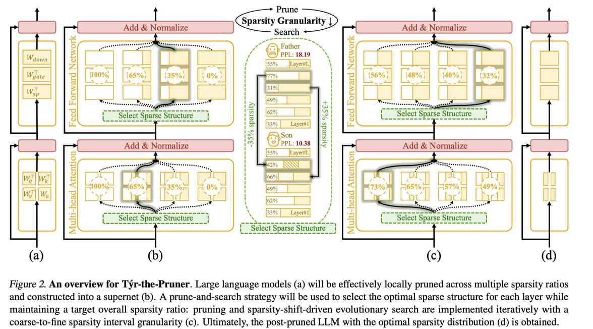

# Týr-the-Pruner: Unlocking Accurate 50% Structural Pruning for LLMs via Global Sparsity Distribution Optimization

> Guanchen Li, Yixing Xu, Zeping Li, Ji Liu, Xuanwu Yin, Dong Li, Emad Barsoum
>
> Advanced Micro Devices (AMD)



---

> ⚠️ **本笔记由 AI Agent 自动生成**，基于论文全文阅读，仅供参考。

---

## 一句话总结

Týr-the-Pruner 是一种基于超网搜索的全局结构化剪枝框架，通过构建多稀疏度比的超网并结合进化搜索，在仅需 4M token 校准的条件下，实现 Llama-3.1-70B 模型 50% 参数剪枝后仍保留 97% 性能的 SOTA 结果。

---

## 摘要翻译

结构化剪枝可以提升大语言模型（LLM）在硬件无关场景下的推理效率，但往往难以维持模型性能。局部剪枝虽然可以高效地逐层压缩，但忽略了全局拓扑结构；全局剪枝虽然有潜力找到最优解，但计算资源消耗大。现有方法倾向于对结构显著性进行统一排序，忽略了结构间的依赖关系，且无法实现端到端优化。为解决这些局限，本文提出了 Týr-the-Pruner，一种高效的端到端搜索式全局结构化剪枝框架。该框架通过在 LLM 的每一层以不同稀疏度比反复应用局部剪枝来构建超网，核心目标是在目标总体稀疏度比下确定最优的稀疏度分布。具体地，我们引入了一种有效的局部剪枝方法和期望误差累积方法来改进超网构建。此外，我们采用迭代的剪枝-搜索策略，配合从粗到细的稀疏度粒度，以确保高效的搜索收敛。实验结果表明，Týr-the-Pruner 实现了 SOTA 的结构化剪枝，在移除 Llama-3.1-70B 的 50% 参数后，仍保留了 97% 的密集模型性能。

---

## 研究动机

LLM 的部署面临巨大的计算和存储资源开销，限制了在资源受限场景中的应用。模型压缩技术（量化、剪枝、低秩分解）是减少 LLM 规模和计算需求的关键方法。

**结构化剪枝**的优势在于可以实现硬件无关的加速（即不依赖特定硬件的稀疏加速器），但面临两大核心挑战：

1. **局部剪枝**（如 ZipLM、OSSCAR）：逐层独立剪枝，可单 GPU 运行，但忽略全局拓扑，限制稀疏度跨层均匀分布。
2. **全局剪枝**（如 LLM-Pruner、FLAP）：支持自定义稀疏度分配，有潜力找到最优解，但依赖内存密集的梯度反向传播，且统一排序结构显著性忽略了结构间的依赖关系，难以实现端到端优化。

**核心问题**：如何实现高效的全局结构化剪枝并进行端到端优化？

---

## 方法（技术细节）

### 整体框架

Týr-the-Pruner 是一个基于超网（supernet）的全局结构化剪枝框架，由以下核心模块组成：

1. **有效的局部剪枝**（Effective Local Pruning）
2. **超网构建与期望误差累积**（Prune-to-supernet with Expectation Error Accumulation）
3. **迭代剪枝-搜索策略**（Iterative Prune-and-Search）

### 2.1 有效的局部剪枝

局部剪枝的目标是确定每一层中需要剪掉的冗余输入通道，并调整剩余权重。

**冗余通道识别与权重调整：**

采用 Taylor 展开近似剪枝误差函数，同时考虑一阶梯度（G）和二阶 Hessian（H）信息：

- **通道选择**：通过最小化 `||G_p W_p^T|| + ||W_p||^2 / (2[H^-1]_pp)` 识别影响最小的通道
- **权重调整**：通过 Lagrange 乘子法求解 `δW = (I - e_p e_p^T)(-H^{-1}_{~p,~p} G_{~p,:})`，补偿剪枝误差

**渐进式剪枝（Progressive Pruning）：**

采用细粒度的逐步剪枝策略，每次只剪一个通道，让未剪通道能逐步、均匀地补偿损失。关键在于利用 Sherman-Morrison-Woodbury 公式快速更新逆 Hessian 矩阵，复杂度为 O(d²_in)：

```
H^{-1} ← H^{-1} - (1/[H^{-1}]_{pp}) * H^{-1}_{:,p} * H^{-1}_{p,:}
```

### 2.2 超网构建与期望误差累积

超网通过对每一层以不同稀疏度比（如 0%、12.5%、25%、...、50%）应用局部剪枝来构建。每层产生多个稀疏结构副本。

**核心挑战：** 多个稀疏结构导致误差累积路径不明确。

**期望误差累积方法：**

定义层输出激活为各稀疏结构输出的加权平均：

```
X_{l+1} = Σ_e [(1-S_e) / Σ_e(1-S_e)] * X_{l+1,e}
```

其中 S_e 是第 e 个稀疏结构的稀疏度。低稀疏度权重的缩放因子更大，因为它们的输出激活更稳定可靠。这确保了各稀疏结构间的平衡互感知。

**实验验证：** 对 Llama-3.1-8B 进行 50% 剪枝，不使用误差累积的困惑度为 538.23，使用期望误差累积方法的困惑度为 66.38（接近完全误差累积的 58.09）。

### 2.3 迭代剪枝-搜索策略

**搜索目标定义：** 使用知识蒸馏（KD）作为搜索优化目标，优先选择与密集模型行为更相似的稀疏结构，避免单任务过拟合。

```
{ê} = argmin{e} Σ_l α_l ||h^dense_l - h^sparse_{l,e}||^2 + β KL(z^dense || z^sparse_{e})
```

**进化搜索：** 通过层间稀疏度偏移（sparsity shift）生成候选方案，选择表现最佳的作为下一代的父代。进化搜索无需额外参数，且支持即时加载稀疏结构（JIT loading），效率高。

**从粗到细的迭代策略：**

- 第一轮：12.5% 粒度（9 个稀疏结构/层），搜索空间小
- 后续轮次：以当前最优稀疏度为中心，将粒度减半（如 12.5% → 6.25% → ...），逐步细化
- 仅需 4 次迭代即可达到与直接细粒度搜索相同的精度

搜索空间从 10^145 量级降低到 10^76 量级，显著减少搜索时间和代数。

---

## 实验结果

### 实验设置

- **模型：** Llama-2 (7B/13B/70B)、Llama-3.x (2-3B/0-8B/1-8B/70B)、Mistral (7B-v0.3/Nemo)
- **校准数据：** FineWeb-Edu，约 4M token（约 1K 样本，最大输入长度 4K）
- **评测指标：** WikiText-2 困惑度（PPL）、零样本下游任务准确率（ARC、BoolQ、HellaSwag、OpenBookQA、RTE、WinoGrande、MMLU-5shot）
- **基线方法：** ShortGPT、LaCO+、SliceGPT、Wanda-sp、LLM-Pruner、ZipLM、OSSCAR、FLAP

### 主要结果

#### 低稀疏度（≤25%）
- 在 12.5% 稀疏度下，Llama-3-8B 的 PPL 为 7.39（最低），下游平均准确率 62.37%（最高）
- 相比之前的 SOTA（LLM-Pruner、LaCO+），准确率分别高出 8.0% 和 2.6%

#### 高稀疏度（≥37.5%）
- 37.5% 稀疏度下，Mistral-Nemo 的 PPL 为 11.47，准确率 55.63%，大幅超过 ZipLM 和 FLAP
- 多数现有方法在高稀疏度下 PPL 超过 100，准确率低于 40%

#### 大规模模型（70B 级别）
- **Llama-2-70B @ 50% 稀疏度：** 平均准确率 64.40%（96% 保持率），最优结果
  - 对比：ZipLM 62.05%（92%）、OSSCAR 62.25%（93%）、FLAP 54.65%（81%）、LLM-Pruner 32.39%（48%）
- **Llama-3.1-70B @ 50% 稀疏度：** 平均准确率 68.56%（**97% 保持率**），刷新 SOTA
  - 对比：ZipLM 62.89%（89%）、OSSCAR 62.75%（89%）、FLAP 53.94%（76%）、LLM-Pruner 32.04%（45%）

#### 推理效率
- Llama-3.1-8B @ 50% 稀疏度：
  - TTFT（首 token 时间）降低 43%，加速 1.75 倍
  - 解码吞吐量提升 38%
- 测试硬件：单张 AMD Instinct™ MI250 加速器

#### 消融实验
- **校准数据：** FineWeb-Edu 始终优于 C4 和 WikiText-2
- **渐进式剪枝：** 对准确率有显著影响，不可省略
- **期望误差累积：** 相比无误差累积（PPL 538.23）、随机误差累积（208.92）表现最佳
- **搜索方向：** KD-Loss 优于单任务 PPL 搜索，KD-Loss Logits-only 在资源和性能间取得平衡
- **执行效率：** 迭代策略比纯搜索策略收敛更快，搜索代数更少，最终模型准确率更高（47.79 vs 43.58）

---

## 优势

1. **SOTA 性能：** 在所有稀疏度比（12.5%-50%）和所有测试模型（Llama-2/3、Mistral）上均取得最优或接近最优结果
2. **高效搜索：** 仅需 4M token 校准和搜索，迭代剪枝-搜索策略将搜索空间降低数个数量级，单代进化搜索仅需 190 秒
3. **硬件无关加速：** 结构化剪枝可直接获得硬件无关的推理加速，50% 稀疏度下 TTFT 降低 43%
4. **端到端优化：** 超网构建 + 进化搜索实现全局最优稀疏度分布，避免了局部剪枝的全局拓扑缺失
5. **大规模可扩展性：** 在 70B 级别模型上仍保持 97% 性能（50% 稀疏度），证明了方法的可扩展性
6. **无需反向传播：** 进化搜索无需梯度反向传播，内存开销低
7. **AMD 生态友好：** 由 AMD 团队提出，使用 AMD 硬件进行推理测试

---

## 局限

1. **剪枝粒度有限：** 仅考虑了 attention heads 和 FFN 中间神经元的剪枝，未涉及嵌入维度和模型深度的剪枝
2. **超网构建开销：** 需要为每层构建多个稀疏结构副本（如 9 个），超网构建过程仍需一定的计算资源
3. **校准数据敏感性：** 对校准数据质量有较高要求（FineWeb-Edu 效果最佳），但仅需 4M token，效率较高
4. **KD 搜索开销：** KD 搜索需要计算层间激活和 logits 的损失，完全 KD 需要 96 GB 内存（用于隐藏激活检查点），论文采用 logits-only 版本作为折中
5. **搜索收敛依赖启发式：** 进化搜索的收敛性依赖于进化算法的超参数（如代数、种群大小等），不保证全局最优
6. **未涉及动态稀疏性：** 方法是静态剪枝，不支持动态稀疏性（即不同输入使用不同的稀疏结构）
7. **缺乏微调后评估：** 剪枝后是否通过微调恢复性能未详细讨论

---

## 与 EfficientPaper 相关的研究方向

1. **结构化剪枝与全局稀疏度分配：** Týr-the-Pruner 提出的全局稀疏度分配优化思路，可与现有结构化剪枝方法（ZipLM、OSSCAR、FLAP）形成对比和互补
2. **超网搜索与 NAS：** 该框架与 Neural Architecture Search（NAS）密切相关，可作为 LLM 压缩的 NAS 范例
3. **迭代剪枝策略：** 从粗到细的迭代剪枝-搜索策略，可扩展到其他压缩方法（如量化、混合精度等）
4. **知识蒸馏引导剪枝：** KD 作为搜索目标的应用，为剪枝提供了更泛化的优化方向
5. **推理效率优化：** 50% 结构化剪枝在 AMD MI250 上的加速效果，为硬件协同设计提供参考
6. **大规模模型压缩：** 70B 级别模型的 50% 剪枝（97% 性能保持），为超大规模 LLM 的实际部署提供了高效方案
7. **与量化方法结合：** 结构化剪枝 + 量化是 LLM 压缩的重要方向，Týr-the-Pruner 可作为剪枝阶段的 SOTA 方法

---

*本笔记由 AI Agent 自动生成，基于论文 arXiv:2503.09657v2 全文阅读。*
