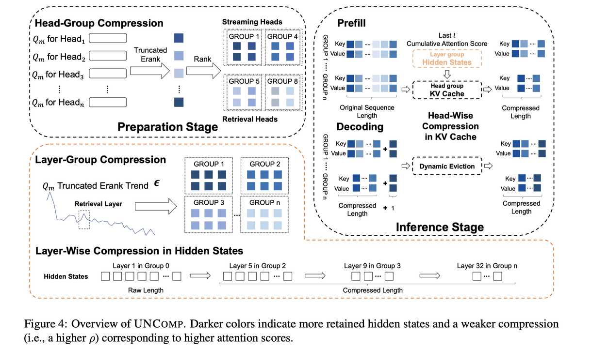

# UNComp: Can Matrix Entropy Uncover Sparsity? — A Compressor Design from an Uncertainty-Aware Perspective

> Jing Xiong, Jianghan Shen, Fanghua Ye, Chaofan Tao, Zhongwei Wan, Jianqiao Lu, Xun Wu, Chuanyang Zheng, Zhijiang Guo, Min Yang, Lingpeng Kong, Ngai Wong

> 发表：EMNLP 2025 | arXiv: [2410.03090v2](http://arxiv.org/abs/2410.03090v2) | 代码：[GitHub](https://github.com/menik1126/UNComp)

## 一句话总结

UNComp 是一种基于截断矩阵熵（Truncated Matrix Entropy）的不确定性感知框架，通过联合压缩隐藏状态和 KV 缓存，将 KV 缓存压缩至原始大小的 4.74%，实现 60% 的预填充加速和 6.4 倍吞吐量提升，同时保持接近无损的性能。

## 摘要翻译

大语言模型（LLM）的长上下文推理部署因其巨大的内存和计算需求而面临挑战。尽管 KV 缓存压缩等技术旨在减少内存使用，但它们往往忽视了隐藏状态与对应 KV 缓存之间固有的结构化稀疏性。在本工作中，我们探索了不确定性作为 LLM 内部稀疏性潜在指标的作用。我们提出了 UNComp，一个不确定性感知框架，利用截断矩阵熵识别低信息含量的区域，从而揭示可用于自适应压缩的稀疏性模式。与采用统一压缩的传统方法不同，UNComp 根据反映各模型组件重要性的不确定性度量动态调整压缩策略。我们的分析表明，从不确定性估计推导出的稀疏性模式可以揭示特殊的长程依赖关系，如检索头和检索层。这一视角不仅增强了我们对压缩优化的理解，还为 LLM 长上下文推理中固有稀疏性提供了新见解。通过专注于不确定性分析稀疏性模式，UNComp 将 KV 缓存大小压缩至原始的 4.74%，实现 6% 的预填充加速和 6.4 倍的吞吐量提升——不仅提供了强大的无损压缩性能，还验证了底层理论工具的有效性。

## 研究动机

大语言模型在长上下文推理场景下面临严峻的内存和计算瓶颈。KV 缓存虽然避免了冗余计算，但完整的长序列 KV 缓存会带来巨大的内存开销。现有的 KV 缓存压缩方法（如 H2O、StreamingLLM、SnapKV 等）主要从单一维度操作——如剪枝注意力头或压缩单个层——而未能充分利用模型层级结构中隐藏状态与 KV 缓存之间的结构化稀疏性。

此外，现有方法在压缩时通常采用统一的压缩比例，忽略了不同层和注意力头之间稀疏性的差异。具体而言，它们忽视了：
1. **隐藏状态与 KV 缓存的共享稀疏模式**：MLP 输出的隐藏状态与 KV 缓存之间存在未被利用的结构化稀疏关系
2. **压缩计算的缺失**：现有方法只在预填充后对 KV 缓存进行驱逐，不减少计算量
3. **检索层的特殊性**：不同层的信息压缩模式不同，部分层（如中间层 9-15）具有特殊的长程依赖特性

因此，作者引入**矩阵信息论**（Matrix Information Theory），提出截断矩阵熵作为连接不确定性和稀疏性的统一框架，从不确定性的角度揭示 LLM 的固有稀疏结构。

## 方法（技术细节）

### 1. 核心理论：截断矩阵熵（Truncated Matrix Entropy）

**矩阵熵定义**：给定 token 矩阵 $X = [x_1, x_2, \ldots, x_N]$，其中 $x_i \in \mathbb{R}^D$，首先计算协方差矩阵 $\Sigma_X$，然后定义 von Neumann（矩阵）熵：

$$H(\Sigma_X) = -\text{Tr}(\Sigma_X \log(\Sigma_X)) = -\sum_{i=1}^{D} \sigma_i \log \sigma_i$$

其中 $\sigma_i$ 是协方差矩阵的特征值。

**截断矩阵熵**：为了更精确地捕捉信息压缩模式，作者仅选取特征值谱中肘点（elbow point）之前的 top-k 个特征值进行计算：

$$H_k(\Sigma_X) = -\sum_{i=1}^{k} \sigma_i \log \sigma_i$$

$$\text{erank}_k(\Sigma_X) = \exp(H_k(\Sigma_X))$$

其中 $\text{erank}_k$ 表示截断有效秩（truncated effective rank），用于量化 token 矩阵的有效信息维度。

### 2. 关键观察

通过对 Query（Qm）、Key（Km）、Value（Vm）矩阵的截断有效秩分析，作者发现：
- **Qm 和 Km** 比 Vm 和 Hm 展现出更显著的熵增或熵减趋势，因此 Qm 是信息压缩模式的更强指标
- 随着模型深度增加，层间截断有效秩呈下降趋势，表明越来越稀疏的结构
- **Qm 的截断矩阵熵比 Km 下降更显著**，因此选择 Qm 作为代理来估计 Km、Vm 和 Hm 的稀疏特性
- 注意力头的信息压缩模式**跨数据集保持一致**，说明头的稀疏模式不依赖于数据
- 每四个头表现出明显相似的信息压缩模式（由于 GQA 训练）
- 高熵头（异常高的熵，主要在中间层 9-15）与特殊的长程依赖（检索层）相关

### 3. 两阶段压缩框架

#### 阶段一：准备阶段（Preparation Stage）

由于头的信息压缩模式不依赖于数据，作者在推理前从 Wikitext2 中采样 500 个数据点，预计算每个头的平均截断有效秩：

$$\widehat{\text{erank}}_k(\Sigma_h^{Q_m}) = \frac{1}{d}\sum_{i=1}^{d}\text{erank}_k(\Sigma_{(i,h)}^{Q_m})$$

以此作为推理阶段的分组依据，识别检索头（retrieval heads）和流式头（streaming heads）。

#### 阶段二：层级组压缩（Layer-Group Compression）— 隐藏状态压缩

这是本方法的**核心创新**：通过压缩隐藏状态来间接压缩 KV 缓存，从而同时减少计算量和内存。

1. **层分组**：将 L 层分为 C 组，每组内的 token 长度保持一致
2. **熵变阈值判断**：层间熵减少量 $\Delta c_i = \text{erank}_k(\Sigma_{Q_m}^i) - \text{erank}_k(\Sigma_{Q_m}^{i+1})$，若超过阈值 $\epsilon$ 则划分新的组
3. **隐藏状态驱逐**：从第 2 组开始，利用最后一 token 的注意力分数预测下一层的 token 驱逐，保留注意力分数最高的 $N_{i+1}$ 个 token
4. **检索层选择**：基于最大熵增层选择检索层，并与最后一层参数进行平均插值以提升性能

#### 阶段三：头组压缩（Head-Group Compression）— KV 缓存压缩

预填充结束后，对每个头的 KV 缓存进行分组压缩：

1. **头分组**：按截断有效秩排名，将头分为 M 组（默认 8 组）
2. **KV 缓存预算分配**：从最大截断有效秩的组到最小的组，逐步减少 KV 缓存大小：$N_{i,g+1} = N_{i,g} - \Delta n_g$
3. **动态 KV 缓存驱逐**：维护固定大小的累积注意力分数窗口，保留 top 个 token，驱逐最低分 token
4. **检索头/流式头**：当 M=2 时，将头分为检索头和流式头；检索头识别时间从 1.2 小时降至 1.6 分钟（45 倍加速）

### 4. 超参数配置

- 记忆最近 l 个 token 的累积注意力分数：l=8
- 每层最大 KV 缓存大小：$N'_{i,1} = 640$
- 头组固定步长：$\Delta n_g = 74$
- 层组增量：$\Delta n = 512$
- 熵变阈值 $\epsilon$：Llama2-7B 为 0.3，Llama2-13B 为 0.5，Llama3-8B 为 0.4，Qwen2.5-7B 为 0.3

## 实验结果

### 评测设置
- **模型**：Llama2-7B/13B-chat-hf、Llama-3-8B-Instruct、Qwen2.5-7B-Instruct
- **基准**：H2O、StreamingLLM、SnapKV、PyramidKV、Quest、Double-Sparse、RazorAttention、CHAI
- **数据集**：LongBench（16 个任务）、Needle-in-a-Haystack、RULER、InfiniteBench、GSM8K
- **硬件**：AMD MI210 64G GPU、NVIDIA A100 80G GPU

### 主要结果

| 指标 | 结果 |
|------|------|
| KV 缓存压缩率 | 4.74%（Llama3-8B） |
| 预填充加速 | 60%（单样本） |
| 吞吐量提升 | 6.4 倍（batch=32） |
| 性能损失 | 仅 1.43%（Llama3-8B） |
| 推理总时间 | 105.47s vs FullKV 129.13s（18.3% 缩减） |

**关键发现**：
- **UNComp 在 LongBench 多个任务上达到最优性能**，尤其在 LLaMA3 模型上优势明显（得益于 GQA 训练的头分组）
- **近无损压缩**：在 Llama2-7B/13B 上，9.38% 压缩率下仅 0.74% 性能损失
- **极端压缩下仍保持高性能**：在 KV 缓存仅 64（1.56% 压缩率）或删除 8 个头时，仍优于 CHAI 和 RazorAttention
- **Needle-in-a-Haystack**：在 9.38% 压缩率下超过 FullKV 基线（98.80% vs 98.70%）
- **吞吐量分析**：prompt=2048, generate=8096 时，FullKV 最大 batch=6（15.67ms/token），UNComp 最大 batch=32（2.45ms/token）
- **InfiniteBench**：唯一超越 FullKV 性能的方法（14.77 vs 14.38 平均分）
- **推理泛化性**：在 GSM8K 零样本推理中显著优于其他方法（12.86 vs FullKV 24.63）

## 优势

1. **理论基础扎实**：基于矩阵信息论和截断矩阵熵，提供了从不确定性角度理解 LLM 稀疏性的统一框架
2. **首次联合压缩隐藏状态和 KV 缓存**：通过压缩隐藏状态间接加速预填充阶段，同时减少计算和内存
3. **高性能、低损耗**：在 4.74% 压缩率下实现 60% 预填充加速和 6.4 倍吞吐量提升，性能损失极小
4. **极端压缩鲁棒性**：即使在仅保留 12 个 token 或删除 8 个头的极端情况下，仍保持高准确率
5. **跨模型泛化**：在 Llama2、Llama3、Qwen2.5 等不同架构上均表现优异
6. **检索头识别高效**：45 倍加速（1.6 分钟 vs 1.2 小时），无需特殊数据集
7. **代码开源**：完整实现在 [GitHub](https://github.com/menik1126/UNComp)

## 局限

1. **密集上下文任务的适用性有待验证**：在机器翻译、对话系统等密集上下文依赖任务上，需要进一步评估
2. **不确定性估计的校准风险**：如果不确定性估计不准确，动态压缩可能导致意外的信息丢失，影响模型在关键任务上的保真度
3. **潜在的安全风险**：通过揭示长程依赖（如检索头），可能无意中暴露模型内部机制，使其可被利用
4. **超参数敏感性**：方法涉及多个超参数（阈值 $\epsilon$、分组数 M、步长 $\Delta n_g$ 等），不同模型需要不同的配置
5. **需要额外的准备阶段**：推理前需在 Wikitext2 上采样 500 个数据点进行预计算，引入一定的启动开销

## 与 EfficientPaper 相关的研究方向

1. **KV 缓存压缩**：作为 `kv_cache_sparse` 关键词下的论文，与 H2O、StreamingLLM、SnapKV、Quest、DoubleSparsity 等基线方法直接关联
2. **隐藏状态压缩**：首次将隐藏状态压缩与 KV 缓存压缩统一，可与 SVD-LLM、ASVD 等低秩压缩方法结合
3. **不确定性度量**：基于矩阵熵的不确定性感知框架可扩展到其他推理加速场景，如动态批处理、自适应计算
4. **检索头/检索层**：与 DuoAttention、RazorAttention 等检索头相关研究互补，提供更高效的检索头识别方法
5. **长上下文推理优化**：在 Needle-in-a-Haystack、RULER、InfiniteBench 等长上下文评测中表现优异，为长上下文推理效率优化提供新思路
6. **信息压缩与稀疏性的理论连接**：截断矩阵熵作为理论工具，为理解 LLM 内部信息流动和稀疏模式提供了新视角
7. **推理效率与吞吐量**：6.4 倍吞吐量提升和 60% 预填充加速，对于大规模 LLM 部署具有重要意义

---

> **生成声明**：本 note 由 AI Agent（Hermes Agent）于 2026 年 6 月 4 日基于论文原文自动生成，仅供学术参考，内容以论文原文为准。
