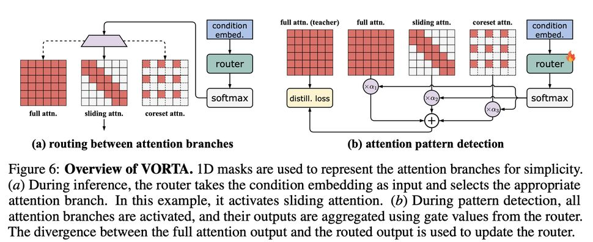

# VORTA: Efficient Video Diffusion via Routing Sparse Attention

> Wenhao Sun, Rong-Cheng Tu, Yifu Ding, Zhao Jin, Jingyi Liao, Shunyu Liu, Dacheng Tao
>
> NeurIPS 2025 | [arXiv:2505.18809v2](http://arxiv.org/abs/2505.18809v2) | [代码](https://github.com/wenhao728/VORTA)



---

## 一句话总结

VORTA 通过将注意力机制区分为局部/长程/关键三类，并基于扩散时间步的信噪比动态路由到对应的稀疏注意力变体（滑动窗口 / 核心集选择），在不损失视频生成质量的前提下实现了 **1.76×** 的端到端加速，并可与特征缓存（PAB）和步数蒸馏（PCD）等方法叠加，最高达到 **14.41×** 加速。

---

## 摘要翻译

视频扩散变换器（Video Diffusion Transformers, VDiTs）在高质量视频生成方面取得了显著进展，但由于注意力操作在高维视频序列上具有二次复杂度，计算成本仍然很高。近期的加速方法利用注意力分数的局部稀疏性来提升效率，但在加速长程计算方面往往力不从心。为此，我们提出 VORTA 加速框架，包含两个新颖组件：（1）一种稀疏注意力机制，能够高效捕获长程依赖关系；（2）一种路由策略，能够自适应地用专用的稀疏注意力变体替代完整的 3D 注意力。VORTA 在 VBench 上实现了 1.76× 的端到端加速且不损失质量。此外，它能够与各种其他加速方法（如模型缓存和步数蒸馏）无缝集成，在性能可忽略不计的退化下达到 14.41× 的加速。VORTA 展示了其效率，并增强了视频扩散变换器在实际场景中的实用性。

---

## 研究动机

1. **VDiT 的计算瓶颈**：以 HunyuanVideo 为例，生成一段 5 秒 720p 视频在 H100 上需要约 1000 秒（500 PFLOPS），其中注意力操作占计算成本的 75% 以上，主要因为序列长度 L 可达 100K 级别。
2. **现有稀疏注意力方法的局限**：
   - **局部稀疏方法**（如滑动窗口注意力）仅关注短程交互，无法捕获长程依赖，在 VDiT 的早期采样步骤中效果较差。
   - **长程注意力**在某些注意力头中存在（如图 2 所示），最近 4% 的键贡献超过 80% 的注意力分数，但剩余 96% 的远距离键仍占据计算成本。
   - **非结构化/半结构化剪枝**（如 ARnR）需要 O(L²) 的在线分析，引入额外开销。
   - **预定义模式**（如 STA）依赖固定模式，在不同配置下需要重新调优，缺乏灵活性。
3. **关键洞察**：VDiT 中的注意力行为与扩散过程中的信噪比（SNR）密切相关——早期采样步骤更偏向长程依赖（语义构建），后期步骤更偏向局部交互（细节精炼）。需要一种能够自适应路由的机制。

---

## 方法（技术细节）

### 3.1 注意力分类法（Taxonomy of VDiT Attentions）

VORTA 将 VDiT 中的注意力分为三类：
- **局部注意力（Local Attentions）**：关注短程交互，不涉及远距离 token，负责生成精细细节。
- **长程注意力（Long-range Attentions）**：在整个序列范围内分布注意力分数，捕获高层语义信息（如粗略布局和运动）。对 token 的微小扰动不敏感。
- **关键注意力（Pivotal Attentions）**：同时维持全局感知场和精炼局部细节，对扰动敏感，需保持完整计算。

三类注意力在采样过程中共存且不互斥，随扩散过程演变可相互转换。

### 3.2 稀疏注意力变体

#### 滑动窗口注意力（Sliding Window Attention）——用于局部注意力

- 限制每个 query token 仅在其邻域 `(i-w, i+w]` 内寻找 attention。
- 采用 **滑动瓦片注意力（Sliding Tile Attention）**，将滑动窗口对齐到瓦片中心，避免 zigzag 形状注意力掩码带来的计算气泡问题。
- 3D 版本中，瓦片大小为 `(tF, tH, tW)`，窗口大小为 `(wF, wH, wW)`。
- 实现上使用 FlexAttention 内核，提供块级密集注意力掩码，硬件效率更高。
- 窗口大小设置为 `(18, 27, 24)`。

#### 核心集选择注意力（Core-set Selection Attention）——用于长程注意力

**核心思想**：在采样早期，token 间高度冗余（相似性高），仅需少量代表性 token 即可捕获必要信息。

**Bucketed Core-set Selection (BCS)** 算法：
1. 将 token 划分为桶（buckets），桶大小为 `(2, 3, 2)`，核心集比例 `rcore = 0.5`。
2. 在每个桶内，仅计算中心 token 与其邻居 token 的相似度（而非桶间比较）。
3. 移除相似度最高的 top-k 个 token（信息合并到中心 token）。
4. 在核心集 token 上执行注意力计算。
5. 将中心 token 信息回传（scattering）到被剪枝的 token。

**复杂度分析**：BCS 为 **O(L)** 线性复杂度，相比 O(L²) 的全局相似度方法（如 Token Merging [4]、ARnR [40]）显著更高效。注意力计算成本可降低 75%（核心集大小为原始序列的 50%）。

### 3.3 信号感知注意力路由（Signal-aware Attention Routing）

#### 路由器设计

- 路由器是一个轻量级线性层，输入为扩散时间步嵌入 `T ∈ R^d`，输出为三路门控值 `α(n) = softmax(T·W_R^(n))`，分别对应：
  - `α1`：完整注意力（full attention）
  - `α2`：滑动窗口注意力（sliding attention）
  - `α3`：核心集注意力（core-set attention）
- 仅增加 **0.1%** 的模型参数。
- 基于信噪比（SNR）动态选择，无需直接操作完整的扩散 token。

#### 推理时路由策略

采用硬选择（hard selection）：选择门控值最高的注意力分支。

- 当 `α2 > α1` 且 `α2 > α3` 时 → 滑动窗口注意力
- 当 `α3 > α1` 且 `α3 > α2` 时 → 核心集注意力
- 否则 → 完整注意力

完整注意力分支在不到 **0.2%** 的情况下被激活，但对保持模型性能至关重要（消融实验表明移除后 VBench 分数下降 4 分）。

#### 路由器优化

采用自监督优化策略，损失函数结合三项：

```
L = L_CFM + λ_distill · L_distill + λ_reg · L_reg
```

- `L_CFM`：条件流匹配损失（来自 VDiT 预训练）
- `L_distill`：蒸馏损失，MSE 在路由输出与原始输出之间，确保路由输出接近原始模型输出
- `L_reg`：L2 正则化，促进路由决策的稀疏性
- 超参数：`λ_distill = 20`，`λ_reg = 0.02`
- **原始 VDiT 参数始终冻结，仅更新路由器。**

#### 路由模式分析（Figure 9）

- **早期采样步骤**（如 step 5）：更多使用核心集注意力（长程语义构建）
- **后期采样步骤**（如 step 45）：更多使用滑动窗口注意力（局部细节精炼）
- 仅约 **0.2%** 的注意力头使用完整注意力分支
- 与自回归/判别模型不同，VDiT 的层间特化较弱，同一层内的注意力头在各分支间分布较均匀

---

## 实验结果

### 主要实验（HunyuanVideo，720p，5s，50步）

| 方法 | 类型 | VBench↑ | Quality↑ | Semantic↑ | LPIPS↓ | 延迟(s) | 加速比 | 显存(GB) |
|------|------|---------|----------|-----------|--------|---------|--------|----------|
| HunyuanVideo (原始) | - | 82.26 | 83.68 | 76.60 | - | 1043.85 | 1.00× | 47.64 |
| + ARnR | S | 82.39 | 83.85 | 76.56 | 0.211 | 790.55 | 1.32× | 78.15 |
| + STA | S | 82.33 | 83.56 | 77.39 | 0.201 | 676.39 | 1.54× | 51.79 |
| + PAB | C | 82.40 | 83.80 | 76.81 | 0.186 | 815.51 | 1.28× | >80 |
| **+ VORTA** | **S** | **82.59** | **83.74** | **77.95** | **0.185** | **594.23** | **1.76×** | **51.15** |
| + VORTA & PAB | S & C | 82.56 | 83.60 | 78.38 | 0.195 | 444.19 | 2.35× | >80 |
| + PCD | D | 81.17 | 82.56 | 75.35 | 0.564 | 125.98 | 8.29× | 47.64 |
| **+ VORTA & PCD** | **S & D** | **81.49** | **82.78** | **76.31** | **0.575** | **72.46** | **14.41×** | **51.15** |

### Wan 2.1 (14B) 结果

| 方法 | VBench↑ | 延迟(s) | 加速比 | 显存(GB) |
|------|---------|---------|--------|----------|
| Wan 2.1 (原始) | 82.36 | 1304.82 | 1.00× | 41.77 |
| + VORTA | 82.85 | 856.50 | 1.52× | 43.97 |

### 关键发现

1. **VORTA 在稀疏注意力方法中效率最高**（1.76×），且 VBench 分数排名第一。
2. **兼容性好**：与 PAB（特征缓存）和 PCD（步数蒸馏）均可叠加，分别实现 2.35× 和 14.41× 加速。
3. **跨架构泛化**：在基于 MMDiT 的 HunyuanVideo 和基于 DiT 的 Wan 2.1 上均表现良好。
4. **跨调度器泛化**：在 UniPC（50步）和 DPM++（30步）调度器下均保持无损性能，无需重新调优。
5. **加速方法有时反而提升质量**：VORTA 的 VBench 分数略高于原始模型，可能源于过参数化模型中的冗余被消除。

### 消融实验（Wan 2.1 1.3B）

| 消融项 | VBench↑ | 延迟(s) | 加速比 |
|--------|---------|---------|--------|
| 完整 VORTA | 81.06 | 58.42 | 1.25× |
| 去除滑动窗口 | 80.25 | 65.14 | 1.12× |
| 去除核心集 | 79.89 | 66.10 | 1.11× |
| 去除完整注意力 | 77.14 | 59.34 | 1.23× |
| 去除时间步条件 | 81.03 | 65.00 | 1.13× |

关键消融发现：
- 移除完整注意力分支导致 VBench 下降 4 分但无额外加速，证明关键注意力的重要性。
- 移除时间步条件导致路由器在所有步骤上选择相同注意力分支，倾向于选择完整注意力。
- BCS 相比平均池化显著提升性能（平均池化在相邻 token 差异大时导致信息丢失，产生像素化或模糊伪影）。

---

## 优势

1. **无损加速**：在 VBench 上实现 1.76× 端到端加速，且不牺牲生成质量，甚至略有提升。
2. **高度兼容**：与特征缓存（PAB）和步数蒸馏（PCD）正交，可叠加使用，最高 14.41× 加速。
3. **跨架构泛化**：支持 MMDiT（HunyuanVideo）和 DiT（Wan 2.1）等不同视频扩散架构。
4. **跨调度器泛化**：无需重新调优即可适配不同采样调度器（UniPC、DPM++ 等）和步数配置。
5. **轻量级路由器**：仅增加 0.1% 参数，训练快速（约 1 天，2×H100）。
6. **BCS 线性复杂度**：相比 O(L²) 的全局方法，BCS 实现 O(L) 的核心集选择，计算开销极低。
7. **可解释性**：路由模式清晰——早期步骤用核心集注意力（语义构建），后期用滑动窗口（细节精炼），符合直觉。

---

## 局限

1. **短序列场景受限**：VORTA 针对注意力机制（占高分辨率视频生成 75%+ 计算），但在图像或低分辨率视频生成等短序列场景中，注意力开销占比低，加速潜力有限。
2. **仅支持双向生成**：当前仅适用于双向生成范式，对自回归生成范式不直接支持，可能需要大量适配。
3. **H100 显存要求**：虽然 VORTA 本身显存开销不大（51.15 GB），但在高分辨率下与其他方法（如 PAB）组合时仍需要 >80 GB 显存。
4. **路由训练需数据集**：路由器优化需要在 Mixkit 等数据集上进行微调，引入额外的训练步骤。
5. **注意力类型分类依赖**：方法的有效性依赖于对注意力行为（局部/长程/关键）的准确识别和分类，对新型架构可能需要重新验证。
6. **冗余性分析**：论文指出加速方法有时反而提升质量（因消除过参数化模型中的冗余），但这并非有意设计，可能在不同场景下表现不一致。

---

## 与 EfficientPaper 相关的研究方向

1. **视频生成加速**：VORTA 直接解决了视频扩散变换器的效率问题，是 EfficientPaper 中"视频生成"类别的核心工作。
2. **稀疏注意力与注意力稀疏化（sparse_pruning / attention_sparsity）**：VORTA 的 BCS 机制和路由策略为稀疏注意力设计提供了新范式，可与 EfficientPaper 中其他稀疏注意力方法（如 ARnR、STA、SVG）进行对比。
3. **条件计算（Conditional Computation）**：VORTA 的路由机制属于条件计算的范畴，通过动态选择计算路径实现效率提升，与 EfficientPaper 中 MoE、BlockDrop 等方法相关。
4. **扩散模型加速**：VORTA 与 PAB（特征缓存）、PCD（步数蒸馏）等方法互补，展示了多维度加速的组合潜力。
5. **轻量化训练策略**：路由器仅增加 0.1% 参数且训练快速，为大模型的轻量化适配提供了参考。
6. **跨架构泛化**：VORTA 在 MMDiT 和 DiT 上的通用性表明其方法论可扩展到更多视频扩散架构。

---

> **生成声明**：本 note 由 AI Agent（Hermes Agent）于 2026 年 6 月自动生成，基于论文原文的全文分析和结构化总结。内容可能存在翻译或理解上的偏差，请以原论文为准。
