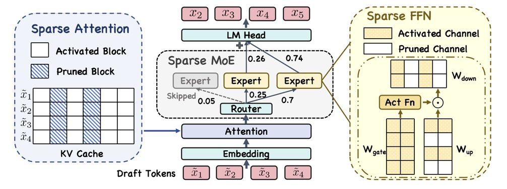

# Accelerate Speculative Decoding with Sparse Computation in Verification

> Jikai Wang, Jianchao Tan, Yuxuan Hu, Jiayu Qin, Yerui Sun, Yuchen Xie, Xunliang Cai, Juntao Li, Min Zhang

## 一句话总结

本文提出一个统一的稀疏验证框架，通过在推测解码（Speculative Decoding）的验证阶段联合应用注意力稀疏、FFN 稀疏和 MoE 稀疏三种策略，大幅降低验证阶段的计算开销，同时保持稳定的接受长度和准确率。

## Abstract

Speculative decoding accelerates autoregressive language model inference by verifying multiple draft tokens in parallel. However, the verification stage often becomes the dominant computational bottleneck, especially for long-context inputs and mixture-of-experts (MoE) models. Existing sparsification methods are designed primarily for standard token-by-token autoregressive decoding to remove substantial computational redundancy in LLMs. This work systematically adopts different sparse methods on the verification stage of the speculative decoding and identifies structured redundancy across multiple dimensions. Based on these observations, we propose a sparse verification framework that jointly sparsifies attention, FFN, and MoE components during the verification stage to reduce the dominant computation cost. The framework further incorporates an inter-draft token and inter-layer retrieval reuse strategy to further reduce redundant computation without introducing additional training. Extensive experiments across summarization, question answering, and mathematical reasoning datasets demonstrate that the proposed methods achieve favorable efficiency-accuracy trade-offs, while maintaining stable acceptance length.

## 摘要翻译

推测解码通过并行验证多个草稿 token 来加速自回归语言模型的推理。然而，验证阶段往往成为主要的计算瓶颈，尤其在长上下文输入和混合专家（MoE）模型中。现有的稀疏化方法主要针对标准的逐 token 自回归解码设计，用于消除 LLM 中大量的计算冗余。本文系统地将不同的稀疏方法应用于推测解码的验证阶段，并识别出跨多个维度的结构性冗余。基于这些观察，我们提出了一个稀疏验证框架，在验证阶段联合对注意力、FFN 和 MoE 组件进行稀疏化，以降低主导计算成本。该框架进一步引入了跨草稿 token 和跨层的检索复用策略，以在不引入额外训练的情况下进一步减少冗余计算。在摘要生成、问答和数学推理数据集上的大量实验表明，所提出的方法实现了良好的效率-准确率权衡，同时保持了稳定的接受长度。

## 研究动机

1. **推测解码的瓶颈转移**：推测解码通过草稿模型生成多个候选 token，再由目标模型并行验证，有效加速自回归生成。但随着 draft 长度增长和长上下文输入的引入，验证阶段成为主要的计算瓶颈，尤其是在注意力计算、密集 FFN 和 MoE 多专家评估方面。

2. **现有稀疏方法的局限**：现有的稀疏推理方法（如 KV Cache 驱逐、稀疏 FFN、MoE 路由优化）主要为标准的逐 token 解码设计，尚未系统地探索其在推测解码验证阶段的应用效果。

3. **验证阶段的结构冗余**：验证过程涉及多个 draft token 同时计算，不同 token 之间存在大量冗余（如注意力计算中 KV block 的高度重叠、FFN 中大量低激活通道、MoE 中低贡献专家）。

## 方法（技术细节）

本文提出统一的稀疏验证框架，从三个正交维度对验证阶段进行稀疏化，且完全在推理时进行，无需额外训练或架构修改。

### 1. 稀疏注意力（Sparse Attention）

- **核心思想**：将 KV cache 按位置和 KV head 划分为结构化 block，使用第一个 draft token 的 query 计算每个 block 的重要性分数，选择 top-N block 进行验证
- **重要性计算**：$s_{h,b} = \frac{1}{B} \sum_{k \in K_{h,b}} q_0^\top k$，即第一个 draft token query 与 block 内所有 key 的点积平均值
- **边界保留**：保留首尾部分 block 不驱逐，因为存在注意力汇聚（attention sink）和位置偏置（locality bias）
- **分段预算控制（Piecewise Budget Control）**：当序列长度 $L_{seq}$ 低于阈值 $L_0$ 时不驱逐；超过时按 $N_{budget} = \lfloor (L_{seq} - L_0) \times \rho + L_0 \rfloor \times \frac{H}{B}$ 自适应确定保留 block 数，保证短文本稳定、长文本按预算缩放
- **跨层检索复用（Inter-layer Retrieval Reuse）**：利用相邻层的 block 选择高度相似性，只在代表性"锚定层"（anchor layers）执行检索，其他层直接复用最近锚定层的结果，计算 Jaccard 相似度来识别锚定层

### 2. 稀疏 FFN（Sparse Feedforward Network）

- **核心思想**：利用 FFN 隐层激活的天然稀疏性，对低激活通道进行剪枝
- **通道选择**：$S_l = \{i \mid |h_{l,i}| < \tau\}$，阈值 $\tau$ 预定义
- **稀疏计算**：只保留非 $S_l$ 中的通道参与 up/down projection，显著减少矩阵乘法，保持 FFN 结构不变
- **在验证阶段应用**，减少整体推理开销

### 3. 稀疏 MoE（Sparse Mixture of Experts）

- **核心思想**：自适应跳过低贡献的专家
- **推广机制**：将 Lu et al. (2024) 的 k=2 跳过策略推广到任意激活专家数 k>2，允许每个 token 最多跳过 m 个专家（1 ≤ m < k）
- **阈值计算**：对校准数据集，计算排序后的路由权重比值，以中位数作为阈值 $\beta_m$，形成阈值映射 $\{\beta_1, ..., \beta_{k-1}\}$
- **推理时动态决定**：根据路由权重比值与阈值的比较，跳过权重最低的 i 个专家

### 4. 混合稀疏方法（Hybrid）

- 联合应用上述三种稀疏策略，沿三个正交维度进行稀疏化
- FLOPs 分析表明稀疏验证显著减少了注意力、FFN 和 MoE 层的主导计算项

## 实验结果

### 实验设置

- **目标模型**：
  - 稀疏注意力：Llama3.1-8B-Instruct
  - 稀疏 FFN：Qwen3-30B-A3B（MoE 模型）
  - 稀疏 MoE：Deepseek-R1（8 专家 MoE）
- **Draft 模型**：EAGLE-3（树结构 draft，60 个候选 token）
- **数据集**：LongBench（GovReport 摘要、2WikiMQA、HotpotQA 问答、LCC/RepoBench-P 代码）+ 数学（GSM8K、Math、CollegeMath）
- **硬件**：8 × NVIDIA H800-80G GPU

### 稀疏注意力结果（Table 2）

- 在 $L_0 = 4K$ 时，性能退化仅 0.3-1.0 个 ROUGE/F1 点
- $L_0 = 2K$ 或 $1K$ 时退化更明显，但仍在可接受范围内
- HotpotQA 和 LCC 等局部依赖强的任务更鲁棒
- 跨层复用（SA*）在 GovReport 和 RepoBench-P 上表现可比或略优，在 QA 任务上略低于 SA

### 稀疏 FFN 结果（Table 3）

- 使用 Qwen3-30B-A3B，阈值 $\tau \in \{0.01, 0.05, 0.1\}$
- 摘要任务（GovReport）在所有稀疏级别下稳定，甚至 ROUGE 从 32.67 提升到 33.51（sf=0.64）
- QA 任务高度鲁棒
- 数学推理任务中即使 sf=0.64（近 2/3 通道被剪枝），准确率退化可忽略
- **结论**：SFFN 验证在不损害正确性的情况下实现高效计算

### 稀疏 MoE 结果（Table 4）

- 使用 Deepseek-R1，跳过预算 m ∈ {2, 3, 4}
- 中度稀疏（m=2, 3）在多个数据集上性能稳定甚至提升（如 2WikiMQA、Math）
- 过度稀疏（m=4）性能开始下降，尤其在数学推理任务上

### 混合稀疏方法（Table 5）

- 在 GovReport、2WikiMQA、HotpotQA 上得分高于严格基线
- GSM8K 和 Math 性能可比
- CollegeMath 出现性能下降，表明需要精细符号推理的任务对激进稀疏化更敏感
- 接受长度（α）在大多数数据集上仅出现可忽略的降低

### 关键发现

- 推测解码验证阶段存在大量计算冗余
- 稀疏验证可以大幅减少计算开销，且不影响生成质量
- 生成导向任务（摘要、QA）对稀疏化更鲁棒，推理密集型任务（数学）更敏感
- 各稀疏维度不是严格独立的，应协调使用而非单独激进应用

## 优势

1. **无需额外训练**：所有稀疏化策略完全在推理时进行，可直接应用于现成模型
2. **多维度联合稀疏**：同时从注意力、FFN、MoE 三个正交维度降低计算开销
3. **理论与实验支撑**：提供了详细的 FLOPs 分析和大量实验验证
4. **分段预算控制**：短文本不稀疏，长文本自适应，保证稳定性
5. **跨层复用策略**：利用层间相似性减少检索开销，且不引入额外训练
6. **自适应 MoE 跳过**：将已有策略推广到任意专家数量，灵活控制稀疏程度
7. **接受长度稳定**：对平均接受长度的影响可忽略，不影响推理效率

## 局限

1. **数学推理任务敏感**：在需要精细符号推理的任务（如 CollegeMath）上，混合稀疏可能导致显著性能下降
2. **稀疏维度不独立**：多个维度的稀疏化不能简单叠加，需要协调配置，否则可能出现系统性退化
3. **缺乏硬件加速验证**：实验未报告实际硬件上的延迟/吞吐量改善，仅分析了 FLOPs
4. **阈值超参数**：$\tau$、$\rho$、$L_0$、$m$ 等超参数需要调优，可能因模型和任务不同而异
5. **缺乏开源代码**：论文未提供开源实现，限制了可复现性
6. **Draft 模型限制**：实验主要基于 EAGLE-3 和 MTP，对其他 draft 方法的适用性未验证

## 与 EfficientPaper 相关的研究方向

1. **推测解码效率优化**：本文从验证阶段入手，探索稀疏化降低计算开销的路径，与推测解码的整体效率提升研究高度相关
2. **KV Cache 管理**：稀疏注意力机制（基于 block 的 KV cache 驱逐、跨层复用）与 KV Cache 优化研究直接相关（如 H2O、StreamingLLM、Quest、SnapKV、NSA）
3. **MoE 推理效率**：稀疏 MoE 策略与专家路由优化、动态专家选择等研究方向相关
4. **稀疏 FFN**：激活稀疏性在推理时的应用与训练时稀疏化方法（如 Hash Layers、Sparse FFN）形成互补
5. **长上下文推理**：本文在长上下文场景下的稀疏验证与长上下文推理效率研究密切相关
6. **无需训练的推理加速**：本文的纯推理时稀疏化策略（无需额外训练）为高效的部署方案提供了参考
7. **多维度协同优化**：联合注意力、FFN、MoE 三个维度进行稀疏化的思路，为多组件协同优化提供了范例

---

> **生成声明**：本 note 由 AI Agent（Hermes Agent）基于论文全文自动生成，生成时间：2025 年。内容仅供参考，不代表任何官方立场。
