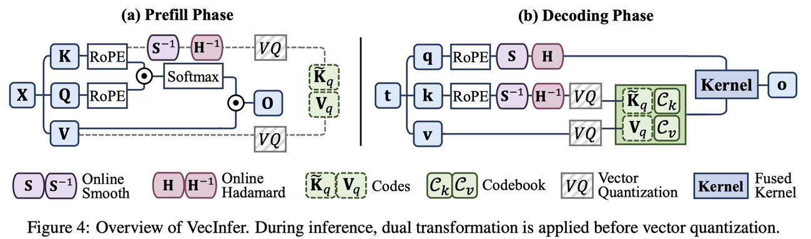

# VecInfer: Efficient LLM Inference with Low-Bit KV Cache via Outlier-Suppressed Vector Quantization

> Dingyu Yao, Chenxu Yang, Zhengyang Tong, Zheng Lin, Wei Liu, Jian Luan, Weiping Wang

---

> **本文由 AI Agent 自动生成（Hermes Agent），基于论文全文阅读与分析。生成时间：2025 年。所有内容以中文呈现，仅供学术参考。**

---

## 一句话总结

VecInfer 通过平滑变换与 Hadamard 变换的双重变换抑制 Key Cache 中的离群值，结合向量量化与融合反量化-计算 CUDA 内核，在极低比特位宽（2-bit 及以下）下实现接近全精度的 LLM 推理精度与显著的推理加速（最高 8.3× 端到端延迟降低）。

---

## 摘要翻译

Key-Value（KV）缓存在大语言模型（LLM）推理过程中引入了大量内存开销。虽然现有的向量量化（VQ）方法能够降低 KV 缓存使用量并提供跨比特位宽的灵活表示能力，但由于 Key 缓存中离群值的存在，这些方法在极低比特位宽下会出现严重的性能退化。为解决这一挑战，我们提出 VecInfer，一种新颖的 VQ 方法，用于激进的 KV 缓存压缩并支持高效推理。通过应用平滑变换和 Hadamard 变换，VecInfer 抑制了 Key 缓存中的离群值，使码本能够全面覆盖原始数据分布，从而降低量化难度。为便于高效部署，我们设计了一个优化的 CUDA 内核，将计算与反量化融合以最小化内存访问开销。大量评估表明，VecInfer 在长上下文理解和数学推理任务中持续优于现有量化基线。仅使用 2-bit 量化，VecInfer 即可达到与全精度相当的性能，同时在 Llama-3.1-8B（196k 序列长度）上实现最高 **2.7×** 的大批量自注意力计算加速和 **8.3×** 的单批次端到端延迟降低。

---

## 研究动机

### KV 缓存的内存挑战

Transformer 架构的 LLM 在推理过程中通过 KV 缓存机制避免重复的注意力计算。然而，KV 缓存的大小随序列长度线性增长，对内存消耗和计算开销构成巨大挑战，尤其是在长上下文推理场景中。

### 现有量化方法的局限

现有的 KV 缓存量化方法主要分为标量量化（SQ）和向量量化（VQ）两类：

- **标量量化（SQ）**（如 KIVI）：将浮点值映射为定点整数，但跨比特位宽的灵活性有限。
- **向量量化（VQ）**（如 CQ、MILLION）：将高维向量映射到有限的码本条目集合，提供更灵活的表示能力。然而，**VQ 方法在极低比特位宽下仍面临严重性能退化**。

**核心问题：** VQ 通常沿 token 维度对 KV 缓存进行量化以确保硬件兼容性，这使其对离群值极为敏感。离群向量远离任何码本质心，导致码本利用率不足，增加量化难度。

---

## 方法

### 1. 双重等价变换（Dual Equivalent Transformation）

VecInfer 的核心创新在于通过两种变换的组合来抑制 Key 缓存中的离群值：

#### (a) 平滑变换（Smooth Transformation）

通过对 Key 进行逐通道缩放，并在 Query 上施加逆缩放以保持计算不变性：

$$q \leftarrow q \cdot \text{diag}(\lambda), \quad K \leftarrow K \cdot \text{diag}(\lambda)^{-1}$$

其中缩放因子 λ 通过校准样本离线预计算：

$$\lambda_i = \sqrt{\max(|K_i|)}, \quad i = 1, 2, \ldots, D$$

平滑变换减少通道间方差，但不能解决通道内方差问题。

#### (b) Hadamard 变换（Hadamard Transformation）

为解决通道内方差问题，进一步应用正交 Hadamard 矩阵 $H_D$（满足 $H_D H_D^\top = I$）：

$$q \leftarrow q \cdot H_D, \quad K \leftarrow K \cdot H_D$$

**引理 1（Hadamard）：** 对于 Key 状态 $K \in \mathbb{R}^{N \times D}$，其中 $\text{sign}(K_{i,j})$ 独立同分布于 $\text{Uniform}\{-1, +1\}$，经过 Hadamard 变换后，$\tilde{K} = KH$ 近似服从高斯分布（由中心极限定理保证），从而重新分配 K 中的离群值。

#### 双重变换的组合效果

两种变换的组合使注意力得分可重写为：

$$s = (\underbrace{q \cdot \text{diag}(\lambda) \cdot H_D}_{\tilde{q}}) \cdot (\underbrace{K \cdot \text{diag}(\lambda)^{-1} \cdot H_D}_{\tilde{K}})^\top$$

- **单独使用平滑变换或 Hadamard 变换**效果次优
- **两者的组合**（无论顺序）可产生更均匀的分布，显著降低量化难度
- 变换后，码本可全面覆盖原始数据分布，且具有任务无关性

### 2. 离群值抑制的向量量化（Outlier-Suppressed Vector Quantization）

整体流程分为预填充（Prefill）和解码（Decode）两个阶段：

#### 预填充阶段

1. 对 Key 施加双重变换（平滑 + Hadamard）
2. 对变换后的 Key $\tilde{K}$ 和原始 Value $V$ 分别进行向量量化：
   - $\tilde{K}_q = \text{VQ}(\tilde{K}, C_k)$
   - $V_q = \text{VQ}(V, C_v)$
3. 码本 $C_k, C_v$ 通过 K-Means 预训练

#### 解码阶段

1. 每个新生成的 token 的 Key $k$ 经过在线双重变换
2. 变换后的 Key $\tilde{k}$ 和对应 Value $v$ 使用预训练码本量化
3. 量化结果与之前量化的 KV 对拼接
4. 对 Query $q$ 施加逆变换以保持输出一致性

**混合精度策略：** 即使经过变换，Key 缓存的量化敏感性仍高于 Value 缓存，因此可为 Key 分配更高的比特位宽。

### 3. 硬件高效定制内核（Hardware-efficient Customized Kernel）

VecInfer 设计了一个融合反量化与注意力计算的 CUDA 内核，包含以下关键优化：

#### (a) 细粒度分块计算（Fine-Grained Tiled Computation）

- 将注意力计算划分为分块（tile），从全局内存加载到共享内存
- 采用三维 grid 配置：(batch_size, num_heads, num_splits)
- 每个 thread block 包含 128 个线程，处理单个 tile 的量化 KV 对

#### (b) 异步流水线执行（Asynchronous Pipeline Execution）

- 利用 `memcpy_async` API 实现内存传输与计算的重叠
- 在处理第 i 个 tile 时，异步加载 Value codes $V_q^{(i)}$，同时计算注意力分数 $s^{(i)}$
- 在计算输出 $o^{(i)}$ 时，异步预取下一个 tile 的 Key codes $\tilde{K}_q^{(i+1)}$
- 优化 Key/Value codes 的共享内存布局以最小化 bank 冲突

---

## 实验结果

### 实验设置

- **模型：** Llama-3.1-8B-Instruct, Mistral-7B-Instruct-v0.3, Qwen2.5-14B-Instruct, DeepSeek-R1-Distill-Llama-8B, DeepSeek-R1-Distill-Qwen-14B, Qwen3-8B
- **长上下文任务：** LongBench（13 个数据集，6 类任务）
- **数学推理任务：** GSM8K, MATH500, AIME24, AMC2023
- **量化配置：** 1.25-bit, 1.5-bit, 2-bit, 3-bit, 4-bit
- **基线方法：** KIVI（标量量化）、MILLION（向量量化）
- **硬件：** H100 (80GB), A100 (40GB)

### 准确度评估

#### 长上下文任务（LongBench）

- VecInfer 在 1.25-bit 到 4-bit 的所有比特位宽下**持续优于** KIVI 和 MILLION
- 在 2-bit 精度下：
  - VecInfer 仅出现 **2.1%** 的平均准确度下降
  - 相比 MILLION（另一个 VQ 方法）平均性能提升 **14.5%**
- 在 1.5-bit 下仍保持较高性能（如 Llama-3.1-8B 平均 51.8%），而 KIVI/MILLION 几乎崩溃

#### 数学推理任务

- KIVI 和 MILLION 在 2-bit 精度下出现严重性能退化，无法生成连贯响应
- VecInfer 在 2-bit 下仍保持合理的推理能力：
  - DeepSeek-R1-Distill-Llama-8B: MATH500 80.0%, GSM8K 87.0%, AIME24 26.7%
  - Qwen3-8B: MATH500 90.6%, GSM8K 95.6%, AIME24 67.1%
- 模型类型和任务难度显著影响性能退化程度

### 效率评估

#### 端到端延迟

- **196k 序列长度，2-bit 量化，H100：**
  - VecInfer 实现 **8.3×** 的单批次端到端延迟降低（相比 SDPA）
  - **9.0×** 的延迟降低（1-bit 配置）
  - **6.6×** 的延迟降低（4-bit 配置）
- 加速优势随序列长度增加而增大
- KIVI 在 64k 序列长度时因缺少融合内核支持而出现 OOM

#### 内核性能

- VecInfer 内核在 H100 上实现 **2.6~3.3×** 的大批量自注意力计算加速（相比 SDPA）
- 在 A100 上实现 **2.0~3.4×** 的加速
- 相比 MILLION，VecInfer 内核持续更快

#### 延迟分解

- 196k 序列长度，2-bit 配置下，VecInfer 实现 **2.0×** 的自注意力加速
- Smooth 和 Hadamard 变换的额外开销可忽略不计
- VecInfer 消除了昂贵的拼接（Concat）和重复（Repeat）操作

### 消融实验

#### 不同变换的效果

- 仅 VQ 基线 → 平滑变换提升 4.9% → Hadamard 变换提升 14.1%
- 两种变换的组合效果远大于单独使用
- 先平滑后 Hadamard 与先 Hadamard 后平滑的效果相当

#### 码本大小的影响

- 增大码本尺寸可提升精度，但增加共享内存开销
- 权衡精度-效率后采用：2-bit 使用 2⁸×4×2 bytes，1.5-bit 使用 2¹²×8×2 bytes

#### 任务无关性

- 使用不同数据集预训练的码本性能几乎一致，证明码本具有良好的泛化能力和任务无关性

---

## 优势

1. **极低比特位宽下的高精度：** 在 2-bit 甚至 1.25-bit 下仍保持接近全精度的性能，显著优于 KIVI 和 MILLION
2. **显著的推理加速：** 通过融合反量化-计算的 CUDA 内核，实现最高 8.3× 端到端延迟降低
3. **任务无关的码本：** 码本通过校准数据集预训练，具有良好的泛化能力，无需针对特定任务调整
4. **理论基础扎实：** 通过 SVD 分析和中心极限定理论证了 Hadamard 变换对离群值的抑制效果
5. **灵活的混合精度：** 支持 Key 和 Value 使用不同比特位宽（如 K-d4b10/V-d8b12），进一步优化精度-效率权衡
6. **广泛的模型支持：** 在多种 LLM 架构（Llama、Mistral、Qwen、DeepSeek）和任务上验证了有效性
7. **自适应的异步流水线：** 通过 memcpy_async 实现计算与内存传输的重叠，充分利用 GPU 资源

---

## 局限

1. **与稀疏注意力的结合未充分探索：** 将向量量化与稀疏注意力模式结合用于混合精度 KV 缓存压缩是有前景的方向，但准确度与效率之间的权衡尚待深入研究
2. **框架集成挑战：** 将 VecInfer 无缝集成到现有服务框架（如 vLLM、SGLang）中存在实际挑战，许多框架缺乏对 KV 缓存压缩的原生支持或灵活 API
3. **校准依赖：** 平滑变换的缩放因子需要从校准样本中离线预计算，虽然仅需几秒，但增加了部署复杂度
4. **仅关注解码阶段：** 论文主要关注解码阶段的加速，对预填充阶段的优化相对有限
5. **无代码开源：** 论文未提供公开代码，影响可复现性和实际应用
6. **硬件限制：** 内核优化针对 NVIDIA GPU（H100/A100），可能需要针对其他硬件进行重新设计

---

## 与 EfficientPaper 相关的研究方向

### KV 缓存优化方向

- **KIVI（2024）：** 标量量化方法，支持 per-channel（Key）和 per-token（Value）量化，但缺乏融合内核，长序列下容易 OOM
- **MILLION（2025）：** 向量量化方法，通过离群值免疫的 KV 乘积量化实现高效推理，但 VecInfer 在极低比特位宽下表现更优
- **ZipCache（2024）：** 混合精度 per-token 量化，保留显著 token 的高精度
- **RotateKV（2025）：** 自适应旋转实现鲁棒的 2-bit KV 缓存量化
- **TailorKV（2025）：** 识别不同层的压缩偏好，选择性量化

### 高效注意力方向

- **FlashAttention（2022/2024）：** IO 感知的分块注意力计算
- **Sparse Attention 方法：** StreamingLLM、H2O、SnapKV（基于驱逐）、Quest、NSA、MoBA（基于选择）
- **SageAttention（2025）：** 量化注意力计算的高效方法
- **BitDecoding（2025）：** 利用 CUDA Cores 和 Tensor Cores 实现低比特 KV 缓存解码

### 量化与加速技术

- **SmoothQuant（2023）：** 权重-激活量化中的平滑变换技术，VecInfer 的平滑变换部分借鉴于此
- **QuaRot（2024）：** 无离群值的 4-bit 推理，通过旋转变换实现
- **FlashDecoding++（2024）：** 优化长上下文解码效率

---

## 参考信息

- **论文链接：** [arXiv:2510.06175v1](http://arxiv.org/abs/2510.06175v1)
- **发表时间：** 2025 年 10 月
- **关键词：** quantization, kv_cache_quant
- **Baseline 方法：** 2024/KIVI, 2025/MILLION
- **代码语言：** PyTorch
- **代码状态：** 暂无公开代码
