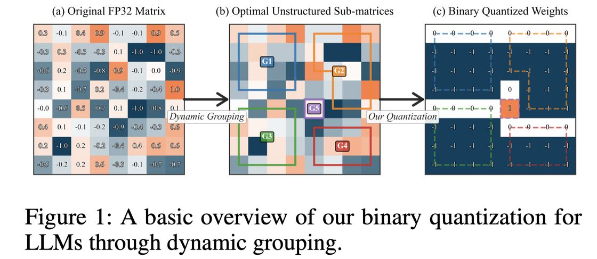

# Binary Quantization For LLMs Through Dynamic Grouping (WGM)

> Xinzhe Zheng, Zhen-Qun Yang, Haoran Xie, S. Joe Qin, Arlene Chen, Fangzhen Lin

> ⚠️ **本 note 由 AI Agent 自动生成（2025-06-04），基于 arXiv:2509.03054v1 全文阅读。**

---

## 一句话总结

WGM（Windowed Greedy Merging）通过动态分组策略将 LLM 权重进行二值量化（1-bit），在仅约 1.007 bit 的平均比特长度下，实现了接近全精度模型的性能，显著优于 BiLLM 等现有 1-bit 方法，且与 4-bit GPTQ 性能相当，同时量化速度极快（单 CPU 核 14 秒完成 LLaMA 3.2 3B）。

---

## 摘要翻译

大型语言模型（LLM）在各类自然语言处理任务中表现出色，但需要大量内存和计算资源。二值量化将模型权重从 16-bit Brain Float 压缩到 {-1, 1} 的 1-bit 表示，可显著降低存储和推理成本。然而，如此激进的量化往往导致性能显著下降，相比更保守的 4-bit 量化方法效果较差。本文提出了一种针对二值量化的新型优化目标，以及三种有效实现该目标的算法。我们的方法通过自适应分组策略动态识别最优非结构化子矩阵，增强了分块量化。实验结果表明，该方法在保持高模型质量的同时，实现了仅 1.007 bit 的平均比特长度。具体而言，量化后的 LLaMA 3.2 3B 模型达到了 8.23 的困惑度（perplexity），接近原始的 7.81，远优于之前 SOTA 方法 BiLLM 的 123.90。此外，我们的方法在性能和效率上与 SOTA 4-bit 方法（如 GPTQ）具有竞争力。压缩过程非常高效，仅需 14 秒即可在单个 CPU 核上量化完整的 LLaMA 3.2 3B 权重，整个过程在 100 分钟内完成，且具有天然的并行特性。

---

## 研究动机

1. **LLM 部署成本问题**：大型语言模型（如 DeepSeek R1 有 6710 亿参数，需 720GB 内存）的部署成本极高，限制了在移动设备、笔记本等受限设备上的部署。
2. **二值量化的性能瓶颈**：虽然 4-bit 量化（如 GPTQ）已取得成功，但极端的 1-bit 量化（二值量化）仍面临性能严重下降的问题。例如，BiLLM 在 LLaMA 7B 上的困惑度高达 35.04（原始 5.68）。
3. **现有方法的局限性**：现有二值 PTQ 方法（如 BiLLM、PB-LLM）主要依赖 Hessian 矩阵来识别重要权重，计算成本高；且使用均匀分块和固定分组策略，忽略了自适应分组的潜力。此外，所有方法均为模拟实现，缺乏专门的硬件和内核支持。
4. **核心问题**：如何在不依赖 Hessian 的情况下，找到最优的非结构化子矩阵分组，以最小化二值量化损失？

---

## 方法（技术细节）

### 1. 新型优化目标

WGM 提出了一个新的优化目标，通过识别最优的非结构化子矩阵分组来最小化量化损失。核心思想是：

- 对于矩阵 $A \in \mathbb{R}^{m \times n}$，将其划分为 $g$ 个不重叠的非结构化子矩阵 $\{A_1, A_2, \ldots, A_g\}$
- 每个子矩阵 $A_i$ 用一个标量 $\alpha_i$ 和一个二值矩阵 $B_i$ 来近似
- 优化目标为：

$$\min_{g, \{A_i\}} \sum_{i=1}^{g} \left( \|A_i - \alpha_i B_i\|_2^2 + \frac{\lambda}{|A_i|} \right)$$

其中：
- 第一项 $\|A_i - \alpha_i B_i\|_2^2$ 是量化损失
- 第二项 $\frac{\lambda}{|A_i|}$ 是正则化项，惩罚过小的分组（分组越小，存储开销越大）
- 通过数学推导，量化损失可转化为 $|A_i| \cdot \text{Var}(\tilde{A}_i)$，其中 $\tilde{A}_i$ 是 $A_i$ 的绝对值

最终优化目标简化为：

$$\min_{g, \{A_i\}} \sum_{i=1}^{g} \left( |A_i| \cdot \text{Var}(\tilde{A}_i) + \frac{\lambda}{|A_i|} \right)$$

### 2. 三种算法

#### 算法 1：动态分组（Dynamic Grouping）
- 基于经典动态规划，系统探索所有可能的分组
- 首先对所有元素的绝对值进行排序（排序后连续子序列保证最小方差）
- 使用动态规划表 $dp[k][n]$ 存储将 $n$ 个元素分为 $k$ 组的最小代价
- 时间复杂度：$O((mn)^3)$，不适用于实际大模型

#### 算法 2：贪心分组（Greedy Grouping）
- 使用最小堆存储每对相邻分组的合并代价
- 迭代弹出最小代价的合并操作，直到剩余分组数达到目标
- 时间复杂度：$O(mn \log(mn))$
- 速度快但可能牺牲一定精度

#### 算法 3：窗口化贪心合并（Windowed Greedy Merging, WGM）
- **核心算法**，也是论文主要使用的算法
- 不从 $mn$ 个大小为 1 的分组开始，而是从 $mn/k$ 个大小为 $k$ 的分组开始（$k$ 为窗口大小）
- 在窗口内进行贪心合并，进一步提高效率
- 时间复杂度：$O(\frac{mn}{k} \log(\frac{mn}{k}))$
- 在速度和质量之间实现最佳平衡

### 3. 超参数

- **窗口大小 $w$**：控制初始分组的大小。实验表明 $w=64$ 是最优平衡点（超过 64 后困惑度显著下降）
- **最大分组数 $g$**：控制最大分组数。$g=32$ 可实现良好的性能和短比特长度
- **正则化参数 $\lambda$**：控制分组数量。实验显示 $\lambda$ 对量化性能影响很小（$\lambda=0.75$）
- **$\tilde{\lambda}$**：通过 $\tilde{\lambda} \in [0, 1]$ 间接控制 $\lambda$ 在 $[\lambda_{\min}, \lambda_{\max}]$ 之间

### 4. 关键技术特点

- **无需 Hessian 计算**：避免了 BiLLM 等方法中昂贵的 Hessian 矩阵计算
- **非结构化子矩阵**：允许任意行和列的元素组成分组，而非固定的结构化分块
- **多标量方案**：每个分组有一个独立的缩放标量 $\alpha_i$，相比全局单一标量更灵活
- **GPU 无关**：整个量化过程仅需 CPU，可在任意硬件上运行

---

## 实验结果

### 主要实验设置
- **模型**：LLaMA 3.2 1B/3B、Falcon3-1B-Instruct/3B-Instruct、Gemma-3-1b-it/4b-it
- **评估任务**：7 个零样本 QA 任务（ARC-C、ARC-E、BoolQ、HellaSwag、OPQA、PIQA、WinoGrande）
- **困惑度数据集**：Wikitext-2、PTB、C4
- **基线方法**：GPTQ (4-bit)、BiLLM (1.08 bit)、PB-LLM (1.7 bit)

### QA 任务性能（主要结果）
| 模型 | 方法 | 比特长度 | 平均性能 |
|------|------|---------|---------|
| LLaMA 3.2 3B | FP | 16 | 0.648 |
| LLaMA 3.2 3B | GPTQ | 4 | 0.633 |
| LLaMA 3.2 3B | BiLLM | 1.08 | 0.400 |
| LLaMA 3.2 3B | PB-LLM | 1.7 | 0.394 |
| **LLaMA 3.2 3B** | **WGM** | **1.007** | **0.627** |

- **WGM 在 6 个模型中有 4 个超过了 GPTQ (4-bit)**
- **WGM 平均性能比 BiLLM 提升 40%+**
- **1.007 bit vs. BiLLM 的 1.08 bit**，更短的比特长度

### 困惑度（PPL）性能
| 模型 | 方法 | 比特长度 | Wikitext-2 | PTB | C4 | 平均 |
|------|------|---------|-----------|-----|-----|------|
| LLaMA 3.2 3B | FP | 16 | 7.81 | 13.53 | 11.33 | 10.89 |
| LLaMA 3.2 3B | GPTQ | 4 | 12.23 | 23.60 | 15.43 | 17.09 |
| LLaMA 3.2 3B | BiLLM | 1.08 | 123.09 | 168.06 | 100.68 | 130.61 |
| **LLaMA 3.2 3B** | **WGM** | **1.007** | **8.53** | **15.24** | **12.97** | **12.25** |

- **WGM 困惑度 8.23（LLaMA 3.2 3B）非常接近原始 7.81**
- **WGM 困惑度远低于 BiLLM（123.90 → 8.23）**
- **WGM 困惑度优于 4-bit GPTQ（17.09 → 12.25）**

### 量化速度
- LLaMA 3.2 3B 在单 CPU 核上仅需 14 秒
- 整个过程在 100 分钟内完成
- 并行化后理论可达约 14 秒
- 对比 GPU 上的 GPTQ（372-1000 秒），WGM 在 CPU 上更快

### 超参数敏感性
- **窗口大小 $w$**：$w=64$ 时困惑度最低（14.00），$w=512$ 时上升至 19.52
- **最大分组数 $g$**：$g=32$ 时性能平缓，继续增加效果不明显
- **正则化参数 $\lambda$**：对量化性能影响很小（差异可忽略）

---

## 优势

1. **极低比特长度**：仅 1.007 bit，接近理论极限
2. **接近全精度性能**：困惑度仅比原始模型高约 0.5-1.0，远优于其他 1-bit 方法
3. **超越 4-bit 方法**：在多个模型上性能超过 GPTQ (4-bit)
4. **无需 Hessian**：避免了昂贵的二阶导数计算，降低了量化成本
5. **极快量化速度**：单 CPU 核 14 秒完成 LLaMA 3.2 3B，可并行化
6. **CPU 友好**：无需 GPU 即可完成量化
7. **三个算法层次**：提供最优（动态规划）、快速近似（贪心）、高效近似（窗口贪心）三种选择
8. **灵活性**：可适应不同硬件和精度需求

---

## 局限

1. **仅限模拟**：当前缺乏专门的 1-bit 硬件和内核，所有结果基于模拟
2. **索引存储开销**：非结构化分组需要额外存储索引信息，可能增加实际比特长度
3. **推理速度受限**：缺乏针对任意分组的优化内核，实际推理速度可能不理想
4. **Python 实现**：当前使用 Python 实现，C++ 可能进一步加速
5. **分组索引开销**：传统方法用单一缩放标量实现平均比特长度，而 WGM 需要多个缩放标量和索引
6. **超参数调优**：需要手动选择最大分组数 $g$ 和窗口大小 $w$
7. **仅限模拟评估**：实际性能取决于未来硬件支持

---

## 与 EfficientPaper 相关的研究方向

1. **极低比特量化（Extreme Low-bit Quantization）**：WGM 展示了 1-bit 量化的可行性，未来可探索更低的比特长度（如 sub-1-bit）
2. **无 Hessian 量化方法**：WGM 证明了无需 Hessian 也能实现高质量量化，可启发更多无 Hessian 方法的研究
3. **自适应分组策略**：动态分组的思想可推广到其他量化场景（如 2-bit、3-bit 量化）
4. **硬件-软件协同设计**：WGM 的分组策略需要专门的硬件和内核支持，未来硬件设计可考虑分组灵活性
5. **多标量方案**：WGM 的每个分组一个缩放标量的思路，可启发更高效的量化方案
6. **量化-压缩联合优化**：结合量化和其他压缩方法（如剪枝、蒸馏）进一步提升效率
7. **边缘设备部署**：WGM 的 CPU 友好特性使其适合在边缘设备上部署
8. **与其他 PTQ 方法对比**：WGM 可与 GPTQ、BiLLM、PB-LLM 等方法进行更深入的对比研究
9. **量化-推理一体化**：探索量化方法与推理引擎的深度集成

---

## 关键信息

- **论文标题**：Binary Quantization For LLMs Through Dynamic Grouping
- **作者**：Xinzhe Zheng, Zhen-Qun Yang, Haoran Xie, S. Joe Qin, Arlene Chen, Fangzhen Lin
- **机构**：香港科技大学、香港理工大学、岭南大学
- **发表时间**：2025 年 9 月
- **arXiv ID**：2509.03054v1
- **代码**：https://github.com/johnnyzheng0636/WGM_bi_quan
- **关键词**：quantization（量化）、binary quantization、dynamic grouping、windowed greedy merging

---

*本 note 由 AI Agent 自动生成，基于 arXiv:2509.03054v1 全文阅读。*
