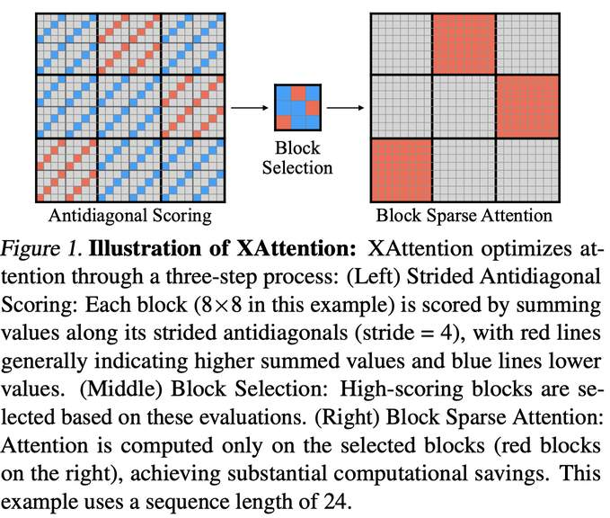

# XAttention: Block Sparse Attention with Antidiagonal Scoring



## 一句话总结

XAttention 提出了一种基于对角线求和（Antidiagonal Scoring）的轻量级块稀疏注意力机制，通过在注意力矩阵的反对角线上以步长采样来评估每个块的重要性，从而实现高效且精确的长上下文推理加速，在 RULER、LongBench、VideoMME 和 VBench 等基准上达到了最高 13.5 倍的注意力计算加速。

---

## 摘要翻译

长上下文 Transformer 模型（LCTMs）对于现实世界的应用至关重要，但由于注意力机制的二次方复杂度而面临高昂的计算成本。块稀疏注意力通过将计算集中在关键区域来缓解这一问题，但现有方法由于代价高昂的块重要性度量而在准确性和效率之间难以平衡。本文介绍了 XAttention，一个即插即用的框架，利用稀疏注意力显著加速 Transformer 模型的长上下文推理。XAttention 的核心创新在于发现：注意力矩阵中反对角线值（即从左下到右上）的总和为块重要性提供了强有力的代理指标。这使得可以精确识别和剪除非必要的块，从而实现高稀疏度和显著加速的推理。在包括语言任务的 RULER 和 LongBench、视频理解的 VideoMME、以及视频生成的 VBench 等具有挑战性的长上下文基准上，XAttention 实现了与全注意力相当的准确度，同时提供了可观的计算收益。我们展示了最高 13.5 倍的注意力计算加速。这些结果证明了 XAttention 解锁块稀疏注意力实际潜力的能力，为 LCTMs 在现实应用中的可扩展和高效部署铺平了道路。

---

## 研究动机

长上下文 Transformer 模型（LCTMs）在视频理解、视频生成等任务中发挥着核心作用，但注意力机制的**二次方计算复杂度**严重制约了其实际部署，尤其在预填充（prefill）阶段的长序列处理中成为显著瓶颈。

块稀疏注意力（Block Sparse Attention）通过将注意力计算限制在关键区域来降低计算量，但现有方法面临两个核心挑战：

1. **块重要性评估代价高昂**：MInference 和 FlexPrefill 依赖 token 池化和"垂直-斜线"模式检测来识别重要块，但这些方法的搜索算法本身引入了大量计算开销。
2. **模式识别不充分**：依赖平均/求和池化的预测方法在块内仅有少量显著的垂直或斜线模式时，无法有效捕捉这些关键指标。此外，仅分析最后一个查询片段的做法可能遗漏重要的注意力模式。

因此，需要一种**训练无关、开销极低**的块重要性预测方法，以真正解锁块稀疏注意力的潜力。

---

## 方法（技术细节）

XAttention 算法包含三个核心组件：**重要性预测**、**阈值块选择**和**最小阈值预测**。

### 2.1 反对角线重要性预测（Antidiagonal Scoring）

**核心洞察**：注意力矩阵中反对角线方向（左下到右上）的值之和可以作为块重要性的高效代理指标。

**具体做法**：在每个大小为 B×B 的注意力块中，沿反对角线以步长 S 选取元素，计算其总和作为该块的重要性评分。

**有效性分析**：
- **信息保留**：每个 token 至少贡献到一条反对角线的求和中，确保所有 token 信息被考虑。
- **模式检测**：反对角线与块内所有可能的垂直模式和斜线模式相交，能够高效检测这些模式并指导稀疏注意力计算。这意味着不会遗漏关键模式。

### 2.2 阈值块选择（Threshold Block Selection）

基于反对角线评分，XAttention 执行以下步骤：

1. **反对角线求和**：在每个 S×S 的注意力子块中沿反对角线选取元素并求和。
2. **Softmax 归一化**：对这些反对角线求和应用 softmax，得到概率分布。
3. **块选择**：通过 `find_blocks` 函数选择累积概率超过阈值 τ 的最小块集合。

形式化表达：
$$\text{find\_blocks}(A, \tau) = \arg\min_{B} \left\{ |B| : \sum_{b \in B} \sum_{(i,j) \in b} A_{i,j} \geq \tau \right\}$$

**动态稀疏度**：与 Top-K 或 Top-Ratio 不同，阈值选择方法自适应地处理多样化的输入序列长度，在计算量和准确度之间实现最优平衡。

### 2.3 最小阈值预测（Minimum Threshold Prediction）

采用**动态规划**为每个注意力头确定最优阈值：

- **问题建模**：定义 DP 表 D[h][m]，其中 h 为第 h 个注意力头，m 为阈值调整次数。
- **递推关系**：D[h][m] = max(D[h-1][m], P(h,m))
- **阈值调整**：每次将阈值降低 10%，即 th(m) = th(m-1) × 0.9
- **目标**：在最大化准确度的同时最小化计算量。

该组件是可选的，不强制使用，但能进一步优化 XAttention 的稀疏度。

### 算法伪代码

```
Algorithm 1 Block Selection
Input: Q ∈ R^{L×d}, K ∈ R^{L×d}, block size B, stride S, head dim d_h, threshold τ
Output: Sparse mask M

1. N_B ← ⌊L/B⌋
2. For each block b:
   - Extract Q block and reshape along antidiagonals with stride S
   - Compute approximate attention: A_approx ← Softmax(Q_reshaped × K_reshaped^T / √(d_h·S))
   - M_b ← find_blocks(A_approx, τ)
3. Concatenate all block masks
```

---

## 实验结果

### 评估设置

- **模型**：Llama-3.1-8B-Instruct（自然语言）、Qwen2-VL-7B-Instruct（视频理解）、HunyuanVideo（视频生成）
- **基准**：RULER、LongBench（语言）、VideoMME（视频理解）、VBench（视频生成）
- **基线**：FlashAttention、MInference、FlexPrefill、SeerAttention

### 语言任务结果

#### RULER 基准

| 方法 | 4k | 8k | 16k | 32k | 64k | 128k | 平均 |
|------|-----|-----|------|------|------|-------|------|
| Full | 96.74 | 94.03 | 92.02 | 84.17 | 81.32 | 76.89 | 87.52 |
| FlexPrefill | 95.99 | 93.67 | 92.73 | 88.14 | 81.14 | 74.67 | 87.72 |
| MInference | 96.54 | 94.06 | 91.37 | 85.79 | 83.03 | 54.12 | 84.15 |
| SeerAttn | 84.43 | 79.55 | 79.80 | 72.95 | 64.79 | 51.61 | 72.18 |
| XAttn S=8 | 96.83 | 94.07 | 93.17 | 90.75 | 84.08 | 72.31 | 88.47 |
| XAttn S=16 | 96.11 | 93.95 | 93.56 | 90.64 | 83.12 | 71.11 | 88.08 |

**关键发现**：XAttention 在 RULER 上不仅超越了最优稀疏基线 FlexPrefill，在多个序列长度上甚至优于全注意力。MInference 和 SeerAttention 在长上下文下性能严重退化，而 XAttention 保持了稳健性。

#### LongBench 基准

XAttention 在 LongBench 的所有 16 个子任务上取得了最高的平均分数（40.60），超过 Full（40.34）、MInference（40.30）和 FlexPrefill（36.83），在各个任务上保持与全注意力相近的性能。

### 视频理解结果（Video-MME）

在 QwenVL-2-7B 模型上，XAttention（S=16, τ=0.9）：
- 在所有稀疏注意力方法中取得最佳平均分
- 在长视频（1小时，1fps）任务上甚至**超越了全注意力**
- Overall: 69.1% vs Full 69.2%

### 视频生成结果（VBench）

在 HunyuanVideo 模型上，采用 5 步全注意力预热：
- τ=0.90: PSNR 21.5, SSIM 0.767, LPIPS 0.215, 密度 34.4%
- τ=0.95: PSNR 23.5, SSIM 0.822, LPIPS 0.155, 密度 45.5%
- 生成质量与全注意力基线难以用肉眼区分

### 加速结果

- **最高 13.5 倍**注意力计算加速（256K tokens, S=8, 密度 6.89%）
- **模式选择加速**：比 MInference 快 24.9 倍，比 FlexPrefill 快 5.9 倍
- 在短上下文（8K）时，MInference 和 FlexPrefill 因模式选择开销而减速，但 XAttention 仍保持加速优势

### 密度分析

| 序列长度 | Stride 4 | Stride 8 | Stride 16 |
|---------|----------|----------|-----------|
| 4k | 51.73% | 52.16% | 55.38% |
| 16k | 27.43% | 27.49% | 28.91% |
| 64k | 9.43% | 10.98% | 11.32% |
| 128k | 6.20% | 6.89% | 7.32% |

随序列长度增加，稀疏度显著提升，这使 XAttention 在长上下文场景中优势更加突出。

### 消融实验

1. **反对角线模式** vs 随机/对角线模式：反对角线模式在准确度和密度上均表现最佳
2. **步长大小**：S=4/8/16 性能相近（88.08-88.89），但 S=64 过大导致性能下降（81.21）
3. **Top-K vs Top-Ratio vs 阈值选择**：阈值方法在所有步长下均实现最佳准确度-密度平衡
4. **最小阈值预测**：动态阈值相比固定 τ=0.9 同时提升准确度和降低密度

---

## 优势

1. **即插即用**：无需训练或微调，直接应用于现有 Transformer 模型
2. **轻量级模式选择**：反对角线评分比 MInference 的垂直-斜线搜索快 24.9 倍，比 FlexPrefill 快 5.9 倍
3. **高稀疏度**：在 256K 上下文长度下达到 6.89% 的密度，实现 13.5 倍加速
4. **多领域适用**：在语言理解、视频理解和视频生成三个不同领域均表现优异
5. **准确度损失极小**：在 RULER 和 LongBench 上甚至超过全注意力
6. **训练无关**：不需要预训练或微调额外参数，与 SeerAttention 不同
7. **动态稀疏度**：阈值选择方法自适应处理不同长度的序列

---

## 局限

1. **代码复现加速不理想**：原始 note 中指出，根据开源代码复现，加速效果不如论文报告的理想
2. **算法复杂度**：op note 中提到算法复杂度比 FlexPrefill 和 Minference 高，尽管最终加速比很好
3. **步长选择敏感**：步长过大（如 S=64）会导致性能显著下降
4. **视频生成需预热**：在视频生成场景中，从一开始就使用 XAttention 会导致布局偏移，需要引入 5 步全注意力预热
5. **依赖注意力模式假设**：反对角线评分假设注意力矩阵中的重要模式（垂直和斜线模式）能被反对角线捕捉，可能在某些特定注意力分布下不适用
6. **未评估解码阶段**：论文主要关注预填充阶段的加速，对解码阶段的加速效果未做详细评估
7. **超参数调优**：阈值 τ、步长 S、块大小 B 等超参数需要针对不同任务进行调优

---

## 与 EfficientPaper 相关的研究方向

### 相关 baseline 方法

- **2024/MInference**：利用动态稀疏注意力模式（垂直-斜线）加速预填充，XAttention 的直接竞争者
- **2024/streaming-llm**：保留初始和最近的 token 进行持续流式推理，关注解码阶段效率
- **2025/FlexPrefill**：上下文感知的稀疏注意力机制，XAttention 的另一个主要基线

### 相关研究方向

1. **块稀疏注意力**：XAttention 属于块稀疏注意力家族，与 BigBird、LongFormer、Sparse Transformer 等方法一脉相承
2. **训练无关加速**：XAttention 无需训练即可加速，与需要微调的 SeerAttention 形成对比
3. **注意力模式挖掘**：反对角线评分是对注意力矩阵稀疏模式的新见解，与 MInference 的垂直-斜线模式检测、FlexPrefill 的模式搜索方法形成互补
4. **多模态长上下文**：XAttention 同时在语言、视频理解和视频生成三个领域验证，体现了长上下文加速技术在多模态 AI 中的广泛应用
5. **视频生成加速**：将稀疏注意力扩展到 Diffusion Transformer（DiT）架构，为视频生成模型的高效部署提供新思路
6. **LLM 推理加速系统**：与 FlashAttention、RingAttention、PagedAttention 等系统级优化方法互补，可组合使用
7. **动态稀疏度策略**：阈值选择方法提供了一种自适应的稀疏度控制机制，与 Top-K、Top-Ratio 等固定稀疏度方法形成对比

---

> **生成声明**：本 note 由 AI Agent（Hermes Agent）自动生成，基于对论文全文的阅读和分析。生成时间：2026年6月。如有错误或遗漏，请以原文为准。
