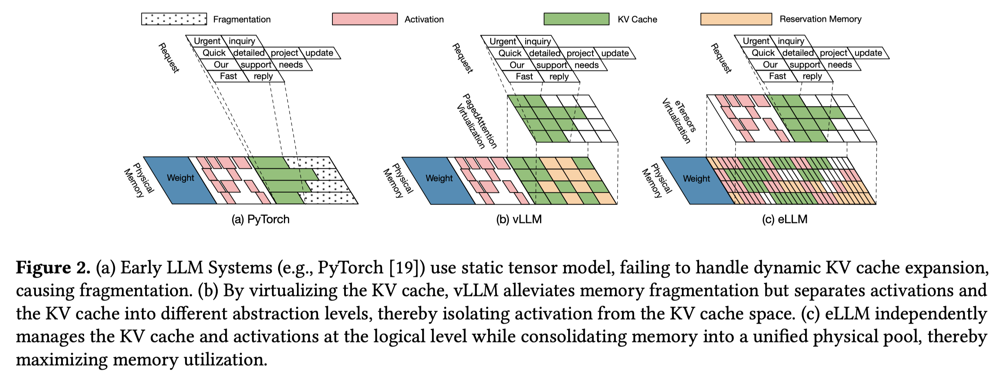

# eLLM: Elastic Memory Management Framework for Efficient LLM Serving

> Jiale Xu, Rui Zhang, Yi Xiong, Cong Guo, Zihan Liu, Yangjie Zhou, Weiming Hu, Hao Wu, Changxu Shao, Ziqing Wang, Yongjie Yuan, Junping Zhao, Minyi Guo, Jingwen Leng

## Abstract

Large Language Models are increasingly being deployed in datacenters. Serving these models requires careful memory management, as their memory usage includes static weights, dynamic activations, and key-value caches. While static weights are constant and predictable, dynamic components such as activations and KV caches change frequently during runtime, presenting significant challenges for efficient memory management. Modern LLM serving systems typically handle runtime memory and KV caches at distinct abstraction levels: runtime memory management relies on static tensor abstractions, whereas KV caches utilize a page table-based virtualization layer built on top of the tensor abstraction. This virtualization dynamically manages KV caches to mitigate memory fragmentation. However, this dual-level approach fundamentally isolates runtime memory and KV cache management, resulting in suboptimal memory utilization under dynamic workloads, which can lead to a nearly 20% drop in throughput.
  To address these limitations, we propose eLLM, an elastic memory management framework inspired by the classical memory ballooning mechanism in operating systems. The core components of eLLM include: (1) Virtual Tensor Abstraction, which decouples the virtual address space of tensors from the physical GPU memory, creating a unified and flexible memory pool; (2) an Elastic Memory Mechanism that dynamically adjusts memory allocation through runtime memory inflation and deflation, leveraging CPU memory as an extensible buffer; and (3) a Lightweight Scheduling Strategy employing SLO-aware policies to optimize memory utilization and effectively balance performance trade-offs under stringent SLO constraints. Comprehensive evaluations demonstrate that eLLM significantly outperforms state-of-the-art systems, 2.32x higher decoding throughput, and supporting 3x larger batch sizes for 128K-token inputs.
