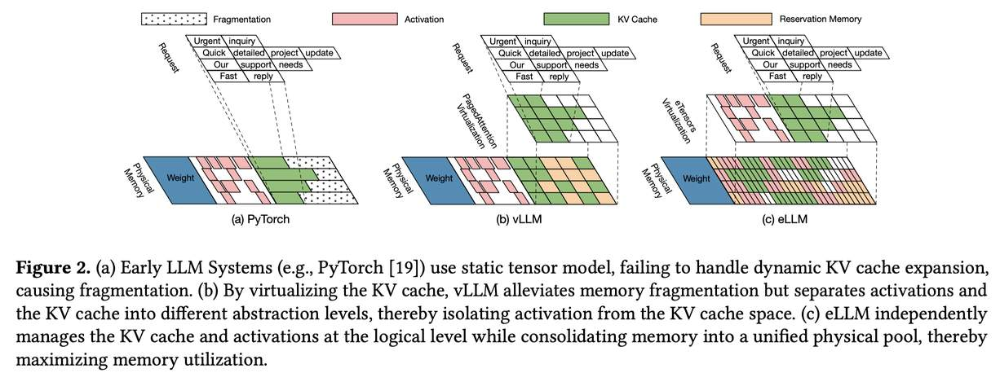

# eLLM: Elastic Memory Management Framework for Efficient LLM Serving

> Jiale Xu, Rui Zhang, Yi Xiong, Cong Guo, Zihan Liu, Yangjie Zhou, Weiming Hu, Hao Wu, Changxu Shao, Ziqing Wang, Yongjie Yuan, Junping Zhao, Minyi Guo, Jingwen Leng

## 一句话总结

eLLM 提出了一种受操作系统内存气球机制启发的弹性内存管理框架，通过虚拟张量抽象（eTensor）打破 KV 缓存与激活内存之间的隔离，实现 GPU 内存的动态弹性分配与 CPU-GPU 协同管理，从而显著提升 LLM 推理系统的内存利用率和吞吐量。

## 摘要

大型语言模型（LLM）越来越多地部署在数据中心。服务这些模型需要仔细的内存管理，因为其内存使用包括静态权重、动态激活和 KV 缓存。虽然静态权重是恒定且可预测的，但激活和 KV 缓存等动态组件在运行时频繁变化，为高效内存管理带来了重大挑战。现代 LLM 服务系统通常在不同的抽象级别上处理运行时内存和 KV 缓存：运行时内存管理依赖于静态张量抽象，而 KV 缓存则利用基于张量抽象的页表虚拟化层。这种虚拟化动态管理 KV 缓存以减轻内存碎片。然而，这种双层方法从根本上隔离了运行时内存和 KV 缓存管理，导致在动态工作负载下内存利用率不优化，吞吐量可下降近 20%。

为解决这些局限，我们提出 eLLM，一种受操作系统经典内存气球机制启发的弹性内存管理框架。eLLM 的核心组件包括：(1) **虚拟张量抽象（Virtual Tensor Abstraction）**，将张量的虚拟地址空间与物理 GPU 内存解耦，创建统一灵活的内存池；(2) **弹性内存机制（Elastic Memory Mechanism）**，通过运行时内存膨胀和收缩动态调整内存分配，利用 CPU 内存作为可扩展缓冲区；(3) **轻量级调度策略（Lightweight Scheduling Strategy）**，采用 SLO 感知策略优化内存利用率，在严格的 SLO 约束下有效平衡性能权衡。综合评估表明，eLLM 显著优于最先进的系统，解码吞吐量提升 2.32 倍，并支持 128K token 输入的 3 倍更大批量大小。

## 研究动机

### 问题背景

LLM 的内存使用由三类张量组成：权重（Weight）、激活（Activation）和 KV 缓存（KV Cache）。现有系统（如 vLLM）在不同抽象层次管理这些张量：激活通过框架层的静态张量抽象管理，而 KV 缓存通过 PagedAttention 的页表虚拟化管理。这种**隔离**导致了两个关键问题：

1. **激活内存利用率低下**：现有系统基于最大可能长度预分配激活内存。在实际工作中，超过 90% 的请求批次使用不到模型最大上下文长度的 30%。在预填充阶段，仅 35% 的已分配激活内存被活跃使用；在解码阶段，利用率更低至 1%。

2. **KV 缓存空间过载**：随着上下文窗口扩展和前缀缓存技术的应用，保留的 KV 条目显著增加，但可用 KV 缓存空间反而减少（因为激活内存的静态分配占据了空间）。

### 关键洞察

- **请求长度变化**：上下文长度从 2K 扩展到 200K，激活空间占比从 0.3% 飙升至 30.8%，而 KV 缓存空间占比从 89.6% 降至 59.1%。
- **模型架构演进**：GQA、MLA、Jamba 等创新架构压缩 KV 缓存，使瓶颈从 KV 缓存中心转向所有动态张量。
- **推理阶段差异**：预填充阶段需要大量激活内存，而解码阶段激活内存极少，两个阶段在单 GPU 上执行时会导致内存利用不均。

## 方法（技术细节）

### 1. 虚拟张量抽象（Virtual Tensor Abstraction）

eLLM 引入一种名为 **eTensor** 的新型张量抽象，利用 GPU 虚拟内存管理（VMM）将张量的虚拟地址空间与物理 GPU 内存解耦。从内核函数角度看，eTensor 可视为引用 GPU 虚拟地址空间内连续段的数组指针结构。

**两种 eTensor 类型**：
- **KV eTensor**：KV 缓存是大而规则的内存块，具有稳定的大小扩展、不频繁的访问模式和持久的推理期间保留。因此，为每个请求在最大并发数下预分配等于模型上下文长度的虚拟地址空间段，确保 KV 缓存的逻辑连续性，物理块在实际写入时按需分配。
- **Activation eTensor**：激活由较小的内存块组成，具有较短的生命周期和较高的访问频率，因此需要更细粒度的虚拟地址空间管理。激活 eTensor 的特点是大小不均匀的虚拟地址段。

**eTensor 池与统一物理池**：
- KV eTensor 池采用 Best-Fit 算法，选择满足要求的最小可用槽位。
- Activation eTensor 池保留框架原生的 Best-Fit with Coalescing（BFC）策略。
- 所有物理块都标记有对应的 eTensor 类别（所有权），但它们本质上属于一个统一的物理内存池。这一特征使得 eLLM 可以通过映射关系传播实现零开销标识转换，动态分配资源。

### 2. 弹性内存机制（Elastic Memory Mechanism）

#### 2.1 内存膨胀与收缩（Memory Inflation and Deflation）

这是 eLLM 的核心机制，通过映射关系传播打破内存隔离：

**膨胀（Inflation）操作**：
1. **触发**：在 KV 缓存分配请求时，系统首先验证 KV 内存池是否有足够的物理块。如果不足，则向激活内存池发出借用请求。
2. **内存回收**：激活池通过轻量级垃圾回收（GC）阶段响应请求，识别并取消映射分配给非活跃 eTensor 对象的物理块。
3. **所有权转移**：回收的块在逻辑上从激活池迁移到 KV 缓存池。
4. **按需重映射**：GPU 虚拟内存管理器动态将这些块映射到目标 KV eTensor 的虚拟地址空间。

**收缩（Deflation）操作**：是上述过程的逆过程，归还借用的内存，以惰性方式触发以避免不必要的开销。

#### 2.2 内存卸载与获取（Memory Offloading and Fetching）

eLLM 进一步引入 GPU-CPU 之间的弹性内存管理，利用 CPU 内存作为 GPU 内存的可扩展缓冲区：

- **预填充阶段**：主动将部分请求的 KV 缓存卸载到 CPU DRAM，降低请求执行的内存准入壁垒，有效减少排队延迟以改善 TTFT。
- **解码阶段**：将 KV 缓存取回 GPU 内存，利用减少的内存占用来支持更大的解码批次。

技术可行性基于以下观察：
- 新生成的 KV 缓存不需要立即使用，可以主动卸载，仅在对应请求的解码被调度时取回。
- Transformer 的多层结构天然支持通过层间流水线实现计算与通信的重叠。
- KV 缓存迁移仅需 O(N) 线性通信开销，而预填充阶段的自注意力计算为 O(N²) 复杂度。

### 3. 轻量级调度策略（Lightweight Scheduling Strategy）

#### 3.1 请求调度（Request Scheduling）

核心调度策略（Algorithm 1）通过弹性分配资源最大化并发 LLM 服务请求数，同时严格遵守内存约束：

- **预填充阶段**：需要大量激活和 KV 缓存内存资源。在内存密集场景中，实施 KV 缓存到 CPU 缓冲区的卸载。
- **解码阶段**：由于激活内存需求极小，通过取回 KV 缓存到 GPU 内存来优化资源利用。
- 两个阶段均通过膨胀和收缩最大化 GPU 内存利用率。
- 消除"持有并等待"条件，避免资源借用导致的死锁风险。

#### 3.2 SLO 感知缓冲区缩放策略（SLO-aware Buffer Scaling）

引入**逻辑缓冲区**概念，作为物理缓冲区的抽象，动态调整固定容量内的实际可用大小：

- 如果检测到 TPOT 违规，缩小逻辑缓冲区大小以限制预填充请求，优化 TPOT。
- 如果检测到 TTFT 违规，增大队逻辑缓冲区大小以优化 TTFT。
- 违规事件定义为：在特定调度迭代窗口（默认 5 次迭代）内，TTFT 或 TPOT 超过预定义 SLO 阈值三次。
- 缓冲区调优因子 α 是一个超参数（默认 α=2）。

### 4. 实现细节

- **系统实现**：基于 vLLM v0.5.5 构建，约 4000 行 C++ 和 Python 代码。
- **映射开销重叠**：
  - **解码推测预映射**：利用自回归特性，假设每个序列将产生下一个 token，提前启动异步内存分配（<50MB），实现完全重叠解码映射开销。
  - **异步取消映射**：利用 GPU VMM 的能力将单个物理块映射到多个虚拟地址，先将物理块分配给新的 tensor slot，异步执行原始 slot 的取消映射。

## 实验结果

### 实验设置
- **基线系统**：vLLM、vLLM with Chunked Prefill（vLLM-CP）、DistServe
- **模型**：Llama3-8B-262K（GQA）、Jamba（Mamba-MoE）、OPT-13B（MHA）
- **硬件**：8× NVIDIA A100 80GB GPU，Intel Xeon Platinum 8369B CPU，1TB RAM
- **数据集**：ShareGPT（真实数据）和合成数据集（固定长度 2K-2K、32K-2K）

### 主要结果

#### 在线服务评估（单 GPU）
- **TTFT 改善**：eLLM 在所有工作负载下持续优于 vLLM，在 2K-2K 工作负载中实现最高 **295 倍**（vs vLLM）和 **140 倍**（vs vLLM-CP）的 TTFT 加速。
- **Goodput 提升**：最高 **2.5 倍**（vs vLLM）和 **2.26 倍**（vs vLLM-CP）的 goodput 提升。
- **SLO 达成率**：eLLM 通过 TTFT 和 TPOT 之间的权衡实现更好的 SLO 达成率。

#### 在线服务评估（多 GPU）
- eLLM 在所有测试配置中持续实现最高性能。
- DistServe 因 GPU 空闲期和模型权重复制导致性能次优。
- eLLM 在 SLO 达成率和 goodput 方面优于 DistServe。

#### 离线推理评估
- **解码吞吐量**：在 128K/8K 数据分布下，eLLM 相比 vLLM 实现 **2.32 倍**解码吞吐量提升。
- **总吞吐量**：1.82 倍提升。
- **最大批量大小**：支持 128K token 输入的 **3 倍**更大批量。
- Jamba 架构下性能提升更大，因为其激活与 KV 缓存大小比更高。

#### 消融实验
- **GPU 内弹性（intra-GPU elasticity）**和 **GPU-CPU 弹性（inter-GPU elasticity）**各自对改善 TTFT 和增加解码批次大小有贡献。
- eLLM 组合两者实现最高 **295 倍** TTFT 加速。
- 在吞吐量方面，两种弹性机制组合不一定总是最优（PCIe 传输开销不能完全重叠），但在 SLO 达成方面，eLLM 通过动态利用两种内存弹性实现 **1.5 倍**吞吐量提升和 **2.5 倍** goodput 改善。

#### 系统开销分析
- CPU 调度时间占总执行时间不到 1%。
- VMM 操作时间占在线服务场景的 1%~5%，得益于策略设计（eTensor 池、解码推测预映射、异步取消映射）。

## 优势

1. **统一内存管理**：通过 eTensor 抽象打破 KV 缓存与激活内存之间的隔离，实现统一的物理内存池，从根本上解决了现有系统中内存空间隔离导致的利用率低下问题。
2. **灵活的弹性机制**：双重弹性（GPU 内膨胀/收缩 + GPU-CPU 卸载/获取）可动态适应 LLM 推理工作负载的变化，在预填充和解码阶段之间灵活调配内存资源。
3. **显著的性能提升**：最高 295 倍 TTFT 改善、2.32 倍解码吞吐量提升、3 倍更大批量大小，特别适合长上下文推理场景。
4. **SLO 感知调度**：通过逻辑缓冲区缩放策略平衡 TTFT 和 TPOT，在严格 SLO 约束下实现高 goodput。
5. **低开销实现**：CPU 调度开销 <1%，VMM 操作开销 1%~5%，不影响系统性能。
6. **架构无关性**：在 GQA（Llama3）、Mamba-MoE（Jamba）、MHA（OPT）等多种架构上均有效，具有良好的通用性。
7. **与现有技术正交**：与 FlashAttention、量化、稀疏化等技术正交，可组合使用。

## 局限

1. **CPU-GPU 通信开销**：GPU-CPU 弹性机制引入 PCIe 传输开销，不能完全被计算重叠，在高负载下可能影响性能。
2. **代码未开源**：目前未提供公开代码，限制了社区的复现和扩展。
3. **仅在特定硬件上评估**：主要在 NVIDIA A100 和 L40S 上评估，未涵盖其他 GPU 架构（如 AMD GPU、消费级 GPU）。
4. **长上下文场景最优**：eLLM 的优势在长上下文场景（如 128K）中最为显著，对于短上下文请求（如 ShareGPT 中的小输入/输出），改善相对有限。
5. **Prefill-Decode 分离的局限未完全解决**：虽然 eLLM 通过弹性机制减少分离需求，但在极端情况下（如极高请求率），仍可能存在内存竞争问题。
6. **未来方向**：论文提到将探索参数动态性的支持（如动态参数高效学习），但目前尚未实现。

## 与 EfficientPaper 相关的研究方向

### 相关关键词
- **KV 缓存管理（kv_cache_management）**：eLLM 直接针对 KV 缓存管理问题，提出统一的内存池机制，与 vLLM 的 PagedAttention 形成互补。
- **系统工具（tool）**：eLLM 作为 LLM 服务系统的底层基础设施组件，属于系统工具层面的创新。

### 可能的研究方向
1. **弹性内存管理与动态并行**：eLLM 的弹性内存机制可与动态并行（如 LoongServe、Llumnix）结合，实现更细粒度的资源调配。
2. **Prefill-Decode 分离优化**：eLLM 的 GPU-CPU 弹性机制可与 Prefill-Decode 分离方案（如 DistServe、Splitwise、Mooncake）协同，减少模型权重复制开销。
3. **KV 缓存压缩与量化**：eLLM 与 KV 缓存压缩技术（如 GQA、MLA、KVQuant）正交，可进一步降低内存压力。
4. **长上下文推理优化**：eLLM 在长上下文（128K+）场景中表现突出，可与高效注意力（如 FlashAttention、FlashDecoding++）结合。
5. **GPU 内存碎片整理**：eLLM 的 eTensor 抽象可与 GMLake 等内存碎片整理技术结合，进一步优化 GPU 内存利用率。
6. **异构内存架构**：eLLM 的 CPU-GPU 卸载机制可扩展到 HBM-DRAM-CPU 多级内存架构，适用于更大规模的部署场景。

---

> **生成声明**：本 note 由 AI Agent（Hermes Agent）于 2025 年 6 月自动生成，基于对论文全文的阅读和理解。所有内容为中文。
