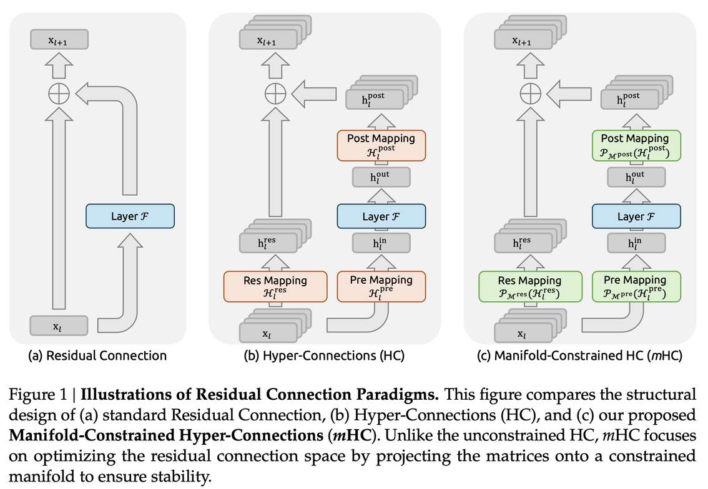

# mHC: Manifold-Constrained Hyper-Connections

> Zhenda Xie, Yixuan Wei, Huanqi Cao, Chenggang Zhao, Chengqi Deng, Jiashi Li, Damai Dai, Huazuo Gao, Jiang Chang, Liang Zhao, Shangyan Zhou, Zhean Xu, Zhengyan Zhang, Wangding Zeng, Shengding Hu, Yuqing Wang, Jingyang Yuan, Lean Wang, Wenfeng Liang

> **⚠️ 生成声明：本 note 由 AI Agent（Hermes Agent）于 2025 年 6 月自动生成，基于论文 arXiv:2512.24880v1 全文内容。如有疏漏请以原文为准。**

---

## 一句话总结

mHC 通过将 Hyper-Connections 的残差映射矩阵约束到双随机矩阵流形（Birkhoff 多面体），恢复了残差连接的恒等映射性质，从而在保持 HC 性能增益的同时解决了大规模训练中的不稳定性和可扩展性问题，且仅引入 6.7% 的额外训练开销（扩展率 n=4）。

---

## 摘要翻译

近年来，以 Hyper-Connections (HC) 为代表的研究通过扩展残差流宽度和多样化连接模式，延伸了过去十年中普遍存在的残差连接范式。虽然这种方法带来了显著的性能提升，但这种多样化从根本上损害了残差连接固有的恒等映射性质，导致严重的训练不稳定性和可扩展性受限，同时还带来了显著的内存访问开销。为了解决这些挑战，我们提出了 **Manifold-Constrained Hyper-Connections (mHC)**，一个通用框架，将 HC 的残差连接空间投影到特定流形上以恢复恒等映射性质，同时结合严格的基础设施优化以确保效率。实证实验表明，mHC 在大规模训练中是有效的，提供了切实的性能改进和优越的可扩展性。我们预计 mHC 作为 HC 的灵活实用扩展，将有助于更深入地理解拓扑架构设计，并为基础模型的演进指明有前景的方向。

---

## 研究动机

### HC 的成功与不足

Hyper-Connections (HC) 是一种扩展残差连接的架构设计，通过将残差流宽度从 C 扩展到 n×C（n 为扩展率，通常为 4），并引入可学习矩阵来调制不同深度特征之间的连接强度。HC 在不增加 FLOPs 的情况下显著提升了模型性能。

然而，HC 存在两个关键问题：

1. **数值不稳定性**：HC 的残差映射 $H_{res}$ 是无约束的。当跨多层扩展时，复合映射 $\prod_{i=1}^{L-l} H_{res}^{L-i}$ 无法保持特征的全局均值。这导致信号在前向传播和反向传播中不断放大或衰减，在大规模训练中出现严重的训练不稳定。实验证明，HC 在 27B 模型中约 12k 步时出现损失突变，Amax Gain Magnitude 峰值达到 3000（理想值应为 1）。

2. **系统开销**：n 流残差设计增加了内存访问（I/O）成本，约与 n 成正比增长。此外，中间激活需要额外的 GPU 显存，且在流水线并行中通信成本增加 n 倍，导致更大的 bubble。

### 核心洞察

残差连接的恒等映射性质是大规模训练稳定性的关键。mHC 的核心思想是：在不牺牲多流信息交换能力的前提下，通过流形约束恢复恒等映射性质。

---

## 方法

### 4.1 流形约束 Hyper-Connections

mHC 的核心是将残差映射 $H_{res}$ 约束为**双随机矩阵**（doubly stochastic matrix），即满足以下条件的矩阵：
- 所有元素非负
- 每行和为 1
- 每列为 1

这些矩阵构成的集合即为 **Birkhoff 多面体**（Birkhoff polytope），是置换矩阵凸包。

**双随机约束的理论性质：**

1. **范数保持**：双随机矩阵的谱范数 ≤ 1，意味着映射是非膨胀的，有效缓解梯度爆炸。
2. **组合封闭性**：双随机矩阵在矩阵乘法下封闭，因此跨多层的复合残差映射仍保持双随机性质，确保任意深度的稳定性。
3. **几何解释**：残差映射等价于置换矩阵的凸组合，重复应用会单调地增加信息混合，充当鲁棒的特征融合机制。

此外，mHC 还对输入映射 $H_{pre}$ 和输出映射 $H_{post}$ 施加非负约束（通过 Sigmoid 函数），防止正负系数组合导致的信号抵消。

### 4.2 参数化与流形投影

给定输入隐藏矩阵 $x_l \in R^{n \times C}$，mHC 的计算过程如下：

1. **参数化**：沿用 HC 的动态/静态映射设计，但输入展平为向量以保留完整上下文信息。
2. **投影**：
   - $H_{pre} = \sigma(\tilde{H}_{pre})$ （Sigmoid 函数）
   - $H_{post} = 2\sigma(\tilde{H}_{post})$
   - $H_{res} = \text{Sinkhorn-Knopp}(\tilde{H}_{res})$

**Sinkhorn-Knopp 算法**：将非负矩阵通过迭代行归一化和列归一化交替进行，收敛到双随机矩阵。起始点为指数变换 $M^{(0)} = \exp(\tilde{H}_{res})$，迭代公式：

$$M^{(t)} = T_r(T_c(M^{(t-1)}))$$

其中 $T_r$ 和 $T_c$ 分别为行和列归一化。实验中 $t_{max} = 20$。

### 4.3 高效基础设施设计

mHC 的工程优化使其在 n=4 时仅引入 6.7% 的额外训练开销：

#### 4.3.1 内核融合（Kernel Fusion）

- 重排 RMSNorm 的除法操作，使其跟随矩阵乘法（数学等价但效率更高）
- 使用混合精度策略（bfloat16 输入，float32 中间计算）
- 基于 **TileLang** 框架实现三个专用 mHC 内核（分别计算 $H_{pre}$、$H_{post}$、$H_{res}$）
- 将 $H_{post}$ 和 $H_{res}$ 的应用与残差合并融合，减少读取元素从 (3n+1)C 到 (n+1)C，写入从 3nC 到 nC

#### 4.3.2 重计算（Recomputing）

- 前向传播后丢弃 mHC 内核的中间激活，反向传播时重新计算
- 对 L_r 个连续层只需存储首层输入 $x_{l_0}$
- 最优块大小 $L_r^* \approx \sqrt{\frac{nL}{n+2}}$，与流水线阶段层数对齐

#### 4.3.3 DualPipe 中的通信重叠

- 扩展 DualPipe 调度，在流水线阶段边界实现通信与计算的重叠
- 在高优先级计算流上执行 MLP 层的 $F_{post,res}$ 内核
- 重计算与流水线通信解耦

---

## 实验结果

### 实验设置

基于 DeepSeek-V3 架构（MoE），训练 3B、9B、27B 三个模型，扩展率 n=4。使用 RoPE 位置编码、MLA 注意力、Loss-Free 负载均衡等技术。

### 主要结果（27B 模型）

| Benchmark | Baseline | HC | mHC |
|-----------|----------|------|------|
| BBH (EM, 3-shot) | 43.8 | 48.9 | **51.0** |
| DROP (F1, 3-shot) | 47.0 | 51.6 | **53.9** |
| GSM8K (EM, 8-shot) | 46.7 | 53.2 | **53.8** |
| HellaSwag (Acc, 10-shot) | 73.7 | 74.3 | **74.7** |
| MATH (EM, 4-shot) | 22.0 | 26.4 | 26.0 |
| MMLU (Acc, 5-shot) | 59.0 | 63.0 | **63.4** |
| PIQA (Acc, 0-shot) | 78.5 | 79.9 | **80.5** |
| TriviaQA (EM, 5-shot) | 54.3 | 56.3 | **57.6** |

- mHC 相比 baseline 最终损失降低 0.021
- 在 8 个 benchmark 中 mHC 在 7 个上超过 HC
- 推理能力显著提升：BBH +2.1%，DROP +2.3%

### 可扩展性

- **计算缩放曲线**（3B → 9B → 27B）：mHC 的性能优势在不同计算预算下持续保持，仅边际衰减
- **Token 缩放曲线**（3B 模型，1T tokens）：mHC 在不同训练 token 数下均表现优异
- 内部大规模训练验证了 mHC 支持大规模训练，额外时间开销仅 6.7%（n=4）

### 稳定性分析

- HC 的 Amax Gain Magnitude 峰值达 3000（信号爆炸），mHC 降低约 3 个数量级，最大值约 1.6
- mHC 的梯度范数与 baseline 相当，显著优于 HC
- 单层映射和复合映射均保持双随机约束，确保信号传播稳定

---

## 优势

1. **理论扎实**：双随机矩阵流形约束具有严格的数学保证（范数保持、组合封闭性），从根本上解决了 HC 的不稳定性问题
2. **性能提升**：在 27B 模型上，mHC 在 8 个 benchmark 中 7 个超过 HC，尤其是推理任务（BBH、DROP）
3. **极低开销**：通过内核融合、重计算和通信重叠等工程优化，仅引入 6.7% 的额外训练时间（n=4）
4. **可扩展性强**：在 3B、9B、27B 不同规模下均保持性能优势，支持大规模训练
5. **实用性强**：基于 DeepSeek-V3 架构和 DualPipe 调度，适合工业级部署
6. **通用框架**：mHC 作为 HC 的流形约束扩展，可探索多种不同的流形约束
7. **高效内核实现**：基于 TileLang 框架实现混合精度内核，充分利用内存带宽

---

## 局限

1. **Sinkhorn-Knopp 近似误差**：由于迭代次数有限（t_max=20），反向梯度增益偏离理想值 1（最大约 1.6），可能影响精确的梯度流
2. **扩展率受限**：当前实验仅验证了 n=4 的情况，更高扩展率的性能和稳定性需要进一步研究
3. **仅在语言模型上验证**：实验基于 MoE 架构的语言模型预训练，未在视觉或其他模态上验证
4. **缺乏开源代码**：prototxt 中未提供代码链接，复现需要自行实现
5. **开销仍存在**：虽然仅 6.7%，但在超大规模训练中仍可能成为瓶颈
6. **MATH benchmark 略有下降**：mHC 在 MATH 上比 HC 略低（26.0 vs 26.4），可能在某些数学推理任务上存在细微差异
7. **流形选择的局限性**：双随机矩阵仅是流形约束的一种选择，其他流形约束（如正交矩阵、Stiefel 流形等）未被探索

---

## 与 EfficientPaper 相关的研究方向

### 结构设计（structure_design）方向

mHC 是 **结构设计** 方向的重要进展，与以下研究密切相关：

1. **Hyper-Connections (HC)**：mHC 的直接前身，通过扩展残差流宽度提升性能，但缺乏流形约束导致不稳定
2. **残差连接变体**：Residual Matrix Transformer (RMT)、MUDDFormer、DenseFormer 等均试图扩展残差连接，mHC 提供了统一的流形约束视角
3. **大规模训练稳定性**：mHC 解决了大规模训练中残差连接的信号爆炸/消失问题，对 DeepSeek 等大规模模型的训练具有重要意义
4. **高效内核设计**：mHC 的内核融合和重计算策略可推广到其他架构设计中
5. **拓扑架构设计**：mHC 的流形约束思想为探索新的拓扑结构提供了框架，未来可结合正交约束、Stiefel 流形等进行更深入研究
6. **Scaling Laws**：mHC 的可扩展性验证了残差流宽度作为一个新的 scaling 维度的有效性，补充了传统 FLOPs 和数据量的 scaling laws

### 建议关注的后续方向

- 更多流形约束的探索（正交矩阵、Stiefel 流形等）
- mHC 与其他高效架构设计（如 MLA、MoE）的结合
- mHC 在视觉模型和多模态模型中的应用
- Sinkhorn-Knopp 迭代的优化（减少迭代次数或使用近似算法）
- mHC 的开源实现和社区复现

---

## 参考链接

- [arXiv:2512.24880v1](https://arxiv.org/abs/2512.24880v1)
- [知乎讨论](https://www.zhihu.com/question/1990102682397074043/answer/1990779344122040823)
- 前身方法：[Hyper-Connections (HC)](https://arxiv.org/abs/2409.19606v3)
