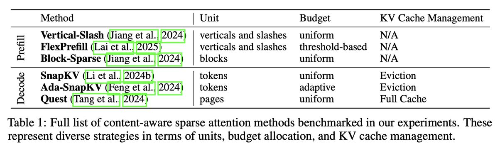

# The Sparse Frontier: Sparse Attention Trade-offs in Transformer LLMs

> ⚠️ **声明**：本 note 由 AI Agent 自动生成，基于论文全文阅读和理解撰写，仅供参考。生成时间：2025 年。

---

## 一句话总结

本文是迄今为止最大规模的训练无关（training-free）稀疏注意力方法实证研究，系统评估了 7B–72B 参数模型在 16K–128K token 序列长度和 0%–95% 稀疏度下的效率-准确性权衡，揭示了稀疏注意力在长序列场景下的关键发现，并提出了专门针对稀疏注意力的缩放定律。

---

## 摘要翻译

稀疏注意力是扩展 Transformer 大语言模型（LLM）长上下文能力的一种有前景的策略，但其可行性、效率-准确性权衡以及系统性的缩放研究仍未被充分探索。为填补这一空白，作者在不同模型规模、序列长度和稀疏度下，对多种训练无关的稀疏注意力方法进行了细致的比较，并在一系列多样化的长序列任务上进行评估——包括一些基于自然语言、可控且易于评估的新型任务。基于实验结果，作者报告了以下关键发现：1）等 FLOPS 分析表明，对于非常长的序列，更大且高度稀疏的模型优于更小且稠密的模型。2）在统计上保证精度不下降的前提下，解码阶段可达到的稀疏度高于预填充阶段，且前者与模型规模正相关。3）没有单一策略能在所有任务和阶段上表现最佳，不同场景需要不同的稀疏化单元或自适应预算策略。即使是中等稀疏度也会在至少一个任务上导致显著性能下降，说明稀疏注意力并非通用解决方案。4）作者提出并验证了专门为稀疏注意力设计的新型缩放定律，证明其发现很可能超出实验范围仍然成立。通过这些洞察，作者证明稀疏注意力是增强 Transformer LLM 处理长序列能力的关键工具，但需要对性能敏感的应用仔细评估权衡。

---

## 研究动机

1. **长序列处理的核心瓶颈**：Transformer LLM 中的自注意力机制在预填充阶段的计算复杂度随序列长度呈二次增长，在解码阶段则因 KV 缓存线性增长而导致内存访问瓶颈。稀疏注意力通过近似全注意力输出来减少计算开销和内存需求。

2. **缺乏系统性评估**：现有稀疏注意力方法虽多，但缺乏大规模、系统性的评估。已有工作（如 Li et al., 2025b; Liu et al., 2025b; Yuan et al., 2024）仅在有限配置（模型规模、序列长度、稀疏度）下进行初步探索，且依赖可变序列长度数据集，无法系统分析长度相关效应。

3. **方法设计原则不清晰**：快速发展的稀疏注意力方法因实现细节复杂，其核心设计原则往往被掩盖，导致难以公平比较。

4. **核心问题待解答**：
   - 固定计算预算下，应选择小稠密模型还是大稀疏模型？
   - 在统计保证精度不下降的前提下，最大可达到的稀疏度是多少？
   - 是否存在在所有任务上表现最佳的通用方法？
   - 能否建立可泛化的稀疏注意力缩放定律？

---

## 方法（技术细节）

### 1. 稀疏注意力方法的分类体系（Taxonomy）

作者将现有训练无关稀疏注意力方法归纳为四个关键维度：

- **稀疏化单元（Unit of Sparsification）**：
  - **块级（Block-based）**：如 Block-Sparse（使用 64×64 块）、Quest（页面级选择）
  - **垂直-对角线级（Vertical-Slash）**：如 MInference 的垂直列和对角线斜线模式，SnapKV 的动态列选择

- **重要性估计（Importance Estimation）**：
  - **固定模式**：如 StreamingLLM（注意力沉没点 + 滑动窗口）、LM-Infinite
  - **内容感知模式**：基于近似注意力分数（如 SparQ、Quest）、块级池化表示（如 MInference）、向量范数（如 VATP）

- **预算分配（Budget Allocation）**：
  - **均匀分配**：如 Block-Sparse、SnapKV
  - **自适应分配**：如 PyramidKV（基于层深度）、Ada-KV（跨头重新分配）
  - **阈值驱动分配**：如 FlexPrefill、Twilight（基于注意力权重质量覆盖率）

- **KV 缓存管理（KV Cache Management）**：
  - **驱逐策略**：如 H2O、SnapKV（永久丢弃不重要的 token）
  - **完整缓存策略**：如 Quest、SparQ（保留完整缓存，仅选择性加载）

### 2. 评估方法

- **模型**：Qwen 2.5 系列（7B、14B、32B、72B），使用 vLLM 推理引擎，bf16 精度
- **稀疏注意力方法**（6 种代表性方法）：
  - 预填充：Vertical-Slash（MInference）、FlexPrefill、Block-Sparse
  - 解码：SnapKV、Ada-SnapKV、Quest
- **评估任务**（9 个）：
  - QA 任务：SQuAD、QuALITY、TOEFL
  - RULER 基准：NIAH（检索）、VT（多跳推理）、CWE（聚合）
  - 新引入的自然语言任务：Story Retrieval、Story Multi-hop、Story Filtering
- **关键维度**：任务难度（Dispersion、Scope）和数据自然性（Naturalness）
- **评估设置**：序列长度 16K/32K/64K/128K，100 样本/配置，压缩比 1×–20×，使用链式思维（Chain-of-Thought）提示

### 3. 稀疏注意力缩放定律

- **公式**：$s = \alpha \log N + \beta \log L + \gamma \log C + \delta_{task} + \epsilon$
  - $s$：准确率的 logit（逆 sigmoid）
  - $N$：模型参数量
  - $L$：序列长度
  - $C$：压缩比
  - $\delta_{task}$：任务特定截距
- **拟合与验证**：在 Qwen 2.5 家族上进行 3 次留出实验（分别留出最大模型、最长序列、最高压缩比），R² 值在 0.57–0.74 之间

---

## 实验结果

### 1. 等 FLOPS 分析（RQ1）

- **短序列（32K）**：大多数模型规模-稀疏度组合位于帕累托前沿；降低稀疏度比增大规模更高效
- **长序列（128K）**：计算动态显著改变，高度稀疏的大型模型超越小型稠密模型
  - 预填充：5–15× 压缩比最优，20× 压缩低于最优边界
  - 解码：20× 压缩配置仍优于小型模型
- **模型规模敏感性**：
  - Qwen 7B 在高压缩下性能急剧下降（128K 下从 0.29 降至 0.06）
  - 大模型（32B、72B）在高压缩下性能稳定（差距 < 0.05）

### 2. 保证性能的最大稀疏度（RQ2）

- **预填充（Vertical-Slash）**：所有模型在不同序列长度下可实现 >10× 压缩而不显著退化
- **解码（Quest）**：模型规模是关键因素
  - 7B：16K 时 12×，128K 时降至 5×
  - 32B/72B：约 17×，与序列长度无关
- **关键局限**：几乎所有配置都有至少一个任务的可容忍压缩比低于 5×（72B Quest 除外）

### 3. 单个任务和方法的结果（RQ3）

- **检索任务（低 Scope、低 Dispersion）**：
  - 单查询 QA（QuALITY、SQuAD、TOEFL）在 20× 压缩下保持稠密级别精度
  - 多查询任务（Story Retrieval，16 查询）退化显著
  - 块级方法（Quest）在解码时对 Story Retrieval 表现最佳

- **高 Scope 或高 Dispersion 任务**：
  - 块级方法（Block-Sparse、Quest）一致匹配或超越 token 级全局选择方法
  - Block-Sparse 在 Ruler VT（5–10× 压缩）上保持近基线性能
  - Quest 在 Ruler CWE 解码时表现出色

- **非均匀预算分配的影响**：
  - 预填充：FlexPrefill 对最小预算超参数极端敏感
  - 解码：Ada-SnapKV 一致优于均匀 SnapKV

- **方法推荐**：
  - 预填充：Vertical-Slash 在检索任务上最优，Block-Sparse 在聚合/多跳任务上更好
  - 解码：Quest 是最稳健的方法（保留完整 KV 缓存，灵活选择）
  - **没有单一方法在所有任务和阶段上均表现最佳**

### 4. 稀疏注意力缩放定律（RQ4）

- **拟合质量**：R² 在 0.57–0.74 之间，拟合稳健
- **外推能力**：Spearman ρ 多数 >0.6，统计显著（p < 0.05）
- **任务特定截距**：反映任务分类（多跳/聚合任务截距为负，NIAH 截距异常高）
- **薄弱点**：Story Multi-hop 在压缩比外推和预填充序列长度外推时表现较弱

---

## 优势

1. **最大规模的系统性评估**：覆盖 7B–72B 参数、16K–128K 序列长度、0%–95% 稀疏度，是迄今为止最全面的稀疏注意力实证研究
2. **清晰的方法分类体系**：将多样化的稀疏注意力方法归纳为四个关键维度，使比较更加公平透明
3. **创新的评估基准**：引入三个基于自然语言的故事模板任务（Story Retrieval、Multi-hop、Filtering），弥补了合成基准（如 RULER）在自然性上的不足
4. **等 FLOPS 分析**：首次在固定计算预算下比较大小模型与稀疏/稠密模型的效率-准确性权衡
5. **统计保证的最大稀疏度分析**：使用 Welch's t-test 统计框架评估稀疏度的可容忍范围
6. **可泛化的缩放定律**：提出专门针对稀疏注意力的缩放定律，R² 在 0.57–0.74 之间
7. **实用的方法推荐**：针对不同推理阶段（预填充/解码）和任务类型提供了具体的方法选择建议
8. **开源代码**：所有代码在 GitHub 开放（https://github.com/PiotrNawrot/sparse-frontier）

---

## 局限

1. **模型家族单一**：仅在 Qwen 2.5 上实验，结果可能不完全推广到其他模型架构
2. **缺乏训练相关方法**：专注于训练无关方法，排除了从头训练或微调的稀疏注意力方法（如基于训练的优化）
3. **稀疏度平均效应掩盖问题**：平均性能可能掩盖某些任务的严重退化（即使中等稀疏度也可能导致性能下降）
4. **任务局限性**：未包含开放式任务（如摘要），且引入的自然语言任务仍受限于模板生成
5. **硬件/系统未优化**：使用 vLLM + bf16 精度，未针对特定硬件进行优化，实际加速可能与理论 FLOPS 差异
6. **缩放定律的薄弱点**：Story Multi-hop 在压缩比外推和预填充序列长度外推时相关性弱
7. **缺乏动态自适应方法**：未评估动态/自适应稀疏度方法，以及在推理过程中实时调整稀疏度的策略
8. **KV 缓存管理的复杂性**：Quest 虽保留完整缓存，但维护页面摘要的额外内存开销未被充分量化

---

## 与 EfficientPaper 相关的研究方向

1. **注意力稀疏化（Attention Sparsity）**：本文直接研究稀疏注意力方法，是 EfficientPaper 关注的核心方向之一。文章提供的分类体系和实验结果可作为后续研究的基准
2. **推理效率（Inference Efficiency）**：通过稀疏注意力减少预填充和解码的计算/内存开销，直接提升推理效率
3. **长上下文处理（Long-context Processing）**：本文专注于 16K–128K 序列长度的效率-准确性权衡，与长上下文 LLM 研究密切相关
4. **KV 缓存压缩（KV Cache Compression）**：多种方法（SnapKV、Ada-SnapKV、Quest）直接涉及 KV 缓存的压缩和管理
5. **缩放定律（Scaling Laws）**：本文提出的稀疏注意力缩放定律与 EfficientPaper 关注的模型缩放研究方向相关
6. **动态稀疏性（Dynamic Sparsity）**：文中提到的未来方向——动态稀疏机制（适应输入和任务需求）是值得深入研究的方向
7. **训练无关优化（Training-free Optimization）**：本文专注于不需重新训练的稀疏注意力方法，与 EfficientPaper 关注的后训练优化方法一致
