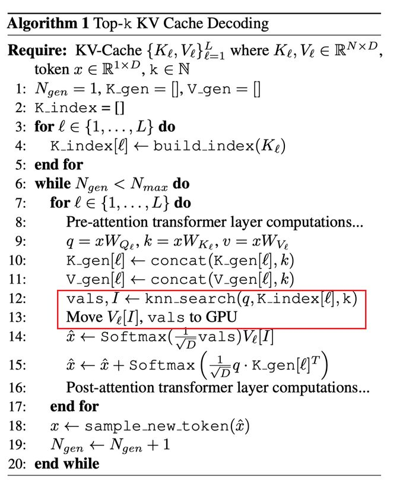

# Exploiting Sparsity for Long Context Inference: Million Token Contexts on Commodity GPUs

> **一句话总结**：通过将 KV 缓存存储在 CPU 内存中并使用向量数据库进行近似 k 近邻搜索，仅需注意力 top-k（约 2% 的 token）即可在单张消费级 GPU 上实现百万 token 上下文的高效推理，性能保持在完整注意力的 95% 以上。

> ⚠️ **声明**：本 note 由 AI Agent 自动生成，基于 arXiv 论文（arXiv:2502.06766v2）全文阅读整理。生成时间：2026年6月。内容仅供参考，具体技术细节请以原文为准。

---

## 摘要翻译

在训练好的 Transformer 模型上进行数十万输入 token 的推理需求日益增长。这种极端规模的推理需要大量计算资源，阻碍了 Transformer 在消费级（即非数据中心级别）硬件上处理长上下文的应用。为了解决在长上下文上运行基于自注意力的 Transformer 语言模型所带来的推理时间成本，并使其在广泛可用的硬件上得以采用，我们提出了一种可调机制，通过在每个生成步骤中仅关注最相关的 token（使用 top-k 选择机制）来降低前向传播的成本。我们通过在约 16GB GPU 显存上对高达 100 万 token 的上下文窗口进行推理，展示了该方法的效率增益。实验表明，模型能够处理由减少的键值对数量所引起的稀疏性。通过仅关注不到 2% 的输入 token，我们在常见基准测试（RULER、AlpacaEval 和 Open LLM Leaderboard）上达到了模型性能的 95% 以上。

---

## 研究动机

长上下文推理是指模型分析大型文档集合或遵循长而详细的指令的过程。随着模型被训练处理越来越大的上下文长度，推理阶段（尤其是解码阶段）面临严峻挑战：

1. **解码阶段的计算瓶颈**：在标准注意力机制中，每个新 token 需要与上下文中所有缓存的 token 进行注意力计算，计算复杂度为 O(N)。当上下文长度很大时，这在计算和内存上都变得不可承受。

2. **KV 缓存的内存开销**：以 Llama-3 8B 为例（D=4096, L=32），在 N=100,000 时，KV 缓存仅内存就需要 52GB（16位浮点格式），远超大多数消费级 GPU 的显存。

3. **现有解决方案的局限**：
   - **KV 缓存卸载到 CPU**：数据传输开销巨大，单层 KV 缓存数据约 1.6GB，需在单次生成中来回传输数百或数千次。
   - **缓存驱逐方法**（如 StreamingLLM、H2O）：难以判断哪些 token 未来会被需要，最终损害性能。
   - **多 GPU 方案**（如 Ring Attention）：需要数据中心级别的计算资源，不适合消费级硬件。

4. **核心发现**：现代 LLM 在任意时刻仅需关注少数几个 token。这一简单事实构成了该方法的理论基础。

---

## 方法

### 核心思想

将注意力计算中的键值对选择与矩阵乘法分离：KV 缓存存储在 CPU 内存中，GPU 仅处理少量被选中的键值对，从而将 GPU 内存需求从 O(N) 降低到 O(k)。

### 技术细节

#### 1. 算法流程（Algorithm 1）

**预处理阶段**：
- 将预填充的 KV 缓存存储在 CPU 内存中
- 为每一层的每个注意力头构建 k 近邻搜索索引（K_index[ℓ]）
- 索引数据结构可以是简单列表（精确最近邻）或基于图的结构（近似最近邻，如 HNSW）

**解码阶段**（每个生成步骤）：
1. 在 GPU 上计算当前 token 的 query、key、value 嵌入：q = xW^Q_ℓ, k = xW^K_ℓ, v = xW^V_ℓ
2. 将新生成的 key-value 保留在 GPU 上（形成 K_gen、V_gen，类似滑动窗口注意力）
3. 将 query q 卸载到 CPU，执行 k 近邻搜索：
   - `vals, I = knn_search(q, K_index[ℓ], k)`
   - 使用点积度量（与注意力分数机制一致）
4. 将选中的 V_ℓ[I] 和 vals 传输到 GPU
5. 在 GPU 上执行注意力计算：
   - 上下文部分：`x̂ = Softmax(1/√D · vals) · V_ℓ[I]`
   - 生成的 token 部分：`x̂ = x̂ + Softmax(1/√D · q · K_gen[ℓ]^T)`
6. 采样新 token

**关键特点**：
- GPU 内存开销为 O(k) 而非 O(N)
- k 可以选择为 N 的很小比例（大多数任务约 1%）
- 近似 k 近邻搜索可在亚线性时间内完成
- CPU-GPU 之间的数据传输量极小（仅 k 个键值对）

#### 2. 百万 token 规模的预填充

对于极大上下文（如 100 万 token），预填充可以：
- 使用 Flash Attention + H100 GPU 构建精确的 KV 缓存
- 使用环形注意力（Ring Attention）跨多 GPU 并行化
- 在极端情况下，预填充阶段也可使用 top-k 注意力

实际使用场景：用户可以在云端租用计算资源一次性预填充缓存，然后在自己的消费级硬件上使用本方法快速查询。

#### 3. 非均匀 k 选择

论文探索了在不同层使用不同 k 值的策略：
- **均匀策略**：每层使用相同的 k
- **自适应策略**：从前层到后层线性递增 k
- 在固定总 k 预算下，自适应策略可以获得非平凡的性能提升

---

## 实验结果

### 基准测试概述

论文在三个基准测试上评估了 top-k 注意力的效果：

1. **RULER**：专门测试长上下文能力（4k-128k token）
2. **Open LLM Leaderboard v1**：测试模型通用能力
3. **AlpacaEval 2.0**：测试生成密集型任务

### 主要实验发现

#### RULER 基准（表 1）

- 在所有上下文长度下，仅需 1% 或更少的上下文长度即可达到基线性能的 95%
- 在 k=2 时，所有上下文长度均能获得超过 60% 的性能
- 在 131k token 上下文长度下，达到完整注意力约 98% 性能仅需 12.5% 的注意力分数
- NIAH（Needle In A Haystack）任务表现最好，几乎不受 k 值影响
- 词计数任务（CWE 和 FWE）对 k 值最敏感，需要更大 k 值

#### Open LLM Leaderboard（图 6）

- 在所有模型上，top-k 效果与指令微调、模型大小或训练 token 数无关
- 所有模型在 k < 10 时性能即达到饱和
- Llama-2 7B、Llama-3 8B、Llama-3.1 8B 均表现出相同趋势

#### AlpacaEval 2.0（图 7）

- 2% 上下文长度的 k 值足以达到完整注意力性能的 95%
- 该趋势在不同模型大小上保持一致

#### 百万 token NIAH 测试（图 8）

- 在 100 万 token 上下文上使用 Faiss 向量数据库
- 仅需 k=10 即可实现 100% 成功率
- 相比 StreamingLLM 的缓存驱逐方法，top-k 注意力在所有位置均能成功检索

#### 任务类型与 k 值需求（表 2）

| 任务类别 | 达到 95% 性能所需的 k 占比 |
|---------|------------------------|
| Needle In A Haystack | 0.001% |
| Variable Tracking | 0.11% |
| Question Answering | 0.23% |
| Multiple NIAH | 0.27% |
| Word Counting | 8.87% |

#### 注意力熵分析（附录 A.1）

- 注意力熵与 k 需求阈值之间存在 0.85 的 Pearson 相关系数
- 第一层网络的注意力分布最不集中（熵最高）
- 深层网络的注意力分布更为集中

---

## 优势

1. **亚线性复杂度**：将解码阶段的 GPU 内存和计算复杂度从 O(N) 降低到 O(k)，其中 k << N。

2. **极低的 GPU 内存需求**：在约 16GB GPU 显存上即可处理 100 万 token 上下文，适合消费级 GPU。

3. **极小的数据传输开销**：仅传输 k 个键值对（而非整个 KV 缓存），CPU-GPU 通信量极小。

4. **高度灵活**：k 值可调，且可在不同层使用不同 k 值（自适应策略），可根据任务需求灵活分配计算资源。

5. **广泛适用性**：
   - 适用于不同模型大小（1B 到 8B）
   - 适用于预训练和指令微调模型
   - 适用于不同模型代际（Llama-1 到 Llama-3.2）
   - 适用于不同类型任务（知识密集型、生成密集型）

6. **与现有框架兼容**：可与 Flash Attention、vLLM 等系统方案结合使用。

7. **无需模型微调**：直接在推理阶段应用，无需对模型进行任何修改或训练。

---

## 局限

1. **预填充阶段仍需大量计算**：虽然解码阶段被优化，但预填充仍然需要 O(N²) 的计算和内存，对于 100 万 token 的上下文，需要高性能 GPU（如 H100）或分布式计算。

2. **对特定任务类型敏感**：词计数等需要全局信息的任务对 k 值要求较高（约 9%），可能需要更大计算资源。

3. **近似搜索的精度损失**：使用近似最近邻搜索（如 HNSW）可能引入检索误差，虽然实验显示影响不大，但在极端情况下可能影响性能。

4. **依赖 CPU 内存容量**：KV 缓存需要存储在 CPU 内存中，对于极长上下文（如 100 万 token），CPU 内存需求仍然可观。

5. **单 GPU 限制**：虽然在消费级 GPU 上实现了 100 万 token 上下文，但吞吐量可能受到限制，不适合高并发场景。

6. **对不同模型架构的泛化性**：论文主要在 Llama 系列模型上验证，对其他架构（如 Mamba、GPT）的适用性需要进一步验证。

7. **动态 k 选择的开销**：虽然 k 值可调，但确定最优 k 值可能需要额外的调优过程。

---

## 与 EfficientPaper 相关的研究方向

本论文属于 **KV Cache 稀疏化（kv_cache_sparse）** 研究方向，与 EfficientPaper 收录的其他高效推理研究密切相关：

1. **KV Cache 管理与压缩**：
   - 与 H2O（Heavy-Hitter Oracle）等缓存驱逐方法形成对比，本方法保留所有 token 但通过稀疏检索加速
   - 与 PQCache（乘积量化 KV 缓存）等方法互补，可结合使用

2. **注意力机制优化**：
   - 与 Flash Attention、Paged Attention 等系统级优化方法互补
   - 可与滑动窗口注意力、Ring Attention 等方法结合使用

3. **长上下文推理**：
   - 为消费级 GPU 上的长上下文推理提供了可行方案
   - 与检索增强生成（RAG）方法互补，可用于长文档处理

4. **稀疏注意力研究**：
   - 与 RetrievalAttention、Loki、Quest 等基于稀疏注意力的方法形成研究脉络
   - 为动态注意力选择机制提供了新的研究方向

5. **高效推理系统**：
   - 与 vLLM、FlexGen 等推理系统形成互补
   - 为资源受限环境下的 LLM 部署提供了新方案

6. **未来研究方向**：
   - 自适应 k 选择策略（根据任务类型和模型层动态调整）
   - 与其他 KV 缓存压缩方法的联合优化
   - 对更多模型架构和更大规模上下文的验证
   - 实时查询的延迟优化和吞吐量提升

---

## 参考信息

- **论文**：arXiv:2502.06766v2
- **作者**：Ryan Synk, Monte Hoover, John Kirchenbauer, Neel Jain, Alex Stein, Manli Shu, Josue Melendez Sanchez, Ramani Duraiswami, Tom Goldstein
- **机构**：University of Maryland, Salesforce Research
- **代码**：https://github.com/ryansynk/topk-decoding
- **关键词**：kv_cache_sparse
