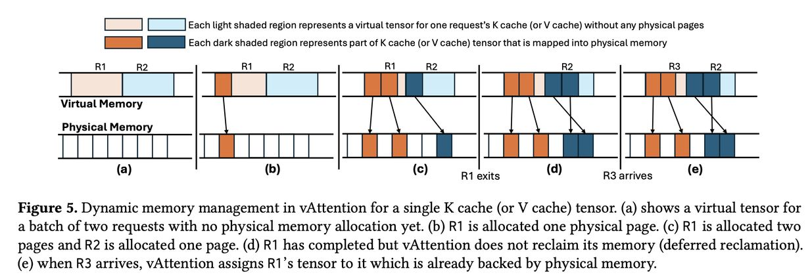

# vAttention: Dynamic Memory Management for Serving LLMs without PagedAttention

> **本文由 AI Agent 自动生成**，基于 arXiv 论文 (2405.04437v3) 全文提取与分析。生成时间：2025年6月。

---

## 一句话总结

vAttention 通过利用 CUDA 虚拟内存管理 API，将 KV cache 的虚拟内存与物理内存分配解耦，保持虚拟内存连续性的同时实现物理内存的按需分配，从而在不重写注意力核函数的情况下，实现比 PagedAttention 更简单、更可移植且性能更优的 LLM 服务内存管理方案。

---

## 摘要翻译

PagedAttention 是 LLM 服务系统中一种流行的动态内存分配方法。它能够按需分配 GPU 内存，以缓解 KV cache 碎片化——这一现象在先前的系统中严重限制了批大小（从而限制了吞吐量）。然而，在尝试在运行时分配物理内存时，PagedAttention 最终将 KV cache 的虚拟内存布局从连续变为非连续。这种设计导致了不可忽视的编程和性能开销。

我们提出了 **vAttention**——一种在缓解物理内存碎片化的同时保持 KV cache 虚拟内存连续性的方法。我们通过使用 CUDA 虚拟内存管理 API 解耦虚拟内存和物理内存的分配来实现这一目标。我们还引入了多种 LLM 特定的优化措施，以解决 CUDA 虚拟内存支持的局限性。总体而言，vAttention 是 PagedAttention 的更简单、更可移植且性能更优的替代方案：它开箱即用地支持各种注意力核函数，并且在使用 FlashAttention-2 和 FlashInfer 的 PagedAttention 核函数时，LLM 服务吞吐量提高了最多 1.23 倍。

---

## 研究动机

### 背景与问题

LLM 服务系统的核心挑战之一是高效管理 GPU 内存，特别是 KV cache 的内存分配。KV cache 在推理过程中按 token 逐步增长，且最终大小不可预知，这给内存管理带来两大挑战：

1. **静态分配导致碎片化**：传统方法（如 Orca、FasterTransformer）按最大上下文长度预分配内存，导致严重的内部碎片，限制批大小和吞吐量。

2. **PagedAttention 的代价**：vLLM 引入的 PagedAttention 受 OS 虚拟内存的启发，按需分配小块内存，有效缓解了碎片化。但它存在根本性问题：
   - **需要重写注意力核函数**：KV cache 从连续变为非连续，所有注意力核函数都需要适配非连续内存访问。
   - **在框架层增加冗余**：服务框架需要维护虚拟内存块到物理内存的映射（类似于 OS 的地址转换功能）。
   - **性能开销显著**：
     - GPU 端：PagedAttention 核函数比非分页核函数慢 20-42%（FlashAttention-2 预填充核函数慢 37%，FlashInfer 慢 42%）。
     - CPU 端：Block-Table 准备开销高（在 vLLM 中曾占 decode 迭代延迟的 30%）。
   - **可移植性差**：每当新的注意力优化出现（如 FlashAttention-3），都需要投入大量工作将其适配到 PagedAttention 模式。vLLM 的 PagedAttention 核函数比 FlashAttention-2 慢最多 2.8 倍。

### 核心洞察

论文通过实验发现 LLM 服务工作负载的两个关键特性：

1. **KV cache 内存需求在每次迭代中可预测**：解码阶段每个请求每次迭代只增长一个 token，因此内存需求是可预知的。
2. **KV cache 不需要高内存分配带宽**：每个 token 的内存需求为几十到几百 KB（Yi-6B 为 64KB，Llama-3-8B 为 128KB，Yi-34B 为 240KB），最高分配速率仅约 750MB/s。

---

## 方法（技术细节）

### 核心思想

vAttention 的核心思想是**在系统层面（而非用户空间）实现按需分页**，保持虚拟内存的连续性，同时通过物理内存的按需分配缓解碎片化。这与 PagedAttention 在用户空间实现按需分页的方式根本不同。

### 设计概览

vAttention 对虚拟内存和物理内存采用不同的分配策略：
- **虚拟内存**：预先分配大块连续缓冲区（类似 PagedAttention 之前的方法）。
- **物理内存**：在运行时按需分配（类似 PagedAttention）。

这种设计既保持了 KV cache 的虚拟内存连续性，又避免了物理内存碎片化。虚拟内存的碎片化不是问题，因为 64 位系统提供每进程 128TB 的虚拟地址空间。

### 虚拟内存缓冲区设计

- **缓冲区数量**：每个 worker 分配 2×N 个缓冲区（N 为层数，分别用于 K cache 和 V cache）。
- **缓冲区大小**：B×S，其中 B 为最大批大小，S 为单请求单层 K/V cache 的最大大小（S = L×H×D×P）。
- **示例**：Yi-34B（FP16，TP-2）：N=60，H=4，D=128，P=2，L=200K，B=500 → 每缓冲区 100GB，总计 12TB 虚拟内存（256TB 可用地址空间中很小的一部分）。

### CUDA 虚拟内存管理（VMM）API

利用 CUDA 提供的精细内存管理 API，实现虚拟内存与物理内存的解耦：
- `cuMemAddressReserve`：预留虚拟内存地址
- `cuMemCreate`：创建物理内存 handle
- `cuMemMap`：将物理内存映射到虚拟地址
- `cuMemSetAccess`：设置访问权限
- `cuMemUnmap`/`cuMemRelease`：释放物理内存

### 请求级 KV cache 索引

每个虚拟张量代表整个批的 K/V cache，不同请求占据不同的非重叠子区域。通过 `reqId`（0 到 B-1）标识每个请求的子张量，偏移量为 `reqId × S`。

### 服务框架集成

vAttention 作为 Python 库构建，内部使用 CUDA/C++ 扩展，暴露简单的 API：
- `init`：初始化模型参数
- `alloc_reqid`：分配请求 ID
- `free_reqid`：释放请求 ID
- `step`：确保每个活跃请求的 KV cache 有物理页支持

### 关键优化

#### 1. 隐藏内存分配延迟

CUDA VMM API 调用开销高（如对 Yi-34B，一个请求扩展 KV cache 需约 5ms）。优化策略：

- **与计算重叠（decode 阶段）**：利用内存需求的可预测性，在上一次迭代执行时通过后台线程为下一次迭代分配物理页。
- **延迟回收 + 急切分配（prefill 阶段）**：
  - 请求完成后不立即回收物理页，而是延迟回收，新请求可复用已有物理页（减少分配需求）。
  - 保持一定数量的预分配物理页（eager allocation），减少关键路径上的分配。

#### 2. 缓解内部碎片

- **修改 CUDA 驱动**：在开源 NVIDIA 驱动中实现新的 VMM API，支持 64KB/128KB/256KB 页面（标准 CUDA 仅支持 2MB 大页）。
- **无 TLB 抖动**：实验证明使用 64KB 页面对注意力核函数性能无负面影响。
- **块大小对比**：64KB 页面的块大小为 32-128 个 token（接近 vLLM 推荐的 16-32），远优于 FlashAttention-2 的最小块大小 256。

#### 3. 支持连续批处理

当请求退出批时，虚拟张量中留下空洞。vAttention 利用 FlashAttention 的 `cache_batch_idx` API 支持 Q 和 KV cache 的批大小不同，无需额外开销。

#### 4. 可选：张量切片（Tensor Slicing）

作为不修改 NVIDIA 驱动的替代方案，将所有层的 KV cache 合并到一个虚拟张量中，碎片化减少为 1/N。但需要注意步幅（stride）支持。

---

## 实验结果

### 评估设置
- **模型**：Yi-6B（1×A100）、Llama-3-8B（2×A100）、Yi-34B（2×A100）
- **基线**：vLLM、FA2_Paged、FI_Paged
- **框架**：vLLM v0.2.7（统一平台）
- **内核库**：FlashAttention-2 v2.5.9、FlashInfer v0.4.0

### Prefill 吞吐量
- **小上下文**：由于线性算子主导，vAttention 与 paged 版本吞吐量相近（FlashAttention-2）。但 FlashInfer 的 paged 版本因其他开销（对象创建/删除、逐块复制）而较慢，vAttention 有优势。
- **长上下文（≥16K）**：
  - FA2_vAttention 比 FA2_Paged 快 1.24-1.26 倍（192K 上下文，Yi-6B/Llama-3-8B/Yi-34B）。
  - FI_vAttention 比 FI_Paged 快 1.17-1.36 倍。
- **原因**：连续虚拟内存使注意力核函数计算更快（注意力计算占长上下文预填充的主要时间）。

### Decode 吞吐量
- **vAttention 与 FA2_Paged 性能持平**（最佳 PagedAttention 方案），优于 FI_Paged 和 vLLM。
- **相比 vLLM**：
  - Yi-6B：快 1.99 倍
  - Llama-3-8B：快 1.58 倍
  - Yi-34B：快 1.53 倍
- **注意**：decode 阶段 vAttention 与 PagedAttention 性能相近，因为 decode attention 是内存瓶颈，额外计算开销被内存停滞隐藏。

### 端到端性能（离线场景）
- 使用 arXiv-Summarization 数据集（427 个长上下文请求，64K-192K token）。
- **FA2_vAttention vs FA2_Paged**：吞吐量提升 1.13-1.18 倍。
- **FA2_vAttention vs FI_Paged**：吞吐量提升 1.14-1.23 倍。
- 增益与上下文长度和预填充/解码 token 比例（P:D ratio）正相关。

### 端到端性能（在线场景）
- 512 个长上下文请求（22K-45K token 输入，6-3250 token 输出）。
- **vAttention 显著降低中位请求执行延迟**：
  - Yi-6B（QPS 0.25）：降低 42%
  - Llama-3-8B（QPS 0.3）：降低 28%
  - Yi-34B（QPS 0.1）：降低 29%
- 主要原因：vAttention 能更快地完成新请求的预填充，减少排队延迟。

### FlashAttention-3 可移植性
- FA3 针对 Hopper 架构优化，发布时不支持 PagedAttention。
- **vAttention 无需代码修改即可支持 FA3**。
- FA3 + vAttention 比 FA2_Paged 提供额外 1.35 倍加速（Yi-6B，H100 GPU）。
- FA3_vAttention 比 FA2_vAttention 快最多 1.35 倍。

### 消融实验
1. **隐藏分配延迟**：与计算重叠有效隐藏了 CUDA VMM API 延迟（消除了 5-15ms 的尖峰）。
2. **延迟回收**：显著减少了预填充阶段的内存分配开销（64KB 页面时减少 15% 开销）。
3. **页面大小影响**：64KB 页面与 2MB 页面在注意力核函数性能上无显著差异（无 TLB 抖动）。
4. **内存分配带宽**：即使使用 64KB 页面，vAttention 也能提供 7.6GB/s 的分配带宽（远高于 750MB/s 的需求）。

---

## 优势

1. **更简单**：保持虚拟内存连续性，无需重写注意力核函数，也无需在服务框架中维护复杂的内存映射。
2. **更可移植**：支持未修改的注意力核函数（FlashAttention-2、FlashInfer、FlashAttention-3 等），无需为每个新核函数实现 PagedAttention 适配。
3. **性能更优**：
   - 预填充阶段：比 PagedAttention 核函数快 1.24-1.36 倍（长上下文）。
   - 端到端服务吞吐量提升 1.13-1.23 倍。
   - 比 vLLM 快最多 1.99 倍（decode）。
4. **减少编程负担**：替换注意力核函数仅需几行代码修改（而非 PagedAttention 的数百行改动）。
5. **支持新架构**：可开箱即用 FlashAttention-3，无需等待其 PagedAttention 适配。
6. **细粒度分配**：通过修改驱动支持 64KB 页面，有效缓解碎片化。

---

## 局限

1. **依赖 CUDA 虚拟内存 API**：目前仅在 NVIDIA GPU 上实现，对其他硬件平台（如 AMD GPU）不适用。
2. **需要修改 NVIDIA 驱动**：为支持小页面（64KB/128KB/256KB），需要修改开源 NVIDIA 驱动，增加了部署复杂性。
3. **虚拟内存消耗**：虽然虚拟内存空间充足，但大规模部署可能需要考虑虚拟地址空间管理。
4. **不支持 KV cache 换出到 CPU 内存**：论文将更复杂的策略（如 swap out）留作未来工作。
5. **Decode 阶段增益有限**：在 decode 阶段，vAttention 与最佳 PagedAttention 方案性能持平（因 decode attention 是内存瓶颈），不如预填充阶段显著。
6. **CUDA VMM API 延迟**：尽管通过与计算重叠隐藏了延迟，但 API 调用本身仍有开销，尤其在预填充阶段。
7. **统一内存限制**：论文指出 CUDA 统一内存（cudaMallocManaged）目前不适合 LLM 服务（不支持部分释放、不支持内存别名/去重）。

---

## 与 EfficientPaper 相关的研究方向

### 关键词
`kv_cache_management`、`deployment`

### 相关研究方向

1. **KV Cache 内存优化**
   - **PagedAttention (2023)**：vAttention 的直接基线，vLLM 提出的按需分页方案。
   - **FlashAttention-2 (2022)**：高效注意力计算的先驱，vAttention 与其非分页核函数配合使用。
   - **FlashInfer (2025)**：LLM 服务的注意力核函数库，vAttention 支持其非分页核函数。
   - **GMLake (2024)**：使用 CUDA 虚拟内存支持的 DNN 训练内存去碎片化，vAttention 将类似技术应用于推理。
   - **H2O (2023)**：KV cache 重要性评估与稀疏化，与 vAttention 的内存管理互补。
   - **InfiniGen (2024)**：动态 KV cache 管理的高效生成推理。
   - **DéjàVu (2024)**：KV cache 流式处理的快速容错 LLM 服务。

2. **LLM 推理优化**
   - **SARATHI (2023)**：通过 chunked prefill 与 decode 的叠加提升推理效率。
   - **Sarathi-Serve (2024)**：吞吐量-延迟权衡的优化。
   - **DistServe (2024)**：预填充与解码的解耦以优化吞吐量。
   - **Splitwise (2024)**：阶段拆分的高效生成推理。
   - **POD-Attention (2024)**：预填充-解码重叠的优化。

3. **注意力核函数优化**
   - **FlashAttention-3 (2024)**：Hopper 架构优化的注意力核函数，vAttention 使其无需 PagedAttention 支持即可部署。
   - **FlashDecoding++ (2024)**：异步和 GEMM 优化的快速推理。
   - **Lean Attention (2024)**：硬件感知的可扩展注意力机制。
   - **ThunderKittens (2024)**：用于快速核函数的 tile 原语。

4. **系统级内存管理**
   - **CUDA 虚拟内存管理**：vAttention 的底层技术基础。
   - **NVIDIA 统一内存**：论文讨论了其限制以及 vAttention 如何扩展（部分释放、页共享、小页面支持）。
   - **GPU 虚拟内存系统设计**：GPU TLB、页大小、地址翻译等体系结构问题。

5. **部署与服务框架**
   - **vLLM**：vAttention 的主要集成框架，也是 PagedAttention 的先驱。
   - **TensorRT-LLM**：NVIDIA 的推理优化框架，PagedAttention 的性能问题被记录。
   - **LightLLM**、**HuggingFace TGI**：其他采用 PagedAttention 的服务框架。

---

## 参考信息

- **论文标题**：vAttention: Dynamic Memory Management for Serving LLMs without PagedAttention
- **作者**：Ramya Prabhu, Ajay Nayak, Jayashree Mohan, Ramachandran Ramjee, Ashish Panwar
- **机构**：Microsoft Research, Indian Institute of Science
- **发表**：ASPLOS '25 (2025)
- **代码**：https://github.com/microsoft/vattention
- **arXiv**：https://arxiv.org/abs/2405.04437v3
- **关键词**：kv_cache_management, deployment
