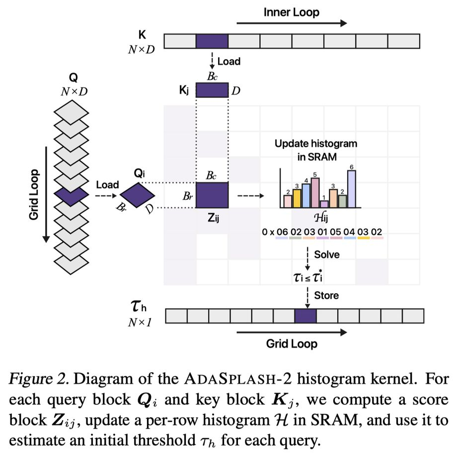

# AdaSplash-2: Faster Differentiable Sparse Attention

> Nuno Gonçalves, Hugo Pitorro, Vlad Niculae, Edoardo Ponti, Lei Li, Andre Martins, Marcos Treviso

## Abstract

Sparse attention has been proposed as a way to alleviate the quadratic cost of transformers, a central bottleneck in long-context training. A promising line of work is $α$-entmax attention, a differentiable sparse alternative to softmax that enables input-dependent sparsity yet has lagged behind softmax due to the computational overhead necessary to compute the normalizer $τ$. In this paper, we introduce AdaSplash-2, which addresses this limitation through a novel histogram-based initialization that reduces the number of iterations needed to compute $τ$ to typically 1--2. The key idea is to compute a coarse histogram of attention scores on the fly and store it in on-chip SRAM, yielding a more accurate initialization that enables fast forward and backward computation. Combined with a sparsity-aware GPU implementation that skips zero blocks with low overhead, AdaSplash-2 matches or improves per-step training time relative to FlashAttention-2 when block sparsity is moderate-to-high (e.g., $>$60\%), which often occurs at long-context lengths. On downstream tasks, models trained with our efficient $α$-entmax attention match softmax baselines at short-context lengths and achieve substantial gains in long-context settings.

---

*以下总结由 MiMo 生成：*

这篇论文旨在解决Transformer模型在长上下文训练中因稀疏注意力计算开销大而导致的效率瓶颈问题。为此，作者提出了AdaSplash-2方法，通过一种新颖的基于直方图的初始化技术，将计算归一化因子τ所需的迭代次数减少到通常1-2次，并结合稀疏感知的GPU实现来跳过零块。该方法在块稀疏度中等至较高（如>60%）时，训练速度与FlashAttention-2相当或更优，并在下游任务中，使用其高效α-entmax注意力训练的模型在短上下文长度下与softmax基线匹配，在长上下文设置中取得了显著提升。
