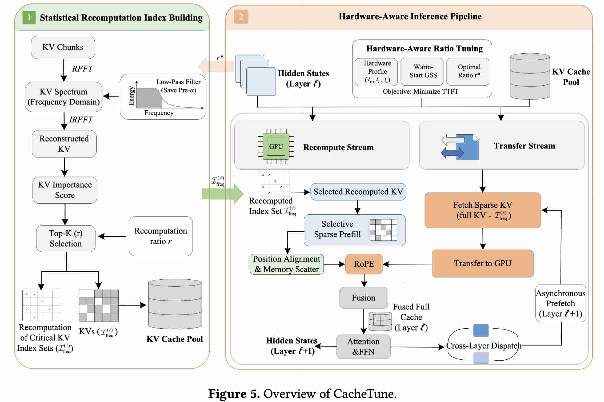

# Adaptive KV Cache Reuse for Fast Long-Context LLM Serving

> Fei Li, Song Liu, Yan Liu, Jinhua Cui, Shiqiang Nie, Jinyu Wang, Weiguo Wu

> 注：以下论文笔记由 AI Agent 自动生成，可能存在理解偏差或遗漏，请以原论文为准。

## Abstract

In long-context Large Language Model inference, TTFT latency incurred by prefill has become the foremost bottleneck. KV Cache reuse reduces redundant prefill, yet traditional prefix caching applies only to strict-prefix scenarios; directly reusing KV Cache in non-prefix settings breaks cross-chunk global attention relationships and causes quality degradation. This paper presents CacheTune, a frequency-guided and hardware-aware KV Cache reuse system. CacheTune identifies, offline, KV pairs most critical to cross-attention recovery through frequency-domain analysis, selectively recomputes semantic-critical tokens online while reusing remaining KVs, and combines sparse KV transfer, multi-stream asynchronous overlap, deferred positional-encoding recovery, and hardware-aware adaptive recomputation-ratio tuning. Evaluations show 3.72x-4.86x TTFT speedup and 3.93x-6.21x higher throughput while maintaining quality close to full recompute; with SSD/HDD cache pools it sustains 2.34x-2.36x TTFT speedup.

## 一句话总结

CacheTune 将 KV reuse 从严格 prefix 扩展到非 prefix 长上下文：大部分 KV 直接复用，只对频域分析判定的语义关键 token 做选择性重算。

## 创新点

1. 非 prefix KV reuse：针对不同文档/片段组合下 cross-chunk attention 关系破坏的问题，引入选择性 recomputation 恢复语义一致性。
2. 频域指导的 token 选择：离线分析哪些 KV 对全局语义恢复最关键，在线只重算这部分 token。
3. 硬件感知 reuse runtime：结合 sparse KV transfer、多流异步 overlap、延迟位置编码恢复和自适应重算比例，平衡 compute 与 I/O。

## 带来什么提升

1. TTFT 加速 3.72×–4.86×，吞吐提升 3.93×–6.21×，同时质量接近 full recompute。
2. 当 KV cache offload 到 SSD/HDD 等 I/O-bound cache pool 时仍有 2.34×–2.36× TTFT 加速。
3. 比 prefix cache 更适合 RAG/长文档拼接/agent history 等非严格前缀复用场景。

## 备注

- 方法依赖离线频域分析和硬件自适应调参，系统复杂度高于纯 prefix cache。
