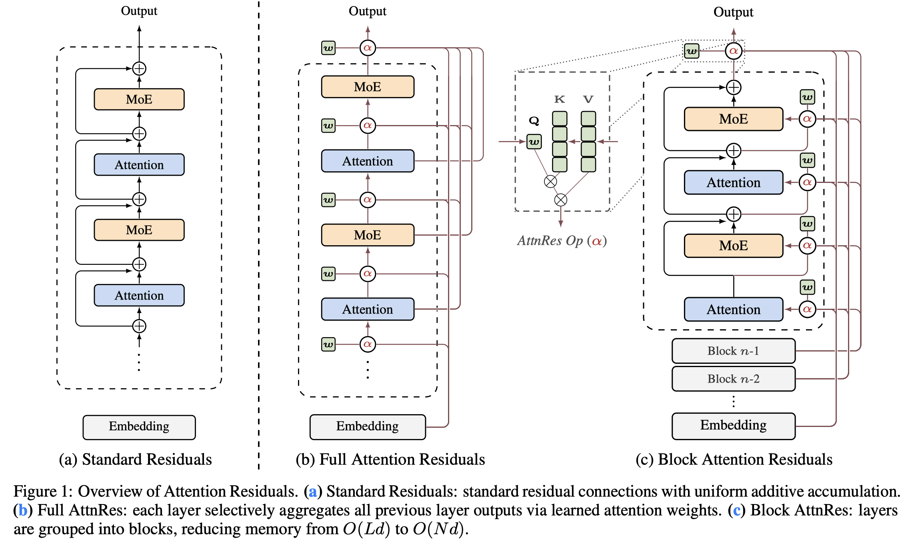

# Attention Residuals

> Kimi Team, Guangyu Chen, Yu Zhang, Jianlin Su, Weixin Xu, Siyuan Pan, Yaoyu Wang, Yucheng Wang, Guanduo Chen, Bohong Yin, Yutian Chen, Junjie Yan, Ming Wei, Y. Zhang, Fanqing Meng, Chao Hong, Xiaotong Xie, Shaowei Liu, Enzhe Lu, Yunpeng Tai, Yanru Chen, Xin Men, Haiqing Guo, Y. Charles, Haoyu Lu, Lin Sui, Jinguo Zhu, Zaida Zhou, Weiran He, Weixiao Huang, Xinran Xu, Yuzhi Wang, Guokun Lai, Yulun Du, Yuxin Wu, Zhilin Yang, Xinyu Zhou

## Abstract

Residual connections with PreNorm are standard in modern LLMs, yet they accumulate all layer outputs with fixed unit weights. This uniform aggregation causes uncontrolled hidden-state growth with depth, progressively diluting each layer's contribution. We propose Attention Residuals (AttnRes), which replaces this fixed accumulation with softmax attention over preceding layer outputs, allowing each layer to selectively aggregate earlier representations with learned, input-dependent weights. To address the memory and communication overhead of attending over all preceding layer outputs for large-scale model training, we introduce Block AttnRes, which partitions layers into blocks and attends over block-level representations, reducing the memory footprint while preserving most of the gains of full AttnRes. Combined with cache-based pipeline communication and a two-phase computation strategy, Block AttnRes becomes a practical drop-in replacement for standard residual connections with minimal overhead.
  Scaling law experiments confirm that the improvement is consistent across model sizes, and ablations validate the benefit of content-dependent depth-wise selection. We further integrate AttnRes into the Kimi Linear architecture (48B total / 3B activated parameters) and pre-train on 1.4T tokens, where AttnRes mitigates PreNorm dilution, yielding more uniform output magnitudes and gradient distribution across depth, and improves downstream performance across all evaluated tasks.
	
AttnRes 想要填补的空白就是：我们想要一种既能跨越任意层级、又能基于当前输入进行动态权重分配的「检索」机制[1]

[1] [Kimi 新发布的「注意力残差」有什么亮点？](https://www.zhihu.com/question/2016993095078684011)
