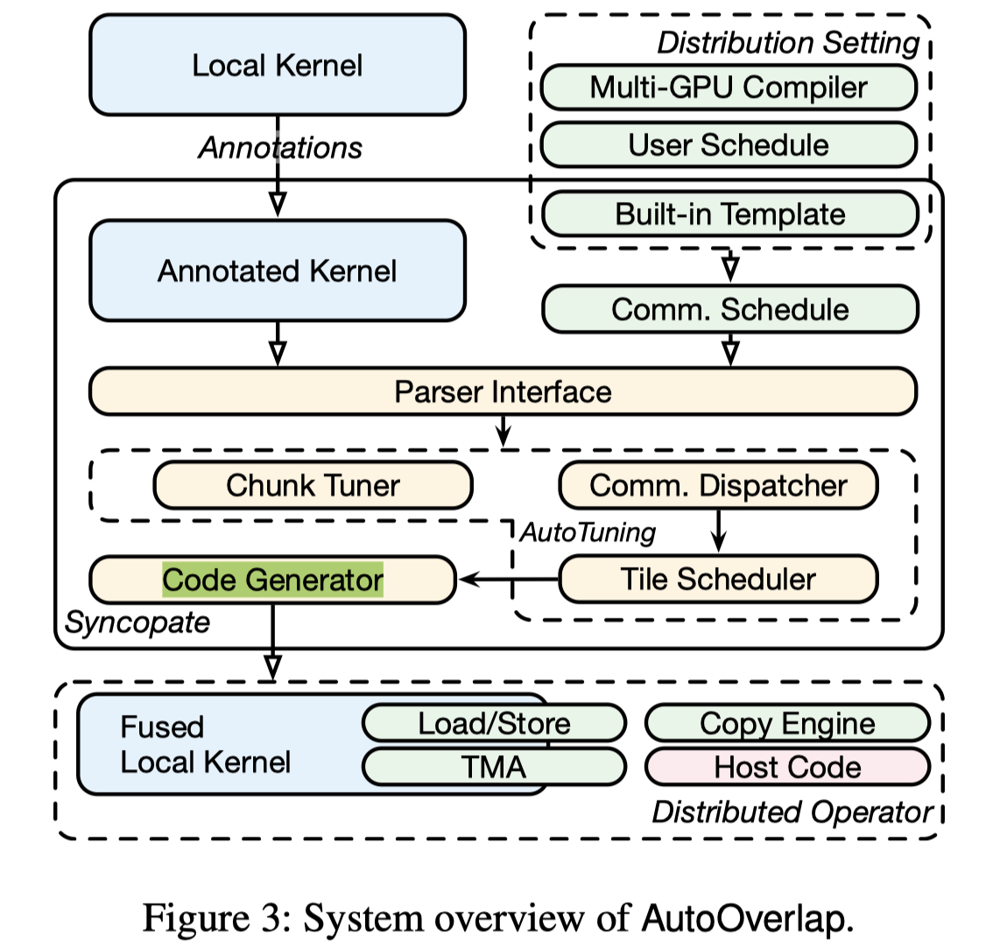

# AutoOverlap: Enabling Fine-Grained Overlap of Computation and Communication with Chunk-Based Scheduling

> Xinwei Qiang, Yue Guan, Zhengding Hu, Yufei Ding, Adnan Aziz

## Abstract

Communication has become a first-order bottleneck in large-cale GPU workloads, and existing distributed compilers address it mainly by overlapping whole compute and communication kernels at the stream level. This coarse granularity incurs extra kernel launches, forces device-wide synchronizations at kernel boundaries, and leaves substantial slack when the slowest tile or kernel stretches the communication tail. We present AutoOverlap, a compiler and runtime that enables automatic fine-grained overlap inside a single fused kernel. AutoOverlap introduces a communication chunk abstraction that decouples communication granularity from kernel structure and backend mechanisms, allowing chunk-level plans to be ported from existing distributed compilers, written directly by users, or instantiated from reusable templates. Given a local Triton kernel and a chunk schedule, AutoOverlap performs transformations to align computation with chunk availability. Implemented as a source-to-source compiler on Triton, AutoOverlap delivers an average end-to-end speedup of 1.3$\times$ and up to 4.7$\times$ on multi-GPU workloads.
